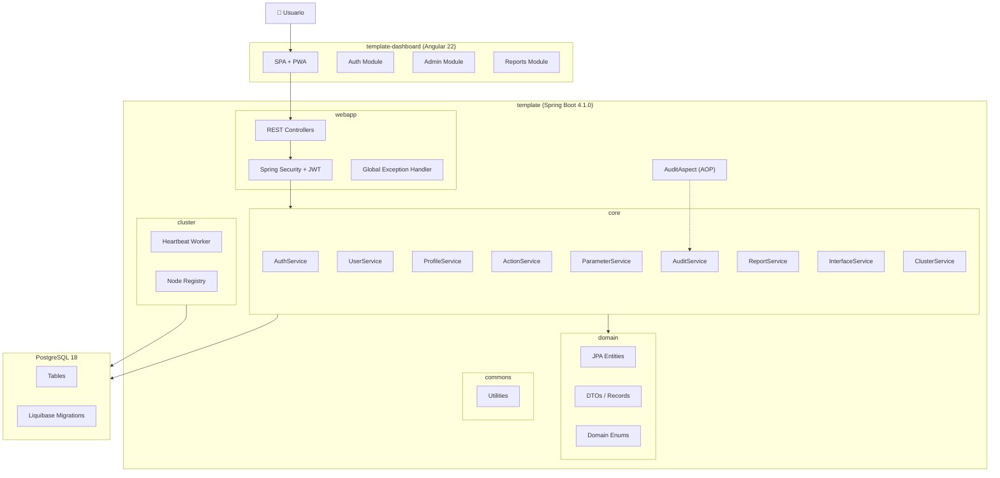
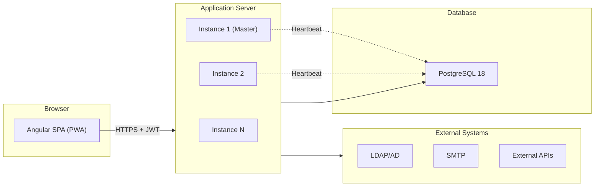
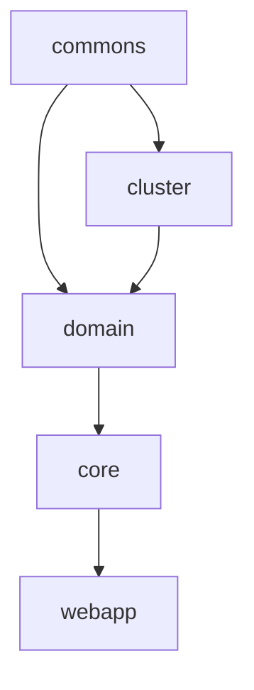
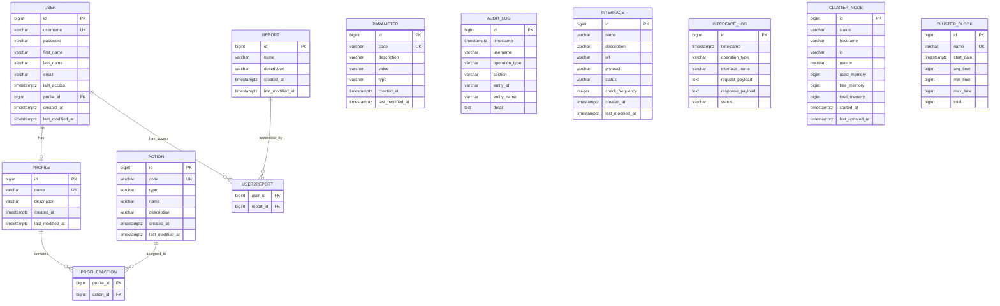

# Design Document: Template App

## Overview

Template App es una aplicación empresarial full-stack diseñada como plataforma reutilizable para proyectos corporativos. La arquitectura sigue un modelo cliente-servidor con:

- **Backend**: Java 21 + Spring Boot 4.1.0, organizado en un proyecto multi-módulo Maven (commons, cluster, domain, core, webapp).
- **Frontend**: Angular 22 SPA con Bootstrap 5.3.8, soporte PWA e i18n.
- **Base de datos**: PostgreSQL 18 con migraciones Liquibase.
- **Seguridad**: JWT (access + refresh tokens), autorización basada en perfiles y acciones.

La plataforma cubre: autenticación/autorización, gestión de usuarios/perfiles/acciones, informes con exportación multi-formato, auditoría AOP, supervisión de interfaces, cluster de alta disponibilidad, y configuración multi-entorno.

### Decisiones de diseño clave

1. **Separación Frontend API vs Integration API**: La Frontend API (`/api/v1/`) está optimizada para el dashboard Angular y no es un contrato público. Las APIs de integración (REST/SOAP) son contratos estables para sistemas externos.
2. **Auditoría no invasiva via AOP**: El sistema de auditoría se implementa como aspecto transversal que no contamina el código de negocio.
3. **Cluster auto-registrado**: Cada instancia se registra automáticamente al arrancar y envía heartbeat periódico.
4. **Modelo de seguridad por acciones**: La autorización se basa en acciones atómicas agrupadas en perfiles, no en roles monolíticos.

---

## Architecture

### High-Level Architecture



### Deployment Architecture



### Module Dependency Graph



---

## Components and Interfaces

### Backend Services

#### AuthService (core)

| Method | Description | Input | Output |
|--------|-------------|-------|--------|
| `authenticate(username, password)` | Valida credenciales y genera tokens | `LoginRequest` | `TokenResponse` (accessToken, refreshToken) |
| `refreshToken(refreshToken)` | Renueva access token | `String` | `TokenResponse` |
| `logout(refreshToken)` | Invalida refresh token | `String` | `void` |

#### UserService (core)

| Method | Description | Input | Output |
|--------|-------------|-------|--------|
| `create(request)` | Crear usuario | `CreateUserRequest` | `UserDTO` |
| `findById(id)` | Obtener usuario por ID | `Long` | `UserDTO` |
| `findByCriteria(criteria, pageable)` | Buscar con paginación | `UserCriteria`, `Pageable` | `Page<UserDTO>` |
| `update(id, request)` | Actualizar usuario | `Long`, `UpdateUserRequest` | `UserDTO` |
| `delete(id)` | Eliminar usuario | `Long` | `void` |
| `updateProfile(userId, request)` | Actualizar perfil propio | `Long`, `UpdateProfileRequest` | `UserDTO` |

#### ProfileService (core)

| Method | Description | Input | Output |
|--------|-------------|-------|--------|
| `create(request)` | Crear perfil con acciones | `CreateProfileRequest` | `ProfileDTO` |
| `findById(id)` | Obtener perfil con acciones | `Long` | `ProfileDTO` |
| `findByCriteria(criteria, pageable)` | Buscar con paginación | `ProfileCriteria`, `Pageable` | `Page<ProfileDTO>` |
| `update(id, request)` | Actualizar perfil | `Long`, `UpdateProfileRequest` | `ProfileDTO` |
| `delete(id)` | Eliminar perfil | `Long` | `void` |

#### ActionService (core)

| Method | Description | Input | Output |
|--------|-------------|-------|--------|
| `findById(id)` | Obtener acción | `Long` | `ActionDTO` |
| `findByCriteria(criteria, pageable)` | Buscar con paginación | `ActionCriteria`, `Pageable` | `Page<ActionDTO>` |
| `update(id, request)` | Actualizar nombre/desc/tipo | `Long`, `UpdateActionRequest` | `ActionDTO` |

#### ParameterService (core)

| Method | Description | Input | Output |
|--------|-------------|-------|--------|
| `create(request)` | Crear parámetro | `CreateParameterRequest` | `ParameterDTO` |
| `findByCode(code)` | Obtener por código | `String` | `ParameterDTO` |
| `findByCriteria(criteria, pageable)` | Buscar con paginación | `ParameterCriteria`, `Pageable` | `Page<ParameterDTO>` |
| `update(code, request)` | Actualizar parámetro | `String`, `UpdateParameterRequest` | `ParameterDTO` |
| `delete(code)` | Eliminar parámetro | `String` | `void` |

#### ReportService (core)

| Method | Description | Input | Output |
|--------|-------------|-------|--------|
| `findByUser(userId)` | Informes asignados al usuario | `Long` | `List<ReportDTO>` |
| `getFilters(reportId)` | Definición de filtros del informe | `Long` | `List<ReportFilterDTO>` |
| `execute(reportId, filters, pageable)` | Ejecutar informe paginado | `Long`, `Map`, `Pageable` | `Page<Map<String, Object>>` |
| `export(reportId, filters, format)` | Exportar informe | `Long`, `Map`, `ExportFormat` | `byte[]` |

#### AuditService (core)

| Method | Description | Input | Output |
|--------|-------------|-------|--------|
| `findByCriteria(criteria, pageable)` | Consultar logs de auditoría | `AuditCriteria`, `Pageable` | `Page<AuditLogDTO>` |
| `log(entry)` | Registrar operación (interno, llamado por AOP) | `AuditLogEntry` | `void` |

#### InterfaceService (core)

| Method | Description | Input | Output |
|--------|-------------|-------|--------|
| `findAll()` | Listar interfaces con estado | — | `List<InterfaceDTO>` |
| `findById(id)` | Detalle de interfaz | `Long` | `InterfaceDTO` |
| `findLogsByCriteria(criteria, pageable)` | Logs de operaciones | `InterfaceLogCriteria`, `Pageable` | `Page<InterfaceLogDTO>` |
| `findLogById(id)` | Detalle de operación | `Long` | `InterfaceLogDTO` |

#### ClusterService (core/cluster)

| Method | Description | Input | Output |
|--------|-------------|-------|--------|
| `findAllNodes()` | Listar nodos del cluster | — | `List<ClusterNodeDTO>` |
| `findNodeById(id)` | Detalle de nodo | `Long` | `ClusterNodeDTO` |
| `setMaster(id)` | Designar nodo maestro | `Long` | `ClusterNodeDTO` |
| `registerNode()` | Auto-registro al arranque | — | `void` |
| `heartbeat()` | Actualizar estado periódico | — | `void` |
| `findBlocksByCriteria(criteria, pageable)` | Listar bloqueos | `ClusterBlockCriteria`, `Pageable` | `Page<ClusterBlockDTO>` |
| `findBlockById(id)` | Detalle de bloqueo | `Long` | `ClusterBlockDTO` |

### Frontend Services (Angular)

#### AuthService (core/)

```typescript
interface AuthService {
  login(credentials: LoginRequest): Observable<TokenResponse>;
  logout(): Observable<void>;
  refreshToken(): Observable<TokenResponse>;
  getAccessToken(): string | null;
  getCurrentUser(): User | null;
  isAuthenticated(): boolean;
  hasAction(actionCode: string): boolean;
}
```

#### HTTP Interceptor

- Añade `Authorization: Bearer <token>` a cada request.
- Detecta expiración próxima y ejecuta refresh automáticamente.
- En caso de refresh fallido, redirige a login.

#### Guards

- `AuthGuard`: Verifica autenticación, redirige a `/login` si no autenticado.
- `ActionGuard`: Verifica que el usuario posee la acción requerida para la ruta.

### REST API Endpoints

#### Authentication

| Endpoint | Method | Description |
|----------|--------|-------------|
| `/api/v1/auth/login` | POST | Autenticar usuario |
| `/api/v1/auth/refresh` | POST | Renovar access token |
| `/api/v1/auth/logout` | POST | Cerrar sesión |

#### Users

| Endpoint | Method | Description |
|----------|--------|-------------|
| `/api/v1/users` | GET | Listar usuarios (paginado) |
| `/api/v1/users` | POST | Crear usuario |
| `/api/v1/users/{id}` | GET | Obtener usuario |
| `/api/v1/users/{id}` | PUT | Actualizar usuario |
| `/api/v1/users/{id}` | DELETE | Eliminar usuario |
| `/api/v1/users/me` | GET | Perfil del usuario actual |
| `/api/v1/users/me` | PUT | Actualizar perfil propio |

#### Profiles

| Endpoint | Method | Description |
|----------|--------|-------------|
| `/api/v1/profiles` | GET | Listar perfiles (paginado) |
| `/api/v1/profiles` | POST | Crear perfil |
| `/api/v1/profiles/{id}` | GET | Obtener perfil |
| `/api/v1/profiles/{id}` | PUT | Actualizar perfil |
| `/api/v1/profiles/{id}` | DELETE | Eliminar perfil |

#### Actions

| Endpoint | Method | Description |
|----------|--------|-------------|
| `/api/v1/actions` | GET | Listar acciones (paginado) |
| `/api/v1/actions/{id}` | GET | Obtener acción |
| `/api/v1/actions/{id}` | PUT | Actualizar acción |

#### Parameters

| Endpoint | Method | Description |
|----------|--------|-------------|
| `/api/v1/parameters` | GET | Listar parámetros (paginado) |
| `/api/v1/parameters` | POST | Crear parámetro |
| `/api/v1/parameters/{code}` | GET | Obtener parámetro |
| `/api/v1/parameters/{code}` | PUT | Actualizar parámetro |
| `/api/v1/parameters/{code}` | DELETE | Eliminar parámetro |

#### Audit

| Endpoint | Method | Description |
|----------|--------|-------------|
| `/api/v1/audit` | GET | Consultar registros de auditoría (paginado) |

#### Reports

| Endpoint | Method | Description |
|----------|--------|-------------|
| `/api/v1/reports` | GET | Informes asignados al usuario |
| `/api/v1/reports/{id}/filters` | GET | Definición de filtros |
| `/api/v1/reports/{id}/execute` | POST | Ejecutar informe (paginado) |
| `/api/v1/reports/{id}/export/{format}` | POST | Exportar informe (PDF, XLSX, CSV, TXT) |

#### Interfaces

| Endpoint | Method | Description |
|----------|--------|-------------|
| `/api/v1/interfaces` | GET | Listar interfaces con estado |
| `/api/v1/interfaces/{id}` | GET | Detalle de interfaz |
| `/api/v1/interfaces/{id}/logs` | GET | Logs de operaciones (paginado) |
| `/api/v1/interface-logs/{id}` | GET | Detalle de operación |

#### Cluster

| Endpoint | Method | Description |
|----------|--------|-------------|
| `/api/v1/cluster/nodes` | GET | Listar nodos |
| `/api/v1/cluster/nodes/{id}` | GET | Detalle de nodo |
| `/api/v1/cluster/nodes/{id}/master` | PATCH | Designar maestro |
| `/api/v1/cluster/blocks` | GET | Listar bloqueos (paginado) |
| `/api/v1/cluster/blocks/{id}` | GET | Detalle de bloqueo |

---

## Data Models

### Entity Relationship Diagram



### Domain Enums

| Enum | Values | Used In |
|------|--------|---------|
| `ActionType` | `READ`, `WRITE`, `EXECUTE` | `action.type` |
| `ParameterType` | `STRING`, `INTEGER`, `BOOLEAN`, `DATE` | `parameter.type` |
| `OperationType` | `CREATE`, `UPDATE`, `DELETE`, `EXECUTE` | `audit_log.operation_type` |
| `AuditSection` | `USERS`, `PROFILES`, `ACTIONS`, `PARAMETERS`, `REPORTS`, `INTERFACES`, `CLUSTER`, `SYSTEM` | `audit_log.section` |
| `NodeStatus` | `ALIVE`, `DEAD` | `cluster_node.status` |
| `InterfaceStatus` | `ACTIVE`, `INACTIVE`, `ERROR` | `interface.status` |
| `InterfaceOperationType` | `IN`, `OUT` | `interface_log.operation_type` |
| `InterfaceLogStatus` | `SUCCESS`, `ERROR` | `interface_log.status` |
| `ExportFormat` | `PDF`, `XLSX`, `CSV`, `TXT` | Report exports |

### Key Data Rules

1. **Passwords**: BCrypt hash, strength ≥ 12.
2. **Timestamps**: Almacenados como `TIMESTAMP WITH TIME ZONE` en UTC.
3. **Join tables**: Convención `<Entidad1>2<Entidad2>` con restricción de unicidad compuesta.
4. **Audit log**: Append-only, inmutable (no UPDATE/DELETE).
5. **Cluster nodes**: Creados/actualizados solo por el sistema; solo `master` editable por API.
6. **Cluster blocks**: Creados/actualizados solo por el sistema; solo lectura por API.
7. **Interface logs**: Append-only, inmutables.

---

## Correctness Properties

*A property is a characteristic or behavior that should hold true across all valid executions of a system — essentially, a formal statement about what the system should do. Properties serve as the bridge between human-readable specifications and machine-verifiable correctness guarantees.*

### Property 1: CRUD round-trip preserves entity data

*For any* valid entity creation request (user, profile, or parameter), creating the entity and then retrieving it by its identifier should return an entity whose fields are equivalent to the original request data (excluding system-generated fields like id, timestamps).

**Validates: Requirements 4.1, 14.1, 20.1**

### Property 2: Uniqueness constraint enforcement

*For any* entity with a uniqueness constraint (username for users, name for profiles, code for parameters, code for actions), attempting to create a second entity with the same unique field value should always result in a 409 Conflict response, regardless of the other field values.

**Validates: Requirements 4.6, 14.6, 20.6**

### Property 3: Duplicate list item detection

*For any* list field with a no-duplicates constraint (user's report assignments, profile's action assignments), submitting a create or update request containing at least one duplicate item in the list should always result in a 400 Bad Request response.

**Validates: Requirements 4.8, 14.9**

### Property 4: JWT payload contains user authorization data

*For any* authenticated user with a profile and assigned actions, decoding the access token JWT payload should yield the user's profile name and the complete list of action codes assigned to that profile.

**Validates: Requirements 5.1**

### Property 5: Authorization enforcement returns 403

*For any* user without a specific required action, attempting to access an API resource protected by that action should result in a 403 Forbidden response. Similarly, for any user without a report assignment, attempting to execute or export that report should result in a 403 Forbidden response.

**Validates: Requirements 5.4, 18.9**

### Property 6: Navigation visibility matches user actions

*For any* set of actions assigned to a user's profile, the set of visible navigation items in the SPA sidebar should be exactly the set of menu items whose required action is present in the user's action set.

**Validates: Requirements 5.6, 7.2**

### Property 7: Auth guard redirects unauthenticated users

*For any* route protected by the AuthGuard, an unauthenticated user (no valid token) attempting navigation should be redirected to the login page.

**Validates: Requirements 1.5**

### Property 8: Action guard redirects unauthorized users

*For any* route protected by a specific action code, a user whose profile does not contain that action code should be redirected to the Dashboard upon navigation attempt.

**Validates: Requirements 5.5**

### Property 9: Parameter type-value validation

*For any* parameter type (INTEGER, BOOLEAN, DATE) and *for any* value string that is not a valid representation of that type, creating or updating the parameter with that value should result in a 400 Bad Request response. Conversely, for any value that IS a valid representation of the declared type, the operation should succeed.

**Validates: Requirements 20.7, 28.5**

### Property 10: Audit log immutability

*For any* existing audit log record, any attempt to modify (UPDATE) or delete (DELETE) the record through the application layer should be rejected. The audit_log table is strictly append-only.

**Validates: Requirements 21.5**

### Property 11: Single master node invariant

*For any* sequence of setMaster operations on cluster nodes, at any point in time there should be at most one node with `master = true` in the cluster_node table.

**Validates: Requirements 23.4, 29.4**

### Property 12: Pagination metadata consistency

*For any* list endpoint, *for any* valid page size and page number, the response pagination metadata should satisfy: `totalPages = ceil(totalElements / size)`, the returned content length should be `≤ size`, and if `page < totalPages` then content should be non-empty.

**Validates: Requirements 25.1, 4.2, 14.2, 15.1, 20.2**

### Property 13: Timezone conversion round-trip

*For any* valid UTC timestamp and *for any* timezone offset, converting the UTC timestamp to the local timezone and then converting back to UTC should produce the original UTC timestamp (within millisecond precision).

**Validates: Requirements 27.3, 27.4**

### Property 14: API date format compliance

*For any* API response containing timestamp fields, all datetime values should conform to ISO 8601 format with the UTC suffix `Z` (e.g., `2024-01-15T10:30:00Z`).

**Validates: Requirements 27.2**

### Property 15: Translation key completeness

*For any* translation key used in any Angular template or component, that key should exist in all supported locale files (en.json and es.json) with a non-empty value.

**Validates: Requirements 12.1**

---

## Error Handling

### Backend Error Strategy

The application uses a centralized exception handling approach via `@RestControllerAdvice`:

```java
@RestControllerAdvice
public class GlobalExceptionHandler {
    // Maps domain exceptions to HTTP responses
}
```

#### Error Response Format

All API errors follow a consistent structure:

```json
{
  "timestamp": "2024-01-15T10:30:00Z",
  "status": 400,
  "error": "Bad Request",
  "message": "Descriptive error message",
  "path": "/api/v1/users"
}
```

#### Exception Classification

| Exception Type | HTTP Status | Use Case |
|---------------|-------------|----------|
| `EntityNotFoundException` | 404 | Entity not found by ID/code |
| `DuplicateEntityException` | 409 | Uniqueness constraint violation |
| `EntityInUseException` | 409 | Delete blocked by referential integrity |
| `ValidationException` | 400 | Invalid input (type mismatch, duplicates in lists) |
| `AuthenticationException` | 401 | Invalid credentials or expired token |
| `AccessDeniedException` | 403 | Insufficient permissions |
| `MethodNotAllowedException` | 405 | Disallowed operations (create/delete actions, nodes, etc.) |
| `ReportExportException` | 500 | Export generation failure |

### Frontend Error Strategy

#### HTTP Interceptor Error Handling

```typescript
// Error interceptor pipeline:
// 1. 401 → Attempt token refresh → If fails, redirect to login
// 2. 403 → Show error notification "Acceso denegado"
// 3. 4xx → Show error notification with server message
// 4. 5xx → Show generic error notification
// 5. Network errors → Show connectivity warning
```

#### Notification Integration

- **Progress**: Shown immediately when an operation starts (create, update, delete).
- **Success**: Replaces progress notification on success (auto-dismiss 5s).
- **Error**: Replaces progress notification on failure with server message (auto-dismiss 8s).
- All notifications are manually dismissible.

### Audit Error Isolation

The AuditAspect is designed to fail silently — if audit logging fails, it must NOT propagate the error to the business operation. The audit failure is logged via Log4j2 at ERROR level for operational monitoring.

---

## Testing Strategy

### Testing Stack

| Layer | Framework | Purpose |
|-------|-----------|---------|
| Backend Unit | JUnit 5 + Mockito + AssertJ | Service/logic unit tests |
| Backend Integration | Spring Boot Test + Testcontainers (PostgreSQL) | End-to-end API tests |
| Backend Property | **jqwik** | Property-based testing for business rules |
| Frontend Unit | Jest + Angular Testing Library | Component/service unit tests |
| Frontend Property | **fast-check** | Property-based testing for validation/conversion logic |
| Frontend E2E | Playwright | End-to-end browser tests |
| Code Quality | JaCoCo + SonarQube | Coverage and static analysis |

### Property-Based Testing Configuration

- **Backend (jqwik)**: Minimum 100 iterations per property test, configured via `@Property(tries = 100)`.
- **Frontend (fast-check)**: Minimum 100 iterations, configured via `fc.assert(property, { numRuns: 100 })`.
- Each property test is tagged with a comment referencing its design property.
- Tag format: **Feature: template-app, Property {number}: {property_text}**

### Test Distribution

#### Backend Property Tests (jqwik)

| Property | Test Class | What varies |
|----------|-----------|-------------|
| P1: CRUD round-trip | `EntityCrudRoundTripPropertyTest` | Random valid entity field values |
| P2: Uniqueness enforcement | `UniquenessConstraintPropertyTest` | Random unique field values |
| P3: Duplicate list detection | `DuplicateListValidationPropertyTest` | Random lists with injected duplicates |
| P4: JWT payload | `JwtPayloadPropertyTest` | Random users with random profiles/actions |
| P5: Authorization 403 | `AuthorizationEnforcementPropertyTest` | Random user/action combinations |
| P9: Parameter type-value | `ParameterTypeValidationPropertyTest` | Random type/value combinations |
| P10: Audit immutability | `AuditImmutabilityPropertyTest` | Random audit entries + modification attempts |
| P11: Single master node | `ClusterMasterInvariantPropertyTest` | Random sequences of setMaster calls |
| P12: Pagination metadata | `PaginationConsistencyPropertyTest` | Random data sets + page/size combinations |
| P14: API date format | `ApiDateFormatPropertyTest` | Random timestamps in responses |

#### Frontend Property Tests (fast-check)

| Property | Test File | What varies |
|----------|-----------|-------------|
| P6: Nav visibility | `navigation-visibility.property.spec.ts` | Random action sets |
| P7: Auth guard | `auth-guard.property.spec.ts` | Random protected routes |
| P8: Action guard | `action-guard.property.spec.ts` | Random routes + action sets |
| P13: Timezone round-trip | `timezone-conversion.property.spec.ts` | Random UTC timestamps + timezone offsets |
| P15: Translation completeness | `i18n-completeness.property.spec.ts` | All translation keys |

### Unit Test Focus Areas

Unit tests (example-based) complement property tests for:

- Login/logout flow (Req 1, 2, 3) — specific scenarios
- Profile page self-update (Req 9) — concrete examples
- Notification lifecycle (Req 11) — state transitions
- Report execution and export (Req 18, 19) — integration with mocks
- Cluster heartbeat registration (Req 30) — specific lifecycle events
- API method restrictions (405 responses for actions, nodes, blocks, audit)
- PWA service worker behavior (Req 13)

### Integration Test Focus Areas

- Full authentication flow with PostgreSQL (Testcontainers)
- Liquibase migrations apply successfully
- Audit AOP captures operations end-to-end
- Report export generates valid file formats (PDF, XLSX, CSV, TXT)
- Cluster node auto-registration and heartbeat cycle
- Interface log automatic recording

---

