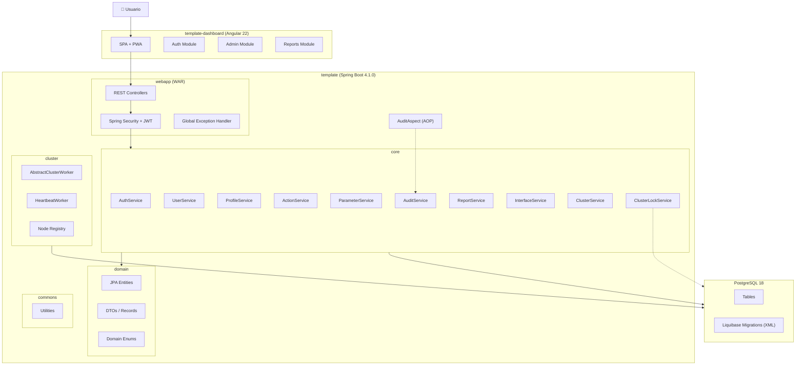
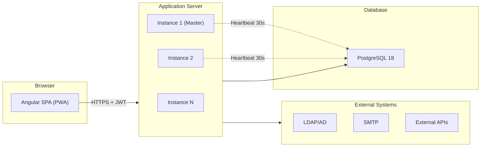
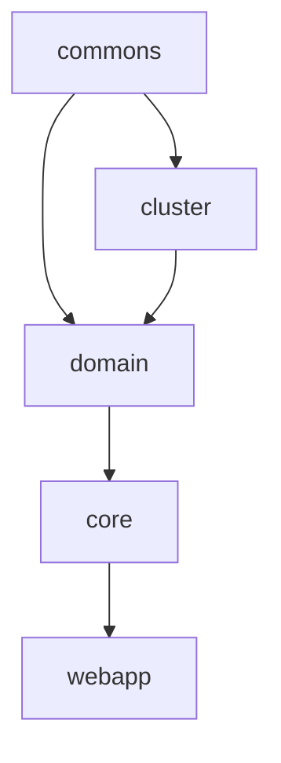
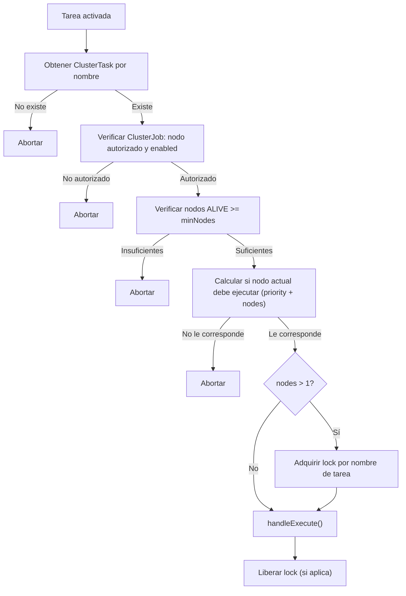

# Design Document: Template App

## Overview

Template App es una aplicación empresarial full-stack diseñada como plataforma reutilizable para proyectos corporativos. La arquitectura sigue un modelo cliente-servidor con:

- **Backend**: Java 21 + Spring Boot 4.1.0, organizado en un proyecto multi-módulo Maven (commons, cluster, domain, core, webapp).
- **Frontend**: Angular 22 SPA con Bootstrap 5.3.8, soporte PWA e i18n.
- **Base de datos**: PostgreSQL 18 con migraciones Liquibase (formato XML).
- **Seguridad**: JWT (access + refresh tokens), autorización basada en perfiles y acciones.

La plataforma cubre: autenticación/autorización, gestión de usuarios/perfiles/acciones, informes con exportación multi-formato, auditoría AOP, supervisión de interfaces, cluster de alta disponibilidad con gobernanza de tareas, y configuración multi-entorno.

### Decisiones de diseño clave

1. **Separación Frontend API vs Integration API**: La Frontend API (`/api/v1/`) está organizada jerárquicamente reflejando los módulos funcionales (administración/seguridad, administración/parámetros, etc.) y no es un contrato público. Las APIs de integración (REST/SOAP) son contratos estables para sistemas externos.
2. **Auditoría no invasiva via AOP**: El sistema de auditoría se implementa como aspecto transversal que no contamina el código de negocio. Es independiente de los campos `created_at`/`last_modified_at` de las entidades.
3. **Cluster auto-registrado con gobierno de tareas**: Cada instancia se registra automáticamente al arrancar, envía heartbeat periódico, detecta nodos muertos y elige maestro automáticamente. La ejecución de tareas se gobierna por configuración (ClusterTask/ClusterJob) con prioridades y condiciones de disponibilidad.
4. **Modelo de seguridad por acciones**: La autorización se basa en acciones atómicas agrupadas en perfiles, no en roles monolíticos. Las acciones controlan tanto el acceso API (backend) como la visibilidad de navegación y funcionalidades (frontend).
5. **Timestamps con zona horaria**: Todos los campos temporales usan `TIMESTAMP WITH TIME ZONE`, almacenados en UTC. El frontend convierte a la zona horaria local del usuario.
6. **Módulo domain sin dependencias de Spring**: El módulo domain es Java puro (salvo JPA), manteniendo la separación de responsabilidades.

---

## Architecture

### High-Level Architecture



### Deployment Architecture



### Module Dependency Graph



### Cluster Task Execution Flow



---

## DTO and Criteria Convention

### DTO Convention

Each domain entity has its own DTO class (Java record) that serves both for creation and update operations:

- **Create**: The DTO is sent with `id = null`. The system generates the identifier.
- **Update**: The DTO is sent with `id` populated, identifying the entity to update.

This eliminates the proliferation of `CreateXxxRequest` / `UpdateXxxRequest` classes. A single DTO per entity covers both use cases.

**DTOs del sistema:** `UserDTO`, `ProfileDTO`, `ActionDTO`, `ParameterDTO`, `ReportDTO`, `AuditLogDTO`, `InterfaceDTO`, `InterfaceLogDTO`, `ClusterNodeDTO`, `ClusterBlockDTO`, `ClusterTaskDTO`, `ClusterJobDTO`.

### Exceptions: Standalone Request/Response Objects

Only the following Request/Response objects are permitted because they have no corresponding domain entity:

| Object | Justification |
|--------|---------------|
| `LoginRequest` | Encapsulates authentication credentials (username + password). No "Login" entity exists. |
| `TokenResponse` | Encapsulates the JWT token pair (accessToken + refreshToken). No "Token" entity exists. |

No other `XxxRequest` or `XxxResponse` classes are allowed in the domain layer.

### Criteria Convention

Each entity that supports paginated listing with filters has its own Criteria class:

- `UserCriteria`, `ProfileCriteria`, `ActionCriteria`, `ParameterCriteria`, `AuditCriteria`, `InterfaceLogCriteria`, `ClusterBlockCriteria`.

Criteria objects are used exclusively as input parameters in:
- `findByCriteria(criteria, pageable)` → returns `Page<XxxDTO>`
- `countByCriteria(criteria)` → returns `long`

---

## Components and Interfaces

### Backend Services

#### AuthService (core)

| Method | Description | Input | Output |
|--------|-------------|-------|--------|
| `authenticate(username, password)` | Valida credenciales y genera tokens | `LoginRequest` | `TokenResponse` (accessToken, refreshToken) |
| `refreshToken(refreshToken)` | Renueva access token | `String` | `TokenResponse` |
| `logout(refreshToken)` | Invalida refresh token | `String` | `void` |

#### UserService (core)

| Method | Description | Input | Output |
|--------|-------------|-------|--------|
| `create(dto)` | Crear usuario con perfil y lista de informes | `UserDTO` (id=null) | `UserDTO` |
| `findById(id)` | Obtener usuario por ID | `Long` | `UserDTO` |
| `findByCriteria(criteria, pageable)` | Buscar con paginación y filtros | `UserCriteria`, `Pageable` | `Page<UserDTO>` |
| `countByCriteria(criteria)` | Contar registros que coinciden con filtros | `UserCriteria` | `long` |
| `update(id, dto)` | Actualizar usuario | `Long`, `UserDTO` (id populated) | `UserDTO` |
| `delete(id)` | Eliminar usuario | `Long` | `void` |
| `updateProfile(userId, dto)` | Actualizar perfil propio (nombre, apellidos, email) | `Long`, `UserDTO` (id populated) | `UserDTO` |

#### ProfileService (core)

| Method | Description | Input | Output |
|--------|-------------|-------|--------|
| `create(dto)` | Crear perfil con lista de acciones | `ProfileDTO` (id=null) | `ProfileDTO` |
| `findById(id)` | Obtener perfil con acciones | `Long` | `ProfileDTO` |
| `findByCriteria(criteria, pageable)` | Buscar con paginación y filtros | `ProfileCriteria`, `Pageable` | `Page<ProfileDTO>` |
| `countByCriteria(criteria)` | Contar registros que coinciden con filtros | `ProfileCriteria` | `long` |
| `update(id, dto)` | Actualizar perfil | `Long`, `ProfileDTO` (id populated) | `ProfileDTO` |
| `delete(id)` | Eliminar perfil (falla si tiene usuarios asignados) | `Long` | `void` |

#### ActionService (core)

| Method | Description | Input | Output |
|--------|-------------|-------|--------|
| `findById(id)` | Obtener acción | `Long` | `ActionDTO` |
| `findByCriteria(criteria, pageable)` | Buscar con paginación y filtros | `ActionCriteria`, `Pageable` | `Page<ActionDTO>` |
| `countByCriteria(criteria)` | Contar registros que coinciden con filtros | `ActionCriteria` | `long` |
| `update(id, dto)` | Actualizar nombre/desc/tipo | `Long`, `ActionDTO` (id populated) | `ActionDTO` |

#### ParameterService (core)

| Method | Description | Input | Output |
|--------|-------------|-------|--------|
| `create(dto)` | Crear parámetro (valida tipo-valor) | `ParameterDTO` (id=null) | `ParameterDTO` |
| `findByCode(code)` | Obtener por código | `String` | `ParameterDTO` |
| `findByCriteria(criteria, pageable)` | Buscar con paginación y filtros | `ParameterCriteria`, `Pageable` | `Page<ParameterDTO>` |
| `countByCriteria(criteria)` | Contar registros que coinciden con filtros | `ParameterCriteria` | `long` |
| `update(code, dto)` | Actualizar parámetro (valida tipo-valor) | `String`, `ParameterDTO` (id populated) | `ParameterDTO` |
| `delete(code)` | Eliminar parámetro | `String` | `void` |

#### ReportService (core)

| Method | Description | Input | Output |
|--------|-------------|-------|--------|
| `findByUser(userId)` | Informes asignados al usuario (via user2report) | `Long` | `List<ReportDTO>` |
| `getFilters(reportId)` | Definición de filtros del informe | `Long` | `List<ReportFilterDTO>` |
| `execute(reportId, filters, pageable)` | Ejecutar informe paginado | `Long`, `Map`, `Pageable` | `Page<Map<String, Object>>` |
| `export(reportId, filters, format)` | Exportar informe (PDF, XLSX, CSV, TXT) | `Long`, `Map`, `ExportFormat` | `byte[]` |

#### AuditService (core)

| Method | Description | Input | Output |
|--------|-------------|-------|--------|
| `findByCriteria(criteria, pageable)` | Consultar logs de auditoría | `AuditCriteria`, `Pageable` | `Page<AuditLogDTO>` |
| `countByCriteria(criteria)` | Contar registros de auditoría que coinciden con filtros | `AuditCriteria` | `long` |
| `log(entry)` | Registrar operación (interno, llamado por AOP) | `AuditLogEntry` | `void` |

#### InterfaceService (core)

| Method | Description | Input | Output |
|--------|-------------|-------|--------|
| `findAll()` | Listar interfaces con estado | — | `List<InterfaceDTO>` |
| `findById(id)` | Detalle de interfaz | `Long` | `InterfaceDTO` |
| `findLogsByCriteria(criteria, pageable)` | Logs de operaciones (paginado, filtros) | `InterfaceLogCriteria`, `Pageable` | `Page<InterfaceLogDTO>` |
| `countLogsByCriteria(criteria)` | Contar logs de operaciones que coinciden con filtros | `InterfaceLogCriteria` | `long` |
| `findLogById(id)` | Detalle de operación | `Long` | `InterfaceLogDTO` |

#### ClusterService (core/cluster)

| Method | Description | Input | Output |
|--------|-------------|-------|--------|
| `findAllNodes()` | Listar nodos del cluster | — | `List<ClusterNodeDTO>` |
| `findNodeById(id)` | Detalle de nodo | `Long` | `ClusterNodeDTO` |
| `setMaster(id)` | Designar nodo maestro (desactiva el anterior) | `Long` | `ClusterNodeDTO` |
| `registerNode()` | Auto-registro al arranque (crear o actualizar por hostname) | — | `void` |
| `heartbeat()` | Actualizar estado periódico (30s) | — | `void` |
| `detectDeadNodes()` | Marcar nodos con timeout > 5min como DEAD | — | `void` |
| `electMaster()` | Elegir maestro si no existe ninguno ALIVE con master=true | — | `void` |
| `findBlocksByCriteria(criteria, pageable)` | Listar bloqueos | `ClusterBlockCriteria`, `Pageable` | `Page<ClusterBlockDTO>` |
| `countBlocksByCriteria(criteria)` | Contar bloqueos que coinciden con filtros | `ClusterBlockCriteria` | `long` |
| `findBlockById(id)` | Detalle de bloqueo | `Long` | `ClusterBlockDTO` |

#### ClusterLockService (core/cluster)

| Method | Description | Input | Output |
|--------|-------------|-------|--------|
| `acquireLock(resourceName)` | Adquirir lock (intra + inter instancia) | `String` | `void` |
| `releaseLock(resourceName)` | Liberar lock y actualizar métricas en ClusterBlock | `String` | `void` |
| `isLocked(resourceName)` | Verificar si recurso tiene lock activo | `String` | `boolean` |

#### AbstractClusterWorker (cluster)

| Method | Description | Input | Output |
|--------|-------------|-------|--------|
| `execute()` | Orquesta el flujo de gobierno (template method) | — | `void` |
| `handleExecute()` | Lógica específica de la tarea (abstract) | — | `void` |
| `getTaskName()` | Nombre de la tarea en ClusterTask (abstract) | — | `String` |

#### HeartbeatWorker (cluster)

| Method | Description | Input | Output |
|--------|-------------|-------|--------|
| `onDeadNodeDetected(node)` | Reaccionar ante nodo muerto (abstract) | `ClusterNode` | `void` |
| `onFirstInvocation()` | Lógica de primera invocación tras arranque (abstract) | — | `void` |

### Frontend Services (Angular)

#### AuthService (core/)

```typescript
interface AuthService {
  login(credentials: LoginRequest): Observable<TokenResponse>;
  logout(): Observable<void>;
  refreshToken(): Observable<TokenResponse>;
  getAccessToken(): string | null;
  getCurrentUser(): User | null;
  isAuthenticated(): boolean;
  hasAction(actionCode: string): boolean;
}
```

#### HTTP Interceptor

- Añade `Authorization: Bearer <token>` a cada request.
- Detecta expiración próxima (margen configurable) y ejecuta refresh automáticamente.
- En caso de refresh fallido, redirige a login.

#### Guards

- `AuthGuard`: Verifica autenticación, redirige a `/login` si no autenticado.
- `ActionGuard`: Verifica que el usuario posee la acción requerida para la ruta. Redirige al Dashboard si no autorizado.

#### DateService / DatePipe (centralizado)

- Convierte UTC → zona horaria local del usuario (`Intl.DateTimeFormat().resolvedOptions().timeZone`).
- Convierte zona horaria local → UTC antes de enviar al backend.
- Aplicado consistentemente en toda la interfaz.

#### I18nService

- Detección automática del idioma del navegador (`navigator.language`).
- Fallback a inglés (en) si el idioma no está soportado.
- Persistencia de preferencia en localStorage.
- Cambio de idioma sin recarga de página.
- Idiomas soportados: en, es.

### REST API Endpoints (Frontend API)

#### Authentication (`/api/v1/auth/`)

| Endpoint | Method | Description |
|----------|--------|-------------|
| `/api/v1/auth/login` | POST | Autenticar usuario |
| `/api/v1/auth/refresh` | POST | Renovar access token |
| `/api/v1/auth/logout` | POST | Cerrar sesión |

#### Users (`/api/v1/administration/security/users/`)

| Endpoint | Method | Description |
|----------|--------|-------------|
| `/api/v1/administration/security/users` | GET | Listar usuarios (paginado, filtros) |
| `/api/v1/administration/security/users/count` | GET | Contar usuarios que coinciden con filtros |
| `/api/v1/administration/security/users` | POST | Crear usuario |
| `/api/v1/administration/security/users/{id}` | GET | Obtener usuario |
| `/api/v1/administration/security/users/{id}` | PUT | Actualizar usuario |
| `/api/v1/administration/security/users/{id}` | DELETE | Eliminar usuario |
| `/api/v1/administration/security/users/me` | GET | Perfil del usuario actual |
| `/api/v1/administration/security/users/me` | PUT | Actualizar perfil propio |

#### Profiles (`/api/v1/administration/security/profiles/`)

| Endpoint | Method | Description |
|----------|--------|-------------|
| `/api/v1/administration/security/profiles` | GET | Listar perfiles (paginado, filtros) |
| `/api/v1/administration/security/profiles/count` | GET | Contar perfiles que coinciden con filtros |
| `/api/v1/administration/security/profiles` | POST | Crear perfil |
| `/api/v1/administration/security/profiles/{id}` | GET | Obtener perfil |
| `/api/v1/administration/security/profiles/{id}` | PUT | Actualizar perfil |
| `/api/v1/administration/security/profiles/{id}` | DELETE | Eliminar perfil |

#### Actions (`/api/v1/administration/security/actions/`)

| Endpoint | Method | Description |
|----------|--------|-------------|
| `/api/v1/administration/security/actions` | GET | Listar acciones (paginado, filtros) |
| `/api/v1/administration/security/actions/count` | GET | Contar acciones que coinciden con filtros |
| `/api/v1/administration/security/actions/{id}` | GET | Obtener acción |
| `/api/v1/administration/security/actions/{id}` | PUT | Actualizar acción |
| `/api/v1/administration/security/actions` | POST | ❌ 405 Method Not Allowed |
| `/api/v1/administration/security/actions/{id}` | DELETE | ❌ 405 Method Not Allowed |

#### Parameters (`/api/v1/administration/parameters/`)

| Endpoint | Method | Description |
|----------|--------|-------------|
| `/api/v1/administration/parameters` | GET | Listar parámetros (paginado, filtros) |
| `/api/v1/administration/parameters/count` | GET | Contar parámetros que coinciden con filtros |
| `/api/v1/administration/parameters` | POST | Crear parámetro |
| `/api/v1/administration/parameters/{code}` | GET | Obtener parámetro |
| `/api/v1/administration/parameters/{code}` | PUT | Actualizar parámetro |
| `/api/v1/administration/parameters/{code}` | DELETE | Eliminar parámetro |

#### Audit (`/api/v1/administration/audit/`)

| Endpoint | Method | Description |
|----------|--------|-------------|
| `/api/v1/administration/audit/system` | GET | Consultar registros de auditoría del sistema (paginado, filtros) |
| `/api/v1/administration/audit/system/count` | GET | Contar registros de auditoría que coinciden con filtros |
| `/api/v1/administration/audit/interfaces` | GET | Consultar trazabilidad de operaciones de interfaces (paginado, filtros) |
| `/api/v1/administration/audit/interfaces/count` | GET | Contar operaciones de interfaces que coinciden con filtros |
| `/api/v1/administration/audit/interfaces/{id}` | GET | Detalle de operación de interfaz |

#### Interfaces (`/api/v1/administration/interfaces/`)

| Endpoint | Method | Description |
|----------|--------|-------------|
| `/api/v1/administration/interfaces` | GET | Listar interfaces con estado |
| `/api/v1/administration/interfaces/{id}` | GET | Detalle de interfaz |

#### Cluster (`/api/v1/administration/cluster/`)

| Endpoint | Method | Description |
|----------|--------|-------------|
| `/api/v1/administration/cluster/nodes` | GET | Listar nodos |
| `/api/v1/administration/cluster/nodes/{id}` | GET | Detalle de nodo |
| `/api/v1/administration/cluster/nodes/{id}` | PATCH | Actualizar campo master |
| `/api/v1/administration/cluster/nodes` | POST | ❌ 405 Method Not Allowed |
| `/api/v1/administration/cluster/nodes/{id}` | DELETE | ❌ 405 Method Not Allowed |
| `/api/v1/administration/cluster/blocks` | GET | Listar bloqueos (paginado, filtros) |
| `/api/v1/administration/cluster/blocks/count` | GET | Contar bloqueos que coinciden con filtros |
| `/api/v1/administration/cluster/blocks/{id}` | GET | Detalle de bloqueo |

#### Reports (`/api/v1/reports/`)

| Endpoint | Method | Description |
|----------|--------|-------------|
| `/api/v1/reports` | GET | Informes asignados al usuario |
| `/api/v1/reports/{id}/filters` | GET | Definición de filtros |
| `/api/v1/reports/{id}/execute` | POST | Ejecutar informe (paginado) |
| `/api/v1/reports/{id}/export/{format}` | POST | Exportar informe (PDF, XLSX, CSV, TXT) |

---

## Data Models

### Entity Relationship Diagram

```mermaid
erDiagram
    USER }o--|| PROFILE : "has"
    PROFILE ||--o{ PROFILE2ACTION : "contains"
    ACTION ||--o{ PROFILE2ACTION : "assigned_to"
    USER ||--o{ USER2REPORT : "has_access"
    REPORT ||--o{ USER2REPORT : "accessible_by"
    CLUSTER_NODE ||--o{ CLUSTER_JOB : "assigned"
    CLUSTER_TASK ||--o{ CLUSTER_JOB : "executed_by"
    CLUSTER_TASK ||--o{ CLUSTER_BLOCK : "tracks"
    
    USER {
        bigint id PK
        varchar username UK
        varchar password
        varchar first_name
        varchar last_name
        varchar email
        timestamptz last_access
        bigint profile_id FK
        timestamptz created_at
        timestamptz last_modified_at
    }
    
    PROFILE {
        bigint id PK
        varchar name UK
        varchar description
        timestamptz created_at
        timestamptz last_modified_at
    }
    
    ACTION {
        bigint id PK
        varchar code UK
        varchar type
        varchar name
        varchar description
        timestamptz created_at
        timestamptz last_modified_at
    }
    
    PROFILE2ACTION {
        bigint profile_id FK
        bigint action_id FK
    }
    
    USER2REPORT {
        bigint user_id FK
        bigint report_id FK
    }
    
    REPORT {
        bigint id PK
        varchar name
        varchar description
        timestamptz created_at
        timestamptz last_modified_at
    }
    
    PARAMETER {
        bigint id PK
        varchar code UK
        varchar description
        varchar value
        varchar type
        timestamptz created_at
        timestamptz last_modified_at
    }
    
    AUDIT_LOG {
        bigint id PK
        timestamptz timestamp
        varchar username
        varchar operation_type
        varchar section
        varchar entity_id
        varchar entity_name
        text detail
    }
    
    INTERFACE {
        bigint id PK
        varchar name
        varchar description
        varchar url
        varchar protocol
        varchar status
        integer check_frequency
        timestamptz created_at
        timestamptz last_modified_at
    }
    
    INTERFACE_LOG {
        bigint id PK
        timestamptz timestamp
        varchar operation_type
        varchar interface_name
        text request_payload
        text response_payload
        varchar status
    }
    
    CLUSTER_NODE {
        bigint id PK
        varchar status
        varchar hostname
        varchar ip
        boolean master
        bigint used_memory
        bigint free_memory
        bigint total_memory
        timestamptz started_at
        timestamptz last_modified_at
    }
    
    CLUSTER_BLOCK {
        bigint id PK
        varchar name FK "UK - references cluster_task.name"
        timestamptz start_date
        bigint avg_time
        bigint min_time
        bigint max_time
        bigint total
    }
    
    CLUSTER_TASK {
        bigint id PK
        varchar name UK
        varchar description
        integer nodes
        integer min_nodes
    }
    
    CLUSTER_JOB {
        bigint cluster_node_id PK_FK
        bigint cluster_task_id PK_FK
        integer priority
        boolean enabled
    }
```



### Domain Enums

| Enum | Values | Used In |
|------|--------|---------|
| `ActionType` | `READ`, `WRITE`, `EXECUTE` | `action.type` |
| `ParameterType` | `STRING`, `INTEGER`, `BOOLEAN`, `DATE` | `parameter.type` |
| `OperationType` | `CREATE`, `UPDATE`, `DELETE`, `EXECUTE` | `audit_log.operation_type` |
| `AuditSection` | `SECURITY`, `REPORTS`, `INTERFACES`, `CLUSTER`, `SYSTEM` | `audit_log.section` |
| `NodeStatus` | `ALIVE`, `DEAD` | `cluster_node.status` |
| `InterfaceStatus` | `ACTIVE`, `INACTIVE`, `ERROR` | `interface.status` |
| `InterfaceOperationType` | `IN`, `OUT` | `interface_log.operation_type` |
| `InterfaceLogStatus` | `SUCCESS`, `ERROR` | `interface_log.status` |
| `ExportFormat` | `PDF`, `XLSX`, `CSV`, `TXT` | Report exports |

### Key Data Rules

1. **Passwords**: BCrypt hash, strength ≥ 12.
2. **Timestamps**: Almacenados como `TIMESTAMP WITH TIME ZONE` en UTC. Todos responden en ISO 8601 con sufijo `Z`.
3. **Join tables**: Convención `<Entidad1>2<Entidad2>` con restricción de unicidad compuesta.
4. **Audit log**: Append-only, inmutable (no UPDATE/DELETE). Índices en (timestamp, username), operation_type, section.
5. **Interface logs**: Append-only, inmutables. Índices en (timestamp, interface_name), status.
6. **Cluster nodes**: Creados/actualizados solo por el sistema; solo `master` editable por API. Timeout de heartbeat: 5 minutos.
7. **Cluster blocks**: Creados/actualizados solo por el sistema; solo lectura por API. El campo `name` es clave foránea que referencia `cluster_task.name`, garantizando integridad referencial (todo bloqueo corresponde a una tarea registrada).
8. **Cluster tasks**: Campo `nodes` ≥ 1, campo `minNodes` ≥ 1. Nombre único. Su campo `name` es referenciado por `cluster_block.name` (ON DELETE RESTRICT, ON UPDATE CASCADE).
9. **Cluster jobs**: Clave compuesta (cluster_node_id, cluster_task_id). Claves foráneas con política de integridad referencial.
10. **Entidades con trazabilidad**: Todos los registros incluyen `created_at` (inmutable tras creación) y `last_modified_at` (actualizado automáticamente por Spring Data JPA). Son solo lectura en la API.
11. **Parameter type-value validation**: El valor debe ser compatible con el tipo declarado (INTEGER → número entero, BOOLEAN → "true"/"false", DATE → ISO 8601, STRING → cualquier valor).

---

## Correctness Properties

*A property is a characteristic or behavior that should hold true across all valid executions of a system — essentially, a formal statement about what the system should do. Properties serve as the bridge between human-readable specifications and machine-verifiable correctness guarantees.*

### Property 1: CRUD round-trip preserves entity data

*For any* valid entity creation request (user, profile, or parameter), creating the entity and then retrieving it by its identifier should return an entity whose fields are equivalent to the original request data (excluding system-generated fields like id, created_at, last_modified_at, lastAccess).

**Validates: Requirements 4.1, 4.3, 14.1, 14.3, 20.1, 20.3**

### Property 2: Uniqueness constraint enforcement

*For any* entity with a uniqueness constraint (username for users, name for profiles, code for parameters, code for actions), attempting to create a second entity with the same unique field value should always result in a 409 Conflict response, regardless of the other field values.

**Validates: Requirements 4.6, 14.6, 20.6**

### Property 3: Duplicate list item detection

*For any* list field with a no-duplicates constraint (user's report assignments, profile's action assignments), submitting a create or update request containing at least one duplicate item in the list should always result in a 400 Bad Request response.

**Validates: Requirements 4.8, 14.9**

### Property 4: JWT payload contains user authorization data

*For any* authenticated user with a profile and assigned actions, decoding the access token JWT payload should yield the user's profile name and the complete list of action codes assigned to that profile.

**Validates: Requirements 5.1**

### Property 5: Authorization enforcement returns 403

*For any* user without a specific required action, attempting to access an API resource protected by that action should result in a 403 Forbidden response. Similarly, for any user without a report assignment, attempting to execute or export that report should result in a 403 Forbidden response.

**Validates: Requirements 5.4, 18.9**

### Property 6: Navigation visibility matches user actions

*For any* set of actions assigned to a user's profile, the set of visible navigation items in the SPA sidebar should be exactly the set of menu items whose required action is present in the user's action set.

**Validates: Requirements 5.6, 7.2**

### Property 7: Auth guard redirects unauthenticated users

*For any* route protected by the AuthGuard, an unauthenticated user (no valid token) attempting navigation should be redirected to the login page.

**Validates: Requirements 1.5**

### Property 8: Action guard redirects unauthorized users

*For any* route protected by a specific action code, a user whose profile does not contain that action code should be redirected to the Dashboard upon navigation attempt.

**Validates: Requirements 5.5**

### Property 9: Parameter type-value validation

*For any* parameter type (INTEGER, BOOLEAN, DATE) and *for any* value string that is not a valid representation of that type, creating or updating the parameter with that value should result in a 400 Bad Request response. Conversely, for any value string that IS a valid representation of the declared type, the operation should succeed.

**Validates: Requirements 20.7, 28.5**

### Property 10: Audit log immutability

*For any* existing audit log record, any attempt to modify (UPDATE) or delete (DELETE) the record through the application layer should be rejected. The audit_log table is strictly append-only.

**Validates: Requirements 21.5, 26.3**

### Property 11: Single master node invariant

*For any* sequence of setMaster operations on cluster nodes, at any point in time there should be at most one node with `master = true` in the cluster_node table.

**Validates: Requirements 23.4, 29.4**

### Property 12: Pagination metadata consistency

*For any* list endpoint, *for any* valid page size and page number, the response pagination metadata should satisfy: `totalPages = ceil(totalElements / size)`, the returned content length should be `≤ size`, and if `page < totalPages` then content should be non-empty.

**Validates: Requirements 25.1, 4.2, 14.2, 20.2**

### Property 13: Timezone conversion round-trip

*For any* valid UTC timestamp and *for any* timezone offset, converting the UTC timestamp to the local timezone and then converting back to UTC should produce the original UTC timestamp (within millisecond precision).

**Validates: Requirements 27.3, 27.4**

### Property 14: API date format compliance

*For any* API response containing timestamp fields, all datetime values should conform to ISO 8601 format with the UTC suffix `Z` (e.g., `2024-01-15T10:30:00Z`).

**Validates: Requirements 27.2**

### Property 15: Translation key completeness

*For any* translation key used in any Angular template or component, that key should exist in all supported locale files (en.json and es.json) with a non-empty value.

**Validates: Requirements 12.1**

### Property 16: System-managed timestamps are read-only

*For any* entity creation or update request that includes values for `created_at` or `last_modified_at` fields, the system should ignore the client-provided values and set its own system-generated timestamps.

**Validates: Requirements 34.4, 34.5, 34.6**

### Property 17: Cluster task execution governance

*For any* cluster configuration (task definition, job assignments, node states), the AbstractClusterWorker execution decision should satisfy: (a) if no ClusterTask exists for the name → abort, (b) if node has no enabled ClusterJob → abort, (c) if ALIVE nodes < minNodes → abort, (d) if node is not within the top N priority candidates (where N = task.nodes) → abort, (e) otherwise → execute.

**Validates: Requirements 38.1, 38.2, 38.3, 38.4, 38.5, 38.8**

---

## Error Handling

### Backend Error Strategy

The application uses a centralized exception handling approach via `@RestControllerAdvice`:

```java
@RestControllerAdvice
public class GlobalExceptionHandler {
    // Maps domain exceptions to HTTP responses
}
```

#### Error Response Format

All API errors follow a consistent structure:

```json
{
  "timestamp": "2024-01-15T10:30:00Z",
  "status": 400,
  "error": "Bad Request",
  "message": "Descriptive error message",
  "path": "/api/v1/administration/security/users"
}
```

#### Exception Classification

| Exception Type | HTTP Status | Use Case |
|---------------|-------------|----------|
| `EntityNotFoundException` | 404 | Entity not found by ID/code |
| `DuplicateEntityException` | 409 | Uniqueness constraint violation (username, name, code) |
| `EntityInUseException` | 409 | Delete blocked by referential integrity (profile in use) |
| `ValidationException` | 400 | Invalid input (type mismatch, duplicates in lists, missing required filters) |
| `AuthenticationException` | 401 | Invalid credentials or expired token |
| `AccessDeniedException` | 403 | Insufficient permissions (missing action, unauthorized report access) |
| `MethodNotAllowedException` | 405 | Disallowed operations (create/delete actions, create/delete nodes, CRUD blocks, CRUD audit, CRUD interfaces) |
| `ReportExportException` | 500 | Export generation failure |

### Frontend Error Strategy

#### HTTP Interceptor Error Handling

```typescript
// Error interceptor pipeline:
// 1. 401 → Attempt token refresh → If fails, redirect to login
// 2. 403 → Show error notification "Acceso denegado"
// 3. 4xx → Show error notification with server message
// 4. 5xx → Show generic error notification
// 5. Network errors → Show connectivity warning (PWA offline mode)
```

#### Notification Integration

- **Progress**: Shown immediately when an operation starts (create, update, delete, export, pagination, filter).
- **Success**: Replaces progress notification on success (auto-dismiss 5s).
- **Error**: Replaces progress notification on failure with server message (auto-dismiss 8s).
- All notifications are manually dismissible.
- Three types supported: progreso (in-progress), éxito (success), error (failure).

### Audit Error Isolation

The AuditAspect is designed to fail silently — if audit logging fails, it must NOT propagate the error to the business operation. The audit failure is logged via the application's logging framework at ERROR level for operational monitoring.

### Cluster Lock Error Handling

If a lock cannot be acquired because another node or thread holds it, the ClusterLockService blocks the requesting thread until the lock is released (or applies a configured timeout policy). Lock-related failures do not propagate to the business operation's caller beyond the timeout.

---

## Testing Strategy

### Testing Stack

| Layer | Framework | Purpose |
|-------|-----------|---------|
| Backend Unit | JUnit 5 + Mockito + AssertJ | Service/logic unit tests |
| Backend Integration | Spring Boot Test + Testcontainers (PostgreSQL) | End-to-end API tests |
| Backend Property | **jqwik** | Property-based testing for business rules |
| Frontend Unit | Jest + Angular Testing Library | Component/service unit tests |
| Frontend Property | **fast-check** | Property-based testing for validation/conversion logic |
| Frontend E2E | Playwright | End-to-end browser tests |
| Code Quality | JaCoCo + SonarQube | Coverage and static analysis |

### Property-Based Testing Configuration

- **Backend (jqwik)**: Minimum 100 iterations per property test, configured via `@Property(tries = 100)`.
- **Frontend (fast-check)**: Minimum 100 iterations, configured via `fc.assert(property, { numRuns: 100 })`.
- Each property test is tagged with a comment referencing its design property.
- Tag format: **Feature: template-app, Property {number}: {property_text}**

### Test Distribution

#### Backend Property Tests (jqwik)

| Property | Test Class | What varies |
|----------|-----------|-------------|
| P1: CRUD round-trip | `EntityCrudRoundTripPropertyTest` | Random valid entity field values (users, profiles, parameters) |
| P2: Uniqueness enforcement | `UniquenessConstraintPropertyTest` | Random unique field values across entities |
| P3: Duplicate list detection | `DuplicateListValidationPropertyTest` | Random lists with injected duplicates |
| P4: JWT payload | `JwtPayloadPropertyTest` | Random users with random profiles/actions |
| P5: Authorization 403 | `AuthorizationEnforcementPropertyTest` | Random user/action/report combinations |
| P9: Parameter type-value | `ParameterTypeValidationPropertyTest` | Random type/value combinations (valid and invalid) |
| P10: Audit immutability | `AuditImmutabilityPropertyTest` | Random audit entries + modification/deletion attempts |
| P11: Single master node | `ClusterMasterInvariantPropertyTest` | Random sequences of setMaster calls |
| P12: Pagination metadata | `PaginationConsistencyPropertyTest` | Random data sets + page/size combinations |
| P14: API date format | `ApiDateFormatPropertyTest` | Random timestamps in responses across all endpoints |
| P16: Timestamp read-only | `TimestampReadOnlyPropertyTest` | Random creation/update requests with client-provided timestamps |
| P17: Task execution governance | `ClusterTaskGovernancePropertyTest` | Random cluster configurations (tasks, jobs, node states, priorities) |

#### Frontend Property Tests (fast-check)

| Property | Test File | What varies |
|----------|-----------|-------------|
| P6: Nav visibility | `navigation-visibility.property.spec.ts` | Random action sets |
| P7: Auth guard | `auth-guard.property.spec.ts` | Random protected routes + unauthenticated state |
| P8: Action guard | `action-guard.property.spec.ts` | Random routes + action sets without required action |
| P13: Timezone round-trip | `timezone-conversion.property.spec.ts` | Random UTC timestamps + timezone offsets |
| P15: Translation completeness | `i18n-completeness.property.spec.ts` | All translation keys across all locale files |

### Unit Test Focus Areas

Unit tests (example-based) complement property tests for:

- Login/logout/refresh flow (Req 1, 2, 3) — specific scenarios
- Profile page self-update (Req 9) — concrete examples
- Notification lifecycle state transitions (Req 11) — progress → success, progress → error
- Report execution and export (Req 18, 19) — integration with mocked services
- Cluster heartbeat lifecycle (Req 30) — registration, dead node detection, master election
- API method restrictions — 405 responses for actions (create/delete), nodes (create/delete), blocks (all CUD), audit (all CUD), interfaces (all CUD)
- Layout responsive behavior (Req 6) — breakpoint-specific component states
- Menu structure and expand/collapse (Req 7.5, 7.6)
- PWA service worker behavior (Req 13)
- I18n language detection and fallback (Req 12.3-12.8)
- Profile in-use constraint (Req 14.7)
- 404 error page (Req 7.4)

### Integration Test Focus Areas

- Full authentication flow with PostgreSQL (Testcontainers)
- Liquibase migrations apply successfully (all tables including CLUSTER_TASK, CLUSTER_JOB)
- Audit AOP captures operations end-to-end without contaminating business code
- Report export generates valid file formats (PDF, XLSX, CSV, TXT)
- Cluster node auto-registration and heartbeat cycle with lock acquisition
- Dead node detection (timeout > 5 min) and automatic master election
- Interface log automatic recording for IN/OUT operations
- ClusterLockService acquire/release cycle with ClusterBlock metric update
- AbstractClusterWorker full execution flow with mocked cluster state
- Frontend API URL structure matches Requirement 35 conventions
- Archival of audit records beyond retention period (Req 21.6)

---
