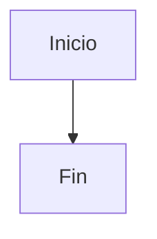

# Reglas de Documentación

## Diagramas y Esquemas

- Cuando se genere un esquema o diagrama en un fichero Markdown (`.md`), se debe utilizar el formato **Mermaid** siempre que sea posible.
- Los diagramas deben ser compatibles con el renderizado nativo de **GitHub** y **GitLab**, que soportan bloques Mermaid en Markdown sin plugins adicionales.
- Usar bloques de código con el lenguaje `mermaid` para definir los diagramas:

```markdown

```

- Tipos de diagramas Mermaid recomendados según el caso:
  - `flowchart` para flujos de proceso y decisiones.
  - `sequenceDiagram` para interacciones entre componentes o servicios.
  - `erDiagram` para modelos de datos y relaciones entre entidades.
  - `classDiagram` para estructura de clases y módulos.
  - `stateDiagram-v2` para máquinas de estados.
  - `gantt` para planificación temporal.

## Compatibilidad GitHub / GitLab (Mermaid 9.1.x)

El resultado debe funcionar en GitHub y GitLab con **Mermaid 9.1.x**. Aplicar las siguientes reglas estrictamente:

### Sintaxis de nodos y decisiones

- Todos los nodos entre `["..."]`.
- Decisiones (rombos) entre `{"..."}`.
- Utilizar únicamente `Si` y `No` en las ramas de decisión.

### Texto dentro de los nodos

- Utilizar únicamente `<br/>` para saltos de línea.
- No usar `\n`.
- No usar comillas dentro del texto de los nodos.
- No usar caracteres especiales: `¿`, `?`, `→`, `⇒`, `≤`, `≥`, emojis ni HTML (excepto `<br/>`).
- Mantener los textos cortos: máximo 2–3 líneas por nodo.

### Restricciones de estilo

- No utilizar estilos: `style`, `classDef`, `linkStyle`, ni ninguna directiva de estilo.
- No usar directivas `%%{init: ...}%%` complejas ni temas personalizados.

### Buenas prácticas

- Usar únicamente la sintaxis estable de Mermaid (tipos de diagramas listados arriba). Evitar funcionalidades experimentales o muy recientes que puedan no estar soportadas.
- Mantener los diagramas simples y legibles. Si un diagrama supera ~30 nodos, dividirlo en varios diagramas más pequeños.
- Probar visualmente el renderizado en GitHub/GitLab antes de dar por definitivo un diagrama complejo.

## Documentación AI-Readable (OpenSpec)

Todos los documentos generados en `template-docs/` deben seguir principios de especificación abierta (OpenSpec) para que cualquier IA pueda interpretarlos correctamente:

### Principios fundamentales

- **Estructura explícita**: Usar encabezados jerárquicos (`#`, `##`, `###`) consistentes para que cualquier modelo de lenguaje pueda parsear la estructura del documento.
- **Secciones autocontenidas**: Cada sección debe ser comprensible de forma aislada, sin depender de contexto implícito de otras partes del documento.
- **Nomenclatura uniforme**: Usar los mismos nombres de entidades, servicios y conceptos en todos los documentos. No usar sinónimos ni abreviaciones no definidas en el glosario.
- **Referencias explícitas**: Cuando un documento depende de otro, incluir una referencia explícita (enlace relativo o `#[[file:...]]`) en lugar de asumir que el lector conoce el contexto.

### Formato de los documentos

- Formato: **Markdown** (`.md`).
- Codificación: **UTF-8** sin BOM.
- Idioma: **Español** para el contenido funcional y de negocio.
- Cada documento debe tener un encabezado de nivel 1 (`#`) con el título del documento.
- Incluir una sección introductoria breve (1-3 frases) al inicio que describa el propósito del documento.

### Estructura recomendada

Todo documento en `template-docs/` debe seguir esta estructura mínima:

```markdown
# Título del Documento

Descripción breve del propósito del documento.

## Sección 1

Contenido estructurado...

## Sección 2

Contenido estructurado...
```

### Legibilidad por IA

- Evitar ambigüedades: preferir listas y tablas sobre párrafos largos para datos estructurados.
- Usar tablas Markdown para relaciones, campos de entidades y comparativas.
- Definir acrónimos y términos técnicos en el glosario central (`template-docs/specification/glossary.md`).
- No incrustar información en imágenes sin proporcionar una descripción textual equivalente.
- Usar identificadores consistentes (p. ej. nombres de servicios, entidades, endpoints) que coincidan exactamente con los usados en el código fuente.
