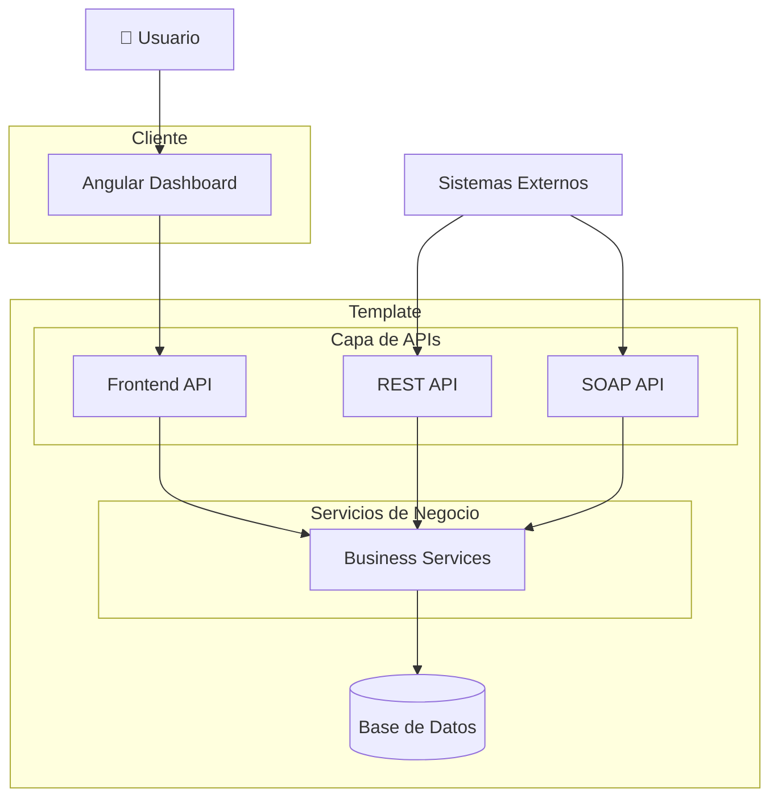
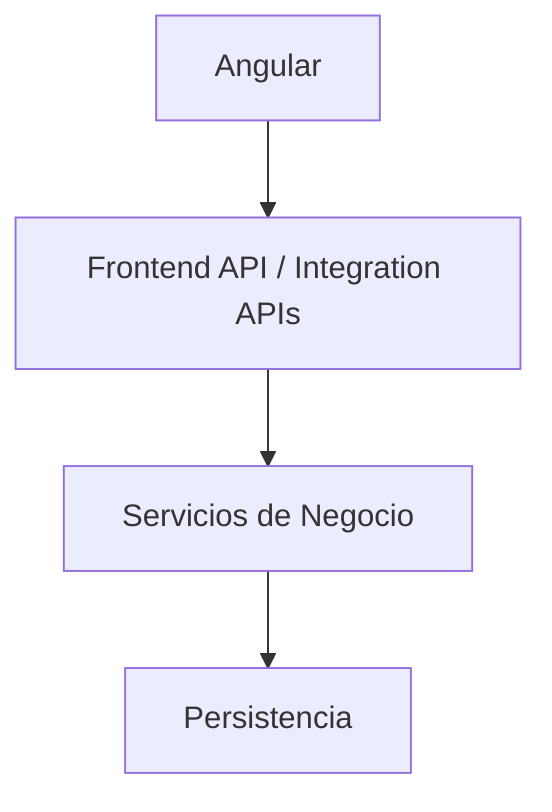
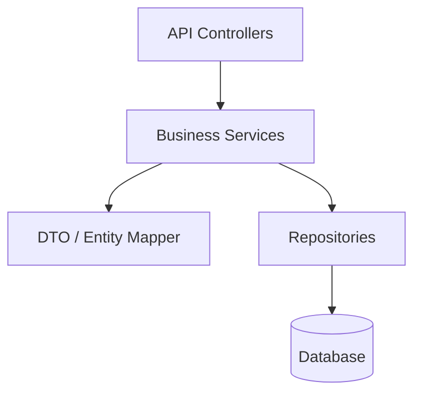
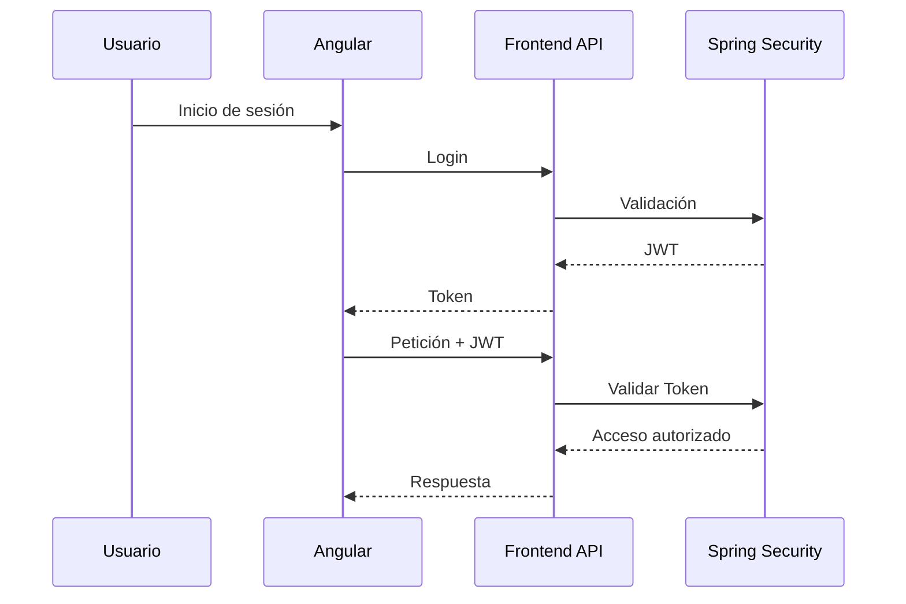
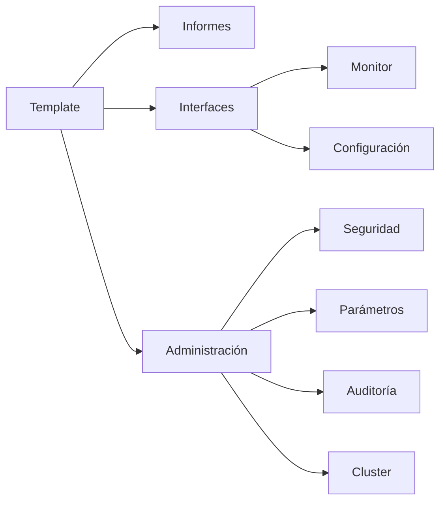

# Arquitectura

## Introducción

La arquitectura de **Template** ha sido diseñada para proporcionar una plataforma robusta, modular y escalable para el desarrollo de aplicaciones empresariales.

La solución sigue una arquitectura cliente-servidor basada en servicios, donde la lógica de negocio se encuentra completamente desacoplada tanto de la interfaz de usuario como de los mecanismos de integración con otros sistemas.

Esta separación permite evolucionar independientemente cada uno de los componentes de la plataforma, facilitando el mantenimiento, la reutilización y la incorporación de nuevas funcionalidades.

---

# Visión general

Template está compuesto por cuatro grandes bloques:

- Frontend
- Backend
- Persistencia
- Sistemas externos

El backend constituye el núcleo de la plataforma y centraliza toda la lógica de negocio.

La lógica de negocio es única para toda la plataforma.

Cada API actúa únicamente como una capa de adaptación para el consumidor correspondiente.

---

# Componentes de la plataforma

## Frontend

El frontend está desarrollado mediante **Angular** como una **Single Page Application (SPA)** con soporte **Progressive Web App (PWA)**.

Sus principales responsabilidades son:

- Presentación de la interfaz de usuario.
- Navegación.
- Gestión del estado de la aplicación.
- Internacionalización.
- Validación de formularios.
- Consumo de la Frontend API.
- Funcionamiento offline.

El frontend no contiene lógica de negocio, limitándose a presentar la información y coordinar la interacción del usuario.

---

## Backend

El backend constituye el núcleo de la plataforma.

Está desarrollado utilizando **Spring Boot** y concentra toda la lógica de negocio de la aplicación.

Entre sus responsabilidades destacan:

- Gestión de usuarios.
- Seguridad.
- Administración.
- Auditoría.
- Procesamiento de negocio.
- Persistencia.
- Integración con sistemas externos.
- Generación de informes.

El backend expone diferentes tipos de API's dependiendo del consumidor.

---

## Persistencia

La persistencia de datos se implementa mediante una base de datos relacional.

El acceso a los datos se realiza mediante JPA/Hibernate, mientras que la evolución del esquema se gestiona mediante Liquibase.

Esta separación permite mantener versionado el modelo de datos y automatizar las migraciones entre versiones.

---

## Sistemas externos

Template puede integrarse con diferentes aplicaciones corporativas.

Entre otras:

- Directorios LDAP / Active Directory.
- Servicios REST.
- Servicios SOAP.
- Servidores SMTP.
- Plataformas corporativas.

La arquitectura permite incorporar nuevos mecanismos de integración sin modificar la lógica de negocio existente.

---

# Arquitectura de API's

Una de las características principales de Template es la separación entre las API's destinadas a la interfaz de usuario y aquellas orientadas a la integración con terceros.

## Frontend API

La Frontend API es utilizada exclusivamente por la aplicación Angular.

Sus características son:

- Optimizada para la interfaz de usuario.
- Puede evolucionar conjuntamente con el frontend.
- Utiliza DTO específicos para la presentación.
- No constituye un contrato público.

Su objetivo es minimizar el número de llamadas necesarias para construir cada pantalla de la aplicación.

---

## APIs de Integración

Las API's de integración permiten la comunicación con aplicaciones externas.

Dependiendo de las necesidades del proyecto, la plataforma puede exponer distintos mecanismos de integración, entre ellos:

- REST.
- SOAP.
- Otros protocolos que puedan incorporarse en el futuro.

Estas API's constituyen contratos estables orientados a otros sistemas y evolucionan de forma independiente de la Frontend API.

---

# Arquitectura lógica

La plataforma organiza sus responsabilidades en capas claramente diferenciadas.

Cada capa únicamente interactúa con la inmediatamente inferior.

Esta organización reduce el acoplamiento y facilita el mantenimiento del sistema.

---

# Arquitectura del Backend

El backend sigue una arquitectura multicapa basada en los principios de separación de responsabilidades.

Las responsabilidades principales de cada capa son:

| Capa         | Responsabilidad                        |
|--------------|----------------------------------------|
| Controllers  | Exposición de las APIs                 |
| Services     | Implementación de la lógica de negocio |
| Mappers      | Conversión entre entidades y DTO       |
| Repositories | Acceso a la base de datos              |
| Database     | Persistencia de la información         |

---

# Seguridad

La plataforma implementa un modelo de seguridad basado en autenticación mediante **JSON Web Token (JWT)**.

La autorización se realiza mediante:

- Usuarios.
- Perfiles.
- Acciones.

Todas las comunicaciones entre cliente y servidor se realizan utilizando HTTPS.

---

# Organización modular

Template organiza sus funcionalidades en módulos independientes.

Cada módulo encapsula su propia lógica funcional y puede evolucionar de forma independiente.

Esta organización favorece la reutilización y simplifica el mantenimiento de la plataforma.

---

# Escalabilidad

La arquitectura permite desplegar la plataforma en distintos escenarios:

- Servidor único.
- Balanceo de carga.
- Alta disponibilidad.
- Cluster.
- Entornos distribuidos.

La lógica de negocio permanece inalterada independientemente del modelo de despliegue utilizado.

---

# Principios arquitectónicos

El diseño de Template se basa en los siguientes principios:

- Separación de responsabilidades.
- Arquitectura modular.
- Bajo acoplamiento.
- Alta cohesión.
- Reutilización de componentes.
- Seguridad desde el diseño (*Security by Design*).
- Escalabilidad.
- Mantenibilidad.
- Extensibilidad.
- Evolución independiente de las API's.

Estos principios permiten adaptar la plataforma a nuevos requisitos sin comprometer la estabilidad del sistema.

---

# Tecnologías principales

| Componente    | Tecnología              |
|---------------|-------------------------|
| Frontend      | Angular                 |
| Backend       | Spring Boot             |
| Seguridad     | Spring Security + JWT   |
| Persistencia  | JPA / Hibernate         |
| Versionado BD | Liquibase               |
| Comunicación  | REST / JSON             |
| Integración   | REST, SOAP              |
| Build         | Maven                   |
| Base de datos | PostgreSQL (referencia) |

---

# Resumen

Template proporciona una arquitectura moderna y desacoplada en la que la lógica de negocio constituye el núcleo de la plataforma.

La separación entre la **Frontend API**, destinada exclusivamente a la aplicación Angular, y las **API's de Integración**, orientadas a sistemas externos, permite optimizar cada interfaz para su consumidor sin duplicar la lógica de negocio.

Este enfoque facilita la evolución independiente de cada componente, simplifica el mantenimiento y proporciona una base sólida para el desarrollo de aplicaciones empresariales escalables y reutilizables.