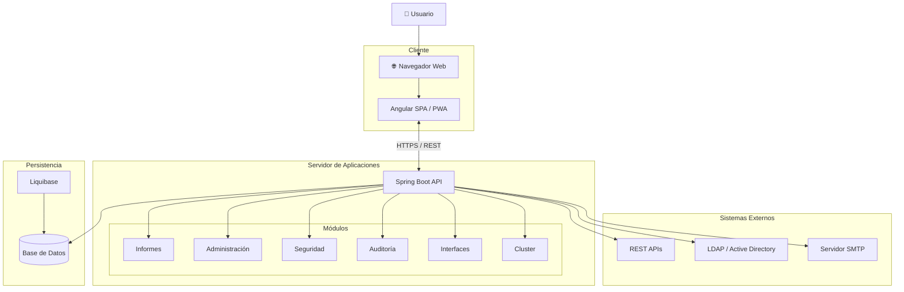
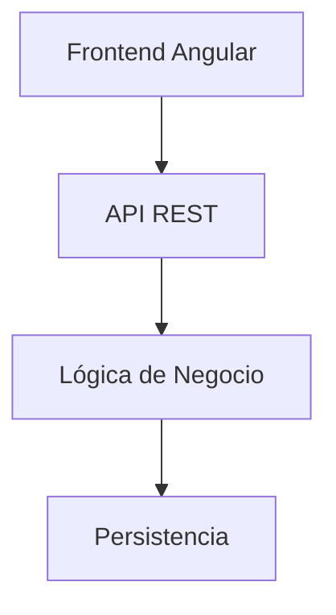
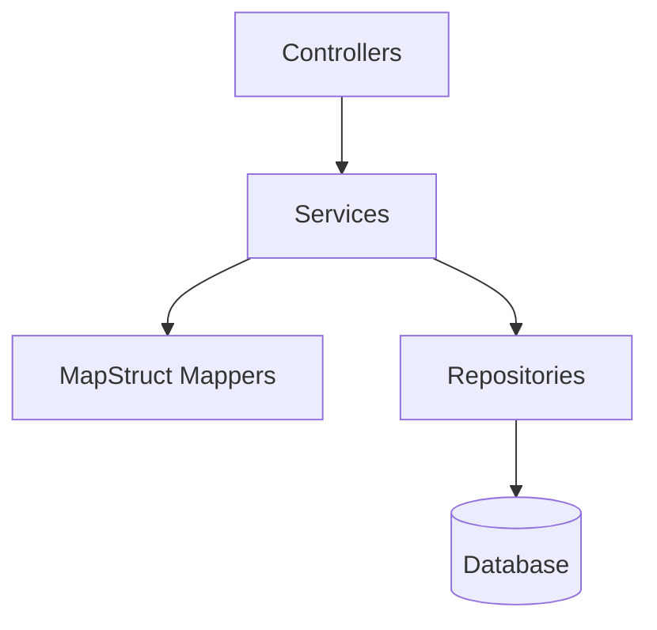
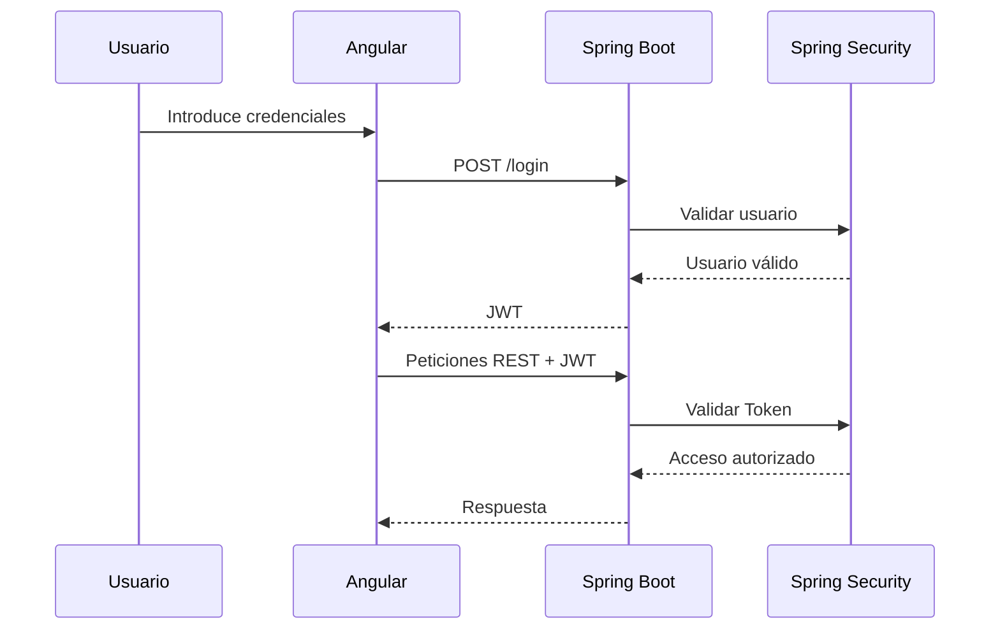
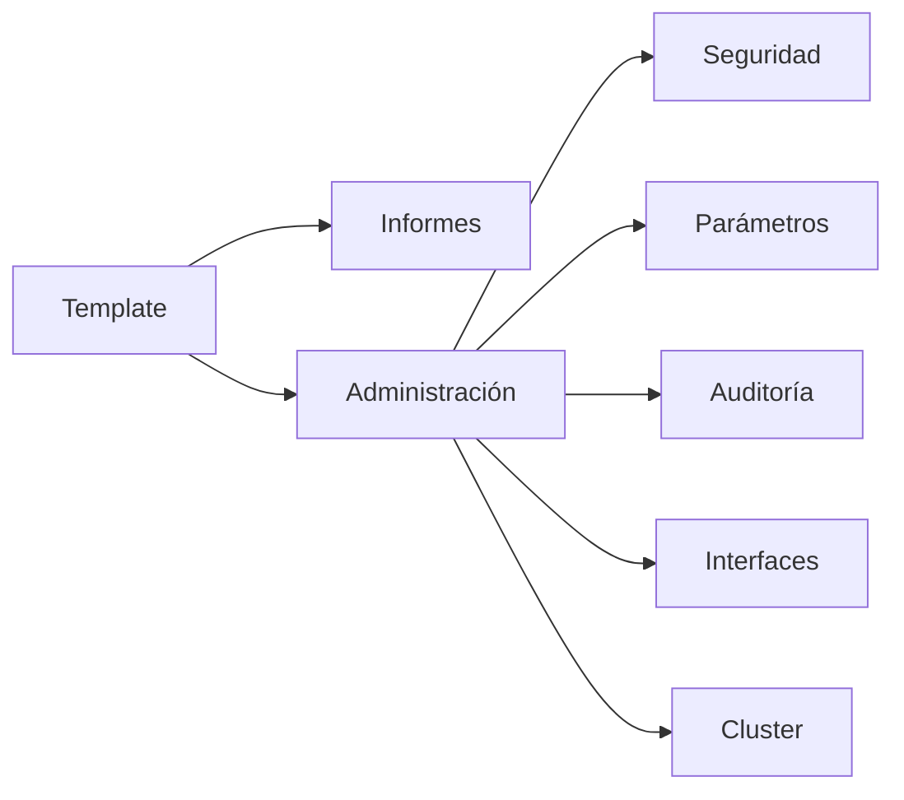

# Arquitectura

## Introducción

La arquitectura de **Template** ha sido diseñada para proporcionar una plataforma moderna, modular y escalable para el desarrollo de aplicaciones empresariales.

La solución sigue una arquitectura cliente-servidor basada en servicios REST, separando completamente la lógica de negocio de la interfaz de usuario. Esta separación facilita el mantenimiento, la evolución independiente de cada componente y la reutilización de la plataforma en distintos proyectos.

La arquitectura está orientada a módulos, permitiendo incorporar nuevas funcionalidades sin afectar al resto del sistema.

---

# Arquitectura general

Template está formado por tres bloques principales:

- **Frontend**, encargado de la interacción con el usuario.
- **Backend**, responsable de la lógica de negocio y de la exposición de la API REST.
- **Persistencia**, donde se almacena toda la información de la aplicación.

---

# Arquitectura lógica

La plataforma se divide en una serie de capas claramente diferenciadas, cada una con responsabilidades específicas.

Cada capa interactúa únicamente con la inmediatamente inferior, favoreciendo el desacoplamiento y facilitando la evolución del sistema.

---

# Arquitectura por capas

El backend sigue una arquitectura multicapa donde cada componente tiene una responsabilidad concreta.

Las principales responsabilidades son:

| Capa       | Responsabilidad                   |
|------------|-----------------------------------|
| Controller | Exposición de la API REST         |
| Service    | Lógica de negocio                 |
| Mapper     | Conversión entre entidades y DTOs |
| Repository | Acceso a datos                    |
| Database   | Persistencia                      |

---

# Arquitectura Frontend

El frontend está desarrollado mediante **Angular** como una **Single Page Application (SPA)** con soporte **Progressive Web App (PWA)**.

Sus principales responsabilidades son:

- Navegación entre módulos.
- Gestión del estado de la aplicación.
- Consumo de la API REST.
- Validación de formularios.
- Internacionalización.
- Gestión de notificaciones.
- Funcionamiento offline mediante PWA.
- Presentación de la interfaz de usuario.

La aplicación está organizada en módulos funcionales independientes y componentes reutilizables.

---

# Arquitectura Backend

El backend está desarrollado utilizando **Spring Boot**.

Es responsable de:

- Exponer la API REST.
- Implementar la lógica de negocio.
- Gestionar la autenticación y autorización.
- Gestionar la persistencia.
- Ejecutar procesos de negocio.
- Auditar las operaciones realizadas.
- Integrarse con sistemas externos.
- Generar informes.

Toda la lógica de negocio se encuentra centralizada en el backend.

---

# Seguridad

La seguridad se basa en un modelo de autenticación mediante **JSON Web Token (JWT)** y autorización basada en **usuarios, perfiles y acciones**.

El siguiente diagrama resume el proceso de autenticación.

Todas las comunicaciones entre cliente y servidor se realizan mediante **HTTPS**.

---

# Persistencia

La información de la aplicación se almacena en una base de datos relacional.

La persistencia se implementa mediante:

- JPA
- Hibernate

La evolución del esquema de base de datos se gestiona mediante **Liquibase**, permitiendo mantener un control de versiones del modelo de datos y automatizar las migraciones entre versiones.

---

# Organización modular

Template organiza las funcionalidades en módulos independientes.

Cada módulo encapsula su propia lógica funcional, facilitando el mantenimiento y la incorporación de nuevas funcionalidades.

---

# Integración con sistemas externos

La plataforma permite integrarse con sistemas corporativos mediante distintos mecanismos.

Entre otros:

- APIs REST.
- LDAP / Active Directory.
- Servidores SMTP.
- Sistemas de monitorización.
- Servicios corporativos.

La arquitectura permite incorporar nuevos conectores sin modificar el resto de módulos de la aplicación.

---

# Escalabilidad

La arquitectura ha sido diseñada para desplegarse tanto en entornos sencillos como en infraestructuras de alta disponibilidad.

Los escenarios soportados incluyen:

- Servidor único.
- Balanceo de carga.
- Cluster de aplicaciones.
- Entornos distribuidos.

La plataforma incorpora funcionalidades de administración y monitorización que permiten supervisar el estado de cada una de las instancias desplegadas.

---

# Principios arquitectónicos

El diseño de Template se basa en los siguientes principios:

- Arquitectura modular.
- Separación de responsabilidades.
- Bajo acoplamiento.
- Alta cohesión.
- Reutilización de componentes.
- Seguridad desde el diseño (*Security by Design*).
- Escalabilidad.
- Mantenibilidad.
- Extensibilidad.
- Independencia tecnológica entre frontend y backend.

Estos principios permiten evolucionar la plataforma de forma sencilla y reutilizar una gran parte de la infraestructura en nuevos proyectos.

---

# Tecnologías principales

| Componente    | Tecnología              |
|---------------|-------------------------|
| Frontend      | Angular                 |
| Backend       | Spring Boot             |
| Seguridad     | Spring Security + JWT   |
| Persistencia  | JPA / Hibernate         |
| Migraciones   | Liquibase               |
| Base de datos | PostgreSQL (referencia) |
| Build Backend | Maven                   |
| Comunicación  | REST / JSON             |
| Cliente       | Navegador Web           |

---

# Resumen

Template proporciona una arquitectura moderna basada en la separación entre frontend y backend, con un diseño modular que facilita la reutilización, el mantenimiento y la evolución de las aplicaciones.

La plataforma ofrece una infraestructura común para el desarrollo de aplicaciones empresariales, incorporando desde el inicio aspectos fundamentales como la seguridad, la administración del sistema, la persistencia, la integración con servicios externos y la monitorización, permitiendo centrar el desarrollo en la implementación de la lógica de negocio específica de cada proyecto.