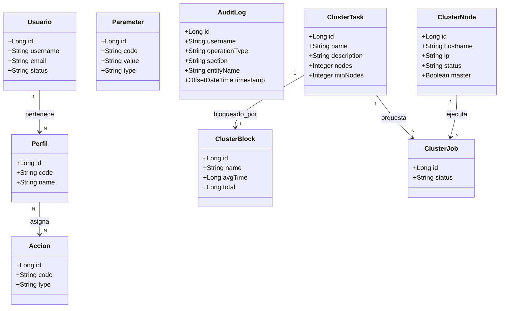

# Administración

Documentación funcional del módulo de Administración. Agrupa las pantallas y dominios reservados a operadores y administradores de la aplicación: seguridad, parámetros globales, registro de auditoría y orquestación de cluster. Los documentos de este área describen el comportamiento funcional y técnico de las pantallas colgadas de `/administration`:

- **Seguridad:** gestión de usuarios, perfiles y catálogo de acciones del sistema. Controla identidad, autorización y asignación de permisos.
- **Parámetros:** mantenimiento CRUD de los parámetros globales de la aplicación, con tipado fuerte (`STRING`, `INTEGER`, `BOOLEAN`, `DATE`) y validación de compatibilidad entre tipo y valor.
- **Auditoría:** consulta de solo lectura y exportación del registro de operaciones ejecutadas en el sistema, con trazabilidad de actor, operación, sección y entidad afectada.
- **Cluster:** orquestación de alta disponibilidad: nodos del cluster (estado, maestro, heartbeat, métricas) y consulta de bloqueos distribuidos por tarea con métricas acumuladas de duración.

Todos los módulos comparten la protección por `actionGuard` a nivel de ruta frontend y, en backend, reglas de autorización en Spring Security; las operaciones de escritura sensibles se registran automáticamente en auditoría.

## Conceptos clave

| Concepto | Descripción |
|-----------|---------|
|  |  |

## Modelo de entidades

Las entidades principales del módulo Administración se distribuyen por submódulo:

- **Seguridad:** `Usuario`, `Perfil`, `Acción`. Controlan identidad, asignación de roles y permisos funcionales.
- **Parámetros:** `Parameter` (entidad de negocio), con código único, valor textual y tipado declarado.
- **Auditoría:** `AuditLog` (append-only), con campos de trazabilidad de cada operación auditable.
- **Cluster:** `ClusterTask`, `ClusterNode`, `ClusterBlock`, `ClusterJob`. Gestionan instancias, tareas clusterizadas y exclusión mutua distribuida.



### Relaciones de negocio

- Un usuario pertenece a uno o varios perfiles, y cada perfil agrupa acciones; la autorización en UI y API se basa en la suma de acciones de sus perfiles.
- Un parámetro se identifica por su código; su valor persiste como texto y se valida contra su tipo tanto en frontend como en el servicio de dominio.
- Un registro de auditoría es inmutable: se crean tras completar una operación auditable correctamente y carecen de API pública de escritura.
- Una tarea clusterizada (`ClusterTask`) se bloquea por nombre a través de un `ClusterBlock` y se ejecuta como `ClusterJob` sobre un `ClusterNode`; en el cluster existe un único nodo maestro activo.

## Seguridad

Permisos principales del módulo:

- **Seguridad:** `USER_READ`, `USER_WRITE`, `PROFILE_READ`, `PROFILE_WRITE`, `ACTION_READ`.
- **Parámetros:** `SYSTEM_PARAMETER_READ`, `SYSTEM_PARAMETER_WRITE`.
- **Auditoría:** `SYSTEM_LOG_READ`.
- **Cluster:** `CLUSTER_NODE_READ`, `CLUSTER_NODE_WRITE`, `CLUSTER_LOCK_READ`.

## Navegación

```
Administración > Auditoria
Administración > Cluster
Administración > Parametros
Administración > Seguridad
```

## Pantallas

| Pantalla | Tipo | Descripción |
|---------------|-------------|-----------|
| [Seguridad](./security/security.md) | Sección |  |
| [Parámetros](./parameters/parameters.md) | Pagina |  |
| [Auditoría](./audit/audit.md) | Pagina |  |
| [Cluster](./cluster/cluster.md) | Sección |  |

## Referencias

- [Seguridad](security/security.md)
- [Parámetros](parameters/parameters.md)
- [Auditoría](audit/audit.md)
- [Cluster](cluster/cluster.md)
