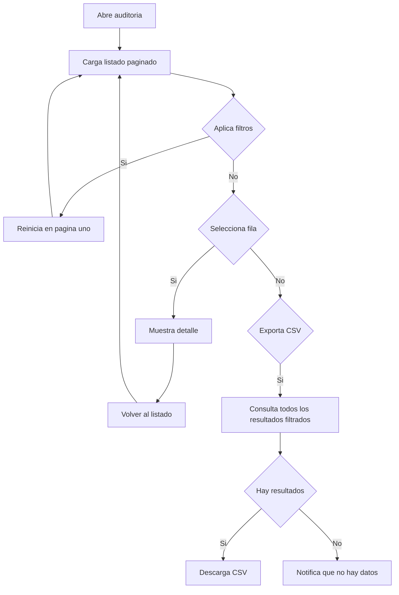

# Auditoría

Documentación funcional y técnica de la pantalla de consulta del registro de auditoría, dentro del módulo de Administración. Permite localizar, revisar y exportar las operaciones registradas por el sistema. Los registros son de solo lectura desde la interfaz y la API.

- **Ruta frontend:** `/administration/audit`
- **Componente:** `AuditListComponent` (listado y detalle)
- **Endpoint backend base:** `/api/v1/administration/audit` (`AuditController`)
- **Acceso:** requiere sesión y la acción `SYSTEM_LOG_READ`

---

## 1. Requisitos

Identificadores locales de este documento: `RF-AUD-*` (requisitos funcionales) y `RNF-AUD-*` (requisitos no funcionales).

### 1.1. Requisitos funcionales

#### RF-AUD-1: Consulta paginada de registros

**Descripción:** el sistema debe permitir consultar los registros de auditoría en un listado paginado y ordenable.

**Criterios de aceptación:**

- AC1.1: El listado muestra fecha/hora, usuario, operación, sección, entidad, identificador de entidad y detalle.
- AC1.2: Las columnas fecha/hora, usuario, operación, sección y entidad permiten ordenación ascendente o descendente.
- AC1.3: La paginación permite navegar entre páginas y elegir 5, 10, 20 o 50 registros por página.

#### RF-AUD-2: Búsqueda y filtrado

**Descripción:** el sistema debe permitir restringir el listado por usuario, operación, sección y rango de fechas.

**Criterios de aceptación:**

- AC2.1: El filtro de usuario aplica coincidencia parcial, sin distinguir mayúsculas de minúsculas.
- AC2.2: Los filtros de operación permiten `CREATE`, `UPDATE`, `DELETE` y `EXECUTE`.
- AC2.3: Los filtros de sección permiten `SECURITY`, `REPORTS`, `INTERFACES`, `CLUSTER` y `SYSTEM`.
- AC2.4: Al aplicar o limpiar filtros, el listado vuelve a la primera página.
- AC2.5: La acción de limpiar restablece todos los filtros y recarga la consulta sin criterios.

#### RF-AUD-3: Consulta de detalle

**Descripción:** el sistema debe permitir consultar un registro de auditoría en modo de solo lectura.

**Criterios de aceptación:**

- AC3.1: Al seleccionar una fila se abre el detalle del registro.
- AC3.2: El detalle muestra todos los datos conservados por el registro, incluidos usuario, operación, sección, entidad y detalle.
- AC3.3: El detalle no ofrece acciones para crear, editar ni eliminar registros.
- AC3.4: La acción Volver restaura el listado y elimina la selección actual.

#### RF-AUD-4: Exportación a CSV

**Descripción:** el sistema debe permitir exportar todos los registros que cumplan los filtros activos.

**Criterios de aceptación:**

- AC4.1: La exportación no queda limitada a la página visible.
- AC4.2: El fichero contiene las columnas fecha/hora, usuario, operación, sección, identificador de entidad, entidad y detalle.
- AC4.3: El nombre del fichero sigue el patrón `audit_YYYY-MM-DD.csv`.
- AC4.4: Si no hay resultados, se informa de que no hay datos que exportar.

#### RF-AUD-5: Inmutabilidad del registro

**Descripción:** los registros de auditoría constituyen evidencia de trazabilidad y no se pueden modificar ni eliminar desde la aplicación.

**Criterios de aceptación:**

- AC5.1: La API pública expone únicamente endpoints de consulta.
- AC5.2: La pantalla no muestra botones ni flujos CRUD.
- AC5.3: Las operaciones auditables se registran automáticamente después de completarse correctamente.

### 1.2. Requisitos no funcionales

- **RNF-AUD-1 (Autorización):** el acceso a la ruta requiere sesión y la acción `SYSTEM_LOG_READ`.
- **RNF-AUD-2 (Trazabilidad):** cada entrada conserva fecha/hora, actor, operación, sección y entidad afectada cuando estén disponibles.
- **RNF-AUD-3 (Integridad):** los campos de `AuditLog` se persisten como no actualizables; no se exponen operaciones públicas de modificación o borrado.
- **RNF-AUD-4 (Aislamiento):** un error al registrar una auditoría se registra técnicamente, pero no revierte la operación de negocio ya completada.
- **RNF-AUD-5 (Idioma):** los textos de pantalla son traducibles mediante el grupo i18n `audit.*`.
- **RNF-AUD-6 (Feedback):** las consultas, exportaciones y sus errores muestran notificaciones de progreso, éxito o error.

---

## 2. Parte funcional

### 2.1. Objetivo

Ofrecer a los administradores una vista trazable de la actividad registrada por la aplicación:

- Consultar operaciones registradas de forma paginada.
- Acotar la consulta mediante filtros combinables.
- Revisar el detalle inmutable de cada entrada.
- Exportar el resultado completo de una consulta.

### 2.2. Vistas de la pantalla

La pantalla gestiona dos modos de vista dentro de `AuditListComponent`:

| Modo | Descripción |
|------|-------------|
| `list` | Listado paginado con filtros, ordenación y exportación CSV |
| `detail` | Vista de solo lectura de una entrada de auditoría |

### 2.3. Patrón visual reutilizable y wireframes

La estructura visual base se define en [layout.md](../../../03-technical/frontend/layout.md). Para auditoría se aplica el patrón `List screen` y una variante de `Form screen` de solo lectura; no se usan formularios de alta, edición ni modal de confirmación.

| Tipo de pantalla | Uso en auditoría | Estructura base |
|------------------|-----------------|-----------------|
| `List screen` | Consulta principal | Cabecera, filtros, barra de acciones, tabla y paginación |
| `Form screen` de solo lectura | Detalle de una entrada | Encabezado, datos no editables y acción de volver |

#### 2.3.1. Wireframe del `List screen`

```text
+--------------------------------------------------------------------------------+
| Registro de auditoría                                                          |
+--------------------------------------------------------------------------------+
| Usuario | Operación | Sección | Desde | Hasta | [Filtrar] [Limpiar]           |
+--------------------------------------------------------------------------------+
|                                                   [Exportar CSV]               |
+--------------------------------------------------------------------------------+
| Fecha/Hora | Usuario | Operación | Sección | Entidad | ID | Detalle            |
|------------|---------|-----------|---------|---------|----|--------------------|
| ...                                                                            |
+--------------------------------------------------------------------------------+
| < 1 2 3 > | Registros por página: 5 / 10 / 20 / 50                            |
+--------------------------------------------------------------------------------+
```

#### 2.3.2. Wireframe del detalle

```text
+------------------------------------------------------------------+
| Detalle de auditoría                                  [Volver]  |
+------------------------------------------------------------------+
| Fecha/Hora | 2026-09-30 10:15 | Usuario | admin                |
| Operación  | UPDATE           | Sección | SECURITY             |
| Entidad    | User             | ID      | 42                   |
| Detalle    | Información registrada por la operación            |
+------------------------------------------------------------------+
```

### 2.4. Listado

**Columnas de la tabla:**

| Columna | Clave i18n | Ordenable | Notas |
|---------|------------|-----------|-------|
| Fecha/Hora | `audit.fields.timestamp` | Sí | Se presenta con `LocalDatePipe` |
| Usuario | `audit.fields.username` | Sí | Usuario autenticado o `SYSTEM` cuando no existe autenticación |
| Operación | `audit.fields.operationType` | Sí | Se muestra como etiqueta visual |
| Sección | `audit.fields.section` | Sí | Área funcional donde se produjo la operación |
| Entidad | `audit.fields.entityName` | Sí | Nombre técnico de la entidad afectada |
| ID Entidad | `audit.fields.entityId` | No | Identificador conservado como texto |
| Detalle | `audit.fields.detail` | No | Información adicional, si existe |

**Filtros disponibles:**

| Filtro | Tipo | Valores o regla | `data-testid` |
|--------|------|-----------------|---------------|
| Usuario | Texto | Coincidencia parcial | `audit-filter-username` |
| Operación | Selección | Todos, `CREATE`, `UPDATE`, `DELETE`, `EXECUTE` | `audit-filter-operation-type` |
| Sección | Selección | Todos, `SECURITY`, `REPORTS`, `INTERFACES`, `CLUSTER`, `SYSTEM` | `audit-filter-section` |
| Desde | Fecha | Inicio inclusivo del rango | `audit-filter-date-from` |
| Hasta | Fecha | Fin inclusivo del rango | `audit-filter-date-to` |

**Barra de acciones:**

| Acción | Condición de disponibilidad | `data-testid` |
|--------|-----------------------------|---------------|
| Filtrar | Siempre disponible | `audit-apply-filters` |
| Limpiar | Siempre disponible | `audit-clear-filters` |
| Exportar CSV | Siempre disponible | `audit-export-csv` |

- La selección de una fila abre directamente el detalle; no existe selección persistente en el listado.
- Al no haber resultados, el listado queda vacío y la exportación informa de que no hay datos.
- Los tamaños de página disponibles son 5, 10, 20 y 50; el valor inicial es 10.

### 2.4. Identificadores para pruebas (`data-testid`)

| Elemento | `data-testid` |
| --- | --- |
| Formulario de filtros | `audit-filter-form` |
| Filtro de usuario | `audit-filter-username` |
| Filtro de operación | `audit-filter-operation-type` |
| Filtro de sección | `audit-filter-section` |
| Filtro desde | `audit-filter-date-from` |
| Filtro hasta | `audit-filter-date-to` |
| Tabla de auditoría | `audit-table` |
| Botón Filtrar | `audit-apply-filters` |
| Botón Limpiar | `audit-clear-filters` |
| Botón Exportar CSV | `audit-export-csv` |

### 2.5. Detalle de una entrada

El detalle muestra los mismos valores recibidos en el listado: fecha/hora, usuario, operación, sección, identificador de entidad, entidad y detalle. Todos los campos se presentan como texto no editable.

La operación se identifica visualmente por tipo: `CREATE`, `UPDATE`, `DELETE` o `EXECUTE`. La sección se presenta como una etiqueta independiente para facilitar la lectura de la trazabilidad.

### 2.6. Diagramas

#### 2.6.1. Flujo de consulta y exportación



---

## 3. Parte técnica

### 3.1. Componentes afectados

| Capa | Elemento | Responsabilidad |
|------|----------|-----------------|
| Frontend | `AuditListComponent` | Estado de filtros, paginación, ordenación, detalle y exportación. |
| Frontend | `AuditService` | Consultas paginadas, recuento y recuperación completa para exportación. |
| Frontend | `TpDataTableComponent` | Tabla reutilizable para ordenación, selección y paginación. |
| Frontend | `LocalDatePipe` y `DateService` | Presentación local de fechas y serialización para CSV. |
| Frontend | `NotificationService` | Feedback de carga, error y progreso en la exportación. |
| Backend | `AuditController` | Exposición de endpoints REST de consulta de registros. |
| Backend | `AuditService` | Consulta por criterios y persistencia interna de entradas. |
| Backend | `AuditAspect` y `@Auditable` | Creación automática de registros al completar operaciones auditables. |
| Domain | `AuditLog` | Entidad append-only para guardar los eventos de auditoría. |
| Domain | `AuditLogDTO` y `AuditCriteria` | Transporte de datos y criterios de consulta para la pantalla. |
| Security | `SecurityConfig` | Protección de rutas de consulta y control de permisos del módulo de auditoría. |

### 3.2. Modelos de datos

#### Frontend (TypeScript)

```typescript
type OperationType = 'CREATE' | 'UPDATE' | 'DELETE' | 'EXECUTE';
type AuditSection = 'SECURITY' | 'REPORTS' | 'INTERFACES' | 'CLUSTER' | 'SYSTEM';

interface AuditLog {
  id: number;
  timestamp: string;
  username: string;
  operationType: OperationType;
  section: AuditSection;
  entityId: string;
  entityName: string;
  detail: string;
}

interface AuditCriteria {
  dateFrom?: string;
  dateTo?: string;
  username?: string;
  operationType?: OperationType;
  section?: AuditSection;
}
```

#### Backend DTOs (Java)

```java
public record AuditLogDTO(
    Long id,
    OffsetDateTime timestamp,
    String username,
    OperationType operationType,
    AuditSection section,
    String entityId,
    String entityName,
    String detail
) {}

public record AuditCriteria(
    OffsetDateTime fromDate,
    OffsetDateTime toDate,
    String username,
    OperationType operationType,
    AuditSection section
) {}
```

#### Entidades JPA

```java
@Entity
@Table(name = "audit_log")
public class AuditLog extends BaseEntity {
    @Column(nullable = false)
    private OffsetDateTime timestamp;

    @Column(nullable = false)
    private String username;

    @Enumerated(EnumType.STRING)
    @Column(nullable = false)
    private OperationType operationType;

    @Enumerated(EnumType.STRING)
    @Column(nullable = false)
    private AuditSection section;

    @Column(nullable = false)
    private String entityName;
}
```

En backend, `AuditCriteria` representa los mismos criterios con fechas `OffsetDateTime` llamadas `fromDate` y `toDate`. `AuditLog` es una entidad append-only: sus campos se mapean con `updatable = false`.

### 3.3. Endpoints

Ruta base: `/api/v1/administration/audit`.

| Método y ruta | Descripción | Respuesta |
|---------------|-------------|-----------|
| `GET /` | Listado paginado con filtros `fromDate`, `toDate`, `username`, `operationType`, `section` y parámetros `page`, `size`, `sort` | 200 OK con página de registros |
| `GET /count` | Número de registros que cumplen los mismos filtros | 200 OK con el total |

No hay endpoints `POST`, `PUT`, `PATCH` ni `DELETE` para registros de auditoría.

### 3.4. Validaciones

- El usuario, la operación y la sección deben respetar los valores admitidos por el backend; los filtros no válidos se descartan antes de ejecutar la consulta.
- Los rangos de fecha deben ser coherentes: `fromDate` no puede ser posterior a `toDate`, y la consulta debe devolver un conjunto vacío si la selección no produce coincidencias.
- La pantalla es de solo lectura; no se exponen endpoints ni acciones para crear, modificar ni borrar registros de auditoría.
- La autorización de acceso se verifica antes de consultar los registros y puede fallar si el usuario no tiene la acción correcta para la sección.

### 3.5. Exportación

- La exportación consulta la primera página con tamaño `100000` y usa los filtros y la ordenación activos; después genera el CSV en el navegador.
- Los campos CSV se escapan cuando contienen comas, comillas o saltos de línea y el fichero se genera con BOM UTF-8 para su apertura compatible en hojas de cálculo.
- Las fechas se muestran y exportan usando los servicios de fecha del frontend.

#### Discrepancia actual en filtros de fecha

El contrato de `AuditController` recibe los parámetros `fromDate` y `toDate` como `OffsetDateTime`, mientras que `AuditService` del frontend envía `dateFrom` y `dateTo` procedentes de controles HTML de tipo `date`. Por tanto, los filtros de usuario, operación y sección se alinean con la API, pero los de fecha no están actualmente alineados con el contrato backend y deben corregirse antes de considerarlos operativos de extremo a extremo.

### 3.6. Paginación, orden, filtros y exportación

- La tabla envía `page`, `size` y, cuando existe, `sort` con formato `campo,dirección`.

### 3.7. Registro automático e inmutabilidad

1. Un método de negocio anotado con `@Auditable` completa su ejecución correctamente.
2. `AuditAspect` lo intercepta mediante `@AfterReturning` y obtiene el usuario autenticado; si no existe, utiliza `SYSTEM`.
3. El aspecto crea un `AuditLogEntry` con tipo de operación, sección, entidad, identificador y detalle disponible.
4. `AuditService.log()` establece la marca temporal UTC y persiste el registro.
5. Si el registro de auditoría falla, el aspecto registra el error técnico y no lo propaga a la operación de negocio.

La consulta de la pantalla utiliza el mismo servicio de dominio para filtrar y paginar, pero no interviene en la creación de registros ni permite su mutación.

---

## 4. Pruebas

### 4.1. Cobertura unitaria (backend)

| Ubicación | Alcance |
|-----------|---------|
| `core/src/test/java/org/myorganization/template/core/service/AuditServiceTest.java` | Consulta por criterios, mapeo de resultados, persistencia de una entrada y comportamiento de retención |
| `core/src/test/java/org/myorganization/template/core/service/AuditServiceImmutabilityPropertyTest.java` | Propiedades de inmutabilidad: ausencia de API pública de modificación y campos JPA no actualizables |
| `core/src/test/java/org/myorganization/template/core/audit/AuditAspectTest.java` | Creación de entradas por el aspecto tras operaciones auditables |

### 4.2. Cobertura unitaria (frontend)

| Ubicación | Alcance |
|-----------|---------|
| `dashboard/src/app/core/services/audit.service.spec.ts` | Construcción de peticiones paginadas, envío de filtros, consulta para exportación y endpoint de recuento |

No hay actualmente pruebas unitarias específicas de `AuditListComponent` en el repositorio.

### 4.3. Cobertura E2E (Playwright)

Ubicación: `dashboard/e2e/tests/administration/audit.spec.ts` (Page Object en `dashboard/e2e/pages/audit.page.ts`).

| Caso | Descripción | Resultado esperado |
|------|-------------|--------------------|
| Listado de solo lectura | Acceder a la pantalla tras iniciar sesión | La tabla y filtros son visibles; no existen acciones de crear, editar ni eliminar |
| Filtrado | Filtrar por administrador, `EXECUTE` y `SECURITY`; después limpiar | El listado contiene los registros coincidentes y se recarga sin filtros al limpiar |
| Detalle | Abrir la primera entrada y volver | El detalle muestra los datos de la fila y la acción Volver restaura el listado |
| Exportación CSV | Exportar registros filtrados por administrador | El navegador descarga un fichero `audit_YYYY-MM-DD.csv` |

Cada caso inicia sesión con el usuario administrador. Ese inicio de sesión genera la operación auditable `EXECUTE` en la sección `SECURITY`, que proporciona un registro conocido para las comprobaciones sin modificar el registro desde la pantalla de auditoría.

### 4.4. Datos de prueba

Los datos semilla de backend para registros de auditoría se encuentran en `domain/src/main/resources/db/changelog/data/v1.0.0/20250119-seed-local-audit-log.xml`.

### 4.5. Dependencias de ejecución

- Las consultas reales y la exportación requieren el backend de integración levantado y datos en la tabla `audit_log`.
- El usuario de prueba debe contar con `SYSTEM_LOG_READ`; de lo contrario, el guard de ruta impide el acceso a `/administration/audit`.
- Para validar los filtros de fecha de extremo a extremo debe resolverse primero la discrepancia de nombres y formato descrita en la sección 3.4.

---

## Referencias

- [Autenticación y Gestión de Sesión](../../login/authentication.md)
- [Requisitos de la aplicación](../../../specification/requirements.md)
- [Modelo de datos funcional](../../../specification/data-model.md)
- [Seguridad backend](../../../03-technical/backend/security.md)
- [API backend](../../../03-technical/backend/api.md)
- [Navegación frontend](../../../03-technical/frontend/navigation.md)
- [Componentes frontend](../../../03-technical/frontend/components.md)
