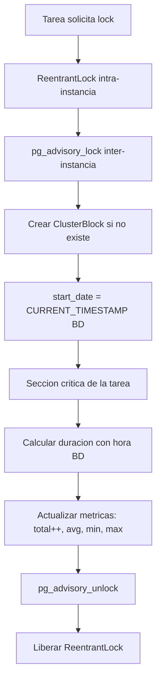

# Bloqueos del Cluster

Documentación funcional y técnica de la pantalla de administración de bloqueos del cluster, dentro de Administración > Cluster. Permite consultar los registros de bloqueos (locks) gestionados por el sistema, con métricas de ejecución por tarea, filtrado por nombre y exportación CSV.

- **Ruta frontend:** `/administration/cluster/blocks`
- **Componentes:** `BlockListComponent` (listado + navegación a detalle) y `BlockDetailComponent` (detalle)
- **Endpoint backend base:** `/api/v1/administration/cluster/blocks` (`ClusterController`)
- **Acceso:** requiere sesión y `CLUSTER_LOCK_READ`; la pantalla es de solo lectura, no existe permiso de escritura

---

## 1. Requisitos

Identificadores locales de este documento: `RF-CLB-*` (requisitos funcionales) y `RNF-CLB-*` (requisitos no funcionales).

### 1.1. Requisitos funcionales

#### RF-CLB-1: Consulta de bloqueos

**Descripción:** el sistema debe permitir consultar los bloqueos registrados en el cluster en un listado ordenable y paginado, mostrando métricas de ejecución acumuladas por tarea.

**Criterios de aceptación:**

- AC1.1: El listado muestra nombre de tarea, fecha de inicio, tiempo promedio, tiempo mínimo, tiempo máximo y total de ejecuciones.
- AC1.2: Todas las columnas permiten ordenar ascendente o descendentemente.
- AC1.3: La paginación permite elegir 5, 10, 20 o 50 registros por página.
- AC1.4: La paginación, ordenación y filtrado se resuelven en el servidor mediante `Pageable`.

#### RF-CLB-2: Búsqueda y filtrado

**Descripción:** el sistema debe permitir filtrar los bloqueos por nombre de tarea.

**Criterios de aceptación:**

- AC2.1: El nombre se filtra por coincidencia parcial sin distinguir mayúsculas de minúsculas.
- AC2.2: Al aplicar o limpiar filtros, se vuelve a la primera página.

#### RF-CLB-3: Consulta de detalle

**Descripción:** el sistema debe permitir consultar un bloqueo en modo de solo lectura.

**Criterios de aceptación:**

- AC3.1: Una selección sobre una fila abre el detalle del bloqueo.
- AC3.2: El detalle muestra nombre de tarea, fecha de inicio, tiempo promedio, tiempo mínimo, tiempo máximo y total de ejecuciones.
- AC3.3: La acción Volver retorna al listado sin modificar nada.

#### RF-CLB-4: Exportación CSV

**Descripción:** el sistema debe permitir exportar todos los bloqueos que cumplen los filtros activos.

**Criterios de aceptación:**

- AC4.1: La exportación incluye todos los resultados filtrados, no solo la página visible (usa tamaño de página 100000 para recuperar el conjunto completo).
- AC4.2: El fichero se descarga como `cluster_blocks_YYYY-MM-DD.csv`, donde la fecha es la del día de la exportación.
- AC4.3: El CSV incluye las columnas visibles del listado, con fechas convertidas a hora local y separador `,` con BOM UTF-8.
- AC4.4: Cuando el conjunto filtrado está vacío, se notifica error y no se descarga ningún fichero.

#### RF-CLB-5: Gestión controlada por el sistema

**Descripción:** los bloqueos no se crean, modifican ni eliminan manualmente desde la pantalla ni mediante la API pública; son registros generados por el servicio de bloqueos del cluster.

**Criterios de aceptación:**

- AC5.1: La interfaz no muestra acciones para crear, editar ni eliminar bloqueos.
- AC5.2: Los intentos de crear, actualizar o eliminar bloqueos por API se rechazan con `405 Method Not Allowed`.
- AC5.3: Los bloqueos se crean automáticamente la primera vez que se adquiere un lock sobre un nombre de recurso; sus métricas se actualizan en cada liberación.

### 1.2. Requisitos no funcionales

- **RNF-CLB-1 (Autorización):** la consulta requiere exclusivamente `CLUSTER_LOCK_READ`; cualquier operación de escritura está prohibida a nivel de API.
- **RNF-CLB-2 (Doble nivel de exclusión):** el servicio de bloqueos garantiza exclusión mutua intra-instancia (`ReentrantLock` por nombre de recurso) e inter-instancia (PostgreSQL advisory lock por clave hash del nombre).
- **RNF-CLB-3 (Tiempo de base de datos):** la fecha de inicio y el cálculo de duración usan la hora del servidor de base de datos (`CURRENT_TIMESTAMP`) para evitar desviaciones de reloj entre nodos.
- **RNF-CLB-4 (Métricas acumuladas):** tras cada liberación, se actualizan total, promedio (running average), mínimo y máximo de duración en milisegundos.
- **RNF-CLB-5 (Idioma):** todos los textos se resuelven mediante las claves i18n `cluster.blocks.*`.
- **RNF-CLB-6 (Feedback):** la carga paginada y la exportación informan del progreso, éxito o error mediante notificaciones.
- **RNF-CLB-7 (Solo lectura):** `ClusterBlockService` lanza `MethodNotAllowedException` para create, update y delete.

---

## 2. Parte funcional

### 2.1. Objetivo

Ofrecer a los administradores visibilidad sobre los bloqueos gestionados por el cluster:

- Consultar las tareas/recursos que disponen de lock registrado y sus métricas históricas.
- Identificar la fecha del último inicio y los tiempos promedio, mínimo y máximo.
- Revisar el número total de ejecuciones completadas con lock.
- Exportar la vista filtrada para análisis o soporte.

### 2.2. Vistas de la pantalla

La funcionalidad usa dos modos de vista dentro de `BlockListComponent`:

| Modo | Descripción |
|------|-------------|
| `list` | Listado de bloqueos con filtros, ordenación, paginación y exportación |
| `detail` | Vista no editable del bloqueo seleccionado, delegada a `BlockDetailComponent` |

### 2.3. Patrón visual reutilizable y wireframes

La estructura visual base se define en [layout.md](../../../03-technical/frontend/layout.md). La pantalla usa `List screen` para la consulta y una variante de `Form screen` solo lectura para el detalle.

| Tipo de pantalla | Uso en bloqueos | Estructura base |
|------------------|-----------------|-----------------|
| `List screen` | Consulta principal | Cabecera, filtros, barra de acciones, tabla y paginación |
| `Form screen` solo lectura | Detalle del bloqueo | Encabezado, datos operativos y acción Volver |

#### 2.3.1. Wireframe del `List screen`

```text
+--------------------------------------------------------------------------------+
| Bloqueos del Cluster                                                           |
+--------------------------------------------------------------------------------+
| Nombre de Tarea | [Filtrar] [Limpiar]                                          |
+--------------------------------------------------------------------------------+
|                                                         [Exportar CSV]         |
+--------------------------------------------------------------------------------+
| Nombre de Tarea | Fecha Inicio | T. Medio | T. Minimo | T. Maximo | Total     |
|-----------------|--------------|----------|-----------|-----------|-----------|
| ...                                                                             |
+--------------------------------------------------------------------------------+
| < 1 2 3 > | Registros por pagina: 5 / 10 / 20 / 50                            |
+--------------------------------------------------------------------------------+
```

#### 2.3.2. Wireframe del detalle

```text
+------------------------------------------------------------------+
| Detalle de Bloqueo                                    [Volver]  |
+------------------------------------------------------------------+
| Nombre de Tarea    | nombre-tarea-01                             |
| Fecha de Inicio    | fecha/hora                                  |
| Tiempo Promedio    | 125 ms                                      |
| Tiempo Minimo      | 10 ms                                       |
| Tiempo Maximo      | 512 ms                                      |
| Total Ejecuciones  | 128                                         |
+------------------------------------------------------------------+
```

### 2.4. Listado

**Columnas de la tabla:**

| Columna | Clave i18n | Notas |
|---------|------------|-------|
| Nombre de Tarea | `cluster.blocks.fields.name` | Identificador único del recurso/tarea |
| Fecha de Inicio | `cluster.blocks.fields.startDate` | Última fecha/hora de adquisición del lock, formateada localmente |
| Tiempo Promedio (ms) | `cluster.blocks.fields.avgTime` | Duración media de lock en milisegundos |
| Tiempo Mínimo (ms) | `cluster.blocks.fields.minTime` | Duración mínima histórica en milisegundos |
| Tiempo Máximo (ms) | `cluster.blocks.fields.maxTime` | Duración máxima histórica en milisegundos |
| Total Ejecuciones | `cluster.blocks.fields.total` | Número total de liberaciones de lock registradas |

**Filtros disponibles:**

| Filtro | Tipo | Regla | `data-testid` |
|--------|------|-------|---------------|
| Nombre de Tarea | Texto | Coincidencia parcial `LIKE %name%` insensible a mayúsculas | `cluster-blocks-filter-name` |

**Barra de acciones:**

| Acción | Condición de disponibilidad | `data-testid` |
|--------|-----------------------------|---------------|
| Filtrar | Siempre disponible | `cluster-blocks-apply-filters` |
| Limpiar | Siempre disponible | `cluster-blocks-clear-filters` |
| Exportar CSV | Siempre disponible; notifica vacío si no hay resultados tras filtrar | `cluster-blocks-export-csv` |

- Una selección sobre una fila abre el detalle del bloqueo.
- El filtrado, la ordenación y la paginación se resuelven en servidor (Spring Data `Pageable`).
- `data-testid` de la tabla: `cluster-blocks-table`.

### 2.4. Identificadores para pruebas (`data-testid`)

| Elemento | `data-testid` |
| --- | --- |
| Formulario de filtros | `cluster-blocks-filter-form` |
| Filtro de nombre de tarea | `cluster-blocks-filter-name` |
| Tabla de bloqueos | `cluster-blocks-table` |
| Botón Filtrar | `cluster-blocks-apply-filters` |
| Botón Limpiar | `cluster-blocks-clear-filters` |
| Botón Exportar CSV | `cluster-blocks-export-csv` |
| Botón Volver | `cluster-blocks-back-to-list` |

### 2.5. Detalle

El detalle es exclusivamente informativo. Muestra nombre de tarea, fecha de inicio y las cuatro métricas de tiempo (promedio, mínimo, máximo, total de ejecuciones) sin controles de edición. El botón Volver retorna al listado paginado sin alterar filtros ni página.

`data-testid` del botón Volver: `cluster-blocks-back-to-list`.

### 2.6. Diagramas

#### 2.6.1. Flujo de adquisición y liberación de lock



---

## 3. Parte técnica

### 3.1. Componentes afectados

| Capa | Elemento | Responsabilidad |
|------|----------|-----------------|
| Frontend | `BlockListComponent` | Consulta paginada, filtros del servidor, ordenación, selección, exportación CSV y cambio de vista list/detalle. |
| Frontend | `BlockDetailComponent` | Presentación de solo lectura de un bloqueo. |
| Frontend | `ClusterService` | Llamadas REST de bloqueos para paginado, conteo, detalle y exportación. |
| Frontend | `TpDataTableComponent` | Tabla reutilizable para ordenación, selección y paginación. |
| Backend | `ClusterController` | Endpoints REST de lectura de bloqueos. |
| Backend | `ClusterBlockService` | Consultas por criterios y por id; las operaciones CUD quedan prohibidas. |
| Backend | `ClusterLockService` | Adquisición/liberación de locks y actualización automática de métricas. |
| Backend | `ClusterBlockRepository` | JPA + Specifications + consultas nativas para advisory locks y hora de base de datos. |
| Domain | `ClusterBlock` | Entidad JPA que persiste la estadística de bloqueo por recurso. |
| Domain | `ClusterBlockDTO` y `ClusterBlockCriteria` | Transporte y filtros de consulta del módulo. |
| Security | `SecurityConfig` | Reglas de autorización y protección del acceso al módulo. |

### 3.2. Modelos de datos

#### Frontend (TypeScript)

```typescript
interface ClusterBlock {
  id: number;
  name: string;
  startDate: string | null;
  avgTime: number;
  minTime: number;
  maxTime: number;
  total: number;
}
```

#### Backend DTOs (Java)

```java
public record ClusterBlockDTO(
    Long id,
    String name,
    OffsetDateTime startDate,
    Long avgTime,
    Long minTime,
    Long maxTime,
    Long total
) {}
```

#### Entidades JPA

```java
@Entity
@Table(name = "cluster_block")
public class ClusterBlock extends BaseEntity {
    @Column(nullable = false, unique = true)
    private String name;

    @Column(nullable = false)
    private OffsetDateTime startDate;

    @Column(nullable = false)
    private Long avgTime;

    @Column(nullable = false)
    private Long minTime;

    @Column(nullable = false)
    private Long maxTime;

    @Column(nullable = false)
    private Long total;
}
```

- Las métricas de tiempo (`avgTime`, `minTime`, `maxTime`) se almacenan en milisegundos.
- `total` es el número de veces que se ha liberado el lock para ese nombre de recurso.
- El cálculo de la media acumulada al liberar es: `((avg * (total-1)) + duration) / total`.
- El mínimo inicializa con la primera duración; ejecuciones posteriores aplican `Math.min`.
- El máximo aplica `Math.max` sobre el valor previo y la duración actual.
- `startDate` se actualiza con `CURRENT_TIMESTAMP` de la BD en cada adquisición exitosa.

### 3.3. Endpoints del backend

Ruta base: `/api/v1/administration/cluster/blocks`.

| Método y ruta | Descripción | Respuesta |
|---------------|-------------|-----------|
| `GET /` | Obtiene bloqueos paginados con filtro opcional por `name` y ordenación `Pageable` | 200 OK con `Page<ClusterBlockDTO>` |
| `GET /count` | Cuenta bloqueos que coinciden con el filtro `name` opcional | 200 OK con `Long` |
| `GET /{id}` | Obtiene un bloqueo por identificador | 200 OK con el bloqueo; 404 si no existe |
| `POST /` | Creación manual no permitida | 405 Method Not Allowed |
| `PUT /{id}` | Actualización no permitida | 405 Method Not Allowed |
| `PATCH /{id}` | Modificación parcial no permitida | 405 Method Not Allowed |
| `DELETE /{id}` | Eliminación no permitida | 405 Method Not Allowed |

El controlador delega lectura en `ClusterService` (que a su vez usa `ClusterBlockService`). Las operaciones CUD se interceptan en `SecurityConfig.denyAll()` y adicionalmente `ClusterBlockService` lanza `MethodNotAllowedException` por si la invocación llegase al servicio.

### 3.4. Doble nivel de locking y actualización de métricas

- `acquireLock(resourceName)`:
  1. Crea o recupera `ReentrantLock` en `ConcurrentHashMap<String, ReentrantLock>` por nombre (intra-instancia).
  2. Calcula `lockKey = resourceName.hashCode()` e invoca `pg_advisory_lock(lockKey)` (inter-instancia, bloqueante).
  3. Inserta el `ClusterBlock` si no existe (`ensureClusterBlockExists`), luego actualiza `start_date = CURRENT_TIMESTAMP` y guarda la hora BD de inicio.
- `releaseLock(resourceName)`:
  1. Calcula duración en milisegundos usando hora BD frente a la de adquisición.
  2. Invoca `updateBlockMetrics` para incrementar total y recalcular media, mínimo y máximo.
  3. Libera `pg_advisory_unlock(lockKey)`.
  4. Libera el `ReentrantLock` en bloque `finally`.
- `isLocked(resourceName)`: consulta el estado intra-instancia del `ReentrantLock`.

### 3.5. Exportación

La exportación pide al backend el conjunto completo (página 0, tamaño 100000) con los mismos criterios y ordenación activos. Construye el CSV con:

- Cabeceras traducidas vía `TranslateService.instant` sobre las claves de campos.
- Fecha de inicio pasada a local mediante `DateService.toLocalString`.
- Separador `,` y escapado de campos que contienen `,`, `"` o `\n`.
- BOM UTF-8 (`\uFEFF`) para compatibilidad con Excel.
- Descarga `cluster_blocks_YYYY-MM-DD.csv` mediante `Blob` + `URL.createObjectURL`.

---

## 4. Pruebas

### 4.1. Cobertura unitaria (backend)

| Ubicación | Alcance |
|-----------|---------|
| `core/src/test/java/org/myorganization/template/core/service/ClusterBlockServiceTest.java` | Lectura por id, por criterios y `MethodNotAllowedException` en CUD |
| `core/src/test/java/org/myorganization/template/core/service/ClusterLockServiceTest.java` | Flujos `acquireLock`, `releaseLock`, `isLocked` y cálculo de métricas acumuladas |
| `webapp/src/test/java/org/myorganization/template/webapp/controller/ClusterControllerTest.java` | Contrato de los endpoints de bloqueos (paginado, count, por id, 405 en escritura) |
| `webapp/src/test/java/org/myorganization/template/webapp/integration/AuditAndClusterIntegrationTest.java` | Integración de locks y bloqueos en escenarios multi-componente |

### 4.2. Cobertura unitaria (frontend)

| Ubicación | Alcance |
|-----------|---------|
| `dashboard/src/app/core/services/cluster.service.spec.ts` | Métodos `findBlocksByCriteria`, `findAllBlocksByCriteria`, `countBlocksByCriteria`, `findBlockById` |

No hay actualmente pruebas unitarias específicas de `BlockListComponent` ni de `BlockDetailComponent` en el repositorio.

### 4.3. Cobertura E2E (Playwright)

Ubicación: `dashboard/e2e/tests/administration/cluster-blocks.spec.ts` (Page Object en `dashboard/e2e/pages/cluster-blocks.page.ts`).

| Caso | Descripción | Resultado esperado |
|------|-------------|--------------------|
| Listado controlado | Acceder a la pantalla tras iniciar sesión | La tabla y filtros son visibles; no existen acciones de crear, editar ni eliminar |
| Filtrado | Filtrar por el nombre de una tarea existente y limpiar | El listado queda reducido a filas cuyo nombre coincide y se restaura al limpiar |
| Detalle | Abrir el primer bloqueo y volver | El detalle muestra sus valores de fila y Volver restaura el listado |
| Exportación CSV | Exportar el listado de bloqueos | El navegador descarga un fichero con nombre `cluster_blocks_YYYY-MM-DD.csv` |

La suite es de solo lectura y no modifica `cluster_block`. Para que existan filas visibles, el backend debe haber adquirido y liberado al menos un lock durante su ciclo de vida (habitualmente el bloqueo `NODOS` del `HeartbeatWorker`).

### 4.4. Datos de prueba

Los registros de `cluster_block` no se cargan mediante datos semilla: se generan automáticamente cuando `ClusterLockService` adquiere y libera locks durante la ejecución de tareas clusterizadas. Los tests E2E utilizan el usuario `admin` (`testUsers.valid` en `dashboard/e2e/fixtures/test-data.ts`), que debe poseer la acción `CLUSTER_LOCK_READ`.

### 4.5. Dependencias de ejecución

- La consulta requiere backend de integración levantado y base de datos PostgreSQL (los advisory locks no operan sobre H2).
- Los registros de `cluster_block` se generan automáticamente cuando `ClusterLockService` adquiere locks durante la ejecución de tareas clusterizadas; sin actividad no habrá filas visibles.
- La exportación solo descarga un fichero cuando existen filas que cumplan los filtros activos.
- Los tests E2E requieren que el usuario `admin` (definido en `testUsers.valid`) posea la acción `CLUSTER_LOCK_READ` y que el frontend se arranque con `--configuration=test` (perfil `test` de `playwright.config.ts`).

---

## Referencias

- [Autenticación y Gestión de Sesión](../../login/authentication.md)
- [Requisitos de la aplicación](../../../specification/requirements.md)
- [Modelo de datos funcional](../../../specification/data-model.md)
- [Glosario](../../../specification/glossary.md)
- [Seguridad backend](../../../03-technical/backend/security.md)
- [API backend](../../../03-technical/backend/api.md)
- [Navegación frontend](../../../03-technical/frontend/navigation.md)
- [Componentes frontend](../../../03-technical/frontend/components.md)
- [Nodos del Cluster](cluster-nodes.md)
