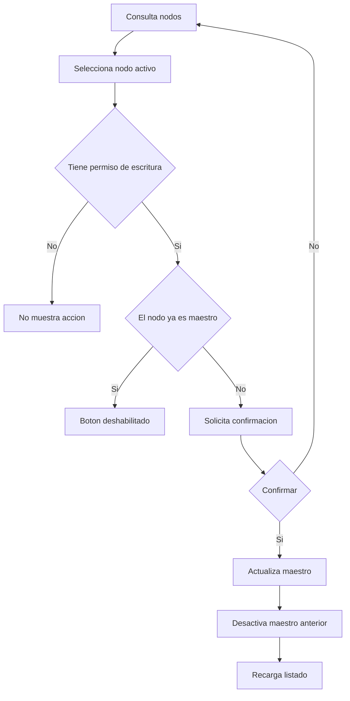

# Nodos del Cluster

Documentación funcional y técnica de la pantalla de administración de nodos del cluster, dentro de Administración > Cluster. Permite consultar el estado de las instancias de la aplicación, filtrar y exportar la información, consultar su detalle y designar de forma controlada el nodo maestro.

- **Ruta frontend:** `/administration/cluster/nodes`
- **Componentes:** `NodeListComponent` (listado) y `NodeDetailComponent` (detalle)
- **Endpoint backend base:** `/api/v1/administration/cluster/nodes` (`ClusterController`)
- **Acceso:** requiere sesión y `CLUSTER_NODE_READ` o `CLUSTER_NODE_WRITE`; designar maestro requiere `CLUSTER_NODE_WRITE`

---

## 1. Requisitos

Identificadores locales de este documento: `RF-CLN-*` (requisitos funcionales) y `RNF-CLN-*` (requisitos no funcionales).

### 1.1. Requisitos funcionales

#### RF-CLN-1: Consulta de nodos

**Descripción:** el sistema debe permitir consultar los nodos registrados en el cluster en un listado ordenable y paginado.

**Criterios de aceptación:**

- AC1.1: El listado muestra hostname, IP, estado, indicador de maestro, fechas de arranque y última actualización, y métricas de memoria.
- AC1.2: Las columnas permiten ordenar ascendente o descendentemente.
- AC1.3: La paginación permite elegir 5, 10, 20 o 50 nodos por página.

#### RF-CLN-2: Búsqueda y filtrado

**Descripción:** el sistema debe permitir filtrar los nodos por hostname, estado y condición de maestro.

**Criterios de aceptación:**

- AC2.1: El hostname se filtra por coincidencia parcial sin distinguir mayúsculas de minúsculas.
- AC2.2: El estado permite seleccionar todos, `ACTIVE` o `INACTIVE`.
- AC2.3: El filtro de maestro permite seleccionar todos, sí o no.
- AC2.4: Al aplicar o limpiar filtros, se vuelve a la primera página y se elimina la selección actual.

#### RF-CLN-3: Consulta de detalle

**Descripción:** el sistema debe permitir consultar un nodo en modo de solo lectura.

**Criterios de aceptación:**

- AC3.1: El doble clic sobre una fila abre el detalle del nodo.
- AC3.2: El detalle muestra los mismos datos operativos y métricas que el listado.
- AC3.3: La acción Volver retorna al listado sin modificar el nodo.

#### RF-CLN-4: Designación de nodo maestro

**Descripción:** un usuario con permiso de escritura debe poder designar un nodo activo que no sea maestro como nuevo maestro del cluster.

**Criterios de aceptación:**

- AC4.1: La acción solo está disponible para usuarios con `CLUSTER_NODE_WRITE`.
- AC4.2: El botón se habilita únicamente cuando hay un nodo seleccionado, activo y no maestro.
- AC4.3: La operación solicita confirmación e identifica el hostname que será designado.
- AC4.4: Tras confirmarla, el nodo elegido pasa a ser maestro y el listado se recarga.
- AC4.5: Al designar un maestro se desactiva el indicador de maestro de cualquier nodo anterior.

#### RF-CLN-5: Exportación CSV

**Descripción:** el sistema debe permitir exportar todos los nodos que cumplen los filtros activos.

**Criterios de aceptación:**

- AC5.1: La exportación incluye todos los resultados filtrados, no solo la página visible.
- AC5.2: El fichero se descarga como `cluster-nodes.csv`.
- AC5.3: El CSV incluye las columnas visibles del listado y las métricas de memoria expresadas en GB y porcentaje.

#### RF-CLN-6: Registro y eliminación controlados por el sistema

**Descripción:** los nodos no se crean ni se eliminan manualmente desde la pantalla ni mediante la API pública.

**Criterios de aceptación:**

- AC6.1: Al iniciarse, cada instancia se registra o actualiza automáticamente mediante el servicio de cluster.
- AC6.2: La interfaz no muestra acciones para crear o eliminar nodos.
- AC6.3: Los intentos de crear o eliminar nodos por API se rechazan con `405 Method Not Allowed`.

### 1.2. Requisitos no funcionales

- **RNF-CLN-1 (Autorización):** la consulta requiere `CLUSTER_NODE_READ` o `CLUSTER_NODE_WRITE`; el cambio de maestro requiere exclusivamente `CLUSTER_NODE_WRITE`.
- **RNF-CLN-2 (Alta disponibilidad):** el sistema mantiene el invariante de un único nodo maestro, desactivando los maestros previos antes de guardar el nuevo.
- **RNF-CLN-3 (Estado):** el heartbeat actualiza estado, memoria y última actualización del nodo propio; los nodos activos sin actualización durante más de cinco minutos pasan a `INACTIVE`.
- **RNF-CLN-4 (Trazabilidad):** los eventos de alta, re-registro e inactivación automática de nodos se registran en auditoría bajo la sección `CLUSTER`.
- **RNF-CLN-5 (Idioma):** todos los textos se resuelven mediante las claves i18n `cluster.nodes.*`.
- **RNF-CLN-6 (Feedback):** la carga y el cambio de maestro informan del progreso, éxito o error mediante notificaciones.

---

## 2. Parte funcional

### 2.1. Objetivo

Ofrecer a los administradores visibilidad y control seguro del cluster:

- Consultar las instancias registradas y su salud operativa.
- Identificar el maestro, los nodos activos y los inactivos.
- Revisar métricas de memoria y marcas temporales de cada instancia.
- Cambiar el maestro con confirmación explícita cuando sea necesario.
- Exportar la vista filtrada para análisis o soporte.

### 2.2. Vistas de la pantalla

La funcionalidad usa dos modos de vista dentro de `NodeListComponent`:

| Modo | Descripción |
|------|-------------|
| `list` | Listado de nodos con filtros, ordenación, selección, paginación y exportación |
| `detail` | Vista no editable del nodo seleccionado |

### 2.3. Patrón visual reutilizable y wireframes

La estructura visual base se define en [layout.md](../../../03-technical/frontend/layout.md). La pantalla usa `List screen` para la consulta y una variante de `Form screen` solo lectura para el detalle; el cambio de maestro utiliza un modal de confirmación.

| Tipo de pantalla | Uso en nodos | Estructura base |
|------------------|--------------|-----------------|
| `List screen` | Consulta principal | Cabecera, filtros, barra de acciones, tabla y paginación |
| `Form screen` solo lectura | Detalle del nodo | Encabezado, datos operativos y acción Volver |
| `Confirmation modal` | Designar maestro | Nombre del nodo y acciones cancelar / confirmar |

#### 2.3.1. Wireframe del `List screen`

```text
+--------------------------------------------------------------------------------+
| Nodos del Cluster                                                              |
+--------------------------------------------------------------------------------+
| Hostname | Estado | Maestro | [Filtrar] [Limpiar]                              |
+--------------------------------------------------------------------------------+
| [Designar maestro]                                           [Exportar CSV]    |
+--------------------------------------------------------------------------------+
| Hostname | IP | Estado | Maestro | Inicio | Ultima actualizacion | Memoria     |
|----------|----|--------|---------|--------|----------------------|-------------|
| ...                                                                            |
+--------------------------------------------------------------------------------+
| < 1 2 3 > | Nodos por pagina: 5 / 10 / 20 / 50                                |
+--------------------------------------------------------------------------------+
```

#### 2.3.2. Wireframe del detalle

```text
+------------------------------------------------------------------+
| Detalle del nodo                                      [Volver]  |
+------------------------------------------------------------------+
| Hostname | node-01        | IP | 10.0.0.10                      |
| Estado   | ACTIVE         | Maestro | MASTER                    |
| Inicio   | fecha/hora     | Ultima actualizacion | fecha/hora   |
| Memoria usada | 1.25 GB   | Memoria total | 4.00 GB             |
| Memoria libre | 68.8 %                                       |
+------------------------------------------------------------------+
```

### 2.4. Listado

**Columnas de la tabla:**

| Columna | Clave i18n | Notas |
|---------|------------|-------|
| Hostname | `cluster.nodes.fields.hostname` | Identificador de la instancia |
| IP | `cluster.nodes.fields.ip` | Dirección IP conocida del nodo |
| Estado | `cluster.nodes.fields.status` | `ACTIVE` o `INACTIVE`, mostrado como etiqueta |
| Maestro | `cluster.nodes.fields.master` | Muestra `MASTER` cuando el indicador es verdadero |
| Inicio | `cluster.nodes.fields.startedAt` | Fecha/hora de arranque, formateada localmente |
| Última actualización | `cluster.nodes.fields.lastModifiedAt` | Marca temporal del último heartbeat o cambio |
| Memoria usada | `cluster.nodes.fields.usedMemoryGb` | Conversión de bytes a GB |
| Memoria total | `cluster.nodes.fields.totalMemoryGb` | Conversión de bytes a GB |
| Memoria libre | `cluster.nodes.fields.freeMemoryPercent` | Porcentaje calculado a partir de memoria usada y total |

**Filtros disponibles:**

| Filtro | Tipo | Regla | `data-testid` |
|--------|------|-------|---------------|
| Hostname | Texto | Coincidencia parcial | `filter-hostname` |
| Estado | Selección | Todos, activo o inactivo | `filter-status` |
| Maestro | Selección | Todos, sí o no | `filter-master` |

**Barra de acciones:**

| Acción | Condición de disponibilidad | `data-testid` |
|--------|-----------------------------|---------------|
| Filtrar | Siempre disponible | `btn-filter-search` |
| Limpiar | Siempre disponible | `btn-filter-clear` |
| Designar maestro | `CLUSTER_NODE_WRITE`, fila activa no maestra seleccionada | `btn-set-master` |
| Exportar CSV | Siempre disponible cuando existen resultados filtrados | `btn-export` |

- Un clic selecciona o deselecciona la fila.
- Un doble clic abre el detalle.
- El filtrado, la ordenación y la paginación se resuelven en cliente sobre la colección de nodos recuperada del backend.

### 2.5. Detalle y designación de maestro

El detalle es exclusivamente informativo. Muestra hostname, IP, estado, condición de maestro, fechas y métricas de memoria sin controles de edición.

Para designar maestro, el usuario selecciona un nodo activo que no sea ya maestro y pulsa **Designar maestro**. El modal solicita confirmación; al aceptar, se realiza la actualización, se limpia la selección y se recarga la lista. Cancelar o cerrar el modal no modifica ningún nodo.

### 2.6. Flujo de cambio de maestro



---

## 3. Parte técnica

### 3.1. Componentes afectados

| Capa | Elemento | Responsabilidad |
|------|----------|-----------------|
| Frontend | `NodeListComponent` | Consulta, filtros cliente, ordenación, paginación, selección y cambio de maestro. |
| Frontend | `NodeDetailComponent` | Presentación de solo lectura del nodo. |
| Frontend | `ClusterService` | Llamadas REST de nodos y actualización del liderazgo. |
| Frontend | `TpDataTableComponent` | Tabla reutilizable para ordenación, selección y paginación. |
| Backend | `ClusterController` | Endpoints REST de lectura de nodos y actualización del maestro. |
| Backend | `ClusterService` | Consulta, heartbeat, detección de inactivos y elección de maestro. |
| Domain | `ClusterNode` | Entidad JPA que representa el estado live de cada nodo del clúster. |
| Domain | `ClusterNodeDTO` y `NodeStatus` | Transporte y estado del nodo en el frontend y backend. |
| Security | `SecurityConfig` | Reglas de autorización y protección del módulo de clúster. |

### 3.2. Modelos de datos

#### Frontend (TypeScript)

```typescript
type NodeStatus = 'ACTIVE' | 'INACTIVE';

interface ClusterNode {
  id: number;
  hostname: string;
  ip: string;
  status: NodeStatus;
  master: boolean;
  freeMemory: number;
  totalMemory: number;
  usedMemory: number;
  startedAt: string;
  lastModifiedAt: string;
}
```

#### Backend DTOs (Java)

```java
public record ClusterNodeDTO(
    Long id,
    String hostname,
    String ip,
    NodeStatus status,
    boolean master,
    Long totalMemory,
    Long usedMemory,
    OffsetDateTime startedAt,
    OffsetDateTime lastModifiedAt
) {}
```

#### Entidades JPA

```java
@Entity
@Table(name = "cluster_node")
public class ClusterNode extends BaseEntity {
    @Column(nullable = false)
    private String hostname;

    @Column(nullable = false)
    private String ip;

    @Enumerated(EnumType.STRING)
    @Column(nullable = false)
    private NodeStatus status;

    @Column(nullable = false)
    private boolean master;

    @Column(nullable = false)
    private Long totalMemory;

    @Column(nullable = false)
    private Long usedMemory;
}
```

Las métricas de memoria se almacenan en bytes. La pantalla calcula la memoria libre como `(totalMemory - usedMemory) / totalMemory * 100`; cuando el total es cero muestra `0%`.

### 3.3. Endpoints del backend

Ruta base: `/api/v1/administration/cluster/nodes`.

| Método y ruta | Descripción | Respuesta |
|---------------|-------------|-----------|
| `GET /` | Obtiene todos los nodos registrados | 200 OK con lista de nodos |
| `GET /{id}` | Obtiene un nodo por identificador | 200 OK con el nodo; 404 si no existe |
| `PATCH /{id}` | Designa el nodo como maestro; el cliente envía `{ "master": true }` | 200 OK con el nodo actualizado |
| `POST /` | Creación manual no permitida | 405 Method Not Allowed |
| `DELETE /{id}` | Eliminación no permitida | 405 Method Not Allowed |

El controlador delega la designación en `ClusterService.setMaster(id)`: el valor del cuerpo de petición no habilita otros cambios y la operación establece el indicador de maestro a verdadero.

### 3.4. Gestión de estado y maestro

- `registerNode()` se ejecuta al arrancar una instancia; crea el nodo si su hostname no existe o actualiza sus datos si ya estaba registrado.
- `heartbeat()` actualiza estado, métricas de memoria y `lastModifiedAt` del nodo propio.
- `detectDeadNodes()` marca `INACTIVE` los nodos `ACTIVE` sin actualización durante más de cinco minutos.
- `electMaster()` elige el primer nodo `ACTIVE` por identificador cuando no existe maestro activo.
- `setMaster(id)` desactiva todos los maestros y guarda el nodo elegido como maestro, garantizando un único maestro.

### 3.5. Exportación

La exportación usa la colección filtrada en cliente, no la página visible. Genera `cluster-nodes.csv` con separador `;`, incluyendo fechas convertidas a hora local, memoria usada y total en GB y el porcentaje de memoria libre.

---

## 4. Pruebas

### 4.1. Cobertura unitaria (backend)

| Ubicación | Alcance |
|-----------|---------|
| `core/src/test/java/org/myorganization/template/core/service/ClusterServiceTest.java` | Consulta de nodos, designación de maestro y operaciones de cluster |
| `core/src/test/java/org/myorganization/template/core/service/ClusterServiceSingleMasterPropertyTest.java` | Propiedad de un único maestro tras secuencias de cambios |
| `webapp/src/test/java/org/myorganization/template/webapp/controller/ClusterControllerTest.java` | Contrato de los endpoints de nodos |
| `webapp/src/test/java/org/myorganization/template/webapp/integration/AuditAndClusterIntegrationTest.java` | Invariante de maestro único en integración |

### 4.2. Cobertura unitaria (frontend)

| Ubicación | Alcance |
|-----------|---------|
| `dashboard/src/app/core/services/cluster.service.spec.ts` | Consultas de nodos, consulta por identificador y `PATCH` para designar maestro |

No hay actualmente pruebas unitarias específicas de `NodeListComponent` o `NodeDetailComponent` en el repositorio.

### 4.3. Cobertura E2E (Playwright)

Ubicación: `dashboard/e2e/tests/administration/cluster-nodes.spec.ts` (Page Object en `dashboard/e2e/pages/cluster-nodes.page.ts`).

| Caso | Descripción | Resultado esperado |
|------|-------------|--------------------|
| Listado controlado | Acceder a la pantalla tras iniciar sesión | La tabla y filtros son visibles; no existen acciones de crear ni eliminar y Designar maestro está deshabilitado sin selección |
| Filtrado | Filtrar por el hostname de un nodo existente y limpiar | El listado queda reducido al nodo coincidente y se restaura al limpiar |
| Detalle | Abrir el primer nodo y volver | El detalle muestra su hostname y Volver restaura el listado |
| Exportación CSV | Exportar el listado de nodos | El navegador descarga `cluster-nodes.csv` |

La suite no ejecuta el cambio de maestro: es una operación que modifica estado compartido y requiere al menos dos nodos activos para validarse de forma aislada o con restauración posterior.

### 4.4. Datos de prueba

Los nodos del cluster se registran automáticamente al arrancar la aplicación; no existe un fichero de datos semilla específico. Los tests E2E utilizan el usuario `testUsers.valid` definido en `dashboard/e2e/fixtures/test-data.ts` y operan sobre las instancias registradas en el entorno de integración.

### 4.5. Dependencias de ejecución

- La consulta requiere backend de integración levantado y al menos una instancia registrada mediante el arranque de la aplicación.
- La designación de maestro requiere al menos un nodo activo que no sea ya maestro.
- La exportación solo descarga un fichero cuando existen nodos que cumplan los filtros activos.

---

## Referencias

- [Autenticación y Gestión de Sesión](../../login/authentication.md)
- [Requisitos de la aplicación](../../../specification/requirements.md)
- [Modelo de datos funcional](../../../specification/data-model.md)
- [Glosario](../../../specification/glossary.md)
- [Seguridad backend](../../../03-technical/backend/security.md)
- [API backend](../../../03-technical/backend/api.md)
- [Navegación frontend](../../../03-technical/frontend/navigation.md)
- [Componentes frontend](../../../03-technical/frontend/components.md)
