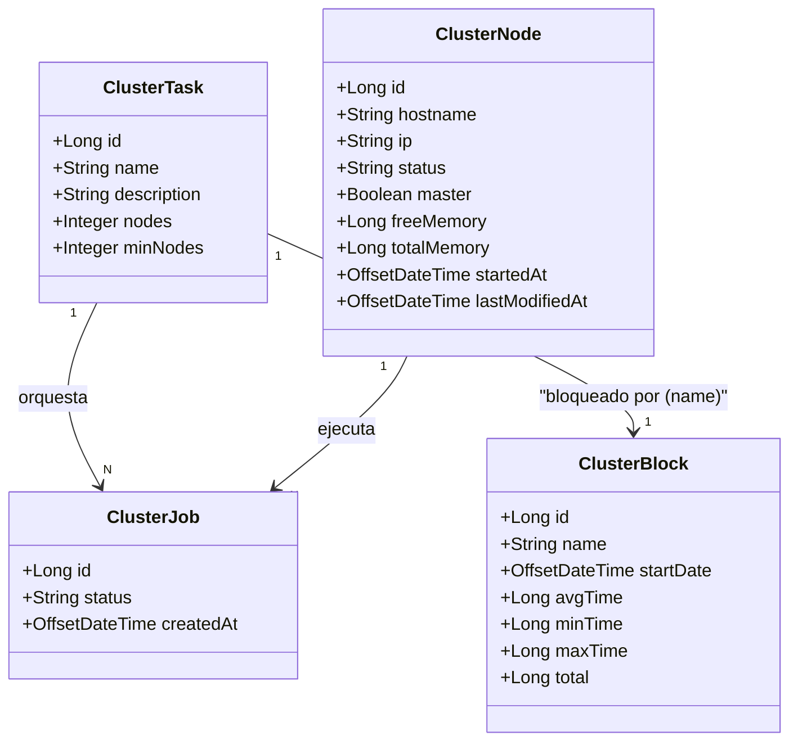

# Cluster

Documentación funcional del módulo de Cluster dentro de Administración. Gestiona la alta disponibilidad de la aplicación: instancias registradas, salud operativa, designación de nodo maestro y trazabilidad de bloqueos distribuidos.

## Módulos

- [Nodos del Cluster](./cluster-nodes.md)
- [Bloqueos del Cluster](./cluster-blocks.md)

## Descripción

Estos documentos describen el comportamiento funcional y técnico de las pantallas del área de Cluster dentro de Administración:

- consulta y designación controlada de nodos del cluster,
- consulta de bloqueos (locks) distribuidos y sus métricas históricas de ejecución.

El módulo de Cluster se apoya en tareas clusterizadas y un servicio de locks a doble nivel (intra-instancia e inter-instancia) para garantizar exclusión mutua entre hilos y entre nodos conectados a la misma base de datos.

## Modelo de entidades

El módulo de cluster centraliza la orquestación de instancias y la exclusión mutua distribuida. Las entidades principales son:

- `ClusterTask`: define una tarea clusterizable y sus requisitos de nodos (`nodes`, `min_nodes`). Se usa como semilla y catálogo de tareas sujetas a lock.
- `ClusterNode`: representa una instancia de la aplicación registrada en el cluster, con estado operativo, métricas de memoria e indicador de nodo maestro.
- `ClusterBlock`: registro de bloqueo asociado a una tarea por nombre, con fecha de último inicio y métricas acumuladas de duración (`avg`, `min`, `max`, `total`).
- `ClusterJob`: ejecución concreta de una `ClusterTask` asociada a un nodo (no se expone en pantalla desde este módulo).

### Relación de negocio

- Un `ClusterNode` representa una instancia desplegada. El sistema garantiza un único maestro activo y marca como inactivos los nodos sin heartbeat tras cinco minutos.
- Una `ClusterTask` describe una tarea orquestable. El lock de la tarea se adquiere antes de ejecutarla y su nombre coincide con `ClusterBlock.name`.
- Un `ClusterBlock` se crea automáticamente la primera vez que se adquiere un lock sobre un nombre de tarea; en cada liberación se actualizan sus métricas acumuladas.
- Los bloqueos se componen de `ReentrantLock` intra-instancia y `pg_advisory_lock` inter-instancia, usando la hora de la base de datos para evitar desviaciones de reloj entre nodos.

### Permisos del módulo

- `CLUSTER_NODE_READ` / `CLUSTER_NODE_WRITE`: lectura y designación de nodo maestro.
- `CLUSTER_LOCK_READ`: consulta de bloqueos y exportación CSV.
- Las escrituras públicas sobre bloqueos no existen: su gestión es exclusiva del servicio de cluster.

### Documentación asociada

- [Nodos del Cluster](./cluster-nodes.md)
- [Bloqueos del Cluster](./cluster-blocks.md)
