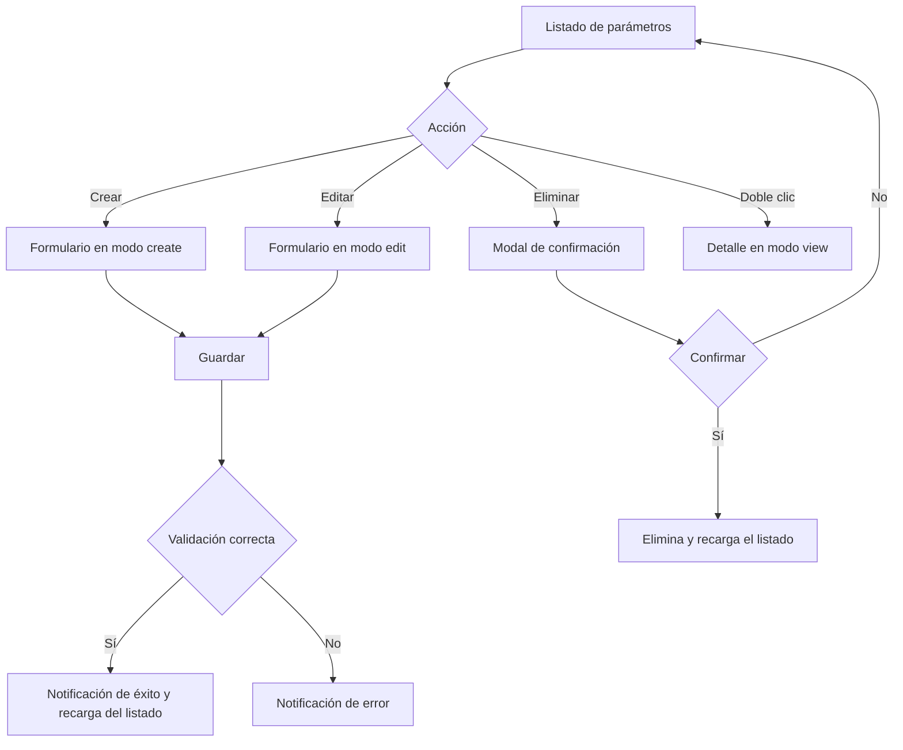

# Parámetros

Documentación funcional y técnica de la pantalla de gestión de parámetros, dentro del módulo de Administración. Permite consultar, filtrar, crear, editar y eliminar los parámetros globales de la aplicación, así como validar la compatibilidad entre su tipo y su valor.

- **Ruta frontend:** `/administration/parameters`
- **Componentes:** `ParameterListComponent` (listado) y `ParameterFormComponent` (detalle / alta / edición)
- **Endpoint backend base:** `/api/v1/administration/parameters` (`ParameterController`)
- **Acceso:** requiere sesión y la acción `SYSTEM_PARAMETER_READ`; las operaciones de escritura requieren `SYSTEM_PARAMETER_WRITE`

---

## 1. Requisitos

Identificadores locales de este documento: `RF-PAR-*` (requisitos funcionales) y `RNF-PAR-*` (requisitos no funcionales).

### 1.1. Requisitos funcionales

#### RF-PAR-1: Consulta paginada de parámetros

**Descripción:** el sistema debe permitir consultar los parámetros del sistema en un listado paginado y ordenable.

**Criterios de aceptación:**
- AC1.1: El listado muestra las columnas código, descripción, tipo y valor.
- AC1.2: Todas las columnas son ordenables (ascendente/descendente).
- AC1.3: La paginación permite navegar entre páginas y cambiar el tamaño de página.

#### RF-PAR-2: Búsqueda y filtrado

**Descripción:** el sistema debe permitir filtrar el listado por código, descripción y tipo.

**Criterios de aceptación:**
- AC2.1: El filtro de código aplica coincidencia parcial.
- AC2.2: El filtro de descripción aplica coincidencia parcial.
- AC2.3: El filtro de tipo permite seleccionar un tipo concreto o todos.
- AC2.4: Al aplicar un filtro, el listado vuelve a la primera página.
- AC2.5: La acción de limpiar restablece todos los filtros y recarga el listado completo.

#### RF-PAR-3: Alta de parámetro

**Descripción:** un usuario con permiso de escritura debe poder crear parámetros con clave única, tipo y valor válidos.

**Criterios de aceptación:**
- AC3.1: El formulario exige código y tipo.
- AC3.2: El valor es obligatorio en el alta y debe ser compatible con el tipo seleccionado.
- AC3.3: El código debe ser único dentro del sistema.
- AC3.4: Una creación válida devuelve 201 y el nuevo parámetro aparece en el listado.

#### RF-PAR-4: Edición de parámetro

**Descripción:** un usuario con permiso de escritura debe poder modificar los datos de un parámetro existente.

**Criterios de aceptación:**
- AC4.1: El código es de solo lectura en edición porque identifica la entidad de forma inmutable.
- AC4.2: El valor se valida de nuevo según el tipo seleccionado.
- AC4.3: Una edición válida devuelve 200 y el cambio se refleja en el listado.

#### RF-PAR-5: Eliminación de parámetro

**Descripción:** un usuario con permiso de escritura debe poder eliminar un parámetro, con confirmación previa.

**Criterios de aceptación:**
- AC5.1: La eliminación solicita confirmación explícita mediante un modal.
- AC5.2: Una eliminación confirmada devuelve 204 y el parámetro desaparece del listado.
- AC5.3: Cancelar la confirmación no elimina el parámetro.

#### RF-PAR-6: Detalle de parámetro

**Descripción:** el sistema debe permitir consultar el detalle de un parámetro en modo solo lectura.

**Criterios de aceptación:**
- AC6.1: El doble clic sobre una fila abre el detalle.
- AC6.2: El detalle muestra la información principal y la auditoría de creación / última modificación.
- AC6.3: En modo vista, el valor y el tipo aparecen deshabilitados para edición.

#### RF-PAR-7: Validación de tipo y valor

**Descripción:** el sistema debe validar que el valor del parámetro sea compatible con su tipo.

**Criterios de aceptación:**
- AC7.1: `INTEGER` exige un entero válido.
- AC7.2: `BOOLEAN` exige `true` o `false`.
- AC7.3: `DATE` exige un valor ISO 8601 válido (`yyyy-MM-dd`, `yyyy-MM-ddTHH:mm:ss` o con offset).
- AC7.4: `STRING` acepta cualquier valor textual.

### 1.2. Requisitos no funcionales

- **RNF-PAR-1 (Autorización):** el acceso requiere sesión y la acción `SYSTEM_PARAMETER_READ`; las operaciones de escritura requieren `SYSTEM_PARAMETER_WRITE`.
- **RNF-PAR-2 (Visibilidad de acciones):** los botones de crear, editar y eliminar solo se muestran a usuarios con `SYSTEM_PARAMETER_WRITE`.
- **RNF-PAR-3 (Integridad de datos):** el código actúa como clave natural y no se puede duplicar.
- **RNF-PAR-4 (Validación temprana):** el backend verifica la compatibilidad de valor/tipo antes de persistir la entidad.
- **RNF-PAR-5 (Idioma):** todos los textos de la pantalla son traducibles (ES / EN) mediante el bloque i18n `parameters.*`.
- **RNF-PAR-6 (Feedback):** toda operación (crear, editar, eliminar, exportar, paginar) informa al usuario mediante notificaciones de progreso, éxito o error.

---

## 2. Parte funcional

### 2.1. Objetivo

Ofrecer a los administradores una pantalla completa para mantener los parámetros globales del sistema:

- Consultar el listado paginado y filtrado.
- Ver el detalle de un parámetro.
- Crear, editar y eliminar parámetros.
- Validar la compatibilidad entre tipo y valor.
- Exportar o consultar la información según el caso de uso.

### 2.2. Vistas de la pantalla

La pantalla gestiona cuatro modos de vista (`viewMode`) dentro del mismo componente:

| Modo | Descripción |
|------|-------------|
| `list` | Listado paginado con barra de filtros y barra de acciones |
| `detail` | Vista de solo lectura del parámetro |
| `create` | Formulario de alta |
| `edit` | Formulario de edición |

### 2.3. Patrón visual reutilizable y wireframes

La estructura visual base de esta pantalla se define en [layout.md](../../../03-technical/frontend/layout.md). Ese documento es la fuente única de verdad para los templates `List Screen`, `Form Screen` y `Confirmation Modal`; la documentación funcional de parámetros solo describe cómo se aplica ese patrón a la entidad concreta.

| Tipo de pantalla | Uso en parámetros | Estructura base |
|------------------|------------------|-----------------|
| `List screen` | Listado principal | Cabecera, filtros, tabla, acciones y paginación |
| `Form screen` | Alta, edición y consulta en modo lectura | Encabezado, campos, validación, auditoría y pie de acciones |
| `Confirmation modal` | Eliminación | Mensaje de confirmación con aceptar/cancelar |

#### 2.3.1. Wireframe del `List screen`

```text
+------------------------------------------------------------------+
| Parámetros                                                       |
| [Crear]                                                          |
+------------------------------------------------------------------+
| Filtro código | Filtro descripción | Filtro tipo | [Buscar] [Limpiar] |
+------------------------------------------------------------------+
| Código | Descripción | Tipo | Valor                              |
|--------|-------------|------|-------------------------------------|
| APP_NAME | Nombre de la aplicación | STRING | Template App |
| MAX_RETRIES | Número máximo de reintentos | INTEGER | 5 |
| FEATURE_X | Habilita la nueva funcionalidad | BOOLEAN | true |
+------------------------------------------------------------------+
| < 1 2 3 > | Registros por página: 10                           |
+------------------------------------------------------------------+
```

#### 2.3.2. Wireframe del `Form screen`

```text
+------------------------------------------------------------------+
| Crear parámetro / Editar parámetro                               |
+------------------------------------------------------------------+
| Código * | [texto]       | Tipo * | [select: STRING/INTEGER/BOOLEAN/DATE] |
| Valor * | [texto]       | Descripción | [texto]                     |
+------------------------------------------------------------------+
| [Guardar] [Cancelar]                                             |
+------------------------------------------------------------------+
```

#### 2.3.3. Wireframe del `Form screen` en modo lectura

```text
+------------------------------------------------------------------+
| Consultar parámetro                                               |
| [Volver] [Editar]                                                |
+------------------------------------------------------------------+
| Código | [APP_NAME]                                              |
| Tipo   | [STRING]                                                |
| Valor  | [Template App]                                          |
| Descripción | [Nombre de la aplicación]                          |
| Auditoría: Creado 2026-09-01 | Última modificación 2026-09-15   |
+------------------------------------------------------------------+
```

La pantalla de parámetros usa `List screen` para la consulta, `Form screen` para alta y edición, y el mismo `Form screen` en modo solo lectura para la consulta detallada. El patrón visual es el mismo que el resto de pantallas de administración, con variaciones en columnas, filtros y campos según la entidad.

### 2.4. Listado

**Columnas de la tabla** (todas ordenables y reordenables):

| Columna | Clave i18n | Notas |
|---------|-----------|-------|
| Código | `parameters.fields.code` | Identificador único del parámetro |
| Descripción | `parameters.fields.description` | Texto descriptivo del parámetro |
| Tipo | `parameters.fields.type` | Uno de `STRING`, `INTEGER`, `BOOLEAN`, `DATE` |
| Valor | `parameters.fields.value` | Se muestra como texto tal y como se almacena |

**Filtros disponibles:**

| Filtro | Tipo | `data-testid` |
|--------|------|---------------|
| Código | Texto (coincidencia parcial) | `filter-code` |
| Descripción | Texto (coincidencia parcial) | `filter-description` |
| Tipo | Selección (todos por defecto) | `filter-type` |

**Barra de acciones:**

| Acción | Condición de disponibilidad | `data-testid` |
|--------|-----------------------------|---------------|
| Crear | Requiere `SYSTEM_PARAMETER_WRITE` | `btn-create` |
| Editar | Requiere `SYSTEM_PARAMETER_WRITE` y una fila seleccionada | `btn-edit` |
| Eliminar | Requiere `SYSTEM_PARAMETER_WRITE` y una fila seleccionada | `btn-delete` |
| Exportar CSV | Siempre disponible | `btn-export` |

- La selección de una fila alterna (seleccionar / deseleccionar).
- El doble clic sobre una fila abre la vista de detalle.
- La exportación a CSV incluye todos los registros que cumplen los filtros activos, no solo la página visible.

### 2.4. Identificadores para pruebas (`data-testid`)

| Elemento | `data-testid` |
| --- | --- |
| Formulario de filtros | `parameters-filter-form` |
| Filtro de código | `filter-code` |
| Filtro de descripción | `filter-description` |
| Filtro de tipo | `filter-type` |
| Tabla de parámetros | `parameters-table` |
| Botón Crear | `btn-create` |
| Botón Editar | `btn-edit` |
| Botón Eliminar | `btn-delete` |
| Botón Exportar CSV | `btn-export` |

### 2.5. Formulario de parámetro

**Campos:**

| Campo | Obligatorio | Notas |
|-------|-------------|-------|
| Código | Sí | Identificador único y no editable en edición |
| Tipo | Sí | Debe escogerse entre `STRING`, `INTEGER`, `BOOLEAN`, `DATE` |
| Valor | Sí | Se valida según el tipo elegido |
| Descripción | No | Texto explicativo opcional |

**Validaciones funcionales:**

| Campo | Regla |
|-------|-------|
| Código | Obligatorio, único y no modificable en edición |
| Tipo | Obligatorio; permitido únicamente por el enum `ParameterType` |
| Valor | Requerido y validado con el tipo; por ejemplo, `true`/`false` para booleanos |
| Descripción | Opcional, permite explicar la finalidad del parámetro |

### 2.6. Validaciones de negocio en backend

Los parámetros se validan no solo en el formulario, sino también en la capa de servicio para evitar inconsistencias:

- `STRING`: acepta cualquier texto.
- `INTEGER`: el valor debe poder convertirse con `Integer.parseInt`.
- `BOOLEAN`: solo admite `true` o `false` en minúsculas.
- `DATE`: requiere un valor ISO 8601 válido (fecha, fecha-hora o fecha con offset).

La regla se implementa en `ParameterService.validateTypeValueCompatibility(...)` y se ejecuta tanto en alta como en edición.

### 2.7. Diagramas

#### 2.7.1. Flujo de operaciones CRUD



### 2.8. Mensajes y notificaciones

- Las operaciones de crear, editar, eliminar, exportar y paginar muestran notificaciones de progreso, éxito o error mediante el `NotificationService` (claves `notification.*`).
- La eliminación solicita confirmación con el mensaje `parameters.delete.confirmMessage`, que incluye el código del parámetro y advierte de que la acción no se puede deshacer.

---

## 3. Parte técnica

### 3.1. Componentes afectados

| Capa | Elemento | Responsabilidad |
|------|----------|-----------------|
| Frontend | `ParameterListComponent` | Listado, filtros, paginación, orden, exportación y orquestación de vistas. |
| Frontend | `ParameterFormComponent` | Alta, edición y detalle del parámetro. |
| Frontend | `ParameterService` | Llamadas CRUD y validación de criterios del formulario. |
| Frontend | `TpDataTableComponent` | Tabla reutilizable para ordenación, paginación y selección. |
| Frontend | `AuthService` | Comprobación de permisos según la acción del usuario. |
| Backend | `ParameterController` | Exposición de endpoints CRUD para administración de parámetros. |
| Backend | `ParameterService` | Lógica de negocio, validación y persistencia del parámetro. |
| Domain | `Parameter` | Entidad principal del sistema para configuración dinámica. |
| Domain | `ParameterType` | Enumerado que tipifica el valor del parámetro. |
| Security | `SecurityConfig` | Reglas de autorización y protección del módulo de parámetros. |

### 3.2. Modelos de datos

#### Frontend (TypeScript)

```typescript
interface ParameterDTO {
  id: number | null;
  code: string;
  description: string | null;
  value: string;
  type: 'STRING' | 'INTEGER' | 'BOOLEAN' | 'DATE';
  createdAt: string | null;
  lastModifiedAt: string | null;
}

interface ParameterCriteria {
  code?: string;
  description?: string;
  type?: 'STRING' | 'INTEGER' | 'BOOLEAN' | 'DATE';
}
```

#### Backend DTOs (Java)

```java
public record ParameterDTO(
    Long id,
    String code,
    String description,
    String value,
    ParameterType type,
    OffsetDateTime createdAt,
    OffsetDateTime lastModifiedAt
) {}

public record ParameterCriteria(
    String code,
    String description,
    ParameterType type
) {}
```

#### Entidades JPA

```java
@Entity
@Table(name = "parameter")
public class Parameter extends BaseEntity {
    @Column(nullable = false, unique = true)
    private String code;

    private String description;

    @Column(nullable = false)
    private String value;

    @Enumerated(EnumType.STRING)
    @Column(nullable = false)
    private ParameterType type;
}
```

### 3.3. Endpoints

Ruta base: `/api/v1/administration/parameters`.

| Método y ruta | Descripción | Respuesta |
|---------------|-------------|-----------|
| `GET /` | Listado paginado con filtros (`code`, `description`, `type`) y `Pageable` | 200 OK con página de parámetros |
| `GET /count` | Número de parámetros que cumplen los filtros | 200 OK con el total |
| `GET /{code}` | Parámetro por código | 200 OK con el parámetro |
| `POST /` | Alta de parámetro (`id` nulo) | 201 Created con el parámetro creado |
| `PUT /{code}` | Actualización del parámetro | 200 OK con el parámetro actualizado |
| `DELETE /{code}` | Eliminación del parámetro | 204 No Content |

### 3.4. Validaciones

- El código del parámetro es obligatorio y único; no puede cambiarse en edición.
- El tipo debe pertenecer al enum `STRING`, `INTEGER`, `BOOLEAN` o `DATE` y el valor debe ser compatible con ese tipo antes de persistir.
- La descripción es opcional, pero si se informa debe incorporar texto descriptivo válido y compatible con la longitud y formato del backend.
- La validación de compatibilidad se repite tanto en frontend como en servicio para evitar inconsistencias.

### 3.5. Exportación

- La exportación reusa la consulta filtrada con un tamaño grande para recuperar todas las filas y generar el CSV en cliente.
- El CSV conserva los filtros y orden activos, y no está limitado a la página visible en pantalla.
- Si no existen filas coincidentes, la UI informa del caso y evita generar un archivo vacío.

### 3.6. Paginación, orden y filtros

- La paginación y el orden se envían como parámetros `page`, `size` y `sort` (formato `campo,dirección`).
- Los filtros vacíos no se envían al backend (`undefined`).

### 3.7. Seguridad y permisos

- El acceso a la ruta está protegido por `actionGuard` con las acciones `SYSTEM_PARAMETER_READ` y `SYSTEM_PARAMETER_WRITE`.
- Las acciones de crear, editar y eliminar solo se muestran si el usuario posee la acción `SYSTEM_PARAMETER_WRITE` (`canWrite`).
- El código del parámetro es inmutable una vez creado.
- El valor se valida siempre antes de persistir la entidad.

### 3.8. Reglas de comportamiento relevantes

- En **edición**, el campo código queda deshabilitado para preservar la identidad del parámetro.
- En **alta**, el valor es obligatorio y debe ser compatible con el tipo escogido.
- Tras crear o actualizar con éxito, la aplicación vuelve al listado y lo recarga.
- La eliminación siempre requiere confirmación explícita del usuario.

---

## 4. Pruebas

### 4.1. Cobertura unitaria (backend)

La suite actual incluye pruebas del servicio y del controlador que cubren la validación, el CRUD y la compatibilidad entre tipo y valor:

| Ubicación | Alcance |
|-----------|---------|
| `template/core/src/test/java/org/myorganization/template/core/service/ParameterServiceTest.java` | Creación, consulta por código y criterios, validación de compatibilidad tipo/valor, actualización, borrado y conteo |
| `template/webapp/src/test/java/org/myorganization/template/webapp/controller/ParameterControllerTest.java` | Respuestas HTTP de los endpoints, parámetros de consulta y propagación de excepciones del servicio |

Estas pruebas cubren la lógica principal del módulo y complementan la validación funcional del frontend.

### 4.2. Cobertura unitaria (frontend)

| Ubicación | Alcance |
|-----------|---------|
| `parameter-list.component.spec.ts` | Estado del listado, filtros, paginación y acciones |
| `parameter-form.component.spec.ts` | Modos del formulario y emisión de eventos |
| `parameter.service.spec.ts` | Construcción de peticiones CRUD y criterios de filtrado |

### 4.3. Cobertura E2E (Playwright)

Ubicación: `dashboard/e2e/tests/administration/parameters.spec.ts` (Page Object en `dashboard/e2e/pages/parameters.page.ts`).

| Caso | Descripción | Resultado esperado |
|------|-------------|--------------------|
| Listar parámetros | Acceder a la pantalla tras iniciar sesión | La tabla es visible, hay al menos una fila y se muestran filtros y el botón de crear |
| Buscar por código | Filtrar por un código existente y por uno inexistente | El listado muestra la fila coincidente; con un término sin coincidencias queda vacío |
| Crear parámetro | Alta desde el formulario con datos válidos | El backend responde 201, se vuelve al listado y el nuevo parámetro aparece al buscarlo |
| Editar parámetro | Seleccionar un parámetro y modificar sus datos | El backend responde 200 y el cambio se refleja en el listado |
| Eliminar parámetro | Seleccionar un parámetro y confirmar el borrado | El backend responde 204 y el parámetro deja de aparecer al buscarlo |
| Exportar CSV | Pulsar el botón de exportar | El navegador descarga el fichero `parameters.csv` |

- Cada test inicia sesión con un usuario administrador y navega directamente a `/administration/parameters`.
- La suite se ejecuta en modo `serial` para evitar contención al trabajar con datos creados por cada caso.
- Los casos de crear, editar y eliminar generan una clave única por ejecución para poder reejecutarse sin colisiones.

### 4.4. Datos de prueba

Definidos en `dashboard/e2e/fixtures/test-data.ts`: `testUsers.valid` (credenciales del administrador) y `buildNewParameter()` (genera datos de un parámetro nuevo con clave única).

### 4.5. Dependencias de ejecución

- Los casos E2E requieren el backend de integración levantado con la configuración de perfil `test`.
- Los casos de creación y edición insertan un registro en el backend por ejecución; el caso de eliminación borra el parámetro que él mismo crea.
- La exportación depende de que existan filas que cumplan los filtros activos; en caso contrario se notifica que no hay datos que exportar.

---

## Referencias

- [Autenticación y Gestión de Sesión](../../login/authentication.md)
- [Login](../../login/login.md)
- [Requisitos de la aplicación](../../../specification/requirements.md)
- [Modelo de datos funcional](../../../specification/data-model.md)
- [Seguridad backend](../../../03-technical/backend/security.md)
- [Componentes frontend](../../../03-technical/frontend/components.md)
- [API backend](../../../03-technical/backend/api.md)
- [layout.md](../../../03-technical/frontend/layout.md)
- [design-system.md](../../../03-technical/frontend/design-system.md)
