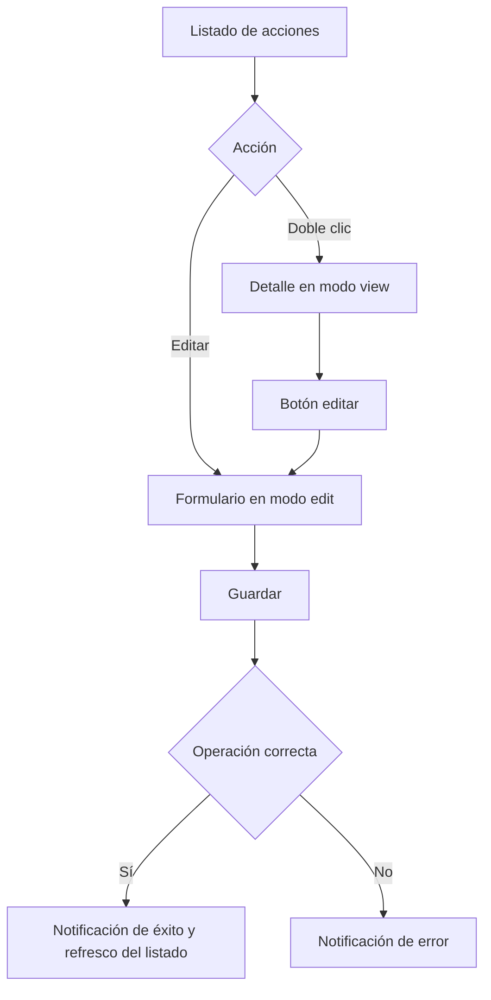

# Acciones (Gestión de permisos)

Documentación funcional y técnica de la pantalla de gestión de permisos, dentro del módulo de Administración > Seguridad. Permite consultar, filtrar, visualizar y editar el catálogo de acciones del sistema que se usa para autorizar accesos a funcionalidades y perfiles.

- **Ruta frontend:** `/administration/security/actions`
- **Componentes:** `ActionListComponent` (listado) y `ActionFormComponent` (detalle / edición)
- **Endpoint backend base:** `/api/v1/administration/security/actions` (`ActionController`)
- **Acceso:** requiere sesión y la acción `ACTION_READ`; la edición usa el mismo permiso `ACTION_READ`
- **Restricción de negocio:** no está permitido crear ni eliminar acciones; el catálogo es semilla de base de datos y solo se actualiza su nombre, descripción y tipo

---

## 1. Requisitos

Identificadores locales de este documento: `RF-ACC-*` (requisitos funcionales) y `RNF-ACC-*` (requisitos no funcionales). La autenticación y la gestión de sesión que dan acceso a esta pantalla se especifican en [requirements.md](../../../specification/requirements.md).

### 1.1. Requisitos funcionales

#### RF-ACC-1: Consulta paginada de acciones

**Descripción:** el sistema debe permitir consultar el catálogo de acciones en un listado paginado y ordenable.

**Criterios de aceptación:**
- AC1.1: El listado muestra las columnas código, nombre, tipo y descripción.
- AC1.2: Todas las columnas son ordenables (ascendente/descendente).
- AC1.3: La paginación permite navegar entre páginas y cambiar el tamaño de página.

#### RF-ACC-2: Búsqueda y filtrado

**Descripción:** el sistema debe permitir filtrar el listado por código y tipo.

**Criterios de aceptación:**
- AC2.1: El filtro de código aplica coincidencia parcial.
- AC2.2: El filtro de tipo permite seleccionar uno de los tipos del catálogo (`READ`, `WRITE`, `EXECUTE`) o todos.
- AC2.3: Al aplicar un filtro, el listado vuelve a la primera página.
- AC2.4: La acción de limpiar restablece todos los filtros y recarga el listado completo.

#### RF-ACC-3: Detalle de acción

**Descripción:** el sistema debe permitir consultar el detalle de una acción en modo solo lectura.

**Criterios de aceptación:**
- AC3.1: El doble clic sobre una fila abre el detalle de la acción.
- AC3.2: El detalle muestra el código, nombre, tipo, descripción y fechas de creación y última modificación.
- AC3.3: La vista detalle incluye el botón de edición cuando el usuario tiene permiso de lectura.

#### RF-ACC-4: Edición de acción

**Descripción:** un usuario con permiso de lectura debe poder modificar los metadatos de una acción existente.

**Criterios de aceptación:**
- AC4.1: El código es de solo lectura y no puede modificarse.
- AC4.2: El nombre puede editarse y es obligatorio.
- AC4.3: El tipo puede cambiarse entre `READ`, `WRITE` y `EXECUTE`.
- AC4.4: La descripción es opcional y se guarda como texto libre.
- AC4.5: Una edición válida devuelve 200 y el cambio se refleja en el listado.

#### RF-ACC-5: Exportación a CSV

**Descripción:** el sistema debe permitir exportar el listado filtrado a un fichero CSV.

**Criterios de aceptación:**
- AC5.1: La exportación incluye todos los registros que cumplen los filtros activos, no solo la página visible.
- AC5.2: El nombre del fichero exportado se genera automáticamente con el formato `actions_YYYY-MM-DD`.
- AC5.3: Si no hay filas que cumplan los filtros, se notifica que no hay datos que exportar.

#### RF-ACC-6: Catalogo de acciones administrado por semilla

**Descripción:** el sistema debe tratar las acciones como un catálogo definido por datos semilla y no como entidades CRUD normales.

**Criterios de aceptación:**
- AC6.1: La API no ofrece alta de acciones.
- AC6.2: La API no ofrece borrado de acciones.
- AC6.3: Cualquier intento de creación o eliminación se rechaza con `MethodNotAllowedException`.
- AC6.4: El catálogo inicial se carga mediante Liquibase y se usa para perfiles y permisos del sistema.

### 1.2. Requisitos no funcionales

- **RNF-ACC-1 (Autorización):** el acceso requiere sesión y la acción `ACTION_READ`; la edición también usa ese mismo permiso, sin necesidad de `ACTION_WRITE`.
- **RNF-ACC-2 (Visibilidad de acciones):** la pantalla muestra edición y exportación, pero no incluye opciones de crear ni borrar.
- **RNF-ACC-3 (Integridad del catálogo):** los tipos de acción están restringidos a `READ`, `WRITE` y `EXECUTE` y se gestionan como valores controlados.
- **RNF-ACC-4 (Idioma):** todos los textos de la pantalla son traducibles (ES / EN) mediante el grupo i18n `actions.*`.
- **RNF-ACC-5 (Feedback):** toda operación (filtrar, ordenar, exportar y guardar) informa al usuario mediante notificaciones de progreso, éxito o error.

---

## 2. Parte funcional

### 2.1. Objetivo

Ofrecer a los administradores una pantalla para consultar y mantener el catálogo de permisos del sistema:

- Consultar el listado paginado y filtrado de acciones.
- Ver el detalle de una acción con su información de auditoría.
- Editar nombre, descripción y tipo de una acción existente.
- Exportar el listado filtrado a CSV.

### 2.2. Vistas de la pantalla

La pantalla gestiona tres modos de vista (`viewMode`) dentro del mismo componente:

| Modo | Descripción |
|------|-------------|
| `list` | Listado paginado con filtros y acciones de exportación/edición |
| `detail` | Vista de solo lectura de una acción |
| `edit` | Formulario de edición de una acción |

> No existe un modo `create` ni una operación de borrado; la entidad acción es de tipo catálogo y se mantiene por datos semilla.

### 2.3. Patrón visual reutilizable y wireframes

La estructura visual base de esta pantalla se define en [layout.md](../../../03-technical/frontend/layout.md). Ese documento es la referencia canónica para los templates `List Screen`, `Form Screen` y `Confirmation Modal`; la documentación funcional de acciones solo describe cómo se aplica el patrón al catálogo semilla.

| Tipo de pantalla | Uso en acciones | Estructura base |
|------------------|-----------------|-----------------|
| `List screen` | Listado principal | Cabecera, filtros, tabla, exportación y edición |
| `Form screen` | Edición y consulta en modo lectura | Encabezado, campos y pie de acciones con estado readonly |
| `Confirmation modal` | No aplica | La eliminación está prohibida por negocio |

#### 2.3.1. Wireframe del `List screen`

```text
+------------------------------------------------------------------+
| Acciones                                                         |
| [Exportar]                                                       |
+------------------------------------------------------------------+
| Filtro código | Filtro tipo | [Buscar] [Limpiar]                 |
+------------------------------------------------------------------+
| Código | Nombre | Tipo | Descripción                             |
|--------|--------|------|------------------------------------------|
| USER_READ | Leer usuarios | READ | Permiso de consulta ...       |
| USER_WRITE | Modificar usuarios | WRITE | Permiso de edición ... |
+------------------------------------------------------------------+
| < 1 2 3 > | Registros por página: 10                           |
+------------------------------------------------------------------+
```

#### 2.3.2. Wireframe del `Form screen`

```text
+------------------------------------------------------------------+
| Editar acción                                                    |
+------------------------------------------------------------------+
| Código | [USER_READ]                                             |
| Nombre * | [Leer usuarios]                                       |
| Tipo * | [READ]                                                 |
| Descripción | [Permiso de consulta ...]                          |
+------------------------------------------------------------------+
| [Guardar] [Cancelar]                                             |
+------------------------------------------------------------------+
```

#### 2.3.3. Wireframe del `Form screen` en modo lectura

```text
+------------------------------------------------------------------+
| Consultar acción                                                 |
| [Volver] [Editar]                                                |
+------------------------------------------------------------------+
| Código | [USER_READ]                                             |
| Nombre | [Leer usuarios]                                         |
| Tipo   | [READ]                                                  |
| Descripción | [Permiso de consulta ...]                          |
| Auditoría: Creado 2026-09-01 | Última modificación 2026-09-15   |
+------------------------------------------------------------------+
```

La diferencia frente a usuarios y perfiles es que acciones no tiene alta ni borrado. Su `List screen` se centra en filtro, ordenación y edición, y la consulta reutiliza el mismo `Form screen` pero en modo solo lectura.

### 2.4. Listado

**Columnas de la tabla** (todas ordenables):

| Columna | Clave i18n | Notas |
|---------|-----------|-------|
| Código | `actions.fields.code` | Identificador técnico, solo lectura |
| Nombre | `actions.fields.name` | Texto editable |
| Tipo | `actions.fields.type` | Etiqueta con color por `READ` / `WRITE` / `EXECUTE` |
| Descripción | `actions.fields.description` | Muestra `-` si está vacía |

**Filtros disponibles:**

| Filtro | Tipo | `data-testid` |
|--------|------|---------------|
| Código | Texto (coincidencia parcial) | `filter-code` |
| Tipo | Selección (`READ`, `WRITE`, `EXECUTE` y todos) | `filter-type` |

**Barra de acciones:**

| Acción | Condición de disponibilidad | `data-testid` |
|--------|-----------------------------|---------------|
| Editar | Requiere `ACTION_READ` y una fila seleccionada | `btn-edit` |
| Exportar CSV | Siempre disponible | `btn-export` |

- La selección de una fila alterna (seleccionar / deseleccionar).
- El doble clic sobre una fila abre la vista de detalle.
- La exportación a CSV incluye **todos los registros que cumplen los filtros activos**, no solo la página actual.

### 2.5. Formulario de acción

**Campos:**

| Campo | Obligatorio | Notas |
|-------|-------------|-------|
| Código | Sí | Solo lectura, no editable |
| Nombre | Sí | Texto visible para usuarios |
| Tipo | Sí | Enumerado: `READ`, `WRITE`, `EXECUTE` |
| Descripción | No | Texto libre opcional |

**Información de auditoría** (solo en modo detalle, solo lectura): fechas de creación y última modificación.

### 2.6. Validaciones funcionales

| Campo | Regla |
|-------|-------|
| Código | Fijo, no editable y generado por semilla |
| Nombre | Obligatorio |
| Tipo | Obligatorio y limitado a los valores del catálogo |
| Descripción | Opcional |

### 2.7. Flujo de operaciones



### 2.8. Mensajes y notificaciones

- Las operaciones de filtrar, exportar, ordenar y guardar muestran notificaciones de progreso, éxito o error mediante el `NotificationService` (claves `notification.*`).
- El formulario de edición usa la misma experiencia de guardado que el resto de módulos y no incluye confirmación de borrado, porque la eliminación está prohibida por negocio.

---

## 3. Parte técnica

### 3.1. Componentes afectados

| Capa | Elemento | Responsabilidad |
|------|----------|-----------------|
| Frontend | `ActionListComponent` | Listado, filtros, paginación, orden, exportación y orquestación de vistas |
| Frontend | `ActionFormComponent` | Detalle y edición de una acción |
| Frontend | `ActionService` | Llamadas de consulta y actualización |
| Frontend | `TpDataTableComponent` | Tabla reutilizable (orden, paginación, selección) |
| Frontend | `AuthService` | Comprobación de permisos (`hasAction`) |
| Backend | `ActionControllerImpl` | Endpoints de consulta y actualización |
| Backend | `ActionService` (core) | Validación, persistencia y bloqueo de operaciones no permitidas |

### 3.2. Modelo de datos (frontend)

```typescript
interface Action {
  id: number | null;
  code: string;
  type: 'READ' | 'WRITE' | 'EXECUTE';
  name: string;
  description: string | null;
  createdAt?: string | null;
  lastModifiedAt?: string | null;
}

interface ActionCriteria {
  code?: string;
  name?: string;
  type?: 'READ' | 'WRITE' | 'EXECUTE';
}
```

### 3.3. Endpoints del backend

Ruta base: `/api/v1/administration/security/actions`.

| Método y ruta | Descripción | Respuesta |
|---------------|-------------|-----------|
| `GET /` | Listado paginado con filtros (`code`, `name`, `type`) y `Pageable` | 200 OK con página de acciones |
| `GET /count` | Número de acciones que cumplen los filtros | 200 OK con el total |
| `GET /{id}` | Acción por identificador | 200 OK con la acción |
| `PUT /{id}` | Actualización del nombre, descripción y tipo | 200 OK con la acción actualizada |
| `POST /` | No permitido por negocio | 405 Method Not Allowed |
| `DELETE /{id}` | No permitido por negocio | 405 Method Not Allowed |

### 3.4. Paginación, orden y filtros

- La paginación y el orden se envían como parámetros `page`, `size` y `sort` (formato `campo,dirección`).
- El filtro `code` se aplica por coincidencia parcial y el filtro `type` por igualdad exacta.
- La exportación reutiliza la consulta filtrada con un tamaño no paginado para recuperar todas las coincidencias y generar el CSV en cliente.

### 3.5. Seguridad y permisos

- La ruta está protegida por `SecurityConfig` con `hasAuthority("ACTION_READ")` para `GET` y `PUT` sobre `/api/v1/administration/security/actions/**`.
- La pantalla se muestra dentro del módulo de administración con la acción `ACTION_READ`, y la edición se habilita bajo ese mismo permiso.
- La operación de creación y borrado está bloqueada tanto a nivel de configuración como de servicio para evitar inconsistencias en el catálogo.

### 3.6. Reglas de comportamiento relevantes

- El catálogo está semillado vía Liquibase y se usa como fuente autoritativa del sistema.
- Solo pueden modificarse `name`, `description` y `type`.
- El campo `code` es inmutable y sirve como clave técnica del permiso.
- Si se intenta crear o borrar una acción, el backend lanza `MethodNotAllowedException`.
- El `ActionType` soportado por la aplicación es `READ`, `WRITE` o `EXECUTE`.

---

## 4. Pruebas

### 4.1. Cobertura E2E (Playwright)

Ubicación: `template/dashboard/e2e/tests/administration/actions.spec.ts` con Page Object en `template/dashboard/e2e/pages/actions.page.ts`.

| Caso | Descripción | Resultado esperado |
|------|-------------|--------------------|
| Listar acciones | Acceder a la pantalla tras iniciar sesión | La tabla es visible, hay más de una fila y se muestran los filtros |
| Filtrar por código y tipo | Aplicar filtro por código y luego por tipo `READ` | El listado se reduce y muestra solo los registros coincidentes |
| Abrir detalle y editar | Seleccionar una fila y guardar un cambio de nombre/descripcion/tipo | El registro aparece actualizado en la tabla |
| Exportar CSV | Pulsar la acción de exportación | Se descarga un fichero con nombre `actions_YYYY-MM-DD.csv` |

- Cada test inicia sesión con un usuario válido y navega directamente a `/administration/security/actions`.
- La suite se ejecuta en modo `serial` para evitar contención con datos del catálogo semilla.
- La edición modifica un registro real del catálogo semilla y verifica el cambio visible en la tabla.
- La exportación valida el nombre del archivo descargado y confirma que la acción de exportación funciona con los filtros activos.

### 4.2. Cobertura unitaria (frontend)

| Ubicación | Alcance |
|-----------|---------|
| `action-list.component.spec.ts` | Estado del listado, filtros, paginación, orden y exportación |
| `action-form.component.spec.ts` | Modo edición y modo lectura, validación y emisión de eventos |
| `action.service.spec.ts` | Construcción de peticiones de consulta y actualización, y criterios de filtrado |

### 4.3. Datos de prueba

Definidos en `template/dashboard/e2e/fixtures/test-data.ts`: `testUsers.valid` (credenciales del usuario con acceso al módulo) y los datos semilla del catálogo de acciones utilizados por los casos de buscar, editar y exportar. En este módulo no se crean acciones nuevas ni se eliminan, porque el catálogo es semilla y la edición solo modifica metadatos existentes.

### 4.4. Dependencias de ejecución

- Los casos E2E de listado, filtrado, edición y exportación requieren el backend de integración levantado y la base de datos con el catálogo de permisos inicializado.
- La edición usa un registro real del catálogo semilla y valida que el cambio se refleja en la tabla del listado.
- La exportación a CSV depende de que existan filas que cumplan los filtros activos; en caso contrario se notifica que no hay datos que exportar.

---

## Referencias

- [Seguridad backend](../../../03-technical/backend/security.md)
- [Componentes frontend](../../../03-technical/frontend/components.md)
- [API backend](../../../03-technical/backend/api.md)
