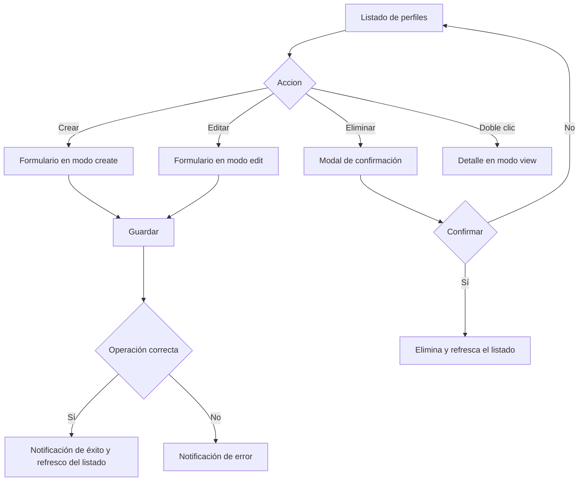

# Perfiles (Gestión de perfiles)

Documentación funcional y técnica de la pantalla de gestión de perfiles, dentro del módulo de Administración > Seguridad. Permite consultar, filtrar, crear, editar y eliminar los perfiles de la aplicación, así como asociarles las acciones a las que tienen acceso.

- **Ruta frontend:** `/administration/security/profiles`
- **Componentes:** `ProfileListComponent` (listado) y `ProfileFormComponent` (detalle / alta / edición)
- **Endpoint backend base:** `/api/v1/administration/security/profiles` (`ProfileController`)
- **Acceso:** el módulo exige `PROFILE_READ` y la escritura requiere `PROFILE_WRITE`; además `GET /references` se permite a usuarios con cualquiera de `USER_READ`, `USER_WRITE`, `PROFILE_READ` o `PROFILE_WRITE`

---

## 1. Requisitos

Identificadores locales de este documento: `RF-PRO-*` (requisitos funcionales) y `RNF-PRO-*` (requisitos no funcionales).

### 1.1. Requisitos funcionales

#### RF-PRO-1: Consulta paginada de perfiles

**Descripción:** el sistema debe permitir consultar los perfiles en un listado paginado y ordenable.

**Criterios de aceptación:**
- AC1.1: El listado muestra las columnas nombre, descripción, acciones y fecha de creación.
- AC1.2: Todas las columnas son ordenables (ascendente/descendente).
- AC1.3: La paginación permite navegar entre páginas y cambiar el tamaño de página.

#### RF-PRO-2: Búsqueda y filtrado

**Descripción:** el sistema debe permitir filtrar el listado por nombre.

**Criterios de aceptación:**
- AC2.1: El filtro de nombre aplica coincidencia parcial.
- AC2.2: Al aplicar el filtro, el listado vuelve a la primera página.
- AC2.3: La acción de limpiar restablece el filtro y recarga el listado completo.

#### RF-PRO-3: Alta de perfil

**Descripción:** un usuario con permiso de escritura debe poder crear nuevos perfiles.

**Criterios de aceptación:**
- AC3.1: El formulario exige nombre y permite definir una descripción y una colección de acciones.
- AC3.2: Un alta válida devuelve 201 y el nuevo perfil aparece en el listado.
- AC3.3: No se permiten acciones duplicadas dentro del mismo perfil.
- AC3.4: Tras el alta correcta se vuelve al listado y se recarga.

#### RF-PRO-4: Edición de perfil

**Descripción:** un usuario con permiso de escritura debe poder modificar los datos de un perfil existente.

**Criterios de aceptación:**
- AC4.1: Se puede cambiar el nombre y la descripción.
- AC4.2: Se puede reemplazar la lista de acciones asignadas.
- AC4.3: Una edición válida devuelve 200 y el cambio se refleja en el listado.

#### RF-PRO-5: Eliminación de perfil

**Descripción:** un usuario con permiso de escritura debe poder eliminar un perfil, con confirmación previa.

**Criterios de aceptación:**
- AC5.1: La eliminación solicita confirmación explícita mediante un modal.
- AC5.2: Una eliminación confirmada devuelve 204 y el perfil desaparece del listado.
- AC5.3: Cancelar la confirmación no elimina el perfil.
- AC5.4: Un perfil asignado a usuarios no puede eliminarse y devuelve error de uso.

#### RF-PRO-6: Detalle de perfil

**Descripción:** el sistema debe permitir consultar el detalle de un perfil en modo solo lectura.

**Criterios de aceptación:**
- AC6.1: El doble clic sobre una fila abre el detalle.
- AC6.2: El detalle muestra los datos generales y la lista de acciones asignadas.
- AC6.3: Se muestran también las fechas de creación y última modificación.

#### RF-PRO-7: Exportación a CSV

**Descripción:** el sistema debe permitir exportar el listado filtrado a un fichero CSV.

**Criterios de aceptación:**
- AC7.1: La exportación incluye todos los registros que cumplen los filtros activos, no solo la página visible.
- AC7.2: El fichero descargado sigue el patrón `profiles_YYYY-MM-DD.csv`.
- AC7.3: Si no hay filas que cumplan los filtros, se notifica que no hay datos que exportar.

### 1.2. Requisitos no funcionales

- **RNF-PRO-1 (Autorización):** el acceso requiere sesión y la acción `PROFILE_READ`; las operaciones de escritura requieren `PROFILE_WRITE`.
- **RNF-PRO-2 (Visibilidad de acciones):** los botones de crear, editar y eliminar solo se muestran a usuarios con `PROFILE_WRITE`.
- **RNF-PRO-3 (Integridad de permisos):** un perfil no puede contener acciones duplicadas y cada acción debe existir en el catálogo.
- **RNF-PRO-4 (Idioma):** todos los textos de la pantalla son traducibles (ES / EN) mediante el grupo i18n `profiles.*`.
- **RNF-PRO-5 (Feedback):** toda operación (crear, editar, eliminar, exportar, paginar) informa al usuario mediante notificaciones de progreso, éxito o error.

---

## 2. Parte funcional

### 2.1. Objetivo

Ofrecer a los administradores una pantalla para gestionar los perfiles de permisos del sistema:

- Consultar el listado paginado y filtrado de perfiles.
- Ver el detalle de un perfil con sus acciones asignadas.
- Crear, editar y eliminar perfiles.
- Asociar una lista de acciones a cada perfil.
- Exportar el listado filtrado a CSV.

### 2.2. Vistas de la pantalla

La pantalla gestiona cuatro modos de vista (`viewMode`) dentro del mismo componente:

| Modo | Descripción |
|------|-------------|
| `list` | Listado paginado con barra de filtros y barra de acciones |
| `detail` | Vista de solo lectura del perfil (incluye auditoría) |
| `create` | Formulario de alta de perfil |
| `edit` | Formulario de edición de perfil |

### 2.3. Patrón visual reutilizable y wireframes

La estructura visual base de esta pantalla se define en [layout.md](../../../03-technical/frontend/layout.md). Ese documento es la referencia canónica para los templates `List Screen`, `Form Screen` y `Confirmation Modal`; la documentación funcional del perfil solo describe cómo se aplican a la entidad concreta.

| Tipo de pantalla | Uso en perfiles | Estructura base |
|------------------|-----------------|-----------------|
| `List screen` | Listado principal | Cabecera, filtros, tabla, acciones y paginación |
| `Form screen` | Alta, edición y consulta en modo lectura | Encabezado, campos, validación, auditoría y pie de acciones |
| `Confirmation modal` | Eliminación | Mensaje de confirmación con aceptar/cancelar |

#### 2.3.1. Wireframe del `List screen`

```text
+------------------------------------------------------------------+
| Perfiles                                                         |
| [Crear] [Exportar]                                               |
+------------------------------------------------------------------+
| Filtro nombre | [Buscar] [Limpiar]                               |
+------------------------------------------------------------------+
| Nombre | Descripción | Acciones | Fecha creación                 |
|--------|-------------|----------|-------------------------------|
| ADMIN  | ...         | 12       | 2026-09-29                    |
| USER   | ...         | 8        | 2026-09-28                    |
+------------------------------------------------------------------+
| < 1 2 3 > | Registros por página: 10                           |
+------------------------------------------------------------------+
```

#### 2.3.2. Wireframe del `Form screen`

```text
+------------------------------------------------------------------+
| Crear perfil / Editar perfil                                      |
+------------------------------------------------------------------+
| Nombre * | [texto]                                               |
| Descripción | [textarea]                                         |
| Acciones asignadas | [multiselect]                               |
+------------------------------------------------------------------+
| [Guardar] [Cancelar]                                             |
+------------------------------------------------------------------+
```

#### 2.3.3. Wireframe del `Form screen` en modo lectura

```text
+------------------------------------------------------------------+
| Consultar perfil                                                  |
| [Volver] [Editar]                                                |
+------------------------------------------------------------------+
| Nombre | [ADMIN]                                                 |
| Descripción | [Perfil de administración]                         |
| Acciones asignadas | [12]                                         |
| Auditoría: Creado 2026-09-01 | Última modificación 2026-09-15    |
+------------------------------------------------------------------+
```

En perfiles, el `List screen` soporta filtrado por nombre, el `Form screen` integra la selección de acciones y el mismo `Form screen` en modo lectura muestra la auditoría y la relación con permisos. El patrón visual es equivalente al de usuarios y acciones, con campos y columnas específicos de cada entidad.

### 2.4. Listado

**Columnas de la tabla** (todas ordenables y reordenables):

| Columna | Clave i18n | Notas |
|---------|-----------|-------|
| Nombre | `profiles.fields.name` | Se muestra en negrita |
| Descripción | `profiles.fields.description` | Muestra `-` si está vacía |
| Acciones | `profiles.fields.actions` | Cuenta el número de acciones asignadas |
| Fecha de creación | `profiles.fields.createdAt` | Formateado con `localDate` |

**Filtros disponibles:**

| Filtro | Tipo | `data-testid` |
|--------|------|---------------|
| Nombre | Texto (coincidencia parcial) | `filter-name` |

**Barra de acciones:**

| Acción | Condición de disponibilidad | `data-testid` |
|--------|-----------------------------|---------------|
| Crear | Requiere `PROFILE_WRITE` | `btn-create` |
| Editar | Requiere `PROFILE_WRITE` y una fila seleccionada | `btn-edit` |
| Eliminar | Requiere `PROFILE_WRITE` y una fila seleccionada | `btn-delete` |
| Exportar CSV | Siempre disponible | `btn-export` |

- La selección de una fila alterna (seleccionar / deseleccionar).
- El doble clic sobre una fila abre la vista de detalle.
- La exportación a CSV incluye **todos los registros que cumplen los filtros activos**, no solo la página actual.

### 2.4. Identificadores para pruebas (`data-testid`)

| Elemento | `data-testid` |
| --- | --- |
| Formulario de filtros | `profiles-filter-form` |
| Filtro de nombre | `filter-name` |
| Tabla de perfiles | `profiles-table` |
| Botón Crear | `btn-create` |
| Botón Editar | `btn-edit` |
| Botón Eliminar | `btn-delete` |
| Botón Exportar CSV | `btn-export` |

### 2.5. Formulario de perfil

**Campos:**

| Campo | Obligatorio | Notas |
|-------|-------------|-------|
| Nombre | Sí | Requerido en alta y edición |
| Descripción | No | Texto libre opcional |
| Acciones asignadas | No | Multi-selección de acciones a través de `TpSelectedActionsComponent` |

**Información de auditoría** (solo en modo detalle, solo lectura): fecha de creación y última modificación.

### 2.6. Validaciones funcionales

| Campo | Regla |
|-------|-------|
| Nombre | Obligatorio |
| Descripción | Opcional |
| Acciones | Deben ser únicas y existir en el catálogo |

### 2.7. Diagramas

#### 2.7.1. Flujo de operaciones CRUD



### 2.8. Mensajes y notificaciones

- Las operaciones de crear, editar, eliminar, exportar y paginar muestran notificaciones de progreso, éxito o error mediante el `NotificationService` (claves `notification.*`).
- La eliminación solicita confirmación mediante un modal con el mensaje `profiles.delete.confirmMessage`, que incluye el nombre del perfil y advierte de que la acción no se puede deshacer.

---

## 3. Parte técnica

### 3.1. Componentes afectados

| Capa | Elemento | Responsabilidad |
|------|----------|-----------------|
| Frontend | `ProfileListComponent` | Listado, filtros, paginación, orden, exportación y orquestación de vistas. |
| Frontend | `ProfileFormComponent` | Alta, edición y detalle de un perfil. |
| Frontend | `ProfileService` | Llamadas CRUD y carga de referencias de acciones asociadas. |
| Frontend | `TpDataTableComponent` | Tabla reutilizable para ordenación, paginación y selección. |
| Frontend | `TpSelectedActionsComponent` | Selección multi-acción del perfil en el formulario. |
| Frontend | `AuthService` | Comprobación de permisos del usuario antes de acceder al módulo. |
| Backend | `ProfileController` | Exposición de endpoints CRUD y de referencias de perfiles. |
| Backend | `ProfileService` | Lógica de negocio, validaciones y persistencia del perfil. |
| Domain | `Profile` | Entidad principal del rol de usuario y asociación con acciones. |
| Domain | `Action` | Entidad de permisos que se vincula al perfil mediante relación muchos a muchos. |
| Security | `SecurityConfig` | Reglas de autorización y protección de rutas del módulo de perfiles. |

### 3.2. Modelos de datos

#### Frontend (TypeScript)

```typescript
interface Profile {
  id: number | null;
  name: string;
  description: string | null;
  actions?: Action[];
  actionIds?: number[];
  createdAt?: string | null;
  lastModifiedAt?: string | null;
}

interface ProfileCriteria {
  name?: string;
}
```

#### Backend DTOs (Java)

```java
public record ProfileDTO(
    Long id,
    String name,
    String description,
    List<Long> actionIds,
    OffsetDateTime createdAt,
    OffsetDateTime lastModifiedAt
) {}

public record ProfileCriteria(
    String name
) {}
```

#### Entidades JPA

```java
@Entity
@Table(name = "profile")
public class Profile extends BaseEntity {
    @Column(nullable = false, unique = true)
    private String name;

    private String description;

    @ManyToMany
    @JoinTable(
        name = "profile_action",
        joinColumns = @JoinColumn(name = "profile_id"),
        inverseJoinColumns = @JoinColumn(name = "action_id")
    )
    private List<Action> actions = new ArrayList<>();
}
```

### 3.3. Endpoints

Ruta base: `/api/v1/administration/security/profiles`.

| Método y ruta | Descripción | Respuesta |
|---------------|-------------|-----------|
| `GET /references` | Lista ligera de perfiles para selectores (`id`, `name`) | 200 OK con lista de referencias |
| `GET /` | Listado paginado con filtros (`name`) y `Pageable` | 200 OK con página de perfiles |
| `GET /count` | Número de perfiles que cumplen los filtros | 200 OK con el total |
| `GET /{id}` | Perfil por identificador | 200 OK con el perfil |
| `POST /` | Alta de perfil (`id` nulo) | 201 Created con el perfil creado |
| `PUT /{id}` | Actualización de perfil | 200 OK con el perfil actualizado |
| `DELETE /{id}` | Eliminación de perfil | 204 No Content |

Datos de referencia consumidos por el formulario:

- Acciones: `GET /api/v1/administration/security/actions` (o la referencia equivalente de acciones del sistema)

### 3.4. Validaciones

- El nombre del perfil es obligatorio y debe cumplir la regla de unicidad en el catálogo de perfiles.
- La descripción es opcional, pero si se informa debe cumplir la longitud y el formato requerido por el backend.
- La relación con acciones debe referenciar IDs válidos que existan en el catálogo de permisos.
- La operación de borrado se rechaza si el perfil está asociado a usuarios activos o si el backend detecta un uso en curso (`EntityInUseException`).

### 3.5. Exportación

- El botón de exportación funciona igual que en el resto de pantallas del módulo: está siempre disponible y exporta la totalidad de registros que cumplen los filtros activos.
- Para construir el CSV se reutiliza la misma consulta del listado contra los mismos métodos backend (`GET /` y `GET /count`) con los filtros activos.
- La exportación incluye **todos los registros que cumplen los filtros activos**, no solo la página visible en pantalla.
- Si no existen filas coincidentes, la UI informa del caso y evita generar un archivo vacío.

### 3.6. Paginación, orden y filtros

- La paginación y el orden se envían como parámetros `page`, `size` y `sort` (formato `campo,dirección`).
- El filtro de nombre se envía solo si existe valor no vacío.
- La ordenación de la columna `actions` se resuelve en cliente, porque es un contador derivado de la relación y no existe como propiedad JPA ordenable del backend.

### 3.7. Seguridad y permisos

- El acceso a la administración de perfiles se protege en `SecurityConfig` con `GET /api/v1/administration/security/profiles/**` usando `hasAnyAuthority("PROFILE_READ", "PROFILE_WRITE")`, y `POST/PUT/DELETE` con `hasAuthority("PROFILE_WRITE")`.
- El endpoint `GET /references` se habilita con cualquiera de `USER_READ`, `USER_WRITE`, `PROFILE_READ` o `PROFILE_WRITE`, porque se usa como catálogo de selección para formularios y filtros.
- Las acciones de crear, editar y eliminar solo se muestran si el usuario posee la acción `PROFILE_WRITE` (`canWrite`).
- Cuando se intenta borrar un perfil con usuarios asociados, el backend lanza una excepción de tipo `EntityInUseException` y la operación se rechaza.
- La duplicación de acciones dentro de un perfil se valida en backend para evitar inconsistencias de permisos.

### 3.8. Reglas de comportamiento relevantes

- En creación y edición, el formulario admite nombre, descripción y selección de acciones.
- En detalle, el formulario pasa a modo de solo lectura y muestra la auditoría.
- Al guardar, el payload se envía como `{ id, name, description, actionIds }`.
- En edición, la lista de acciones se reemplaza completa, no se fusiona.
- Tras crear o actualizar con éxito, la aplicación vuelve al listado y lo recarga.
- La eliminación es irreversible y siempre requiere confirmación explícita del usuario.

---

## 4. Pruebas

### 4.1. Cobertura unitaria (backend)

La suite actual incluye pruebas del servicio y del controlador que cubren el CRUD, validaciones de negocio y la relación con las acciones asignadas:

| Ubicación | Alcance |
|-----------|---------|
| `template/core/src/test/java/org/myorganization/template/core/service/ProfileServiceTest.java` | Alta, consulta, búsqueda por criterios, actualización, borrado, validación de acciones duplicadas y gestión de perfiles en uso |
| `template/webapp/src/test/java/org/myorganization/template/webapp/controller/ProfileControllerTest.java` | Respuestas HTTP de los endpoints, filtros y propagación de excepciones del servicio |

Estas pruebas cubren la lógica principal del módulo y complementan la validación E2E del frontend.

### 4.2. Cobertura unitaria (frontend)

| Ubicación | Alcance |
|-----------|---------|
| `profile-list.component.spec.ts` | Estado de listado, filtros, paginación y acciones |
| `profile-form.component.spec.ts` | Modos del formulario y emisión de eventos |
| `profile.service.spec.ts` | Construcción de peticiones CRUD y parámetros |

### 4.3. Cobertura E2E (Playwright)

Ubicación: `dashboard/e2e/tests/administration/profiles.spec.ts` (Page Object en `dashboard/e2e/pages/profiles.page.ts`).

| Caso | Descripción | Resultado esperado |
|------|-------------|--------------------|
| Listar perfiles | Acceder a la pantalla tras iniciar sesión | La tabla es visible, hay al menos una fila y se muestran filtros y el botón de crear |
| Buscar por nombre | Filtrar por un nombre existente y por uno inexistente | El listado muestra la fila coincidente; con un término sin coincidencias queda vacío |
| Crear perfil | Alta desde el formulario con datos válidos | El backend responde 201, se vuelve al listado y el nuevo perfil aparece al buscarlo |
| Editar perfil | Seleccionar un perfil y modificar sus datos | El backend responde 200 y el cambio se refleja en el listado |
| Eliminar perfil | Seleccionar un perfil y confirmar el borrado | El backend responde 204 y el perfil deja de aparecer al buscarlo |
| Exportar CSV | Pulsar el botón de exportar | El navegador descarga el fichero `profiles_YYYY-MM-DD.csv` |

- Cada test inicia sesión con un usuario administrador (acciones `PROFILE_READ` y `PROFILE_WRITE`) y navega directamente a `/administration/security/profiles`.
- Los casos de creación y edición insertan un registro en el backend por ejecución; el caso de eliminación borra el perfil que él mismo crea.
- La exportación a CSV depende de que existan filas que cumplan los filtros activos; en caso contrario se notifica que no hay datos que exportar.

### 4.4. Datos de prueba

Definidos en `dashboard/e2e/fixtures/test-data.ts`: `testProfiles.valid` y helpers para crear perfiles con nombre único por ejecución.

### 4.5. Dependencias de ejecución

- Los casos E2E de listar, buscar, crear, editar, eliminar y exportar requieren el backend de integración levantado (por defecto en `http://localhost:8080`).
- Los casos de creación y edición insertan un registro en el backend por ejecución; el caso de eliminación borra el perfil que él mismo crea.
- La exportación a CSV depende de que existan filas que cumplan los filtros activos; en caso contrario se notifica que no hay datos que exportar.

---

## Referencias

- [Requisitos](../../../specification/requirements.md)
- [Glosario](../../../specification/glossary.md)
- [Modelo de datos](../../../specification/data-model.md)
- [Módulo Seguridad](./security.md)
- [Autenticación y Gestión de Sesión](../../login/authentication.md)
- [Seguridad (backend)](../../../03-technical/backend/security.md)
- [API (backend)](../../../03-technical/backend/api.md)
- [Diseño (frontend)](../../../03-technical/frontend/design-system.md)
