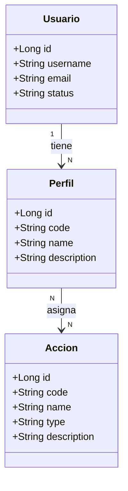

# Seguridad

Documentación funcional de los módulos de administración y seguridad.

## Módulos

- [Usuarios](./users.md)
- [Perfiles](./profiles.md)
- [Acciones](./actions.md)

## Descripción

Estos documentos describen el comportamiento funcional y técnico de las pantallas del área de Seguridad dentro de Administración:

- gestión de usuarios,
- gestión de perfiles,
- catálogo de acciones y permisos del sistema.

## Modelo de entidades

El módulo de seguridad centraliza la autorización y la identidad del sistema. Las entidades principales son:

- `Usuario`: identifica al sujeto autenticado y puede pertenecer a uno o varios perfiles.
- `Perfil`: agrupa un conjunto de permisos y se asigna a los usuarios para controlar accesos.
- `Acción`: representa un permiso o capacidad del sistema, con un código técnico y un tipo (`READ`, `WRITE`, `EXECUTE`).

### Relación de negocio

- Un usuario puede tener varios perfiles y cada perfil agrupa permisos.
- Una acción se reutiliza como permiso a nivel funcional en la autorización del sistema.
- El catálogo de acciones se gestiona como conjunto semilla, no como CRUD abierto para creación o borrado.

### Documentación asociada

- [Usuarios](./users.md)
- [Perfiles](./profiles.md)
- [Acciones](./actions.md)
