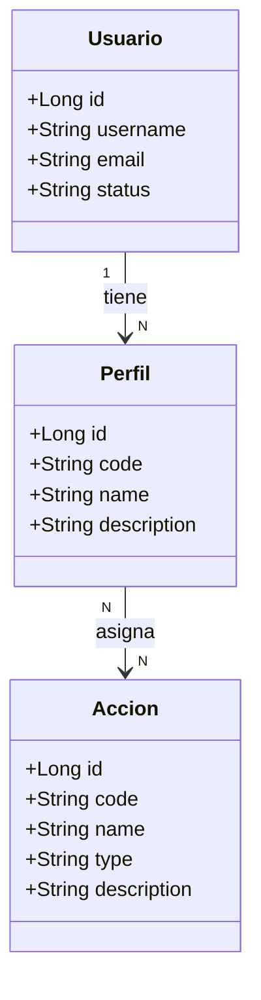

# Seguridad

Documentación funcional de los módulos de administración y seguridad. Estos documentos describen el comportamiento funcional y técnico de las pantallas del área de Seguridad dentro de Administración:

- gestión de usuarios,
- gestión de perfiles,
- catálogo de acciones y permisos del sistema.

## Conceptos clave

| Concepto | Descripción |
|-----------|---------|
| Usuario | Identidad autenticada del sistema, asociada a un o varios perfiles. |
| Perfil | Agrupación funcional de permisos que define qué puede hacer un usuario. |
| Acción | Permiso granular del sistema con código técnico y tipo de operación. |
| Autorización | Validación de accesos en frontend y backend basada en acciones y perfiles. |


## Modelo de entidades

El módulo de seguridad centraliza la autorización y la identidad del sistema. Las entidades principales son:

- `Usuario`: identifica al sujeto autenticado y puede pertenecer a uno o varios perfiles.
- `Perfil`: agrupa un conjunto de permisos y se asigna a los usuarios para controlar accesos.
- `Acción`: representa un permiso o capacidad del sistema, con un código técnico y un tipo (`READ`, `WRITE`, `EXECUTE`).



### Relación de negocio

- Un usuario puede tener varios perfiles y cada perfil agrupa permisos.
- Una acción se reutiliza como permiso a nivel funcional en la autorización del sistema.
- El catálogo de acciones se gestiona como conjunto semilla, no como CRUD abierto para creación o borrado.

## Seguridad

Permisos principales del módulo:

- `USER_READ`: consulta de usuarios y su estado.
- `USER_WRITE`: creación, edición y baja de usuarios, así como gestión de perfiles asociados.
- `PROFILE_READ`: consulta de perfiles y su composición.
- `PROFILE_WRITE`: creación, edición y eliminación de perfiles y su relación con acciones.
- `ACTION_READ`: consulta del catálogo de acciones del sistema.

Estos permisos se usan para ocultar o mostrar rutas, menús y acciones en la capa frontend y para validar el acceso en la API con Spring Security. El acceso a perfiles y usuarios se realiza siempre sobre la identidad autenticada del usuario actual y el conjunto de acciones derivadas de sus perfiles.

## Navegación

```
Administración > Seguridad > Acciones
Administración > Seguridad > Perfiles
Administración > Seguridad > Usuarios
```

## Pantallas

| Pantalla | Tipo | Descripción |
|---------------|-------------|-----------|
| [Usuarios](./users.md) | Pagina |  |
| [Perfiles](./profiles.md) | Pagina |  |
| [Acciones](./actions.md) | Pagina |  |

## Referencias

- [Requisitos](../../../specification/requirements.md)
- [Glosario](../../../specification/glossary.md)
- [Modelo de datos](../../../specification/data-model.md)
- [Autenticación y Gestión de Sesión](../../login/authentication.md)
- [Seguridad (backend)](../../../03-technical/backend/security.md)
- [Módulo Administración](../administration.md)
