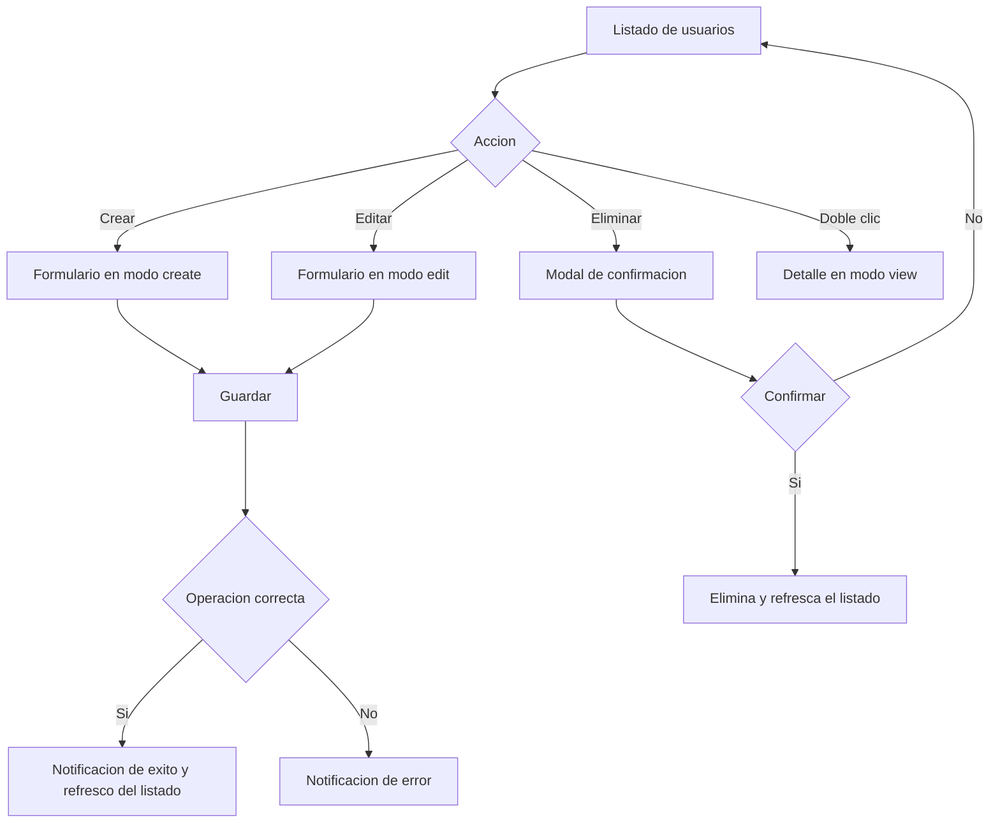

# Usuarios (Gestión de usuarios)

Documentación funcional y técnica de la pantalla de gestión de usuarios, dentro del módulo de Administración > Seguridad. Permite consultar, filtrar, crear, editar y eliminar los usuarios de la aplicación, así como asignarles un perfil y los informes a los que tienen acceso.

- **Ruta frontend:** `/administration/security/users`
- **Componentes:** `UserListComponent` (listado) y `UserFormComponent` (detalle / alta / edición)
- **Endpoint backend base:** `/api/v1/administration/security/users` (`UserController`)
- **Acceso:** requiere sesión y la acción `USER_READ`; las operaciones de escritura requieren `USER_WRITE`

---

## 1. Requisitos

Identificadores locales de este documento: `RF-USR-*` (requisitos funcionales) y `RNF-USR-*` (requisitos no funcionales).

### 1.1. Requisitos funcionales

#### RF-USR-1: Consulta paginada de usuarios

**Descripción:** el sistema debe permitir consultar los usuarios en un listado paginado y ordenable.

**Criterios de aceptación:**
- AC1.1: El listado muestra las columnas usuario, nombre, apellidos, email, perfil y último acceso.
- AC1.2: Todas las columnas son ordenables (ascendente/descendente).
- AC1.3: La paginación permite navegar entre páginas y cambiar el tamaño de página.

#### RF-USR-2: Búsqueda y filtrado

**Descripción:** el sistema debe permitir filtrar el listado por usuario, nombre y perfil.

**Criterios de aceptación:**
- AC2.1: Los filtros de usuario y nombre aplican coincidencia parcial.
- AC2.2: El filtro de perfil permite seleccionar un perfil concreto o todos.
- AC2.3: Al aplicar un filtro, el listado vuelve a la primera página.
- AC2.4: La acción de limpiar restablece todos los filtros y recarga el listado completo.

#### RF-USR-3: Alta de usuario

**Descripción:** un usuario con permiso de escritura debe poder crear nuevos usuarios.

**Criterios de aceptación:**
- AC3.1: El formulario exige usuario, contraseña y perfil.
- AC3.2: Un alta válida devuelve 201 y el nuevo usuario aparece en el listado.
- AC3.3: El email, cuando se informa, debe tener formato válido.
- AC3.4: Tras el alta correcta se vuelve al listado y se recarga.

#### RF-USR-4: Edición de usuario

**Descripción:** un usuario con permiso de escritura debe poder modificar los datos de un usuario existente.

**Criterios de aceptación:**
- AC4.1: El campo usuario es de solo lectura en edición (identidad inmutable).
- AC4.2: La contraseña no es obligatoria en edición.
- AC4.3: Una edición válida devuelve 200 y el cambio se refleja en el listado.

#### RF-USR-5: Eliminación de usuario

**Descripción:** un usuario con permiso de escritura debe poder eliminar un usuario, con confirmación previa.

**Criterios de aceptación:**
- AC5.1: La eliminación solicita confirmación explícita mediante un modal.
- AC5.2: Una eliminación confirmada devuelve 204 y el usuario desaparece del listado.
- AC5.3: Cancelar la confirmación no elimina el usuario.

#### RF-USR-6: Detalle de usuario

**Descripción:** el sistema debe permitir consultar el detalle de un usuario en modo solo lectura.

**Criterios de aceptación:**
- AC6.1: El doble clic sobre una fila abre el detalle.
- AC6.2: El detalle muestra la información de auditoría (último acceso, creación, última modificación).
- AC6.3: La contraseña se muestra enmascarada.

#### RF-USR-7: Exportación a CSV

**Descripción:** el sistema debe permitir exportar el listado filtrado a un fichero CSV.

**Criterios de aceptación:**
- AC7.1: La exportación incluye todos los registros que cumplen los filtros activos, no solo la página visible.
- AC7.2: El fichero descargado se llama `users.csv`.
- AC7.3: Si no hay filas que cumplan los filtros, se notifica que no hay datos que exportar.

### 1.2. Requisitos no funcionales

- **RNF-USR-1 (Autorización):** el acceso requiere sesión y la acción `USER_READ`; las operaciones de escritura requieren `USER_WRITE`.
- **RNF-USR-2 (Visibilidad de acciones):** los botones de crear, editar y eliminar solo se muestran a usuarios con `USER_WRITE`.
- **RNF-USR-3 (Seguridad de credenciales):** la contraseña nunca se muestra en claro ni se devuelve en las respuestas del backend.
- **RNF-USR-4 (Idioma):** todos los textos de la pantalla son traducibles (ES / EN) mediante el grupo i18n `users.*`.
- **RNF-USR-5 (Feedback):** toda operación (crear, editar, eliminar, exportar, paginar) informa al usuario mediante notificaciones de progreso, éxito o error.

---

## 2. Parte funcional

### 2.1. Objetivo

Ofrecer a los administradores una pantalla completa para administrar los usuarios del sistema:

- Consultar el listado paginado y filtrado de usuarios.
- Ver el detalle de un usuario, incluyendo su información de auditoría.
- Crear, editar y eliminar usuarios.
- Asignar un perfil y una lista de informes a cada usuario.
- Exportar el listado filtrado a CSV.

### 2.2. Vistas de la pantalla

La pantalla gestiona cuatro modos de vista (`viewMode`) dentro del mismo componente:

| Modo | Descripción |
|------|-------------|
| `list` | Listado paginado con barra de filtros y barra de acciones |
| `detail` | Vista de solo lectura de un usuario (incluye auditoría) |
| `create` | Formulario de alta de usuario |
| `edit` | Formulario de edición de usuario |

### 2.3. Patrón visual reutilizable y wireframes

La estructura visual base de esta pantalla se define en [layout.md](../../../03-technical/frontend/layout.md). Ese documento es la fuente única de verdad para los templates `List Screen`, `Form Screen` y `Confirmation Modal`; la documentación funcional de usuarios solo describe cómo se aplica ese patrón a la entidad concreta.

| Tipo de pantalla | Uso en usuarios | Estructura base |
|------------------|-----------------|-----------------|
| `List screen` | Listado principal | Cabecera, filtros, tabla, acciones y paginación |
| `Form screen` | Alta, edición y consulta en modo lectura | Encabezado, campos, validación, auditoría y pie de acciones |
| `Confirmation modal` | Eliminación | Mensaje de confirmación con aceptar/cancelar |

#### 2.3.1. Wireframe del `List screen`

```text
+------------------------------------------------------------------+
| Usuarios                                                          |
| [Crear] [Exportar]                                                |
+------------------------------------------------------------------+
| Filtro usuario | Filtro nombre | Filtro perfil | [Buscar] [Limpiar] |
+------------------------------------------------------------------+
| Usuario | Nombre | Apellidos | Email | Perfil | Último acceso     |
|-------- |--------|-----------|-------|--------|------------------|
| admin   | Admin  | User      | ...   | ADMIN  | 2026-09-29       |
| tester  | Test   | User      | ...   | USER   | 2026-09-28       |
+------------------------------------------------------------------+
| < 1 2 3 > | Registros por página: 10                            |
+------------------------------------------------------------------+
```

#### 2.3.2. Wireframe del `Form screen`

```text
+------------------------------------------------------------------+
| Crear usuario / Editar usuario                                     |
+------------------------------------------------------------------+
| Usuario * | [texto]          | Perfil * | [select]                |
| Contraseña | [texto]        | Email    | [texto]                  |
| Nombre    | [texto]         | Apellidos| [texto]                  |
| Informes asignados | [multiselect]                               |
+------------------------------------------------------------------+
| [Guardar] [Cancelar]                                             |
+------------------------------------------------------------------+
```

#### 2.3.3. Wireframe del `Form screen` en modo lectura

```text
+------------------------------------------------------------------+
| Consultar usuario                                                 |
| [Volver] [Editar]                                                |
+------------------------------------------------------------------+
| Usuario | [admin]                                                 |
| Nombre  | [Admin]                                                 |
| Email   | [admin@domain.com]                                      |
| Perfil  | [ADMIN]                                                 |
| Informes asignados | [3]                                          |
| Auditoría: Creado 2026-09-01 | Última modificación 2026-09-15   |
+------------------------------------------------------------------+
```

La pantalla de usuarios usa `List screen` para la consulta, `Form screen` para alta y edición, y el mismo `Form screen` en modo solo lectura para la vista de detalle. El patrón visual es el mismo que el de perfiles y acciones, con variaciones en columnas, filtros y campos según la entidad.

### 2.4. Listado

**Columnas de la tabla** (todas ordenables y reordenables):

| Columna | Clave i18n | Notas |
|---------|-----------|-------|
| Usuario | `users.fields.username` | — |
| Nombre | `users.fields.firstName` | — |
| Apellidos | `users.fields.lastName` | — |
| Email | `users.fields.email` | — |
| Perfil | `users.fields.profile` | Se muestra como etiqueta (badge) |
| Último acceso | `users.fields.lastAccess` | Formateado con `localDate` |

**Filtros disponibles:**

| Filtro | Tipo | `data-testid` |
|--------|------|---------------|
| Usuario | Texto (coincidencia parcial) | `filter-username` |
| Nombre | Texto (coincidencia parcial) | `filter-firstName` |
| Perfil | Selección (todos por defecto) | `filter-profile` |

**Barra de acciones:**

| Acción | Condición de disponibilidad | `data-testid` |
|--------|-----------------------------|---------------|
| Crear | Requiere `USER_WRITE` | `btn-create` |
| Editar | Requiere `USER_WRITE` y una fila seleccionada | `btn-edit` |
| Eliminar | Requiere `USER_WRITE` y una fila seleccionada | `btn-delete` |
| Exportar CSV | Siempre disponible | `btn-export` |

- La selección de una fila alterna (seleccionar / deseleccionar).
- El doble clic sobre una fila abre la vista de detalle.
- La exportación a CSV incluye **todos los registros que cumplen los filtros activos**, no solo la página actual.

### 2.4. Identificadores para pruebas (`data-testid`)

| Elemento | `data-testid` |
| --- | --- |
| Formulario de filtros | `users-filter-form` |
| Filtro de usuario | `filter-username` |
| Filtro de nombre | `filter-firstName` |
| Filtro de perfil | `filter-profile` |
| Tabla de usuarios | `users-table` |
| Botón Crear | `btn-create` |
| Botón Editar | `btn-edit` |
| Botón Eliminar | `btn-delete` |
| Botón Exportar CSV | `btn-export` |

### 2.5. Formulario de usuario

**Campos:**

| Campo | Obligatorio | Notas |
|-------|-------------|-------|
| Usuario | Sí | No editable en modo edición (solo alta) |
| Contraseña | Solo en alta | En modo detalle se muestra enmascarada |
| Email | No | Validación de formato email |
| Nombre | No | — |
| Apellidos | No | — |
| Perfil | Sí | Selección de un perfil existente |
| Informes asignados | No | Multi-selección de informes |

**Información de auditoría** (solo en modo detalle, solo lectura): último acceso, fecha de creación y última modificación.

### 2.6. Validaciones funcionales

| Campo | Regla |
|-------|-------|
| Usuario | Obligatorio en alta; inmutable en edición |
| Contraseña | Obligatoria únicamente al crear un usuario |
| Perfil | Obligatorio |
| Email | Formato de email cuando se informa |

### 2.7. Diagramas

#### 2.7.1. Flujo de operaciones CRUD



### 2.8. Mensajes y notificaciones

- Las operaciones de crear, editar, eliminar, exportar y paginar muestran notificaciones de progreso, éxito o error mediante el `NotificationService` (claves `notification.*`).
- La eliminación solicita confirmación mediante un modal con el mensaje `users.delete.confirmMessage`, que incluye el nombre del usuario y advierte de que la acción no se puede deshacer.

---

## 3. Parte técnica

### 3.1. Componentes afectados

| Capa | Elemento | Responsabilidad |
|------|----------|-----------------|
| Frontend | `UserListComponent` | Listado, filtros, paginación, orden, exportación y orquestación de vistas. |
| Frontend | `UserFormComponent` | Alta, edición y detalle de un usuario. |
| Frontend | `UserService` | Llamadas CRUD y carga de datos de referencia como perfiles e informes. |
| Frontend | `TpDataTableComponent` | Tabla reutilizable para ordenación, paginación y selección. |
| Frontend | `AuthService` | Comprobación de permisos por acción y acceso según el perfil activo. |
| Backend | `UserController` | Exposición de endpoints CRUD y `/me` para autoservicio del usuario. |
| Backend | `UserService` | Lógica de negocio, validación y persistencia del usuario. |
| Domain | `User` | Entidad principal del sistema con perfil, credenciales y relaciones asociadas. |
| Domain | `User2Report` | Relación entre usuarios e informes visibles para cada perfil. |
| Security | `SecurityConfig` | Reglas de autorización y protección de rutas del módulo de usuarios. |

### 3.2. Modelos de datos

#### Frontend (TypeScript)

```typescript
interface UserDTO {
  id: number | null;
  username: string;
  password?: string;
  firstName: string | null;
  lastName: string | null;
  email: string | null;
  profileId: number | null;
  profileName?: string;
  reportIds: number[];
  lastAccess: string | null;
  createdAt: string | null;
  lastModifiedAt: string | null;
}

interface UserCriteria {
  username?: string;
  firstName?: string;
  lastName?: string;
  email?: string;
  profileId?: number;
}
```

#### Backend DTOs (Java)

```java
public record UserDTO(
    Long id,
    String username,
    String password,
    String firstName,
    String lastName,
    String email,
    OffsetDateTime lastAccess,
    Long profileId,
    String profileName,
    List<Long> reportIds,
    OffsetDateTime createdAt,
    OffsetDateTime lastModifiedAt
) {}

public record UserCriteria(
    String username,
    String firstName,
    String lastName,
    String email,
    Long profileId
) {}
```

#### Entidades JPA

```java
@Entity
@Table(name = "user")
public class User extends BaseEntity {
    @Column(nullable = false, unique = true)
    private String username;

    @Column(nullable = false)
    private String password;

    @ManyToOne(fetch = FetchType.LAZY)
    @JoinColumn(name = "profile_id")
    private Profile profile;

    @OneToMany(mappedBy = "user")
    private List<User2Report> userReports = new ArrayList<>();
}
```

### 3.3. Endpoints

Ruta base: `/api/v1/administration/security/users`.

| Método y ruta | Descripción | Respuesta |
|---------------|-------------|-----------|
| `GET /` | Listado paginado con filtros (`username`, `firstName`, `lastName`, `email`, `profileId`) y `Pageable` | 200 OK con página de usuarios |
| `GET /count` | Número de usuarios que cumplen los filtros | 200 OK con el total |
| `GET /{id}` | Usuario por identificador | 200 OK con el usuario |
| `POST /` | Alta de usuario (`id` nulo) | 201 Created con el usuario creado |
| `PUT /{id}` | Actualización de usuario | 200 OK con el usuario actualizado |
| `DELETE /{id}` | Eliminación de usuario | 204 No Content |
| `GET /me` | Perfil del usuario autenticado | 200 OK |
| `PUT /me` | Autoservicio: actualiza nombre, apellidos y email del usuario autenticado | 200 OK |

Datos de referencia consumidos por el formulario y los filtros:

- Perfiles: `GET /api/v1/administration/security/profiles/references`.
- Informes: `GET /api/v1/reports/all`.

### 3.4. Validaciones

- El formulario valida que el campo `username` sea obligatorio en alta y que el valor no cambie en edición.
- La contraseña es obligatoria solo en creación; si el usuario no la modifica en edición, el backend conserva la existente.
- El `email` se valida con formato de correo cuando se informa, y el `perfil` debe apuntar a una entidad existente en el catálogo.
- Los informes asociados deben pertenecer a registros válidos del sistema; cualquier identificador inexistente se rechaza en backend.

### 3.5. Exportación

- La exportación reutiliza la consulta filtrada con un tamaño de página muy grande (`EXPORT_PAGE_SIZE = 100000`) para recuperar todas las filas y generar el CSV en cliente vía `CsvExportService`.
- El fichero generado mantiene el orden y los filtros activos, sin limitarse a la página visible en pantalla.
- Si no hay filas que cumplan los criterios, la UI informa al usuario y evita la descarga del archivo vacío.

### 3.6. Paginación, orden y filtros

- La paginación y el orden se envían como parámetros `page`, `size` y `sort` (formato `campo,dirección`).
- Los filtros vacíos no se envían al backend (`undefined`).

### 3.7. Seguridad y permisos

- El acceso a la ruta está protegido por `actionGuard` con las acciones `USER_READ`, `USER_WRITE`, `PROFILE_READ`, `PROFILE_WRITE`, `ACTION_READ` (basta una para acceder, lógica OR).
- Las acciones de crear, editar y eliminar solo se muestran si el usuario posee la acción `USER_WRITE` (`canWrite`).
- El campo `usuario` es inmutable una vez creado (solo editable en alta).
- La contraseña nunca se muestra: en modo detalle aparece enmascarada.

### 3.8. Reglas de comportamiento relevantes

- En **edición**, el campo usuario queda deshabilitado para preservar la identidad de la cuenta.
- En **alta**, la contraseña es obligatoria; en edición no se exige (se conserva si no se cambia según la lógica del backend).
- Tras crear o actualizar con éxito, la aplicación vuelve al listado y lo recarga.
- La eliminación es irreversible y siempre requiere confirmación explícita del usuario.

---

## 4. Pruebas

### 4.1. Cobertura unitaria (backend)

La suite actual incluye pruebas específicas del servicio y del controlador que cubren la lógica principal de la pantalla:

| Ubicación | Alcance |
|-----------|---------|
| `template/core/src/test/java/org/myorganization/template/core/service/UserServiceTest.java` | Validaciones de negocio, creación, consulta por ID y username, filtrado por criterios, actualización, borrado y asociaciones con perfiles e informes |
| `template/webapp/src/test/java/org/myorganization/template/webapp/controller/UserControllerTest.java` | Respuestas HTTP del endpoint, parámetros de consulta, autenticación del usuario actual y propagación de excepciones del servicio |

Estas pruebas cubren el flujo principal de usuarios y complementan la cobertura E2E del frontend, sin reemplazar la validación funcional end-to-end del comportamiento completo de la pantalla.

### 4.2. Cobertura unitaria (frontend)

| Ubicación | Alcance |
|-----------|---------|
| `user-list.component.spec.ts` | Estado de listado, filtros, paginación y acciones |
| `user-form.component.spec.ts` | Modos del formulario y emisión de eventos |
| `user.service.spec.ts` | Construcción de peticiones CRUD y parámetros |

### 4.3. Cobertura E2E (Playwright)

Ubicación: `dashboard/e2e/tests/administration/users.spec.ts` (Page Object en `dashboard/e2e/pages/users.page.ts`).

| Caso | Descripción | Resultado esperado |
|------|-------------|--------------------|
| Listar usuarios | Acceder a la pantalla tras iniciar sesión | La tabla es visible, hay al menos una fila y se muestran filtros y el botón de crear |
| Buscar por usuario | Filtrar por un usuario existente y por uno inexistente | El listado muestra la fila coincidente; con un término sin coincidencias queda vacío |
| Crear usuario | Alta desde el formulario con datos válidos | El backend responde 201, se vuelve al listado y el nuevo usuario aparece al buscarlo |
| Editar usuario | Seleccionar un usuario y modificar sus datos | El campo usuario es de solo lectura, el backend responde 200 y el cambio se refleja en el listado |
| Eliminar usuario | Seleccionar un usuario y confirmar el borrado | El backend responde 204 y el usuario deja de aparecer al buscarlo |
| Exportar CSV | Pulsar el botón de exportar | El navegador descarga el fichero `users.csv` |

- Cada test inicia sesión con un usuario administrador (acciones `USER_READ` y `USER_WRITE`) y navega directamente a `/administration/security/users`.
- La suite se ejecuta en modo `serial` para evitar contención en el backend al compartir el usuario administrador entre casos.
- Los casos de crear, editar y eliminar generan un `username` único por ejecución para poder reejecutarse sin colisiones; los de editar y eliminar crean previamente su propio usuario para trabajar de forma aislada.

### 4.4. Datos de prueba

Definidos en `dashboard/e2e/fixtures/test-data.ts`: `testUsers.valid` (credenciales del administrador) y `buildNewUser()` (genera los datos de un usuario nuevo con `username` único). Deben ajustarse al entorno de integración (perfil `test`).

### 4.5. Dependencias de ejecución

- Los casos E2E de listar, buscar, crear, editar, eliminar y exportar requieren el backend de integración levantado (por defecto en `http://localhost:8080`) con al menos un perfil de referencia disponible.
- Los casos de creación y edición insertan un registro en el backend por ejecución; el caso de eliminación borra el usuario que él mismo crea.
- La exportación a CSV depende de que existan filas que cumplan los filtros activos; en caso contrario se notifica que no hay datos que exportar.

---

## Referencias

- [Requisitos](../../../specification/requirements.md)
- [Glosario](../../../specification/glossary.md)
- [Modelo de datos](../../../specification/data-model.md)
- [Módulo Seguridad](./security.md)
- [Autenticación y Gestión de Sesión](../../login/authentication.md)
- [Seguridad (backend)](../../../03-technical/backend/security.md)
- [API (backend)](../../../03-technical/backend/api.md)
- [Diseño (frontend)](../../../03-technical/frontend/design-system.md)
