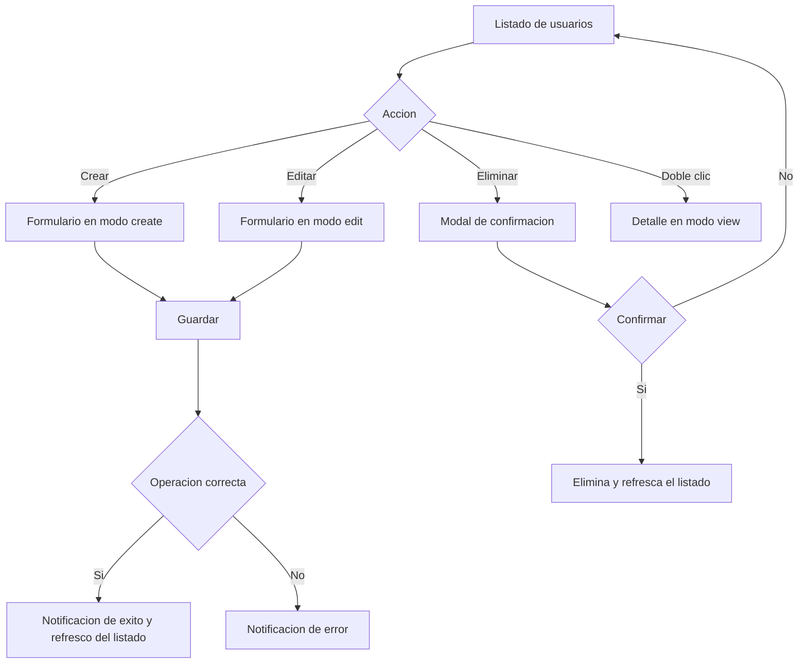

# Usuarios (Gestión de usuarios)

Documentación funcional y técnica de la pantalla de gestión de usuarios, dentro del módulo de Administración > Seguridad. Permite consultar, filtrar, crear, editar y eliminar los usuarios de la aplicación, así como asignarles un perfil y los informes a los que tienen acceso.

- **Ruta frontend:** `/administration/security/users`
- **Componentes:** `UserListComponent` (listado) y `UserFormComponent` (detalle / alta / edición)
- **Endpoint backend base:** `/api/v1/administration/security/users` (`UserController`)
- **Acceso:** requiere sesión y la acción `USER_READ`; las operaciones de escritura requieren `USER_WRITE`

---

## 1. Parte funcional

### 1.1. Objetivo

Ofrecer a los administradores una pantalla completa para administrar los usuarios del sistema:

- Consultar el listado paginado y filtrado de usuarios.
- Ver el detalle de un usuario, incluyendo su información de auditoría.
- Crear, editar y eliminar usuarios.
- Asignar un perfil y una lista de informes a cada usuario.
- Exportar el listado filtrado a CSV.

### 1.2. Vistas de la pantalla

La pantalla gestiona cuatro modos de vista (`viewMode`) dentro del mismo componente:

| Modo | Descripción |
|------|-------------|
| `list` | Listado paginado con barra de filtros y barra de acciones |
| `detail` | Vista de solo lectura de un usuario (incluye auditoría) |
| `create` | Formulario de alta de usuario |
| `edit` | Formulario de edición de usuario |

### 1.3. Listado

**Columnas de la tabla** (todas ordenables y reordenables):

| Columna | Clave i18n | Notas |
|---------|-----------|-------|
| Usuario | `users.fields.username` | — |
| Nombre | `users.fields.firstName` | — |
| Apellidos | `users.fields.lastName` | — |
| Email | `users.fields.email` | — |
| Perfil | `users.fields.profile` | Se muestra como etiqueta (badge) |
| Último acceso | `users.fields.lastAccess` | Formateado con `localDate` |

**Filtros disponibles:**

| Filtro | Tipo | `data-testid` |
|--------|------|---------------|
| Usuario | Texto (coincidencia parcial) | `filter-username` |
| Nombre | Texto (coincidencia parcial) | `filter-firstName` |
| Perfil | Selección (todos por defecto) | `filter-profile` |

**Barra de acciones:**

| Acción | Condición de disponibilidad | `data-testid` |
|--------|-----------------------------|---------------|
| Crear | Requiere `USER_WRITE` | `btn-create` |
| Editar | Requiere `USER_WRITE` y una fila seleccionada | `btn-edit` |
| Eliminar | Requiere `USER_WRITE` y una fila seleccionada | `btn-delete` |
| Exportar CSV | Siempre disponible | `btn-export` |

- La selección de una fila alterna (seleccionar / deseleccionar).
- El doble clic sobre una fila abre la vista de detalle.
- La exportación a CSV incluye **todos los registros que cumplen los filtros activos**, no solo la página actual.

### 1.4. Formulario de usuario

**Campos:**

| Campo | Obligatorio | Notas |
|-------|-------------|-------|
| Usuario | Sí | No editable en modo edición (solo alta) |
| Contraseña | Solo en alta | En modo detalle se muestra enmascarada |
| Email | No | Validación de formato email |
| Nombre | No | — |
| Apellidos | No | — |
| Perfil | Sí | Selección de un perfil existente |
| Informes asignados | No | Multi-selección de informes |

**Información de auditoría** (solo en modo detalle, solo lectura): último acceso, fecha de creación y última modificación.

### 1.5. Validaciones funcionales

| Campo | Regla |
|-------|-------|
| Usuario | Obligatorio en alta; inmutable en edición |
| Contraseña | Obligatoria únicamente al crear un usuario |
| Perfil | Obligatorio |
| Email | Formato de email cuando se informa |

### 1.6. Flujo de operaciones CRUD



### 1.7. Mensajes y notificaciones

- Las operaciones de crear, editar, eliminar, exportar y paginar muestran notificaciones de progreso, éxito o error mediante el `NotificationService` (claves `notification.*`).
- La eliminación solicita confirmación mediante un modal con el mensaje `users.delete.confirmMessage`, que incluye el nombre del usuario y advierte de que la acción no se puede deshacer.

---

## 2. Parte técnica

### 2.1. Componentes afectados

| Capa | Elemento | Responsabilidad |
|------|----------|-----------------|
| Frontend | `UserListComponent` | Listado, filtros, paginación, orden, exportación y orquestación de vistas |
| Frontend | `UserFormComponent` | Alta, edición y detalle de un usuario |
| Frontend | `UserService` | Llamadas CRUD y datos de referencia (perfiles, informes) |
| Frontend | `TpDataTableComponent` | Tabla reutilizable (orden, paginación, selección) |
| Frontend | `AuthService` | Comprobación de permisos (`hasAction`) |
| Backend | `UserController` | Endpoints CRUD y `/me` (autoservicio) |
| Backend | `UserService` (core) | Lógica de negocio y persistencia |

### 2.2. Modelo de datos (frontend)

```typescript
interface UserDTO {
  id: number | null;
  username: string;
  password?: string;
  firstName: string | null;
  lastName: string | null;
  email: string | null;
  profileId: number | null;
  profileName?: string;
  reportIds: number[];
  lastAccess: string | null;
  createdAt: string | null;
  lastModifiedAt: string | null;
}

interface UserCriteria {
  username?: string;
  firstName?: string;
  lastName?: string;
  email?: string;
  profileId?: number;
}
```

### 2.3. Endpoints del backend

Ruta base: `/api/v1/administration/security/users`.

| Método y ruta | Descripción | Respuesta |
|---------------|-------------|-----------|
| `GET /` | Listado paginado con filtros (`username`, `firstName`, `lastName`, `email`, `profileId`) y `Pageable` | 200 OK con página de usuarios |
| `GET /count` | Número de usuarios que cumplen los filtros | 200 OK con el total |
| `GET /{id}` | Usuario por identificador | 200 OK con el usuario |
| `POST /` | Alta de usuario (`id` nulo) | 201 Created con el usuario creado |
| `PUT /{id}` | Actualización de usuario | 200 OK con el usuario actualizado |
| `DELETE /{id}` | Eliminación de usuario | 204 No Content |
| `GET /me` | Perfil del usuario autenticado | 200 OK |
| `PUT /me` | Autoservicio: actualiza nombre, apellidos y email del usuario autenticado | 200 OK |

Datos de referencia consumidos por el formulario y los filtros:

- Perfiles: `GET /api/v1/administration/security/profiles/references`.
- Informes: `GET /api/v1/reports/all`.

### 2.4. Paginación, orden y filtros

- La paginación y el orden se envían como parámetros `page`, `size` y `sort` (formato `campo,dirección`).
- Los filtros vacíos no se envían al backend (`undefined`).
- La exportación reutiliza la consulta filtrada con un tamaño de página muy grande (`EXPORT_PAGE_SIZE = 100000`) para recuperar todas las filas y generar el CSV en cliente vía `CsvExportService`.

### 2.5. Seguridad y permisos

- El acceso a la ruta está protegido por `actionGuard` con las acciones `USER_READ`, `USER_WRITE`, `PROFILE_READ`, `PROFILE_WRITE`, `ACTION_READ` (basta una para acceder, lógica OR).
- Las acciones de crear, editar y eliminar solo se muestran si el usuario posee la acción `USER_WRITE` (`canWrite`).
- El campo `usuario` es inmutable una vez creado (solo editable en alta).
- La contraseña nunca se muestra: en modo detalle aparece enmascarada.

### 2.6. Reglas de comportamiento relevantes

- En **edición**, el campo usuario queda deshabilitado para preservar la identidad de la cuenta.
- En **alta**, la contraseña es obligatoria; en edición no se exige (se conserva si no se cambia según la lógica del backend).
- Tras crear o actualizar con éxito, la aplicación vuelve al listado y lo recarga.
- La eliminación es irreversible y siempre requiere confirmación explícita del usuario.

---

## 3. Pruebas

### 3.1. Cobertura E2E (Playwright)

Ubicación: `dashboard/e2e/tests/administration/users.spec.ts` (Page Object en `dashboard/e2e/pages/users.page.ts`).

| Caso | Descripción | Resultado esperado |
|------|-------------|--------------------|
| Listar usuarios | Acceder a la pantalla tras iniciar sesión | La tabla es visible, hay al menos una fila y se muestran filtros y el botón de crear |
| Buscar por usuario | Filtrar por un usuario existente y por uno inexistente | El listado muestra la fila coincidente; con un término sin coincidencias queda vacío |
| Crear usuario | Alta desde el formulario con datos válidos | El backend responde 201, se vuelve al listado y el nuevo usuario aparece al buscarlo |
| Editar usuario | Seleccionar un usuario y modificar sus datos | El campo usuario es de solo lectura, el backend responde 200 y el cambio se refleja en el listado |
| Eliminar usuario | Seleccionar un usuario y confirmar el borrado | El backend responde 204 y el usuario deja de aparecer al buscarlo |
| Exportar CSV | Pulsar el botón de exportar | El navegador descarga el fichero `users.csv` |

- Cada test inicia sesión con un usuario administrador (acciones `USER_READ` y `USER_WRITE`) y navega directamente a `/administration/security/users`.
- La suite se ejecuta en modo `serial` para evitar contención en el backend al compartir el usuario administrador entre casos.
- Los casos de crear, editar y eliminar generan un `username` único por ejecución para poder reejecutarse sin colisiones; los de editar y eliminar crean previamente su propio usuario para trabajar de forma aislada.

### 3.2. Cobertura unitaria (frontend)

| Ubicación | Alcance |
|-----------|---------|
| `user-list.component.spec.ts` | Estado de listado, filtros, paginación y acciones |
| `user-form.component.spec.ts` | Modos del formulario y emisión de eventos |
| `user.service.spec.ts` | Construcción de peticiones CRUD y parámetros |

### 3.3. Datos de prueba

Definidos en `dashboard/e2e/fixtures/test-data.ts`: `testUsers.valid` (credenciales del administrador) y `buildNewUser()` (genera los datos de un usuario nuevo con `username` único). Deben ajustarse al entorno de integración (perfil `test`).

### 3.4. Dependencias de ejecución

- Los casos E2E de listar, buscar, crear, editar, eliminar y exportar requieren el backend de integración levantado (por defecto en `http://localhost:8080`) con al menos un perfil de referencia disponible.
- Los casos de creación y edición insertan un registro en el backend por ejecución; el caso de eliminación borra el usuario que él mismo crea.
- La exportación a CSV depende de que existan filas que cumplan los filtros activos; en caso contrario se notifica que no hay datos que exportar.

---

## Referencias

- [Login](../../login/login.md)
- [Seguridad backend](../../../03-technical/backend/security.md)
- [Componentes frontend](../../../03-technical/frontend/components.md)
- [API backend](../../../03-technical/backend/api.md)
