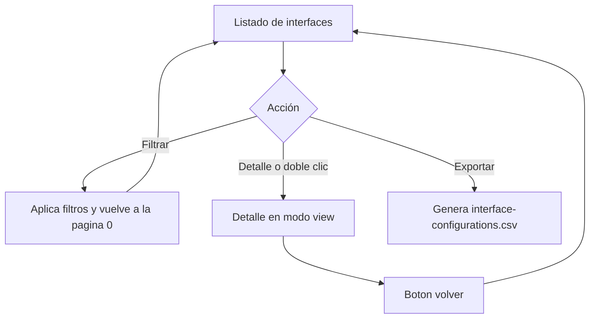

# Configuración de Interfaces

Documentación funcional y técnica de la pantalla de configuración de interfaces, dentro del módulo de Interfaces. Permite consultar, filtrar y visualizar en modo solo lectura la definición y el estado de todas las interfaces registradas en el sistema, así como exportar el listado filtrado a CSV. Ofrece una visión consolidada de la salud de las integraciones con indicadores visuales de estado.

- **Ruta frontend:** `/interfaces/configuration`
- **Componente:** `ConfigurationComponent` (listado y detalle en un único componente)
- **Endpoint backend base:** `/api/v1/interfaces/configuration` (`InterfaceController`)
- **Acceso:** requiere sesión y la acción `INTERFACES_READ`
- **Restricción de negocio:** no está permitido crear, editar ni eliminar interfaces desde la interfaz de usuario; las interfaces se gestionan externamente y solo se consultan

---

## 1. Requisitos

Identificadores locales de este documento: `RF-CFG-*` (requisitos funcionales) y `RNF-CFG-*` (requisitos no funcionales).

### 1.1. Requisitos funcionales

#### RF-CFG-1: Consulta paginada de interfaces

**Descripción:** el sistema debe permitir consultar las interfaces registradas en un listado paginado y ordenable.

**Criterios de aceptación:**
- AC1.1: El listado muestra las columnas nombre, protocolo, URL, estado, frecuencia de check y última modificación.
- AC1.2: Las columnas nombre, protocolo, estado, frecuencia de check y última modificación son ordenables (ascendente/descendente).
- AC1.3: La paginación permite navegar entre páginas y cambiar el tamaño de página.
- AC1.4: El estado se muestra como etiqueta con color: verde (`ACTIVE`), rojo (`ERROR`) y gris (`INACTIVE`).

#### RF-CFG-2: Búsqueda y filtrado

**Descripción:** el sistema debe permitir filtrar el listado por nombre, protocolo y estado.

**Criterios de aceptación:**
- AC2.1: El filtro de nombre aplica coincidencia parcial (no sensible a mayúsculas).
- AC2.2: El filtro de protocolo permite seleccionar `REST`, `SOAP`, `LDAP`, `SMTP` o todos.
- AC2.3: El filtro de estado permite seleccionar `ACTIVE`, `INACTIVE`, `ERROR` o todos.
- AC2.4: Al aplicar un filtro, el listado vuelve a la primera página.
- AC2.5: La acción de limpiar restablece todos los filtros y recarga el listado completo.

#### RF-CFG-3: Detalle de interfaz

**Descripción:** el sistema debe permitir consultar el detalle de una interfaz en modo solo lectura.

**Criterios de aceptación:**
- AC3.1: El doble clic sobre una fila abre el detalle de la interfaz.
- AC3.2: El botón de detalle de la barra de acciones abre la interfaz seleccionada y solo está habilitado cuando hay una fila seleccionada.
- AC3.3: El detalle muestra nombre, descripción, URL, protocolo, estado, frecuencia de check, fecha de creación y última modificación.
- AC3.4: El detalle incluye un botón de volver que regresa al listado.

#### RF-CFG-4: Exportación a CSV

**Descripción:** el sistema debe permitir exportar el listado filtrado a un fichero CSV.

**Criterios de aceptación:**
- AC4.1: La exportación incluye todos los registros que cumplen los filtros activos, no solo la página visible.
- AC4.2: El fichero descargado se llama `interface-configurations.csv`.
- AC4.3: Si no hay filas que cumplan los filtros, no se genera ninguna descarga.

#### RF-CFG-5: Pantalla de solo lectura

**Descripción:** el sistema debe tratar las interfaces como entidades de solo consulta, sin operaciones de creación, edición ni borrado.

**Criterios de aceptación:**
- AC5.1: La pantalla no ofrece acciones de crear, editar ni eliminar.
- AC5.2: La API solo expone operaciones de consulta (`GET`) sobre interfaces.
- AC5.3: Las interfaces son gestionadas externamente por el sistema, no desde la interfaz de usuario.

### 1.2. Requisitos no funcionales

- **RNF-CFG-1 (Autorización):** el acceso requiere sesión y la acción `INTERFACES_READ`.
- **RNF-CFG-2 (Visibilidad de acciones):** la pantalla muestra consulta de detalle y exportación, pero no incluye opciones de crear, editar ni borrar.
- **RNF-CFG-3 (Integridad del catálogo):** los valores de estado están restringidos a `ACTIVE`, `INACTIVE` y `ERROR`, y los de protocolo a `REST`, `SOAP`, `LDAP` y `SMTP`.
- **RNF-CFG-4 (Idioma):** todos los textos de la pantalla son traducibles (ES / EN) mediante el grupo i18n `interfaces.configuration.*`.
- **RNF-CFG-5 (Feedback):** las operaciones de carga del listado informan al usuario mediante notificaciones de progreso y error.

---

## 2. Parte funcional

### 2.1. Objetivo

Ofrecer a los administradores una pantalla para consultar y supervisar la configuración y el estado de salud de las integraciones del sistema:

- Consultar el listado paginado y filtrado de interfaces.
- Ver el detalle de una interfaz con su información de auditoría.
- Detectar rápidamente problemas de conectividad mediante indicadores visuales de estado.
- Exportar el listado filtrado a CSV.

### 2.2. Vistas de la pantalla

La pantalla gestiona dos modos de vista (`viewMode`) dentro del mismo componente:

| Modo | Descripción |
|------|-------------|
| `list` | Listado paginado con filtros, exportación y acceso al detalle |
| `detail` | Vista de solo lectura de una interfaz |

> No existe un modo `create` ni `edit`, ni operación de borrado; las interfaces se gestionan externamente y la pantalla es exclusivamente de consulta.

### 2.3. Patrón visual reutilizable y wireframes

La estructura visual base de esta pantalla se define en [layout.md](../../../03-technical/frontend/layout.md). Ese documento es la referencia canónica para los templates `List Screen` y `Form Screen`; la documentación funcional de interfaces solo describe cómo se aplica el patrón a una pantalla de solo lectura.

| Tipo de pantalla | Uso en interfaces | Estructura base |
|------------------|-------------------|-----------------|
| `List screen` | Listado principal | Cabecera, filtros, tabla, exportación y acceso al detalle |
| `Form screen` | Consulta en modo lectura | Encabezado, campos de solo lectura y pie con botón volver |
| `Confirmation modal` | No aplica | No existe borrado ni edición |

#### 2.3.1. Wireframe del `List screen`

```text
+------------------------------------------------------------------+
| Configuración de interfaces                                       |
+------------------------------------------------------------------+
| Filtro nombre | Filtro protocolo | Filtro estado | [Buscar] [Limpiar] |
+------------------------------------------------------------------+
| [Detalle]                                             [Exportar] |
+------------------------------------------------------------------+
| Nombre | Protocolo | URL | Estado | Frecuencia | Últ. modificación |
|--------|-----------|-----|--------|------------|-------------------|
| ERP    | REST      | ... | ACTIVE | 60s        | 2026-09-29        |
| LDAP   | LDAP      | ... | ERROR  | 30s        | 2026-09-28        |
+------------------------------------------------------------------+
| < 1 2 3 > | Registros por página: 10                            |
+------------------------------------------------------------------+
```

#### 2.3.2. Wireframe del `Form screen` en modo lectura

```text
+------------------------------------------------------------------+
| Detalle de interfaz                                               |
| [Volver]                                                         |
+------------------------------------------------------------------+
| Nombre | [ERP]                           | Estado | [ACTIVE]      |
| Descripción | [Integración con el ERP corporativo]               |
| URL    | [https://erp.example.com/api]                           |
| Protocolo | [REST]                                               |
| Frecuencia de check | [60]                                       |
| Fecha creación 2026-09-01 | Última modificación 2026-09-15       |
+------------------------------------------------------------------+
```

La diferencia frente a usuarios y acciones es que interfaces no tiene alta, edición ni borrado. Su `List screen` se centra en filtro, ordenación, exportación y acceso al detalle, y la consulta reutiliza un `Form screen` en modo exclusivamente de lectura.

### 2.4. Listado

**Columnas de la tabla:**

| Columna | Clave i18n | Ordenable | Notas |
|---------|-----------|-----------|-------|
| Nombre | `interfaces.configuration.fields.name` | Sí | Nombre identificador de la interfaz |
| Protocolo | `interfaces.configuration.fields.protocol` | Sí | Etiqueta (badge); se resalta `REST` |
| URL | `interfaces.configuration.fields.url` | No | Dirección del servicio externo (formato `code`) |
| Estado | `interfaces.configuration.fields.status` | Sí | Etiqueta con color por `ACTIVE` / `INACTIVE` / `ERROR` |
| Frecuencia de check | `interfaces.configuration.fields.checkFrequency` | Sí | Intervalo de verificación en segundos |
| Última modificación | `interfaces.configuration.fields.lastModifiedAt` | Sí | Formateado con `localDate` |

**Indicadores de estado:**

| Indicador | Estado | Descripción |
|-----------|--------|-------------|
| Verde | `ACTIVE` | La interfaz está operativa |
| Rojo | `ERROR` | La interfaz presenta problemas |
| Gris | `INACTIVE` | La interfaz está deshabilitada |

**Filtros disponibles:**

| Filtro | Tipo | `data-testid` |
|--------|------|---------------|
| Nombre | Texto (coincidencia parcial) | `filter-name` |
| Protocolo | Selección (`REST`, `SOAP`, `LDAP`, `SMTP` y todos) | `filter-protocol` |
| Estado | Selección (`ACTIVE`, `INACTIVE`, `ERROR` y todos) | `filter-status` |

**Barra de acciones:**

| Acción | Condición de disponibilidad | `data-testid` |
|--------|-----------------------------|---------------|
| Detalle | Requiere una fila seleccionada | `btn-view-detail` |
| Exportar CSV | Siempre disponible | `btn-export` |

- La selección de una fila alterna (seleccionar / deseleccionar).
- El doble clic sobre una fila abre la vista de detalle.
- La exportación a CSV incluye **todos los registros que cumplen los filtros activos**, no solo la página actual.

### 2.5. Detalle de interfaz

**Campos (todos de solo lectura):**

| Campo | Descripción |
|-------|-------------|
| Nombre | Nombre identificador de la interfaz |
| Descripción | Descripción funcional de la interfaz |
| URL | Dirección del servicio externo |
| Protocolo | Protocolo de comunicación (REST, SOAP, LDAP, SMTP) |
| Estado | Estado actual (`ACTIVE`, `INACTIVE`, `ERROR`) |
| Frecuencia de check | Intervalo de verificación de disponibilidad (segundos) |
| Fecha de creación | Fecha de registro en el sistema |
| Última modificación | Fecha de última actualización |

### 2.6. Validaciones funcionales

No aplican validaciones de entrada: la pantalla es de solo lectura y no dispone de formularios de alta ni edición. Los filtros no tienen reglas de obligatoriedad; cualquier combinación (incluida la vacía) es válida y recarga el listado correspondiente.

### 2.7. Flujo de operaciones



### 2.8. Mensajes y notificaciones

- La carga del listado muestra una notificación de progreso y, en caso de fallo, una notificación de error mediante el `NotificationService` (claves `notification.*`).
- Los cambios de estado de las interfaces se registran automáticamente en el sistema de auditoría del backend (fuera del alcance de esta pantalla).
- La exportación no genera descarga cuando no hay filas que cumplan los filtros activos.

---

## 3. Parte técnica

### 3.1. Componentes afectados

| Capa | Elemento | Responsabilidad |
|------|----------|-----------------|
| Frontend | `ConfigurationComponent` | Listado, filtros, paginación, orden, exportación y vista de detalle |
| Frontend | `InterfaceService` | Consulta de configuraciones de interfaz |
| Frontend | `TpDataTableComponent` | Tabla reutilizable (orden, paginación, selección) |
| Frontend | `NotificationService` | Notificaciones de progreso y error |
| Backend | `InterfaceControllerImpl` | Endpoints de consulta de interfaces (solo lectura) |
| Backend | `InterfaceService` (core) | Consulta y persistencia |

### 3.2. Modelo de datos (frontend)

```typescript
type InterfaceStatus = 'ACTIVE' | 'INACTIVE' | 'ERROR';

interface InterfaceConfig {
  id: number;
  name: string;
  description: string;
  url: string;
  protocol: string;
  checkFrequency: number;
  status: InterfaceStatus;
  createdAt: string;
  lastModifiedAt: string;
}
```

### 3.3. Endpoints del backend

Ruta base: `/api/v1/interfaces/configuration`.

| Método y ruta | Descripción | Respuesta |
|---------------|-------------|-----------|
| `GET /configuration` | Listado de todas las interfaces con su estado actual | 200 OK con `List<InterfaceDTO>` |
| `GET /configuration/{id}` | Interfaz por identificador | 200 OK con `InterfaceDTO` (o 404 Not Found) |
| `POST /configuration` | No disponible | No expuesto por la API (solo lectura) |
| `PUT /configuration/{id}` | No disponible | No expuesto por la API (solo lectura) |
| `DELETE /configuration/{id}` | No disponible | No expuesto por la API (solo lectura) |

### 3.4. Paginación, orden y filtros

- El listado completo se recupera en una sola llamada (`findAllConfigurations`); la **paginación, el orden y el filtrado se realizan en el cliente**.
- El filtro de nombre aplica coincidencia parcial no sensible a mayúsculas; los filtros de protocolo y estado aplican igualdad exacta.
- La exportación reutiliza el conjunto filtrado en cliente para generar el CSV sin realizar una llamada adicional al backend.

### 3.5. Seguridad y permisos

- El acceso al módulo de interfaces está protegido por `actionGuard` con la acción `INTERFACES_READ` (configurado en `app.routes.ts`).
- La ruta `/interfaces/configuration` se carga de forma perezosa dentro de las rutas del módulo de interfaces.
- La API no expone operaciones de creación, edición ni borrado de interfaces: solo métodos `GET`.

### 3.6. Reglas de comportamiento relevantes

- La pantalla es de **solo lectura**: no permite crear, editar ni eliminar interfaces.
- Las interfaces se gestionan externamente por el sistema; la pantalla solo consulta su definición y estado.
- Los cambios de estado de las interfaces se registran automáticamente en el sistema de auditoría.
- El estado se representa visualmente con etiquetas de color (verde/rojo/gris) para facilitar la detección de problemas.

---

## 4. Pruebas

### 4.1. Cobertura unitaria (backend)

No hay actualmente pruebas unitarias de backend específicas de esta pantalla documentadas en este documento. La protección de los endpoints de interfaces y el rechazo de operaciones de escritura se cubren en las pruebas de backend documentadas en [Monitor de Interfaces](../monitor/monitor.md) (sección 4.1).

### 4.2. Cobertura unitaria (frontend)

| Ubicación | Alcance |
|-----------|---------|
| `configuration.component.spec.ts` | Estado del listado, filtros en cliente, paginación, orden, detalle y exportación |
| `interface.service.spec.ts` | Construcción de las peticiones de consulta de configuraciones |

### 4.3. Cobertura E2E (Playwright)

Ubicación: `template/dashboard/e2e/tests/interfaces/interfaces-configuration.spec.ts` con Page Object en `template/dashboard/e2e/pages/interfaces-configuration.page.ts`.

| Caso | Descripción | Resultado esperado |
|------|-------------|--------------------|
| Listar interfaces (solo lectura) | Acceder a la pantalla tras iniciar sesión | La tabla, el formulario de filtros y el botón de exportar son visibles; no existen botones de crear, editar ni borrar |
| Filtrar por nombre, protocolo y estado | Aplicar filtros y luego limpiarlos | El listado se filtra y, al limpiar, vuelve a mostrarse completo |
| Abrir detalle desde la barra de acciones | Seleccionar una fila y pulsar el botón de detalle | Se muestra la vista de detalle con el botón volver; al volver reaparece el listado |
| Abrir detalle con doble clic | Hacer doble clic sobre una fila | Se abre la vista de detalle de la interfaz |
| Exportar CSV | Pulsar la acción de exportación | Se descarga el fichero `interface-configurations.csv` |
| Navegación desde el menú lateral | Desplegar la sección de Interfaces y pulsar Configuración | Navega a `/interfaces/configuration` y muestra la tabla |

- Cada test inicia sesión con un usuario válido (`testUsers.valid`) y navega a `/interfaces/configuration`.
- Los casos de detalle y exportación se ejecutan solo si existen filas en el listado.
- La suite verifica explícitamente la ausencia de acciones de creación, edición y borrado para garantizar el comportamiento de solo lectura.

### 4.4. Datos de prueba

Definidos en `template/dashboard/e2e/fixtures/test-data.ts`: `testUsers.valid` (credenciales del usuario con acceso al módulo). La pantalla no crea ni modifica interfaces; los casos consultan las interfaces existentes cargadas en el entorno de integración.

### 4.5. Dependencias de ejecución

- Los casos E2E de listado, filtrado, detalle y exportación requieren el backend de integración levantado (por defecto en `http://localhost:8080`) con al menos una interfaz registrada.
- La exportación a CSV depende de que existan filas que cumplan los filtros activos; en caso contrario no se genera descarga.
- Los casos de detalle y exportación están condicionados a la existencia de filas en el listado.

---

## Referencias

- [Módulo Interfaces](../interfaces.md)
- [Monitor de Interfaces](../monitor/monitor.md)
- [Autenticación y Gestión de Sesión](../../login/authentication.md)
- [Seguridad backend](../../../03-technical/backend/security.md)
- [Componentes frontend](../../../03-technical/frontend/components.md)
- [API backend](../../../03-technical/backend/api.md)
