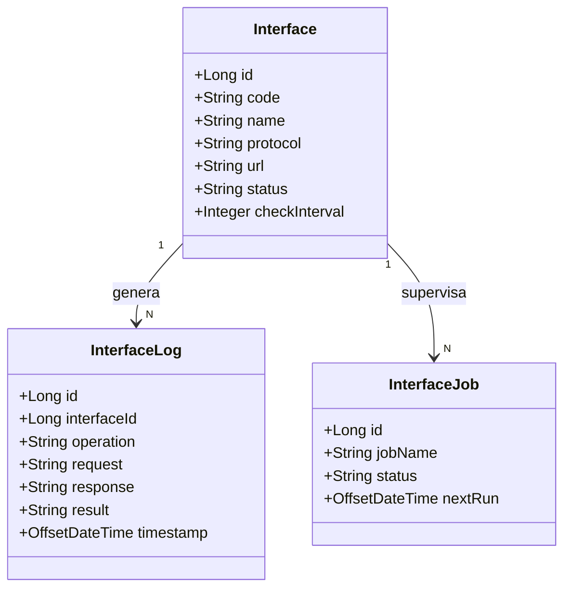

# Interfaces

El módulo **Interfaces** es un módulo funcional de primer nivel que agrupa toda la funcionalidad relacionada con la supervisión e integración de la aplicación con sistemas externos.

Su objetivo es proporcionar al administrador una visión unificada del estado de las interfaces, su actividad y su configuración, facilitando la detección de problemas de conectividad y garantizando la disponibilidad de las integraciones.

## Conceptos clave

| Concepto | Descripción |
|-----------|---------|
| Interfaz | Integración externa configurada en el sistema y supervisada desde la consola de administración. |
| Registro de operación | Evento inmutable generado por una interfaz: petición, respuesta, estado y errores asociados. |
| Monitor | Vista de supervisión centralizada para consultar actividad, diagnósticos y trazabilidad. |
| Configuración | Catálogo y estado actual de las interfaces registradas, únicamente de consulta. |

## Modelo de entidades

Las entidades principales del módulo Interfaces son:

- `Interface`: definición funcional de la integración, con nombre, protocolo, URL, estado y frecuencia de chequeo.
- `InterfaceLog`: registro histórico de una operación ejecutada por la interfaz, con trazabilidad de entrada/salida y resultado.
- `InterfaceJob` o equivalente de ejecución: tarea programada que dispara la comprobación periódica de salud de una interfaz.



### Relación de negocio

- Una interfaz se configura de forma centralizada y se supervisa desde la pantalla de configuración.
- Cada ejecución o chequeo de una interfaz genera uno o varios `InterfaceLog`, que quedan inmutables y sirven como registro de actividad.
- El monitor de interfaces permite filtrar, consultar y exportar esos registros para diagnóstico y auditoría.
- La configuración es de solo lectura en UI; las interfaces se gestionan externamente y no se crean, editan ni eliminan desde la aplicación.

## Seguridad

El acceso al módulo Interfaces está controlado por el sistema de acciones del perfil del usuario. Solo los usuarios con las acciones correspondientes pueden visualizar las opciones del menú y acceder a las pantallas.

## Navegación

```
Interfaces > Monitor
Interfaces > Configuración
```

## Pantallas

| Pantalla | Tipo | Descripción |
|---------------|-------------|-----------|
| [Monitor](./monitor/monitor.md) | Pagina | Panel de actividad de las interfaces: trazabilidad de operaciones de entrada/salida, estados y payloads. |
| [Configuración](./configuration/configuration.md) | Pagina | Listado de interfaces registradas con su estado actual y detalle de cada interfaz. |

## Referencias

- [Requisitos](../../specification/requirements.md)
- [Glosario](../../specification/glossary.md)
- [Modelo de datos](../../specification/data-model.md)
- [Autenticación y Gestión de Sesión](../login/authentication.md)
- [Seguridad (backend)](../../03-technical/backend/security.md)

