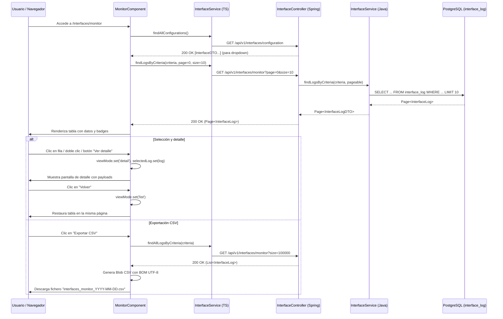

# Monitor de Interfaces

Documentación funcional y técnica de la pantalla de **Monitor de Interfaces**, dentro del módulo de **Interfaces**. Permite supervisar la trazabilidad de las operaciones de integración del sistema con servicios y clientes externos (entrantes y salientes), consultar su detalle técnico (payloads de petición y respuesta, estado y errores) y exportar los registros filtrados a formato CSV.

- **Ruta frontend:** `/interfaces/monitor` (`MonitorComponent`)
- **Endpoint backend base:** `/api/v1/interfaces/monitor` (`InterfaceController` / `InterfaceControllerImpl`)
- **Acceso:** requiere sesión activa y la acción `INTERFACES_READ`
- **Naturaleza:** vista de solo lectura (`read-only`) sobre registros inmutables (`append-only`)

---

## 1. Requisitos

Identificadores locales de este documento: `RF-IFM-*` (funcionales) y `RNF-IFM-*` (no funcionales).

### 1.1. Requisitos funcionales

#### RF-IFM-1: Consulta paginada y ordenable de logs de interfaces

**Descripción:** el sistema debe permitir consultar los registros de operaciones de interfaces con paginación y ordenación en el servidor.

**Criterios de aceptación:**
- AC1.1: El listado muestra las columnas: Fecha/hora (`timestamp`), Tipo de operación (`operationType`), Interfaz (`interfaceName`) y Estado (`status`).
- AC1.2: El `timestamp` se formatea a la zona horaria local del navegador mediante `LocalDatePipe`.
- AC1.3: Las columnas son ordenables (ascendente / descendente) y redimensionables a través del componente `tp-data-table`.
- AC1.4: La paginación en servidor permite navegar entre páginas y seleccionar el tamaño de página (5, 10, 20, 50 registros).
- AC1.5: Si no hay registros coincidentes, la tabla muestra el estado vacío (`common.noData`).

#### RF-IFM-2: Búsqueda y filtrado multicriterio

**Descripción:** el sistema debe permitir filtrar el historial de operaciones por rango de fechas, tipo de operación, interfaz y estado.

**Criterios de aceptación:**
- AC2.1: Filtro de fecha desde (`filterDateFrom`) y fecha hasta (`filterDateTo`) mediante controles de tipo `date`.
- AC2.2: Selector de tipo de operación con valores `GET`, `POST`, `PUT`, `PATCH`, `DELETE` y opción "Todos".
- AC2.3: Selector de interfaz alimentado dinámicamente desde `GET /api/v1/interfaces/configuration` y opción "Todas".
- AC2.4: Selector de estado con valores `SUCCESS`, `ERROR`, `BAD_REQUEST`, `NOT_FOUND` y opción "Todos".
- AC2.5: Al pulsar *Buscar* (`monitor-apply-filters`), se aplican los criterios y se reinicia la paginación a la página 0.
- AC2.6: Al pulsar *Limpiar* (`monitor-clear-filters`), se restablecen todos los filtros a sus valores por defecto y se recarga el listado completo desde la página 0.

#### RF-IFM-3: Visualización de detalle de operación

**Descripción:** el sistema debe permitir consultar la información técnica completa de una operación seleccionada.

**Criterios de aceptación:**
- AC3.1: Se accede al detalle seleccionando una fila y pulsando *Ver detalle* (`monitor-view-detail`), o mediante doble clic sobre la fila.
- AC3.2: La vista de detalle muestra: Timestamp (local), Tipo de operación, Nombre de interfaz, Estado, Payload de petición (`requestPayload`), Payload de respuesta (`responsePayload`) y Mensaje de error (`errorMessage` si aplica).
- AC3.3: Los payloads se presentan en bloques preformateados (`<pre>`) para preservar su formato estructurado (JSON / XML).
- AC3.4: El botón *Volver* (`monitor-back-to-list`) restaura la vista de listado manteniendo la selección y paginación previas.

#### RF-IFM-4: Exportación completa a CSV

**Descripción:** el sistema debe permitir exportar a CSV todos los registros que cumplan los filtros activos, independientemente de la paginación de la UI.

**Criterios de aceptación:**
- AC4.1: Al pulsar *Exportar CSV* (`monitor-export-csv`), el frontend consulta todos los registros filtrados mediante `findAllLogsByCriteria` (tamaño de lote para exportación `EXPORT_PAGE_SIZE = 100000`).
- AC4.2: Si no existen registros coincidentes, muestra una notificación de aviso (`notification.export.empty`).
- AC4.3: El fichero generado incluye BOM UTF-8 (`\uFEFF`), cabeceras traducidas y campos escapados con comillas dobles si contienen comas, comillas o saltos de línea.
- AC4.4: El nombre del fichero descargado sigue el patrón `interfaces_monitor_YYYY-MM-DD.csv`.
- AC4.5: El proceso informa del estado mediante notificaciones de progreso, éxito o error (`notification.export.*`).

### 1.2. Requisitos no funcionales

- **RNF-IFM-1 (Autorización y seguridad):**
  - La ruta `/interfaces/monitor` está protegida en frontend por `actionGuard` con la acción `INTERFACES_READ`.
  - El backend exige la autoridad `INTERFACES_READ` en `/api/v1/interfaces/**`.
  - Las operaciones de creación, modificación y eliminación (CUD) están explícitamente denegadas a nivel de Spring Security y lanzan `MethodNotAllowedException` en el servicio.
- **RNF-IFM-2 (Inmutabilidad y trazabilidad):**
  - Los registros de `interface_log` son estrictamente inmutables (`append-only`).
  - El registro de operaciones se realiza de forma programática y desacoplada mediante `InterfaceService.logOperation()`.
- **RNF-IFM-3 (Paginación en servidor y rendimiento):**
  - La consulta utiliza Spring Data `Pageable` y `Specification` dinámicas sobre JPA, garantizando alto rendimiento con grandes volúmenes de datos.
- **RNF-IFM-4 (Internacionalización):**
  - Todos los textos, etiquetas y cabeceras están internacionalizados bajo el espacio de nombres `interfaces.monitor.*`, `common.*` y `button.*`.
- **RNF-IFM-5 (Presentación de fechas y zona horaria):**
  - Las fechas UTC del servidor se convierten y muestran en la zona horaria local del cliente mediante `LocalDatePipe` y `DateService`.
- **RNF-IFM-6 (Feedback al usuario):**
  - `NotificationService` gestiona estados de progreso y errores en cargas, búsquedas y exportaciones.

---

## 2. Parte funcional

### 2.1. Objetivo

Ofrecer a los administradores e ingenieros de integración un panel centralizado para supervisar el tráfico de integraciones, verificar el cumplimiento de contratos de comunicación y diagnosticar fallos en tiempo real mediante la inspección de payloads y códigos de estado.

### 2.2. Vistas de la pantalla

La pantalla gestiona dos modos de vista principales dentro del mismo componente:

| Modo | Descripción |
|------|-------------|
| `list` | Listado paginado con filtros, ordenación, selección y exportación CSV |
| `detail` | Vista de detalle de una operación seleccionada con payloads y errores |

### 2.3. Patrón visual reutilizable y wireframes

La estructura visual base de esta pantalla se define en [layout.md](../../../03-technical/frontend/layout.md). Ese documento es la fuente única de verdad para los templates `List Screen`, `Form Screen` y `Confirmation Modal`; la documentación funcional del monitor describe cómo se aplica ese patrón a la entidad auditiva de operaciones de integración.

| Tipo de pantalla | Uso en monitor | Estructura base |
|------------------|----------------|-----------------|
| `List screen` | Listado principal de logs | Cabecera, filtros, tabla, acciones y paginación |
| `Detail screen` | Consulta de una operación | Encabezado, metadatos, payloads y botón de retorno |
| `Empty state` | Sin resultados | Mensaje de no-data con filtros aplicados |

#### 2.3.1. Vista principal de listado y filtros

#### Vista principal de listado y filtros

```text
┌─────────────────────────────────────────────────────────────────────────────────────────┐
│ Monitor de Interfaces                                                                   │
├─────────────────────────────────────────────────────────────────────────────────────────┤
│ [Desde: yyyy-mm-dd] [Hasta: yyyy-mm-dd] [Tipo: Todos ▾] [Interfaz: Todas ▾] [Estado ▾] │
│                                                                   [Limpiar] [🔍 Buscar] │
├─────────────────────────────────────────────────────────────────────────────────────────┤
│ [👁 Ver detalle]                                                      [📥 Exportar CSV] │
├─────────────────────────────────────────────────────────────────────────────────────────┤
│ Fecha/hora ▲          │ Tipo   │ Interfaz            │ Estado                           │
│───────────────────────┼────────┼─────────────────────┼──────────────────────────────────│
│ 01/10/2026 14:35:12   │ [OUT]  │ api/users           │ [SUCCESS]                        │
│ 01/10/2026 14:00:00   │ [POST] │ api/reports         │ [ERROR]                          │
│ 01/10/2026 13:25:00   │ [GET]  │ api/parameters      │ [SUCCESS]                        │
├─────────────────────────────────────────────────────────────────────────────────────────┤
│ Mostrando 1 a 10 de 755 registros      < 1 2 3 4 5 >       Elementos por página: [10 ▾] │
└─────────────────────────────────────────────────────────────────────────────────────────┘
```

#### Vista de detalle de operación

```text
┌─────────────────────────────────────────────────────────────────────────────────────────┐
│ Detalle de Operación                                                        [← Volver]  │
├─────────────────────────────────────────────────────────────────────────────────────────┤
│ Fecha/Hora: 01/10/2026 14:00:00   │ Tipo: POST   │ Interfaz: api/reports │ Estado: ERROR│
├─────────────────────────────────────────────────────────────────────────────────────────┤
│ Payload de Petición:                                                                    │
│ ┌─────────────────────────────────────────────────────────────────────────────────────┐ │
│ │ { "reportId": 1, "filters": { "period": "2026-09" } }                               │ │
│ └─────────────────────────────────────────────────────────────────────────────────────┘ │
│ Payload de Respuesta:                                                                   │
│ ┌─────────────────────────────────────────────────────────────────────────────────────┐ │
│ │ { "error": "Internal Server Error", "code": 500, "message": "Timeout conexión" }    │ │
│ └─────────────────────────────────────────────────────────────────────────────────────┘ │
│ Mensaje de Error:                                                                       │
│ Timeout de conexión con servicio externo al ejecutar generación de informe             │
└─────────────────────────────────────────────────────────────────────────────────────────┘
```

### 2.4. Identificadores para pruebas (`data-testid`)

| Elemento | `data-testid` |
| --- | --- |
| Título de la pantalla | `monitor-title` |
| Filtro Fecha desde | `monitor-filter-date-from` |
| Filtro Fecha hasta | `monitor-filter-date-to` |
| Filtro Tipo de operación | `monitor-filter-operation-type` |
| Filtro Interfaz | `monitor-filter-interface` |
| Filtro Estado | `monitor-filter-status` |
| Botón Buscar / Aplicar filtros | `monitor-apply-filters` |
| Botón Limpiar filtros | `monitor-clear-filters` |
| Botón Ver detalle (toolbar) | `monitor-view-detail` |
| Botón Exportar CSV | `monitor-export-csv` |
| Tabla de datos | `monitor-table` |
| Botón Volver (desde detalle) | `monitor-back-to-list` |

### 2.5. Diagramas

#### 2.5.1. Flujo de navegación y secuencia



---

## 3. Parte técnica

### 3.1. Componentes afectados

| Capa | Componente | Responsabilidad |
| --- | --- | --- |
| Frontend | `MonitorComponent` | Gestión de filtros, paginación, cambio a vista de detalle y exportación CSV. |
| Frontend | `InterfaceService` | Cliente HTTP para monitor y configuración de interfaces. |
| Frontend | `TpDataTableComponent` | Tabla reutilizable con ordenación, paginación y plantillas de visualización. |
| Frontend | `LocalDatePipe` y `DateService` | Formateo de fechas a la zona horaria del usuario. |
| Backend | `InterfaceControllerImpl` | Endpoints REST bajo `/api/v1/interfaces` para consultas de logs y configuración. |
| Backend | `InterfaceService` | Lógica de consulta paginada con `Specification`, conteo y registro programático `logOperation`. |
| Backend | `InterfaceLogRepository` | Repositorio Spring Data JPA con soporte de `JpaSpecificationExecutor`. |
| Domain | `InterfaceLog` | Entidad JPA mapeada a la tabla `interface_log`. |
| Domain | `InterfaceLogDTO` | Record para transferencia de datos del monitor. |
| Security | `SecurityConfig` | Reglas de autorización (`INTERFACES_READ`) y bloqueo de métodos CUD. |

### 3.2. Modelos de datos

#### Frontend (TypeScript)

```typescript
export type InterfaceOperationType = 'GET' | 'POST' | 'PUT' | 'PATCH' | 'DELETE';
export type InterfaceLogStatus = 'SUCCESS' | 'ERROR' | 'BAD_REQUEST' | 'NOT_FOUND';

export interface InterfaceLog {
  id: number;
  timestamp: string;
  operationType: InterfaceOperationType;
  interfaceName: string;
  interfaceId: number;
  requestPayload: string | null;
  responsePayload: string | null;
  status: InterfaceLogStatus;
  errorMessage: string | null;
}

export interface InterfaceLogCriteria {
  dateFrom?: string;
  dateTo?: string;
  operationType?: InterfaceOperationType;
  interfaceId?: number;
  status?: InterfaceLogStatus;
}
```

#### Backend DTOs (Java)

```java
public record InterfaceLogDTO(
    Long id,
    OffsetDateTime timestamp,
    InterfaceOperationType operationType,
    String interfaceName,
    String requestPayload,
    String responsePayload,
    InterfaceLogStatus status
) {}

public record InterfaceLogCriteria(
    OffsetDateTime fromDate,
    OffsetDateTime toDate,
    InterfaceOperationType operationType,
    String interfaceName,
    InterfaceLogStatus status
) {}
```

#### Entidades JPA

```java
@Entity
@Table(name = "interface_log")
public class InterfaceLog extends BaseEntity {
    @Column(nullable = false)
    private OffsetDateTime timestamp = OffsetDateTime.now();

    @Enumerated(EnumType.STRING)
    @Column(nullable = false, length = 10)
    private InterfaceOperationType operationType;

    @Column(nullable = false, length = 100)
    private String interfaceName;

    @Column(columnDefinition = "TEXT")
    private String requestPayload;

    @Column(columnDefinition = "TEXT")
    private String responsePayload;

    @Enumerated(EnumType.STRING)
    @Column(nullable = false, length = 20)
    private InterfaceLogStatus status;
}
```

### 3.3. Endpoints

| Método | Ruta | Descripción | Parámetros principales | Respuesta |
| --- | --- | --- | --- | --- |
| `GET` | `/api/v1/interfaces/monitor` | Consulta paginada y filtrada de logs | `page`, `size`, `fromDate`, `toDate`, `operationType`, `interfaceName`, `status`, `sort` | `200 OK` + `Page<InterfaceLogDTO>` |
| `GET` | `/api/v1/interfaces/monitor/count` | Recuento total según criterios | Mismos criterios de filtrado | `200 OK` + `Long` |
| `GET` | `/api/v1/interfaces/monitor/{id}` | Detalle de un log por ID | `id` (path variable) | `200 OK` + `InterfaceLogDTO` (o `404 Not Found`) |
| `GET` | `/api/v1/interfaces/configuration` | Listado de interfaces disponibles | Ninguno | `200 OK` + `List<InterfaceDTO>` |

### 3.4. Validaciones

- Los filtros de fecha, tipo de operación, interfaz y estado se validan antes de ejecutar la consulta; valores no permitidos se descartan o se convierten al tipo del enum.
- El nombre de interfaz y el estado debe existir en el catálogo de configuración para que la consulta devuelva resultados coherentes.
- La API exige que el usuario tenga la autoridad `INTERFACES_READ`; en caso contrario el acceso se deniega antes de procesar la consulta.
- El backend no permite crear, editar ni borrar registros de `interface_log`; la operación de registro es programática y se ejecuta solo desde `InterfaceService.logOperation()`.

### 3.5. Exportación

- La exportación del monitor reutiliza la colección filtrada en backend con un tamaño de lote elevado (`EXPORT_PAGE_SIZE = 100000`) para garantizar que el CSV incluya todos los resultados que cumplen los criterios activos.
- El fichero generado usa BOM UTF-8, columnas traducidas, separador `,` y escapado de valores con comas, comillas o saltos de línea.
- Si no hay registros coincidentes, el frontend muestra una notificación de aviso y evita la descarga para no generar ficheros vacíos.

### 3.6. Inmutabilidad y registro programático

Los registros de operaciones de interfaces son generados internamente por la capa de integración de la aplicación cuando interactúa con servicios externos. El método `InterfaceService.logOperation()` encapsula la persistencia:

```java
@Transactional
public void logOperation(InterfaceOperationType operationType,
                         String interfaceName,
                         String requestPayload,
                         String responsePayload,
                         InterfaceLogStatus status) {
    InterfaceLog log = new InterfaceLog();
    log.setOperationType(operationType);
    log.setInterfaceName(interfaceName);
    log.setRequestPayload(requestPayload);
    log.setResponsePayload(responsePayload);
    log.setStatus(status);
    interfaceLogRepository.save(log);
}
```

No existen endpoints ni métodos que permitan alterar o borrar registros existentes.

---

## 4. Pruebas

### 4.1. Cobertura unitaria (backend)

| Ubicación | Alcance |
| --- | --- |
| `core/src/test/java/org/myorganization/template/core/service/InterfaceServiceTest.java` | Pruebas unitarias de servicio: filtrado con `Specification`, conteo, rechazo de operaciones CUD (`MethodNotAllowedException`), logging programático. |
| `webapp/src/test/java/org/myorganization/template/webapp/controller/InterfaceControllerTest.java` | Pruebas de endpoints REST `/monitor`, `/monitor/count`, `/monitor/{id}` y `/configuration`. |
| `webapp/src/test/java/org/myorganization/template/webapp/security/SecurityConfigTest.java` | Verificación de protección con `INTERFACES_READ` y denegación de verbos POST/PUT/DELETE sobre `/api/v1/interfaces/**`. |

### 4.2. Cobertura unitaria (frontend)

| Ubicación | Alcance |
| --- | --- |
| `dashboard/src/app/core/services/interface.service.spec.ts` | Pruebas de cliente HTTP: `findAllConfigurations`, `findConfigurationById`, `findLogsByCriteria`, `findAllLogsByCriteria`, `countLogsByCriteria`, `findLogById`. |
| `dashboard/src/app/features/interfaces/monitor/monitor.component.stories.ts` | Historias de Storybook para validación visual de estados del monitor de interfaces. |

### 4.3. Cobertura E2E (Playwright)

Ubicación: `dashboard/e2e/tests/interfaces/interfaces-monitor.spec.ts` (Page Object en `dashboard/e2e/pages/interfaces-monitor.page.ts`).

| Caso | Descripción | Resultado esperado |
|------|-------------|--------------------|
| Listado de solo lectura | Acceder a `/interfaces/monitor` tras iniciar sesión | La tabla y filtros son visibles; no existen botones de crear, editar ni eliminar |
| Filtrado por tipo y estado | Filtrar por operación `POST` y estado `ERROR`; después limpiar | El listado muestra los registros coincidentes y recarga sin filtros al limpiar |
| Detalle desde toolbar | Seleccionar fila y pulsar *Ver detalle* | La vista de detalle muestra metadatos y payloads; la acción *Volver* restaura el listado |
| Detalle por doble clic | Doble clic sobre la primera fila | Abre la vista de detalle; *Volver* restaura el listado |
| Cambio de tamaño de página | Cambiar tamaño a 5 registros | La tabla se actualiza con un máximo de 5 filas |
| Exportación CSV | Exportar registros filtrados | El navegador descarga un fichero `interfaces_monitor_YYYY-MM-DD.csv` |
| Navegación lateral | Desplegar menú *Interfaces* y seleccionar *Monitor* | Navega a `/interfaces/monitor` y carga el listado de logs |

### 4.4. Datos de prueba

Los datos semilla de backend para registros de interfaces se encuentran en `domain/src/main/resources/db/changelog/data/v1.0.0/20250120-seed-local-interface-log.xml`.

### 4.5. Dependencias de ejecución

- Base de datos con tabla `interface_log` y datos semilla (`20250120-seed-local-interface-log.xml`, 755 registros simulados).
- Usuario con rol/perfil que contenga la acción `INTERFACES_READ`.
- Backend Spring Boot en ejecución en el puerto 8080 (o perfil `test`).

### 4.6. Casos clave (matriz)

| Caso | Entrada / Acción | Resultado esperado |
| --- | --- | --- |
| **Acceso sin autorización** | Usuario sin `INTERFACES_READ` navega a `/interfaces/monitor` | Guard redirige a `/forbidden` y API devuelve `403 Forbidden` |
| **Carga inicial** | Acceso a `/interfaces/monitor` | Tabla muestra los primeros 10 registros con badges y paginador configurado |
| **Filtro por tipo y estado** | Seleccionar tipo `POST` y estado `ERROR` + pulsar *Buscar* | Tabla muestra únicamente operaciones POST con estado ERROR y reinicia a página 0 |
| **Filtro por interfaz** | Seleccionar interfaz específica del desplegable | Solo se muestran operaciones de la interfaz seleccionada |
| **Limpieza de filtros** | Pulsar botón *Limpiar* | Se restablecen todos los selectores y recarga el listado completo |
| **Apertura de detalle** | Seleccionar fila y pulsar *Ver detalle* (o doble clic) | Se activa `viewMode = 'detail'`, mostrando payloads formateados y botón *Volver* |
| **Retorno al listado** | Pulsar botón *Volver* desde la vista de detalle | Se regresa a la vista de listado manteniendo la página actual |
| **Exportación CSV** | Pulsar *Exportar CSV* con filtros aplicados | Descarga fichero `interfaces_monitor_YYYY-MM-DD.csv` con todos los registros filtrados |
| **Exportación vacía** | Exportar cuando ningún registro coincide con los filtros | Notificación de aviso `notification.export.empty` sin descarga |

---

## Documentación relacionada

- [Módulo Interfaces (Visión General)](../interfaces.md)
- [Configuración de Interfaces](../configuration/configuration.md)
- [Autenticación y Gestión de Sesión](../../login/authentication.md)
- [Navegación del Sistema](../../03-technical/frontend/navigation.md)
- [API REST Backend](../../03-technical/backend/api.md)
- [Seguridad y Permisos](../../03-technical/backend/security.md)
- [Requisitos de la Aplicación](../../specification/requirements.md)
