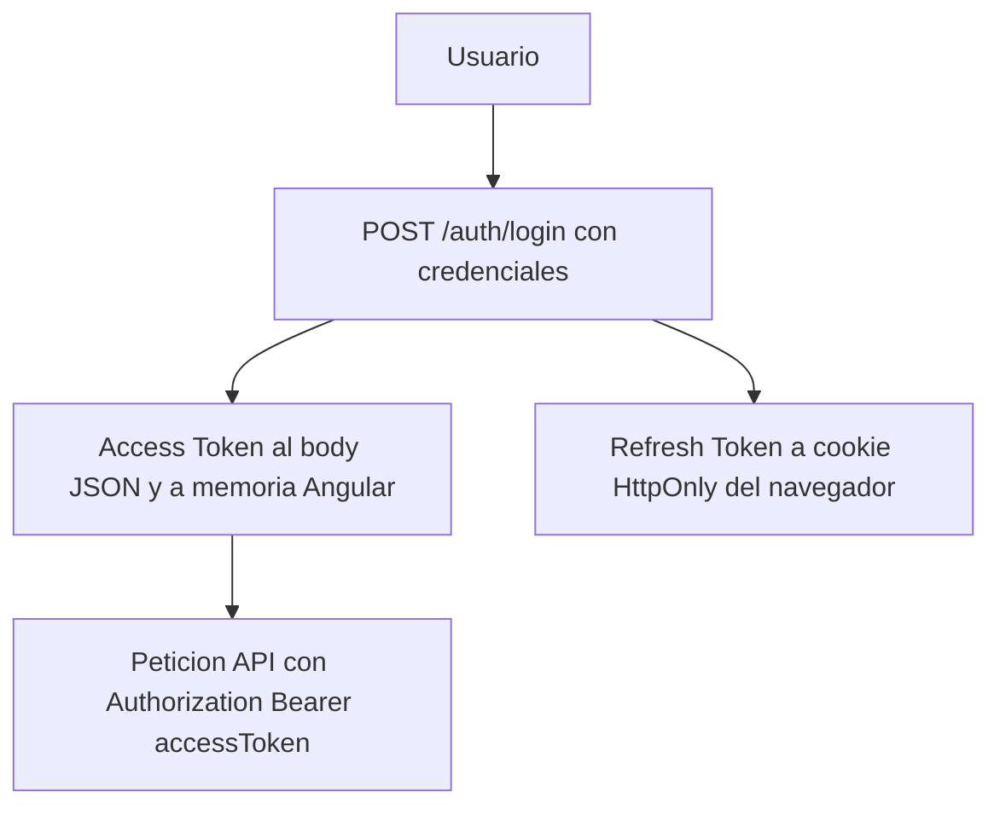
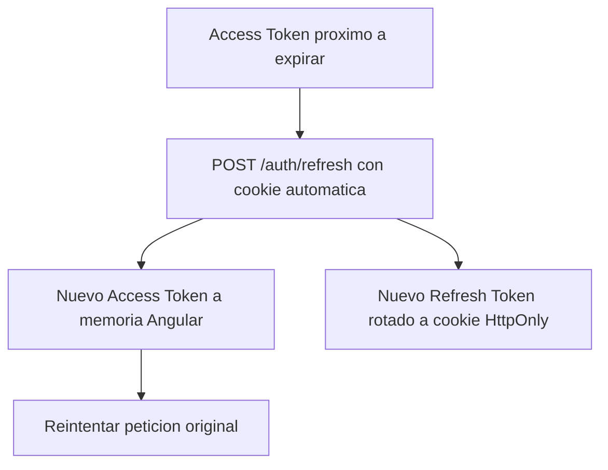
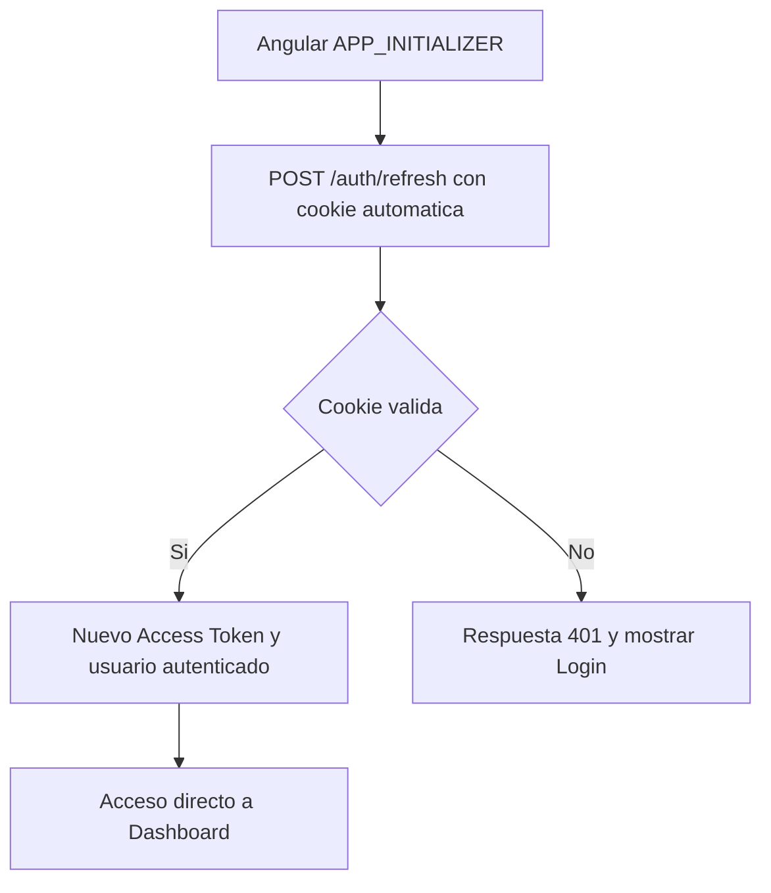
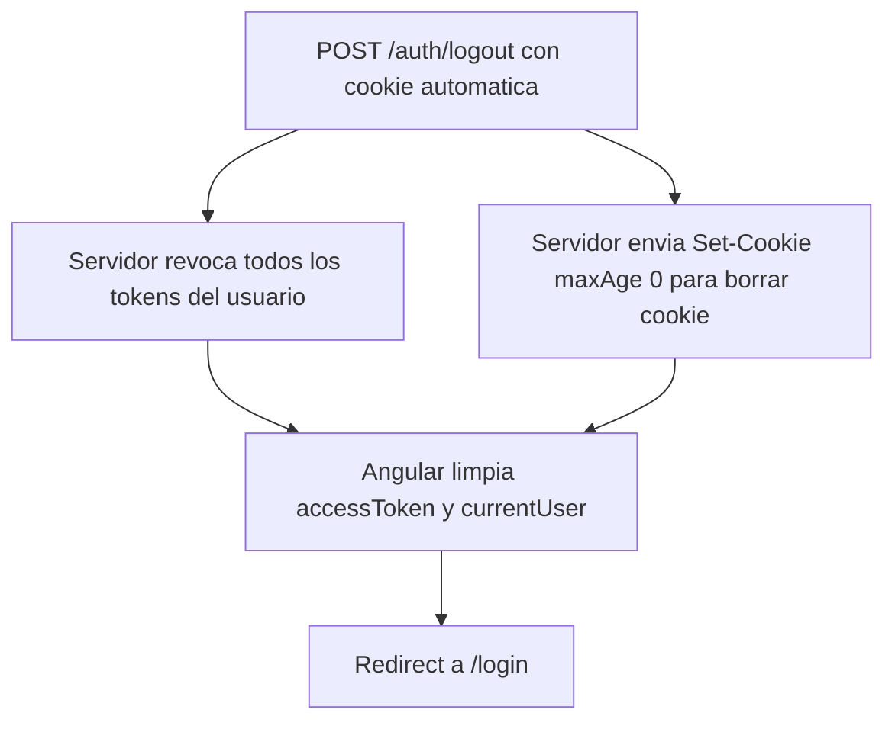

# Autenticación y Gestión de Sesión

Documentación funcional y técnica del modelo global de autenticación y gestión de sesión de la plataforma: login y emisión de tokens, persistencia y recuperación automática de sesión, renovación del access token, logout, seguridad del refresh token y configuración externalizable por entorno.

Estos requisitos son transversales a toda la aplicación y dan soporte a la pantalla de inicio de sesión descrita en [login.md](login.md).

- **Endpoints backend:** `POST /api/v1/auth/login`, `POST /api/v1/auth/refresh`, `POST /api/v1/auth/logout` (`AuthController`)
- **Servicio frontend:** `AuthService`
- **Modelo de tokens:** access token JWT en memoria + refresh token opaco en cookie HttpOnly
- **Acceso:** `/login` y `/refresh` son públicos; `/logout` requiere la cookie de sesión

---

## 1. Requisitos

Identificadores locales de este documento: `RF-AUT-*` (requisitos funcionales) y `RNF-AUT-*` (requisitos no funcionales). La pantalla de inicio de sesión que consume este modelo se especifica en [login.md](login.md).

### 1.1. Requisitos funcionales

#### RF-AUT-1: Login y generación de tokens

**Descripción:** el sistema debe autenticar usuarios mediante credenciales (username/password) y establecer una sesión segura compuesta por un access token JWT y un refresh token opaco.

El usuario envía credenciales a `POST /api/v1/auth/login` y el servidor las valida contra la base de datos (BCrypt). Si son válidas, genera un access token JWT de duración corta, genera un refresh token opaco (UUID) que persiste en la tabla `refresh_token`, devuelve el access token en el body JSON y establece el refresh token como cookie HttpOnly. Si son inválidas, devuelve 401 Unauthorized.

**Criterios de aceptación:**
- AC1.1: El login exitoso devuelve `accessToken` en el body y el refresh token en `Set-Cookie`.
- AC1.2: El login fallido devuelve 401 sin establecer cookie.
- AC1.3: El access token no aparece en `localStorage` ni `sessionStorage`.
- AC1.4: El refresh token no es accesible desde JavaScript (HttpOnly).
- AC1.5: La cookie tiene los atributos Secure, HttpOnly y SameSite configurados.
- AC1.6: La cookie es persistente (maxAge configurado, no session cookie).
- AC1.7: El access token se almacena exclusivamente en memoria del frontend (campo privado del servicio) y el refresh token nunca se incluye en el body de la respuesta.

#### RF-AUT-2: Persistencia de sesión y recuperación automática

**Descripción:** la sesión del usuario debe sobrevivir a la recarga de página, al cierre y reapertura del navegador, al reinicio del servidor Spring Boot y al reinicio de la aplicación PWA.

Al arrancar Angular, `APP_INITIALIZER` ejecuta `tryRestoreSession()`, que llama a `POST /api/v1/auth/refresh` con `withCredentials:true`. El navegador adjunta la cookie HttpOnly automáticamente. Si el refresh token es válido, el servidor genera un nuevo access token y un nuevo refresh token (rotación) y el usuario accede directamente al Dashboard. Si no hay cookie, ha expirado o ha sido revocada, el servidor responde 401 y Angular permite que el Guard redirija al login.

**Criterios de aceptación:**
- AC2.1: Recargar la página no obliga a introducir credenciales si el refresh token es válido.
- AC2.2: Cerrar y reabrir el navegador no obliga a login si el refresh token no ha expirado.
- AC2.3: Reiniciar Spring Boot no invalida sesiones existentes (tokens persistidos en BD).
- AC2.4: El proceso de recuperación no provoca redirecciones incorrectas al login.
- AC2.5: El Guard espera a que `tryRestoreSession()` complete antes de rechazar el acceso.

#### RF-AUT-3: Renovación automática del access token

**Descripción:** el access token debe renovarse automáticamente antes de expirar, sin intervención del usuario, mientras el refresh token sea válido.

El interceptor HTTP detecta que el access token está próximo a expirar (margen configurable `tokenRefreshMargin`), envía `POST /api/v1/auth/refresh`, recibe un nuevo access token y una cookie rotada, reemplaza el token en memoria y reintenta la petición original. Si varias peticiones detectan la expiración de forma simultánea, solo una ejecuta el refresh y las demás se encolan y esperan el resultado (patrón `BehaviorSubject`). En cada renovación el refresh token anterior se revoca y se genera uno nuevo; si se reutiliza un refresh token revocado, se revocan todos los tokens del usuario (detección de posible robo).

**Criterios de aceptación:**
- AC3.1: El token se renueva proactivamente antes de expirar.
- AC3.2: Las peticiones concurrentes no provocan múltiples llamadas a refresh.
- AC3.3: Cada refresh genera un nuevo refresh token (rotación).
- AC3.4: El refresh token anterior queda invalidado tras la rotación.
- AC3.5: Reutilizar un token revocado invalida todas las sesiones del usuario.
- AC3.6: Si el refresh falla con 401/403, se ejecuta logout y redirect a login.
- AC3.7: Si el refresh falla por error de red/servidor, se muestra notificación sin logout.

#### RF-AUT-4: Logout

**Descripción:** el logout debe invalidar completamente la sesión del usuario, tanto en el cliente como en el servidor.

Angular llama a `POST /api/v1/auth/logout` con `withCredentials:true`. El servidor lee el refresh token de la cookie, revoca todos los refresh tokens del usuario en la base de datos, establece una cookie con `maxAge=0` para eliminarla del navegador y responde 200 OK. Angular elimina el access token de memoria, limpia el estado del usuario autenticado (`currentUser = null`) y redirige al login.

**Criterios de aceptación:**
- AC4.1: Tras logout, el access token no está disponible en memoria.
- AC4.2: Tras logout, la cookie del refresh token se elimina del navegador.
- AC4.3: Tras logout, el refresh token está revocado en el servidor.
- AC4.4: Intentar usar el refresh token tras logout devuelve 401.
- AC4.5: Intentar acceder a una ruta protegida tras logout redirige al login.
- AC4.6: El logout no depende únicamente de borrar información del navegador.

#### RF-AUT-5: Rotación y revocación del refresh token

**Descripción:** el sistema debe rotar el refresh token en cada uso y permitir su revocación desde el servidor, incluyendo la revocación masiva ante reutilización.

El refresh token es un valor opaco (UUID aleatorio) almacenado en base de datos con asociación a usuario, expiración y estado de revocación. Se entrega exclusivamente vía cookie HttpOnly, se rota en cada uso (el anterior se invalida) y la expiración se valida en el servidor en cada petición. La reutilización de un token revocado dispara la revocación masiva de todas las sesiones del usuario.

**Criterios de aceptación:**
- AC5.1: El token es un valor opaco (UUID), no un JWT, y no contiene información decodificable.
- AC5.2: El token es revocable desde el servidor.
- AC5.3: La expiración se valida en el servidor en cada uso.
- AC5.4: La reutilización de un token revocado dispara la revocación masiva de sesiones.
- AC5.5: El valor del token no se registra en logs.

#### RF-AUT-6: Configuración externalizable por entorno

**Descripción:** toda la configuración de autenticación y de cookies debe ser externalizable por entorno.

**Parámetros configurables:**

| Parámetro                    | Propiedad YAML                   | Default               |
|------------------------------|----------------------------------|-----------------------|
| Duración access token        | `jwt.access-token-expiration`    | 900000 (15 min)       |
| Duración refresh token       | `jwt.refresh-token-expiration`   | 604800000 (7 días)    |
| Secreto JWT                  | `jwt.secret`                     | (requerido en prod)   |
| Nombre de cookie             | `auth.cookie.name`               | `__Host-refresh-token`|
| Path de cookie               | `auth.cookie.path`               | `/template/api/v1/auth` |
| Max-Age de cookie (segundos) | `auth.cookie.max-age-seconds`    | 604800 (7 días)       |
| Cookie Secure                | `auth.cookie.secure`             | true                  |
| Cookie SameSite              | `auth.cookie.same-site`          | Strict                |
| CORS origins                 | `cors.allowed-origins`           | (requerido)           |
| Margen renovación (frontend) | `environment.tokenRefreshMargin` | 60000 (1 min)         |

**Criterios de aceptación:**
- AC6.1: Los parámetros son configurables vía variables de entorno.
- AC6.2: El perfil local permite trabajar con HTTP (`secure=false`, `sameSite=Lax`).
- AC6.3: El perfil dist/producción fuerza `secure=true` y `sameSite=Strict`.

### 1.2. Requisitos no funcionales

- **RNF-AUT-1 (Almacenamiento seguro de tokens):** el access token se conserva solo en memoria del frontend; ni el access token ni el refresh token se almacenan nunca en `localStorage` o `sessionStorage`.
- **RNF-AUT-2 (Protección del refresh token):** el refresh token se entrega exclusivamente como cookie HttpOnly, no es accesible desde JavaScript y no aparece en el body de ninguna respuesta HTTP.
- **RNF-AUT-3 (Atributos de cookie):** la cookie de refresh es `HttpOnly`, `Secure` en producción, con `SameSite` apropiado (`Strict` en producción, `Lax` en local) y `Path` restringido a los endpoints de autenticación.
- **RNF-AUT-4 (Hash de credenciales):** las contraseñas se validan contra la base de datos mediante BCrypt; nunca se almacenan ni se transmiten en claro.
- **RNF-AUT-5 (Trazabilidad sin fugas):** el valor de los tokens nunca se registra en logs.
- **RNF-AUT-6 (Concurrencia):** las renovaciones concurrentes del access token se serializan para que solo una petición ejecute el refresh y el resto reutilice su resultado.
- **RNF-AUT-7 (Resiliencia):** un fallo de red o de servidor durante el refresh no provoca logout; solo los errores de autorización (401/403) cierran la sesión.

---

## 2. Parte funcional

### 2.1. Objetivo

Proporcionar un modelo de autenticación y gestión de sesión seguro, persistente y transparente para el usuario:

- Autenticar con usuario y contraseña y emitir una sesión basada en access token JWT y refresh token opaco.
- Mantener la sesión activa entre recargas, reinicios de navegador y reinicios del servidor.
- Renovar el access token de forma automática y transparente antes de que expire.
- Cerrar la sesión invalidándola tanto en el cliente como en el servidor.
- Proteger el refresh token frente a robo, reutilización y exposición.
- Externalizar toda la configuración de tokens y cookies por entorno.

### 2.2. Flujo de login



### 2.3. Flujo de renovación automática



### 2.4. Flujo de arranque de Angular (recuperación de sesión)



### 2.5. Flujo de logout



---

## 3. Parte técnica

### 3.1. Componentes afectados

| Capa | Elemento | Responsabilidad |
|------|----------|-----------------|
| Frontend | `AuthService` | Gestión del flujo de login, refresh, logout y almacenamiento del access token. |
| Frontend | Interceptor HTTP | Detección de sesiones expiradas, renovación proactiva y encolado de peticiones concurrentes. |
| Frontend | `authGuard` | Protección de rutas privadas y espera a la recuperación de sesión antes de rechazar. |
| Backend | `AuthController` | Exposición de los endpoints `/login`, `/refresh` y `/logout`. |
| Backend | `AuthService` | Autenticación, emisión, renovación y revocación de tokens. |
| Domain | `User` | Entidad principal del proceso de autenticación y sesión. |
| Domain | `RefreshToken` | Persistencia del refresh token para la renovación de sesiones. |
| Security | `SecurityConfig` | Reglas de seguridad y control de acceso a endpoints de autenticación. |

### 3.2. Modelos de datos

#### Frontend (TypeScript)

```typescript
interface LoginRequest {
  username: string;
  password: string;
}

interface AccessTokenResponse {
  accessToken: string;
}
```

#### Backend DTOs (Java)

```java
public record LoginRequestDTO(
    String username,
    String password
) {}

public record TokenRefreshResponseDTO(
    String accessToken
) {}
```

#### Entidades JPA

```java
@Entity
@Table(name = "refresh_token")
public class RefreshToken extends BaseEntity {
    @ManyToOne(fetch = FetchType.LAZY)
    @JoinColumn(name = "user_id", nullable = false)
    private User user;

    @Column(nullable = false, unique = true)
    private String token;

    @Column(nullable = false)
    private OffsetDateTime expiresAt;
}
```

### 3.3. Endpoints

Ruta base de autenticación: `/api/v1/auth`.

| Método y ruta | Descripción | Respuesta |
|---------------|-------------|-----------|
| `POST /login` | Autenticación con usuario y contraseña | 200 OK con `accessToken` y cookie de refresh |
| `POST /refresh` | Renovación de sesión usando cookie HttpOnly | 200 OK con nuevo `accessToken` y cookie rotada |
| `POST /logout` | Cierre de sesión | 200 OK y cookie eliminada (`maxAge=0`) |

### 3.4. Modelo de seguridad

- El **access token** (JWT) se guarda **solo en memoria** dentro de `AuthService`; nunca en `localStorage` ni `sessionStorage`.
- El **refresh token** se entrega como **cookie HttpOnly** gestionada por el navegador; no es accesible desde JavaScript.
- El JWT se decodifica en cliente para extraer `username`, `profile`, `actions`, `exp` e `iat` (sin verificar la firma; la validación real es del backend).
- Atributos de la cookie de refresh (configurables): `HttpOnly`, `Secure`, `SameSite=Strict`, `Path=/template/api/v1/auth`, `Max-Age=604800` (7 días).
- Las llamadas de autenticación usan `withCredentials: true`; el backend debe permitir credenciales en CORS.

### 3.5. Consideraciones de despliegue

- El frontend consume el backend a través de `environment.apiUrl` según el perfil de compilación (`local`, `test`, `dist`).
- En entornos accesibles por HTTPS la cookie `Secure` funciona correctamente; en local debe ajustarse el atributo `secure` (perfil local con `secure=false`, `sameSite=Lax`).
- Los tokens persistidos en base de datos permiten que las sesiones sobrevivan al reinicio del servidor.

---

## Referencias

- [Login (pantalla de inicio de sesión)](login.md)
- [Seguridad backend](../../03-technical/backend/security.md)
- [Entornos](../../04-development/environments.md)
- [Descripción del producto y especificación](../../specification/requirements.md)
