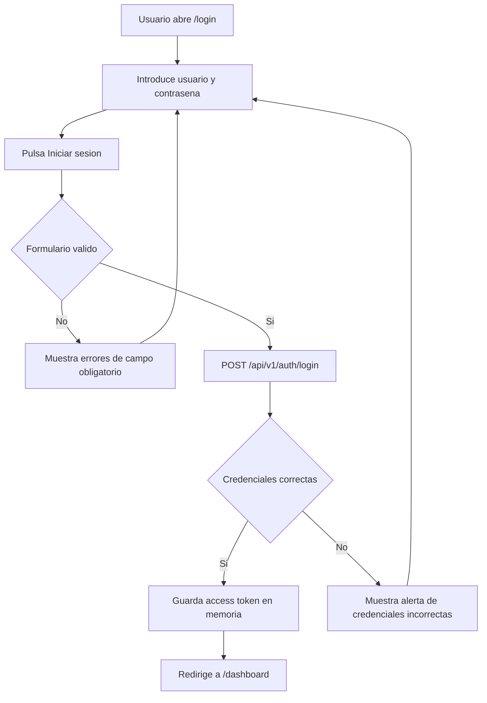
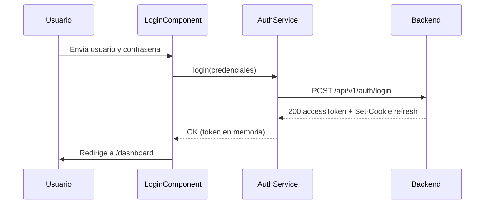

# Login (Inicio de sesión)

Documentación funcional y técnica de la pantalla de inicio de sesión de la aplicación. Es el punto de entrada de todos los usuarios: valida las credenciales contra el backend, establece la sesión y da acceso al resto de módulos.

- **Ruta frontend:** `/login`
- **Componente:** `LoginComponent` (`dashboard/src/app/features/login/login.component.ts`)
- **Endpoint backend:** `POST /api/v1/auth/login` (`AuthController`)
- **Acceso:** público (no requiere sesión previa)

---

## 1. Requisitos

Identificadores locales de este documento: `RF-LOG-*` (requisitos funcionales) y `RNF-LOG-*` (requisitos no funcionales). El detalle del modelo de autenticación y autorización global de la plataforma se especifica en [authentication.md](authentication.md) (`RF-AUT-*` / `RNF-AUT-*`).

### 1.1. Requisitos funcionales

#### RF-LOG-1: Autenticación con usuario y contraseña

**Descripción:** el sistema debe permitir autenticarse mediante usuario y contraseña válidos.

**Criterios de aceptación:**
- AC1.1: Al enviar credenciales válidas, se invoca `POST /api/v1/auth/login`.
- AC1.2: Con respuesta correcta (200), se guarda el `accessToken` en memoria y se establece la sesión.
- AC1.3: Tras autenticación correcta, el usuario es redirigido a `/dashboard`.

#### RF-LOG-2: Validaciones de formulario

**Descripción:** el sistema debe validar que los campos obligatorios están informados antes de enviar.

**Criterios de aceptación:**
- AC2.1: Usuario y contraseña son obligatorios.
- AC2.2: Si el formulario es inválido, no se realiza llamada al backend.
- AC2.3: Los errores de validación se muestran cuando los campos han sido tocados.

#### RF-LOG-3: Gestión de errores de autenticación

**Descripción:** el sistema debe informar de forma clara cuando las credenciales no son válidas.

**Criterios de aceptación:**
- AC3.1: Ante credenciales incorrectas, se muestra la alerta `login-error-alert`.
- AC3.2: El usuario permanece en `/login`.
- AC3.3: El mensaje de error usa la clave traducible `login.error`.

#### RF-LOG-4: Control de interacción durante el envío

**Descripción:** el sistema debe evitar envíos duplicados durante una autenticación en curso.

**Criterios de aceptación:**
- AC4.1: Al iniciar el envío, el botón de inicio de sesión se deshabilita.
- AC4.2: Mientras dura la petición, se muestra estado de carga en el botón.

#### RF-LOG-5: Mostrar/ocultar contraseña

**Descripción:** el sistema debe permitir alternar la visibilidad de la contraseña sin perder su valor.

**Criterios de aceptación:**
- AC5.1: Al pulsar `btn-toggle-password`, el input alterna entre tipo `password` y `text`.
- AC5.2: El valor introducido en la contraseña se conserva al alternar visibilidad.

#### RF-LOG-6: Selección de idioma

**Descripción:** el sistema debe permitir cambiar el idioma de la interfaz desde la pantalla de login.

**Criterios de aceptación:**
- AC6.1: El usuario puede alternar entre ES y EN desde `btn-lang-<lang>`.
- AC6.2: Los textos visibles del login se actualizan al idioma seleccionado sin recargar la página.

### 1.2. Requisitos no funcionales

- **RNF-LOG-1 (Seguridad de sesión):** el `accessToken` se conserva solo en memoria; no se persiste en `localStorage` ni `sessionStorage`.
- **RNF-LOG-2 (Protección de credenciales):** la contraseña no se muestra en claro salvo cuando el usuario activa explícitamente el toggle de visibilidad.
- **RNF-LOG-3 (Internacionalización):** todos los textos de la pantalla son traducibles mediante claves `login.*` y `validation.*`.
- **RNF-LOG-4 (Usabilidad):** el envío inválido proporciona feedback inmediato en los campos requeridos.
- **RNF-LOG-5 (Resiliencia):** los errores de autenticación no rompen la navegación ni abandonan la vista de login.

---

## 2. Parte funcional

### 2.1. Objetivo

Permitir que un usuario se autentique con usuario y contraseña para acceder a la aplicación. Tras una autenticación correcta, el usuario es redirigido al dashboard. Ante credenciales incorrectas se muestra un mensaje de error sin abandonar la pantalla.

### 2.2. Elementos de la pantalla

| Elemento | Descripción | `data-testid` |
|----------|-------------|---------------|
| Título | Nombre de la aplicación (`login.title`) | `login-title` |
| Subtítulo | Texto de ayuda (`login.subtitle`) | — |
| Campo Usuario | Entrada de texto para el nombre de usuario | `input-username` |
| Campo Contraseña | Entrada de contraseña, oculta por defecto | `input-password` |
| Botón mostrar/ocultar contraseña | Alterna la visibilidad del campo contraseña | `btn-toggle-password` |
| Checkbox Recordarme | Opción de recordar la sesión | `checkbox-remember` |
| Botón Iniciar sesión | Envía el formulario | `btn-login-submit` |
| Alerta de error | Aviso visible solo cuando fallan las credenciales | `login-error-alert` |
| Selector de idioma | Cambia el idioma de la interfaz (ES / EN) | `btn-lang-<lang>` |

### 2.3. Validaciones funcionales

| Campo | Regla | Mensaje |
|-------|-------|---------|
| Usuario | Obligatorio | `validation.required` |
| Contraseña | Obligatoria | `validation.required` |

- Las validaciones de campo obligatorio se muestran cuando el campo ha sido tocado y está vacío.
- Mientras el formulario es inválido, el envío no dispara ninguna llamada al backend: se marcan los campos como tocados para mostrar los errores.
- Durante el envío, el botón de inicio de sesión se deshabilita y muestra un indicador de carga para evitar envíos duplicados.

### 2.4. Flujo de inicio de sesión



### 2.5. Mensajes al usuario

| Situación | Texto (clave i18n) | Valor en español |
|-----------|--------------------|------------------|
| Campo obligatorio vacío | `validation.required` | (mensaje de campo requerido) |
| Credenciales incorrectas | `login.error` | `Credenciales incorrectas. Inténtalo de nuevo.` |
| Placeholder usuario | `login.username.placeholder` | `Introduce tu usuario` |
| Placeholder contraseña | `login.password.placeholder` | `Introduce tu contraseña` |
| Subtítulo | `login.subtitle` | `Introduce tus credenciales para acceder` |

### 2.6. Internacionalización

- La pantalla es multi-idioma (ES / EN) mediante `@ngx-translate`.
- El selector de idioma al pie permite cambiar el idioma sin recargar la página.
- Todos los textos visibles se resuelven por clave dentro del grupo `login.*` de los ficheros `src/assets/i18n/{es,en}.json`.

---

## 3. Parte técnica

### 3.1. Componentes afectados

| Capa | Elemento | Responsabilidad |
|------|----------|-----------------|
| Frontend | `LoginComponent` | Formulario reactivo, validación y orquestación del flujo de autenticación. |
| Frontend | `AuthService` | Invocación del endpoint, almacenamiento del access token y gestión de la sesión. |
| Frontend | `authGuard` | Protección de rutas privadas y redirección a `/login` cuando la sesión no existe. |
| Frontend | `actionGuard` | Verificación de permisos por acción antes de permitir el acceso a la vista. |
| Backend | `AuthController` | Exposición de los endpoints `/login`, `/refresh` y `/logout`. |
| Backend | `AuthService` | Autenticación con credenciales, emisión y renovación de tokens. |
| Domain | `User` | Entidad principal para la autenticación y asociación con perfil y permisos. |
| Security | `SecurityConfig` | Reglas de autorización y protección de rutas del módulo de autenticación. |

### 3.2. Modelos de datos

#### Frontend (TypeScript)

```typescript
interface LoginRequest {
  username: string;
  password: string;
}

interface AccessTokenResponse {
  accessToken: string;
}
```

El campo `remember` del formulario no se envía al backend; forma parte únicamente del estado del formulario.

#### Backend DTOs (Java)

```java
public record LoginRequestDTO(
    String username,
    String password
) {}

public record AccessTokenResponseDTO(
    String accessToken
) {}
```

#### Entidades JPA

```java
@Entity
@Table(name = "users")
public class User extends BaseEntity {
    @Column(nullable = false, unique = true)
    private String username;

    @Column(nullable = false)
    private String password;

    @ManyToOne(fetch = FetchType.LAZY)
    @JoinColumn(name = "profile_id")
    private Profile profile;
}
```

### 3.3. Endpoints del backend

Ruta base de autenticación: `/api/v1/auth`.

| Método y ruta | Descripción | Respuesta |
|---------------|-------------|-----------|
| `POST /login` | Autenticación con usuario y contraseña | 200 OK con `accessToken` y cookie de refresh |
| `POST /refresh` | Renovación de sesión usando cookie HttpOnly | 200 OK con nuevo `accessToken` |
| `POST /logout` | Cierre de sesión | 200 OK |

### 3.4. Contrato del endpoint de login

- **Método y ruta:** `POST /api/v1/auth/login` (ruta pública).
- **Cuerpo de la petición:** `{ "username": "...", "password": "..." }`.
- **Respuesta correcta (200):** `{ "accessToken": "<JWT>" }` y cabecera `Set-Cookie` con el refresh token.
- **Respuesta con error:** las credenciales inválidas se traducen en un error que el frontend interpreta para mostrar la alerta.

### 3.5. Modelo de seguridad

- El **access token** (JWT) se guarda **solo en memoria** dentro de `AuthService`; nunca en `localStorage` ni `sessionStorage`.
- El **refresh token** se entrega como **cookie HttpOnly** gestionada por el navegador; no es accesible desde JavaScript.
- El JWT se decodifica en cliente para extraer `username`, `profile`, `actions`, `exp` e `iat` (sin verificar la firma; la validación real es del backend).
- Atributos de la cookie de refresh (configurables): `HttpOnly`, `Secure`, `SameSite=Strict`, `Path=/template/api/v1/auth`, `Max-Age=604800` (7 días).

### 3.6. Reglas de comportamiento relevantes

- Si el formulario es inválido, no se invoca el backend y se marcan los controles para mostrar validaciones.
- Con login correcto, `LoginComponent` redirige a `/dashboard`.
- Con login inválido, se mantiene la vista y se muestra la alerta de error.
- Durante el envío, se bloquea temporalmente la acción de login para evitar duplicidad.

### 3.7. Navegación y restauración de sesión

- El acceso a `/dashboard` está protegido por `authGuard` (sesión válida) y `actionGuard` (acción `DASHBOARD_READ`).
- Al arrancar la aplicación, `AuthService.tryRestoreSession()` llama a `POST /api/v1/auth/refresh`.
- Si la cookie HttpOnly es válida, se obtiene un nuevo access token sin intervención del usuario y se evita el paso por `/login`.



### 3.8. Consideraciones de despliegue

- El frontend consume el backend a través de `environment.apiUrl` según el perfil de compilación (`local`, `test`, `dist`).
- Las llamadas de autenticación usan `withCredentials: true` para enviar y recibir la cookie de refresh; el backend debe permitir credenciales en CORS.
- La cookie es `Secure`, por lo que en entornos accesibles por HTTPS el refresh funciona correctamente; en local debe considerarse la configuración del atributo `secure`.

---

## 4. Pruebas

### 4.1. Cobertura unitaria (backend)

Hay cobertura unitaria de backend para la autenticación, centrada en la capa de controlador de la API y en la validación de las rutas de sesión:

| Ubicación | Alcance |
|-----------|---------|
| `template/webapp/src/test/java/org/myorganization/template/webapp/controller/AuthControllerTest.java` | Respuestas HTTP de login, refresh y logout, así como la propagación de errores de autenticación y la gestión del flujo principal del endpoint |

No se documenta una clase de servicio específica para login con una suite dedicada en el repositorio actual; la comprobación de la autenticación se mantiene validada mediante el controlador y la batería de pruebas funcionales del frontend.

### 4.2. Cobertura unitaria (frontend)

| Ubicación | Alcance |
|-----------|---------|
| `login.component.spec.ts` | Validación del formulario, envío y manejo de estado de carga/error |
| `auth.service.spec.ts` | Login, refresh, logout y gestión de token en memoria |

### 4.3. Cobertura E2E (Playwright)

Ubicación: `dashboard/e2e/tests/auth/login.spec.ts` (Page Object en `dashboard/e2e/pages/login.page.ts`).

| Caso | Descripción | Resultado esperado |
|------|-------------|--------------------|
| Render del formulario | Se muestran título, campos y botón | Elementos visibles |
| Campos obligatorios | Enviar el formulario vacío | Permanece en `/login` |
| Mostrar/ocultar contraseña | Pulsar el toggle | El campo alterna `password` / `text` |
| Login válido | Usuario y contraseña correctos | Navega a `/dashboard` y muestra `dashboard-title` |
| Login inválido | Contraseña incorrecta | Muestra alerta de error y permanece en `/login` |

### 4.4. Datos de prueba

Definidos en `dashboard/e2e/fixtures/test-data.ts`. Deben ajustarse a las credenciales del entorno de integración (perfil `test`).

### 4.5. Dependencias de ejecución

- Los casos de login válido e inválido requieren el backend de integración levantado (por defecto en `http://localhost:8080`).
- Los casos de render, validación y toggle no dependen del backend.

---

## Referencias

- [Autenticación y Gestión de Sesión](authentication.md)
- [Seguridad backend](../../03-technical/backend/security.md)
- [Navegación frontend](../../03-technical/frontend/navigation.md)
- [Internacionalización](../../03-technical/frontend/internacionalizacion.md)
- [Entornos](../../04-development/environments.md)
