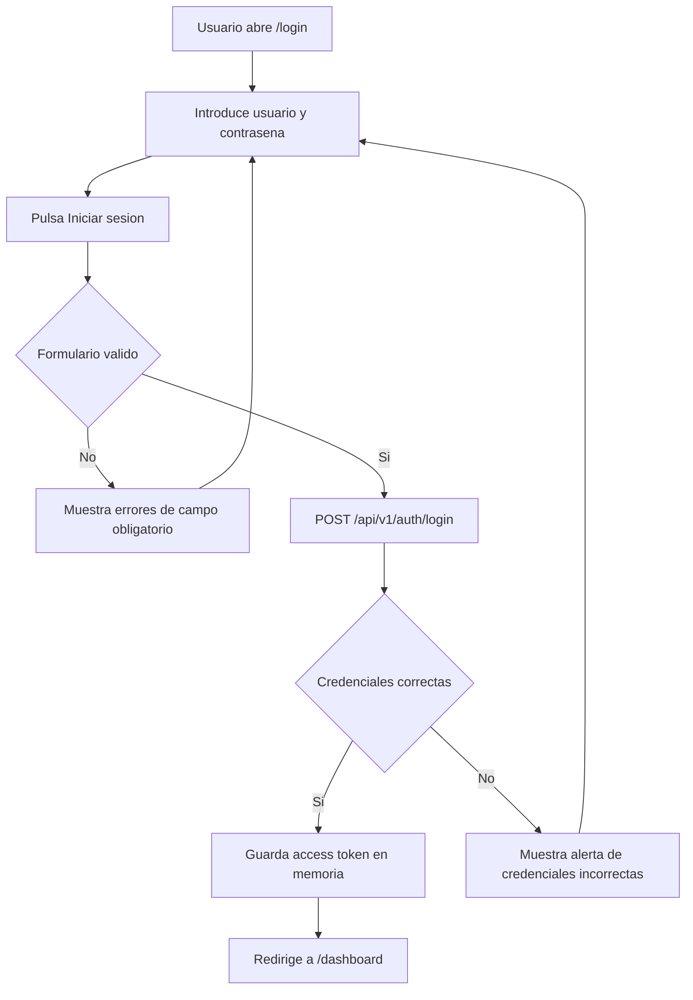
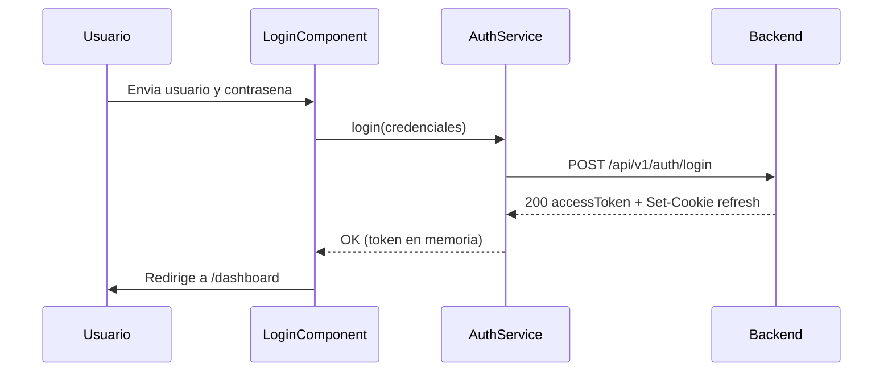

# Login (Inicio de sesión)

Documentación funcional y técnica de la pantalla de inicio de sesión de la aplicación. Es el punto de entrada de todos los usuarios: valida las credenciales contra el backend, establece la sesión y da acceso al resto de módulos.

- **Ruta frontend:** `/login`
- **Componente:** `LoginComponent` (`dashboard/src/app/features/login/login.component.ts`)
- **Endpoint backend:** `POST /api/v1/auth/login` (`AuthController`)
- **Acceso:** público (no requiere sesión previa)

---

## 1. Parte funcional

### 1.1. Objetivo

Permitir que un usuario se autentique con usuario y contraseña para acceder a la aplicación. Tras una autenticación correcta, el usuario es redirigido al dashboard. Ante credenciales incorrectas se muestra un mensaje de error sin abandonar la pantalla.

### 1.2. Elementos de la pantalla

| Elemento | Descripción | `data-testid` |
|----------|-------------|---------------|
| Título | Nombre de la aplicación (`login.title`) | `login-title` |
| Subtítulo | Texto de ayuda (`login.subtitle`) | — |
| Campo Usuario | Entrada de texto para el nombre de usuario | `input-username` |
| Campo Contraseña | Entrada de contraseña, oculta por defecto | `input-password` |
| Botón mostrar/ocultar contraseña | Alterna la visibilidad del campo contraseña | `btn-toggle-password` |
| Checkbox Recordarme | Opción de recordar la sesión | `checkbox-remember` |
| Botón Iniciar sesión | Envía el formulario | `btn-login-submit` |
| Alerta de error | Aviso visible solo cuando fallan las credenciales | `login-error-alert` |
| Selector de idioma | Cambia el idioma de la interfaz (ES / EN) | `btn-lang-<lang>` |

### 1.3. Validaciones funcionales

| Campo | Regla | Mensaje |
|-------|-------|---------|
| Usuario | Obligatorio | `validation.required` |
| Contraseña | Obligatoria | `validation.required` |

- Las validaciones de campo obligatorio se muestran cuando el campo ha sido tocado y está vacío.
- Mientras el formulario es inválido, el envío no dispara ninguna llamada al backend: se marcan los campos como tocados para mostrar los errores.
- Durante el envío, el botón de inicio de sesión se deshabilita y muestra un indicador de carga para evitar envíos duplicados.

### 1.4. Flujo de inicio de sesión



### 1.5. Mensajes al usuario

| Situación | Texto (clave i18n) | Valor en español |
|-----------|--------------------|------------------|
| Campo obligatorio vacío | `validation.required` | (mensaje de campo requerido) |
| Credenciales incorrectas | `login.error` | `Credenciales incorrectas. Inténtalo de nuevo.` |
| Placeholder usuario | `login.username.placeholder` | `Introduce tu usuario` |
| Placeholder contraseña | `login.password.placeholder` | `Introduce tu contraseña` |
| Subtítulo | `login.subtitle` | `Introduce tus credenciales para acceder` |

### 1.6. Internacionalización

- La pantalla es multi-idioma (ES / EN) mediante `@ngx-translate`.
- El selector de idioma al pie permite cambiar el idioma sin recargar la página.
- Todos los textos visibles se resuelven por clave dentro del grupo `login.*` de los ficheros `src/assets/i18n/{es,en}.json`.

---

## 2. Parte técnica

### 2.1. Componentes afectados

| Capa | Elemento | Responsabilidad |
|------|----------|-----------------|
| Frontend | `LoginComponent` | Formulario reactivo, validación y orquestación del login |
| Frontend | `AuthService` | Llamada al endpoint, almacenamiento del access token y gestión de sesión |
| Frontend | `authGuard` | Protege rutas privadas; redirige a `/login` si no hay sesión |
| Frontend | `actionGuard` | Autoriza rutas según las acciones del usuario |
| Backend | `AuthController` | Endpoints `/login`, `/refresh`, `/logout` |
| Backend | `AuthService` (core) | Autenticación y emisión de tokens |

### 2.2. Modelo de datos (frontend)

```typescript
interface LoginRequest {
  username: string;
  password: string;
}

interface AccessTokenResponse {
  accessToken: string;
}
```

El campo `remember` del formulario no se envía al backend; forma parte únicamente del estado del formulario.

### 2.3. Contrato del endpoint de login

- **Método y ruta:** `POST /api/v1/auth/login` (ruta pública).
- **Cuerpo de la petición:** `{ "username": "...", "password": "..." }`.
- **Respuesta correcta (200):** `{ "accessToken": "<JWT>" }` y cabecera `Set-Cookie` con el refresh token.
- **Respuesta con error:** las credenciales inválidas se traducen en un error que el frontend interpreta para mostrar la alerta.

### 2.4. Modelo de seguridad

- El **access token** (JWT) se guarda **solo en memoria** dentro de `AuthService`; nunca en `localStorage` ni `sessionStorage`.
- El **refresh token** se entrega como **cookie HttpOnly** gestionada por el navegador; no es accesible desde JavaScript.
- El JWT se decodifica en cliente para extraer `username`, `profile`, `actions`, `exp` e `iat` (sin verificar la firma; la validación real es del backend).
- Atributos de la cookie de refresh (configurables): `HttpOnly`, `Secure`, `SameSite=Strict`, `Path=/template/api/v1/auth`, `Max-Age=604800` (7 días).

### 2.5. Navegación tras autenticar

- Login correcto: `LoginComponent` invoca `router.navigate(['/dashboard'])`.
- El acceso a `/dashboard` está protegido por `authGuard` (sesión válida) y `actionGuard` (acción `DASHBOARD_READ`).

### 2.6. Restauración de sesión

Al arrancar la aplicación, `AuthService.tryRestoreSession()` llama a `POST /api/v1/auth/refresh`. Si la cookie HttpOnly es válida, se obtiene un nuevo access token sin intervención del usuario y se evita el paso por `/login`.



### 2.7. Consideraciones de despliegue

- El frontend consume el backend a través de `environment.apiUrl` según el perfil de compilación (`local`, `test`, `dist`).
- Las llamadas de autenticación usan `withCredentials: true` para enviar y recibir la cookie de refresh; el backend debe permitir credenciales en CORS.
- La cookie es `Secure`, por lo que en entornos accesibles por HTTPS el refresh funciona correctamente; en local debe considerarse la configuración del atributo `secure`.

---

## 3. Pruebas

### 3.1. Cobertura E2E (Playwright)

Ubicación: `dashboard/e2e/tests/auth/login.spec.ts` (Page Object en `dashboard/e2e/pages/login.page.ts`).

| Caso | Descripción | Resultado esperado |
|------|-------------|--------------------|
| Render del formulario | Se muestran título, campos y botón | Elementos visibles |
| Campos obligatorios | Enviar el formulario vacío | Permanece en `/login` |
| Mostrar/ocultar contraseña | Pulsar el toggle | El campo alterna `password` / `text` |
| Login válido | Usuario y contraseña correctos | Navega a `/dashboard` y muestra `dashboard-title` |
| Login inválido | Contraseña incorrecta | Muestra alerta de error y permanece en `/login` |

### 3.2. Datos de prueba

Definidos en `dashboard/e2e/fixtures/test-data.ts`. Deben ajustarse a las credenciales del entorno de integración (perfil `test`).

### 3.3. Dependencias de ejecución

- Los casos de login válido e inválido requieren el backend de integración levantado (por defecto en `http://localhost:8080`).
- Los casos de render, validación y toggle no dependen del backend.

---

## Referencias

- [Seguridad backend](../../03-technical/backend/security.md)
- [Navegación frontend](../../03-technical/frontend/navigation.md)
- [Internacionalización](../../03-technical/frontend/internacionalizacion.md)
- [Entornos](../../04-development/environments.md)
