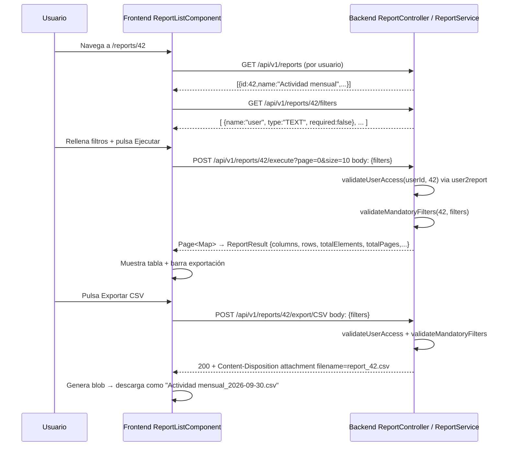

# Informes

Documentación funcional y técnica del módulo de Informes. Permite a los usuarios autorizados ejecutar los informes asignados, con filtros dinámicos por informe, paginación servidor y exportación en múltiples formatos. Además, proporciona un componente reutilizable de selección multiple para asignar informes a usuarios desde mantenimientos.

- **Ruta principal (ejecución):** `/reports/:id` (carga `ReportListComponent`).
- **Componente reutilizable:** `TpSelectedReportsComponent` (`<tp-selected-reports>`), usado en formularios de mantenimiento de usuarios.
- **Endpoint backend base:** `/api/v1/reports` (`ReportController`).
- **Acceso:** requiere sesión y la autoridad `REPORT_EXECUTE`; además, cada `execute`/`export` valida que el usuario tenga el informe asignado vía `user2report`.

---

## 1. Requisitos

Identificadores locales: `RF-RPT-*` (funcionales) y `RNF-RPT-*` (no funcionales). La autenticación se especifica en [requirements.md](../../specification/requirements.md).

### 1.1. Requisitos funcionales

#### RF-RPT-1: Carga de metadatos y definición de filtros

**Descripción:** al acceder a `/reports/:id`, el sistema carga los metadatos del informe y sus filtros dinámicos sin ejecutar automáticamente la consulta de datos.

**Criterios de aceptación:**

- AC1.1: La cabecera muestra `report.name` y `report.description`.
- AC1.2: Se renderiza una barra de filtros con un control por filtro, según `type`: `TEXT`, `NUMBER`, `DATE`, `SELECT`.
- AC1.3: La tabla de resultados y la barra de exportación aparecen vacías hasta que el usuario pulse *Ejecutar*.
- AC1.4: Si el usuario no tiene el informe asignado en `user2report`, `findByUser` no lo devuelve y el componente queda con `report = null` (sin cabecera, sin ejecución).

#### RF-RPT-2: Filtros dinámicos y obligatorios

**Descripción:** cada informe declara sus propios filtros (obligatorios u opcionales) y el sistema debe validar los obligatorios antes de ejecutar/exportar.

**Criterios de aceptación:**

- AC2.1: `TEXT`/`NUMBER` → `<input>`; `DATE` → `<input type="date">`; `SELECT` → `<select>` con opción vacía `common.all`.
- AC2.2: Los filtros `required=true` se marcan visualmente con asterisco rojo y usan el atributo `required` HTML5.
- AC2.3: *Limpiar* restablece todos los valores a `''`, resetea resultados y vuelve a página 0.
- AC2.4: Si faltan filtros obligatorios, el submit HTML5 bloquea la ejecución y el backend devolvería `ValidationException` de alcanzarse.

#### RF-RPT-3: Ejecución con paginación en servidor

**Descripción:** el usuario pulsa *Ejecutar* y se obtienen resultados paginados del lado del servidor, con navegación y selección de tamaño de página.

**Criterios de aceptación:**

- AC3.1: `POST /api/v1/reports/{id}/execute` con body `filters` y query params `page` / `size` (default `page=0`, `size=10`).
- AC3.2: El backend valida `validateUserAccess` y `validateMandatoryFilters` antes de ejecutar.
- AC3.3: Muestra spinner + notificación `notification.progress` mientras dura la ejecución.
- AC3.4: Renderiza tabla con `ReportResult.columns` como cabeceras y `ReportResult.rows` como filas; si está vacío, `common.noData`.
- AC3.5: Paginador del footer:
  - Anterior / Siguiente y hasta 5 números de página alrededor de la actual.
  - Tamaños de página: 5, 10, 20, 50.
  - Etiqueta `common.pagination.showing` (from/to/total).
- AC3.6: Cualquier cambio de página o tamaño dispara una nueva ejecución servidor con los mismos filtros.

#### RF-RPT-4: Exportación en formatos PDF / XLSX / CSV / TXT

**Descripción:** tras una ejecución exitosa, el usuario puede exportar los resultados con los mismos filtros, en cualquiera de los 4 formatos.

**Criterios de aceptación:**

- AC4.1: La barra de exportación (PDF, XLSX, CSV, TXT) solo aparece si `hasExecuted() == true`.
- AC4.2: Cada botón dispara `POST /api/v1/reports/{id}/export/{format}` con los filtros actuales.
- AC4.3: Backend devuelve bytes con `Content-Type` apropiado y `Content-Disposition: attachment; filename="report_{id}.{ext}"`.
- AC4.4: Frontend renombra la descarga a `${report.name}_YYYY-MM-DD.${format.toLowerCase()}`.
- AC4.5: CSV y TXT están implementados. PDF y XLSX lanzan `ReportExportException: "Export format PDF/XLSX not yet implemented"`; frontend muestra `notification.export.error`.
- AC4.6: Progresos y resultados se notifican (`notification.export.progress`, `notification.export.success`, `notification.export.error`).

#### RF-RPT-5: Selección multiple de informes (componente CVA)

**Descripción:** `<tp-selected-reports>` gestiona una lista de informes asignados (por ejemplo, en el formulario de usuario) y permite añadirlos mediante un modal paginado servidor.

**Criterios de aceptación:**

- AC5.1: Implementa `ControlValueAccessor` y su valor es `number[]` (IDs de informes).
- AC5.2: Muestra listado de seleccionados vía `tp-data-list` con filtro cliente y botón de eliminar por fila.
- AC5.3: Botón *Añadir* abre un modal con búsqueda servidor y paginación.
- AC5.4: El modal consulta `GET /api/v1/reports/search?name=&page=&size=`.
- AC5.5: Soporta selección multiple y "Seleccionar/Deseleccionar todos de la página".
- AC5.6: Confirmar modal sobreescribe el valor CVA con los IDs seleccionados.
- AC5.7: Cualquier cambio dispara `onTouched()` y `onChange()`.

### 1.2. Requisitos no funcionales

- **RNF-RPT-1 (Autorización):**
  - `/api/v1/reports/**` requiere autoridad `REPORT_EXECUTE` (definida en `SecurityConfig.java`, línea 131).
  - `execute` y `export` validan además la asignación vía `user2report` → `AccessDeniedException` si no existe.
- **RNF-RPT-2 (Integridad de filtros):** doble validación (HTML5 required en formulario + `validateMandatoryFilters` backend) antes de consultar datos.
- **RNF-RPT-3 (Paginación servidor):** resultados, búsqueda modal y ejecuciones usan siempre `Pageable`; no se emula paginación en cliente.
- **RNF-RPT-4 (i18n):** textos de la pantalla bajo claves `reports.*`, `common.*` y `selected-reports.*`.
- **RNF-RPT-5 (Sesión):** `ReportController.getAuthenticatedUserId()` resuelve el usuario a partir del `Authentication` de Spring Security y consulta `UserService.findByUsername`.
- **RNF-RPT-6 (Feedback):** `NotificationService` informa de progreso, éxito y error en ejecuciones y exportaciones.
- **RNF-RPT-7 (Codificación exportación):**
  - CSV UTF-8 sin BOM; campos con `,`, `"` o `\n` se entrecomillan y doblan comillas internas.
  - TXT UTF-8 con cabecera y separador `---`.
  - PDF y XLSX reservados para integraciones reales (placeholder con `ReportExportException`).

---

## 2. Parte funcional

### 2.1. Objetivo

Pantalla paramétrica común para ejecutar cualquier informe y exportarlo en varios formatos, más un componente reutilizable CVA para asignar informes en mantenimientos.

### 2.2. Vistas de la pantalla

#### Vista de ejecución (`ReportListComponent`)

Ruta `/reports/:id`. Flujo:

1. Cabecera (nombre y descripción del informe).
2. Barra de filtros dinámica + botones *Limpiar* / *Ejecutar*.
3. Barra de exportación (solo post-ejecución).
4. Tabla de resultados paginada servidor.

#### Vista de selección multiple (`TpSelectedReportsComponent`)

Integrable en formularios. Cuenta con:

1. Listado de informes asignados, filtrado cliente y opción de quitar.
2. Botón *Añadir* → modal paginado servidor con búsqueda y selección multiple.

### 2.3. Patrón visual reutilizable y wireframes

#### Pantalla de ejecución de informe

```text
┌─────────────────────────────────────────────────────────────────────────────┐
│ Nombre del informe (h1)                                                     │
│ Descripción breve del informe                                               │
├─────────────────────────────────────────────────────────────────────────────┤
│ [Filtro 1 *] [Filtro 2] [Fecha desde ▾] [Sección ▾]   [Limpiar] [Ejecutar] │
├─────────────────────────────────────────────────────────────────────────────┤
│ [PDF] [XLSX] [CSV] [TXT]                                           (solo tras ejecutar) │
├─────────────────────────────────────────────────────────────────────────────┤
│ columna A │ columna B │ columna C │ …                                       │
│─────────────────────────────────────────────────────────────────────────────│
│ A1        │ B1        │ C1        │ …                                       │
│ A2        │ B2        │ C2        │ …                                       │
├─────────────────────────────────────────────────────────────────────────────┤
│ Mostrando 1–10 de 234           < 1 2 3 4 5 >      Tamaño página [10 ▾]    │
└─────────────────────────────────────────────────────────────────────────────┘
```

#### Modal de selección multiple de informes

```text
┌──────────────────────────────────────────────────────────────────────────┐
│ Seleccionar informes                                            [x]     │
├──────────────────────────────────────────────────────────────────────────┤
│ 🔍 [ Buscar por nombre ... ]                                              │
├──────────────────────────────────────────────────────────────────────────┤
│  │ Nombre                       │ Descripción                             │
│──┼──────────────────────────────┼─────────────────────────────────────────│
│☑ │ Informe de actividad mensual │ Agrupación mensual por usuario         │
│☐ │ Informe de errores           │ Errores de interfaces y jobs           │
│  │ …                            │ …                                      │
├──────────────────────────────────────────────────────────────────────────┤
│ Mostrando 1–5 de 23      < 1 2 3 4 5 >          Tamaño página [5 ▾]      │
├──────────────────────────────────────────────────────────────────────────┤
│ 2 seleccionados                                        [Cancelar] [Aceptar] │
└──────────────────────────────────────────────────────────────────────────┘
```

### 2.4. Identificadores para pruebas (`data-testid`)

| Elemento | data-testid |
| --- | --- |
| Formulario de filtros | `report-filter-form` |
| Input de filtro con nombre `name` | `report-filter-${name}` |
| Botón Ejecutar | `report-execute-btn` |
| Botón Limpiar | `report-clear-btn` |
| Exportar PDF / XLSX / CSV / TXT | `report-export-pdf` / `xlsx` / `csv` / `txt` |
| Tabla de resultados | `report-results-table` |
| Tamaño página (resultados) | `report-page-size` |
| Modal `tp-selected-reports` | `${testId}-modal` |
| Buscar modal / fila id / paginación / tamaño / cancelar / aceptar | `${testId}-modal-search` / `-modal-row-${id}` / `-modal-pagination` / `-modal-page-size` / `-modal-cancel` / `-modal-accept` |

### 2.5. Diagramas

#### 2.5.1. Flujo de ejecución y exportación



---

## 3. Parte técnica

### 3.1. Componentes afectados

| Capa | Componente | Propósito |
| --- | --- | --- |
| Frontend | `ReportListComponent` | Pantalla de ejecución paramétrica y consulta de resultados. |
| Frontend | `TpSelectedReportsComponent` | CVA reutilizable de selección múltiple para informes asignados. |
| Frontend | `ReportService` (TS) | Cliente HTTP para `/reports`, filtros y exportación. |
| Backend | `ReportController` | Exposición de endpoints `/api/v1/reports` para listado, ejecución y exportación. |
| Backend | `ReportService` | Listado, asignación, ejecución y exportación de informes. |
| Backend | `ReportRepository` y `User2ReportRepository` | Acceso a datos para informes y relaciones usuario–informe. |
| Domain | `Report` | Entidad principal con metadatos del informe. |
| Domain | `User2Report` | Relación N:M entre usuarios e informes. |
| Security | `SecurityConfig` | Regla `/api/v1/reports/**` requiere `REPORT_EXECUTE`. |

### 3.2. Modelos de datos

#### Frontend (TypeScript)

```typescript
// report.model.ts
export type ExportFormat = 'PDF' | 'XLSX' | 'CSV' | 'TXT';

export interface Report {
  id: number;
  name: string;
  description: string;
}

export interface ReportFilter {
  name: string;
  label: string;
  type: 'TEXT' | 'NUMBER' | 'DATE' | 'SELECT';
  required: boolean;
  options?: string[];
}

export interface ReportResult {
  columns: string[];
  rows: Record<string, string>[];
  totalElements: number;
  totalPages: number;
  size: number;
  number: number;
}
```

#### Backend DTOs (Java)

```java
public record ReportDTO(
    Long id,
    String name,
    String description,
    OffsetDateTime createdAt,
    OffsetDateTime lastModifiedAt
) {}

public record ReportFilterDTO(String name, String type, boolean required) {}

public enum ExportFormat { PDF, XLSX, CSV, TXT }
```

#### Entidades JPA

```java
@Entity @Table(name = "report")
public class Report extends BaseEntity {
    @Column(nullable = false) private String name;
    private String description;
    @OneToMany(mappedBy = "report") private List<User2Report> userReports = new ArrayList<>();
}

@Entity @Table(name = "user2report")
public class User2Report {
    @EmbeddedId private User2ReportPK id;
    @ManyToOne(fetch = LAZY) @MapsId("userId")  @JoinColumn(name = "user_id") private User user;
    @ManyToOne(fetch = LAZY) @MapsId("reportId") @JoinColumn(name = "report_id") private Report report;
}
```

### 3.3. Endpoints

| Método HTTP | Ruta | Descripción |
| --- | --- | --- |
| `GET`  | `/api/v1/reports` | Lista informes asignados al usuario autenticado (vía `user2report`) |
| `GET`  | `/api/v1/reports/all` | Todos los informes (administración y carga de caché en CVA) |
| `GET`  | `/api/v1/reports/search?name=&page=&size=` | Búsqueda paginada servidor |
| `GET`  | `/api/v1/reports/{id}/filters` | Definición de filtros de un informe |
| `POST` | `/api/v1/reports/{id}/execute?page=&size=` | Ejecución paginada servidor; body: `Map<String,Object>` de filtros |
| `POST` | `/api/v1/reports/{id}/export/{format}` | Exportación; body: mismos filtros; respuesta `application/octet` con `Content-Disposition: attachment` |

### 3.4. Validaciones

- `ReportService.validateUserAccess(userId, reportId)`: busca en `user2report`; si no `AccessDeniedException("User does not have access to report with id: ...")`.
- `ReportService.validateMandatoryFilters(reportId, filters)`: itera `getFilters` y si falta alguno `required=true` → `ValidationException("Missing mandatory filters: a, b")`.
- HTML5 `required` en los inputs del formulario frontend refuerza la validación cliente.

### 3.5. Exportación

- **CSV**: `id,name,description` como cabecera; escapes de valores. Nombre backend `report_42.csv`.
- **TXT**: bloque `Report: ... / Description: ... / --- / No data available (placeholder implementation)`.
- **PDF / XLSX**: plantilla actual lanza `ReportExportException("Export format PDF not yet implemented")`.
- Frontend renombra a `${report.name}_YYYY-MM-DD.csv` (fecha local del navegador).

---

## 4. Pruebas

### 4.1. Cobertura unitaria (backend)

| Ubicación | Alcance |
|-----------|---------|
| `core/src/test/java/org/myorganization/template/core/service/ReportServiceTest.java` | `findByUser`, `findAll`, `findAll(name, pageable)`, `getFilters`, `execute` (control de acceso y filtros obligatorios), `export` (CSV/TXT OK, PDF/XLSX no implementados) |
| `webapp/src/test/java/org/myorganization/template/webapp/controller/ReportControllerTest.java` | Endpoints `/all`, `/search`, `/filters`, `/execute`, `/export/*` con validación de estados 200, 403 y 404 |
| `ws/src/test/java/org/myorganization/template/ws/security/AuthorizationEnforcementProperties.java` | `Property 5`: verificación de 403 Forbidden en `/api/v1/reports/**` sin `REPORT_EXECUTE` |
| `ws/src/test/java/org/myorganization/template/ws/security/JwtTokenProvider*Test.java` | Verificación de claims y autorización con acción `REPORT_EXECUTE` |

### 4.2. Cobertura unitaria (frontend)

| Ubicación | Alcance |
|-----------|---------|
| `dashboard/src/app/core/services/report.service.spec.ts` | Endpoints `findUserReports`, `findAll`, `search`, `getFilters`, `execute` y `export` |
| `dashboard/src/app/features/reports/selected-reports/selected-reports.component.spec.ts` | Ciclo CVA, modal de selección, paginación, búsqueda, selección multiple y emisión de `onChange`/`onTouched` |

### 4.3. Cobertura E2E (Playwright)

Ubicación: `dashboard/e2e/tests/reports/reports.spec.ts` (Page Object en `dashboard/e2e/pages/report.page.ts`).

| Caso | Descripción | Resultado esperado |
|------|-------------|--------------------|
| Estado inicial | Navegar a `/reports/1` tras iniciar sesión | Título y descripción visibles; formulario y botones presentes; tabla y botones de exportación ocultos antes de ejecutar |
| Ejecución y resultados | Pulsar botón *Ejecutar* | Carga datos vía `POST /execute`, muestra tabla de resultados con filas y activa la barra de exportación (PDF, XLSX, CSV, TXT) |
| Limpieza de filtros | Pulsar botón *Limpiar* tras ejecutar | Restablece valores de filtros y oculta la tabla de resultados y barra de exportación |
| Cambio de tamaño de página | Cambiar selector de tamaño de página (p. ej. a 5) | Dispara nueva petición paginada al servidor y actualiza la tabla |
| Exportación CSV y TXT | Exportar a CSV y TXT | El navegador descarga los ficheros con el formato `Informe de actividad mensual_YYYY-MM-DD.csv` y `.txt` |
| Navegación lateral | Desplegar menú lateral "Informes" y pulsar "Informe de actividad mensual" | Navega a `/reports/1` y carga el informe correspondiente |

### 4.4. Datos de prueba

Los datos semilla para informes y asignaciones al usuario administrador se encuentran en `domain/src/main/resources/db/changelog/data/v1.0.0/20250117-seed-local-reports.xml`.

### 4.5. Dependencias de ejecución

- Base de datos con tabla `report` y `user2report` pobladas (seed `20250117-seed-local-reports.xml`).
- JWT con autoridad `REPORT_EXECUTE` para acceder a la ruta y endpoints.
- Backend de integración levantado (perfil `test`) para las llamadas a `/api/v1/reports/**`.

### 4.6. Casos clave (matriz)

| Caso | Resultado esperado |
| --- | --- |
| Usuario sin `REPORT_EXECUTE` accede a `/api/v1/reports/**` | 403 Forbidden |
| Usuario sin `user2report` ejecuta `POST /{id}/execute` | `AccessDeniedException` / 403 |
| Faltan filtros obligatorios en `execute` | `ValidationException` (filtros faltantes) |
| Ejecutar informe | 200 + `ReportResult {columns, rows, totalElements, totalPages, size, number}` |
| Cambiar `resultSize` a 50 tras ejecutar | Nueva llamada `/execute?size=50&page=0` |
| Cambiar página `resultPage=2` | `/execute?page=2&size=actual` |
| Exportar CSV | `text/csv` + `Content-Disposition: attachment; filename="report_{id}.csv"` |
| Exportar PDF/XLSX | `ReportExportException`; frontend notificación error |
| Modal: buscar nombre | `/search?name=` + `page=0` y actualiza `modalReports` y `modalTotalElements` |
| Modal: "seleccionar página" | Marca/desmarca todos los IDs de `modalReports` en `modalSelectedIds` |
| Confirmar modal | `selectedIds` actualizado, `onChange` emitido, modal cerrado |

---

## Documentación relacionada

- [Glosario (ReportService)](../../specification/glossary.md)
- [Modelo de datos (Informe)](../../specification/data-model.md)
- [Acciones de seguridad (REPORT_EXECUTE)](../administration/security/actions.md)
- [Usuarios (asignación de informes)](../administration/security/users.md)
- [Navegación (menú "Informes")](../../03-technical/frontend/navigation.md)
- [API REST de informes](../../03-technical/backend/api.md)
