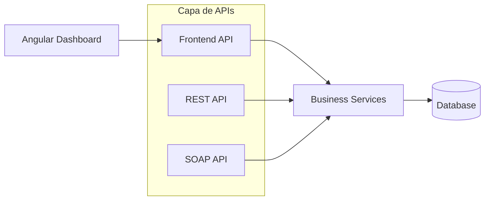
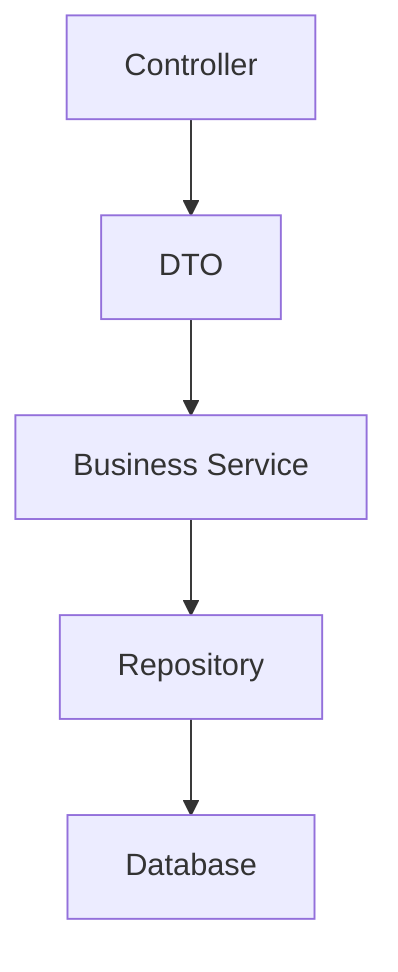

# Arquitectura de APIs

## Introducción

Template desacopla completamente la lógica de negocio de los mecanismos utilizados para exponer los servicios.

Para ello, la plataforma distingue entre las APIs utilizadas por la interfaz de usuario y aquellas destinadas a la integración con sistemas externos.

Todas las APIs consumen los mismos servicios de negocio, garantizando que la lógica funcional se implemente una única vez.

---

# Arquitectura



La lógica de negocio permanece completamente independiente de la tecnología utilizada para exponer los servicios.

---

# Frontend API

## Objetivo

La Frontend API proporciona todos los servicios necesarios para la aplicación Angular.

Está optimizada para minimizar el número de peticiones realizadas por la interfaz de usuario.

No constituye una API pública y puede evolucionar conjuntamente con el frontend.

---

## Características

- Uso exclusivo del Dashboard.
- DTO específicos para la interfaz de usuario.
- Autenticación mediante JWT.
- Optimizada para reducir llamadas.
- No garantiza compatibilidad entre versiones.

---

## Ejemplo

```
GET /api/ui/dashboard

GET /api/ui/users

GET /api/ui/reports
```

---

# APIs de Integración

## Objetivo

Las APIs de integración permiten que aplicaciones externas interactúen con Template.

Estas APIs representan contratos públicos y deben mantenerse estables entre versiones.

---

## REST API

La REST API está orientada a aplicaciones modernas.

Características:

- JSON
- HTTPS
- Versionado
- OpenAPI
- JWT u otros mecanismos de autenticación

Ejemplo:

```
GET /api/rest/users

POST /api/rest/contracts
```

---

## SOAP API

La plataforma puede exponer servicios SOAP cuando sea necesario mantener compatibilidad con aplicaciones existentes.

Los contratos se publican mediante WSDL.

---

## Futuras APIs

La arquitectura permite incorporar nuevas tecnologías de integración sin modificar la lógica de negocio.

Por ejemplo:

- GraphQL
- gRPC
- Kafka
- WebSockets

---

# Organización

Todas las APIs siguen la misma estructura lógica.



Cada API implementa únicamente la adaptación entre el protocolo utilizado y los servicios de negocio.

---

# Versionado

Las APIs públicas utilizan versionado.

Ejemplo:

```
/api/rest/v1

/api/rest/v2
```

La Frontend API evoluciona junto con la versión del Dashboard y no requiere mantener compatibilidad con versiones anteriores.

---

# Seguridad

Las APIs implementan autenticación y autorización.

Dependiendo del tipo de API podrán utilizarse diferentes mecanismos:

- JWT
- OAuth2
- API Keys
- Certificados
- Basic Authentication (SOAP)

La autorización siempre se realiza sobre los servicios de negocio.

---

# DTO

Las APIs nunca exponen directamente las entidades JPA.

Todas las operaciones utilizan objetos DTO específicos para cada consumidor.

Esto permite:

- Desacoplar la persistencia.
- Optimizar el tamaño de las respuestas.
- Mantener compatibilidad.
- Adaptar la información a cada consumidor.

---

# Gestión de errores

Todas las APIs proporcionan una respuesta uniforme en caso de error.

Las APIs REST utilizan códigos HTTP estándar.

Las APIs SOAP utilizan SOAP Fault.

---

# Documentación

Las APIs públicas se documentan mediante OpenAPI y, en el caso de SOAP, mediante WSDL.

La Frontend API no tiene por qué publicarse externamente, aunque puede documentarse internamente para facilitar el desarrollo del Dashboard.

---

# Principios de diseño

Todas las APIs desarrolladas sobre Template deben cumplir los siguientes principios:

- La lógica de negocio debe implementarse únicamente en los servicios de negocio.
- Las APIs actúan únicamente como adaptadores.
- No acceder directamente a la persistencia desde los controladores.
- No exponer entidades JPA.
- Mantener contratos estables para las APIs públicas.
- Optimizar la Frontend API para la experiencia de usuario.
- Documentar todas las APIs.

---

# Resumen

Template diferencia claramente entre las APIs orientadas a la interfaz de usuario y aquellas destinadas a la integración con otros sistemas.

Esta separación permite optimizar cada interfaz para su consumidor específico, manteniendo una única implementación de la lógica de negocio y facilitando la evolución independiente de cada mecanismo de integración.