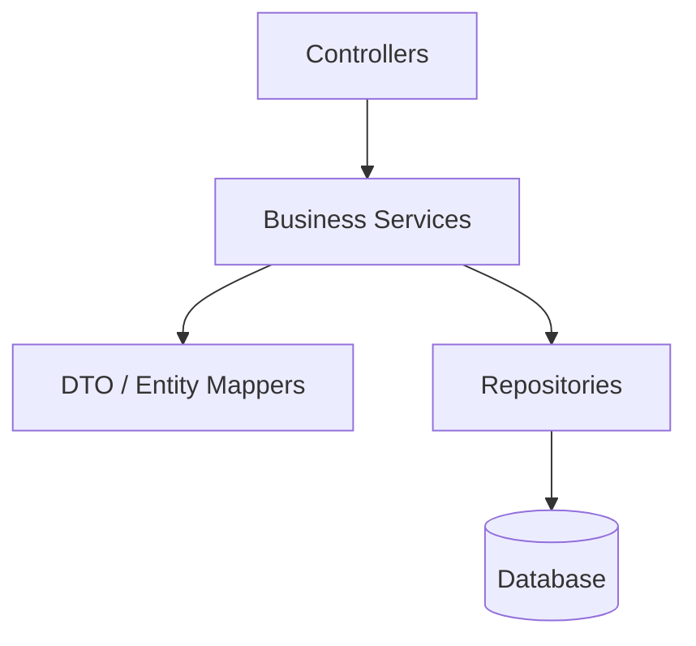
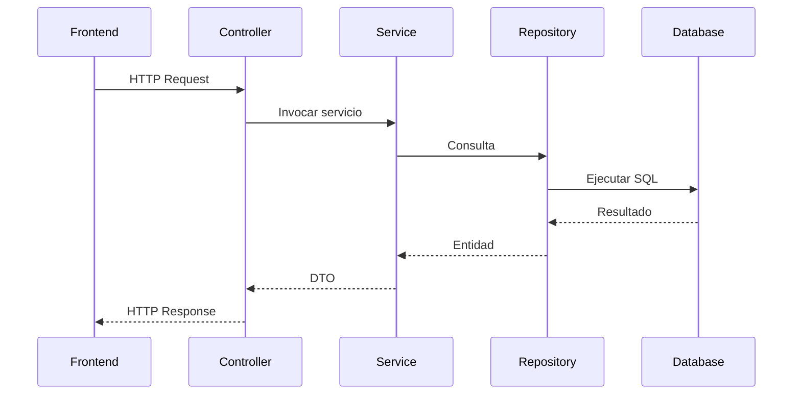
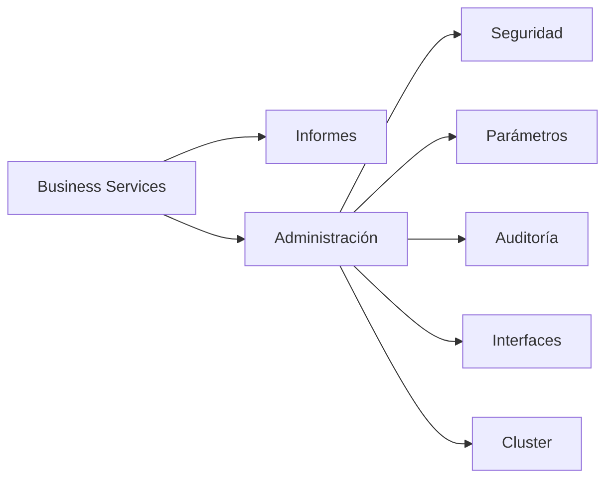
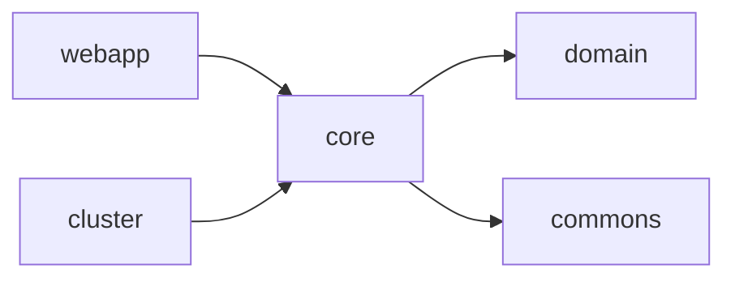

# Backend

## Introducción

El backend de **Template** constituye el núcleo de la plataforma y es el responsable de implementar toda la lógica de negocio de la aplicación.

Está desarrollado utilizando **Spring Boot** y sigue una arquitectura modular organizada en capas, donde cada componente tiene una responsabilidad claramente definida.

Esta organización facilita el mantenimiento, la reutilización de componentes y la evolución independiente de cada módulo funcional.

---

# Objetivos

El backend ha sido diseñado con los siguientes objetivos:

- Centralizar la lógica de negocio.
- Separar claramente las responsabilidades de cada componente.
- Facilitar la reutilización entre proyectos.
- Simplificar el mantenimiento.
- Permitir la incorporación de nuevos módulos funcionales.
- Facilitar la integración con sistemas externos.
- Garantizar la escalabilidad de la plataforma.

---

# Organización del proyecto

El backend se distribuye en varios módulos Maven.

```text
template/
│
├── commons/
│
├── cluster/
│
├── domain/
│
├── core/
│
└── webapp/
```

Cada módulo tiene una responsabilidad específica.

| Módulo | Descripción |
|---------|-------------|
| commons | Componentes reutilizables y utilidades comunes |
| cluster | Gestión de la alta disponibilidad y coordinación entre nodos |
| domain | Modelo de dominio, entidades, DTOs y objetos compartidos |
| core | Servicios de negocio, persistencia y procesos internos |
| webapp | Configuración de Spring Boot, APIs y seguridad |

---

# Arquitectura por capas

El backend sigue una arquitectura multicapa.



Cada capa únicamente interactúa con la inmediatamente inferior.

---

# Responsabilidad de las capas

## Controllers

Los controladores representan el punto de entrada de las distintas APIs.

Sus responsabilidades son:

- Recibir las peticiones.
- Validar los datos de entrada.
- Invocar los servicios de negocio.
- Construir la respuesta.

Los controladores no contienen lógica de negocio.

---

## Business Services

Los servicios implementan toda la lógica funcional de la aplicación.

Entre sus responsabilidades se encuentran:

- Aplicar reglas de negocio.
- Gestionar transacciones.
- Coordinar repositorios.
- Invocar servicios externos.
- Ejecutar procesos internos.

Toda la lógica de negocio debe residir exclusivamente en esta capa.

---

## Mappers

Los mappers realizan la conversión entre:

- Entidades.
- DTOs.
- Objetos de negocio.

La plataforma utiliza **MapStruct** para automatizar estas conversiones.

---

## Repositories

Los repositorios encapsulan el acceso a la base de datos.

Son responsables de:

- Consultas.
- Inserciones.
- Actualizaciones.
- Eliminaciones.

No implementan reglas de negocio.

---

## Persistencia

La persistencia se implementa mediante JPA/Hibernate.

La evolución del modelo de datos se gestiona mediante Liquibase.

Los detalles de implementación se describen en los documentos específicos de persistencia.

---

# Flujo de una petición

El siguiente diagrama muestra el recorrido habitual de una petición.



Este flujo se mantiene independientemente del tipo de API utilizada.

---

# Organización funcional

La plataforma organiza la lógica de negocio mediante módulos funcionales independientes.



Cada módulo encapsula su funcionalidad y puede evolucionar de forma independiente.

---

# Gestión de dependencias

Las dependencias entre módulos siguen una única dirección.



Esta organización evita dependencias circulares y facilita el mantenimiento del proyecto.

---

# Configuración

La configuración del backend se externaliza mediante el proyecto **template-properties**.

Esta configuración incluye, entre otros:

- Base de datos.
- Seguridad.
- Correo electrónico.
- Integraciones.
- Parámetros de ejecución.
- Configuración específica por entorno.

La separación entre código y configuración facilita el despliegue en distintos entornos.

---

# Gestión de transacciones

Las operaciones que modifican información se ejecutan dentro de transacciones gestionadas por Spring.

Las transacciones se definen en la capa de servicios, garantizando la consistencia de los datos.

---

# Gestión de excepciones

El backend dispone de un mecanismo centralizado para el tratamiento de errores.

Las excepciones se clasifican según su naturaleza:

- Excepciones de negocio.
- Excepciones técnicas.
- Errores de validación.

Todas ellas son transformadas en respuestas homogéneas por la capa de APIs.

---

# Escalabilidad

La arquitectura del backend permite desplegar la aplicación tanto en un único servidor como en entornos de alta disponibilidad.

La lógica de negocio permanece completamente independiente del modelo de despliegue utilizado.

---

# Integración

El backend proporciona distintos mecanismos para la integración con otros sistemas.

Entre ellos:

- APIs REST.
- Servicios SOAP.
- Directorios LDAP.
- Servidores SMTP.
- Otros mecanismos que puedan incorporarse en el futuro.

La arquitectura de las APIs se describe en el documento **api.md**.

---

# Buenas prácticas

Todo el desarrollo realizado sobre Template debe respetar las siguientes normas:

- Mantener la lógica de negocio exclusivamente en los servicios.
- No acceder directamente a la base de datos desde los controladores.
- Utilizar DTOs para todas las APIs.
- Evitar dependencias entre módulos funcionales.
- Mantener la separación entre configuración y código.
- Reutilizar los componentes comunes siempre que sea posible.
- Documentar adecuadamente las nuevas funcionalidades.

Las convenciones de desarrollo se describen con mayor detalle en el documento **coding-guidelines.md**.

---

# Documentación relacionada

Para obtener información más detallada sobre aspectos específicos del backend, consultar los siguientes documentos:

- [api.md](api.md)
- [security.md](security.md)
- [database-model.md](database-model.md)
- [liquibase.md](liquibase.md)
- [coding-guidelines.md](../../04-development/coding-guidelines.md)

---

# Resumen

El backend de Template constituye el núcleo funcional de la plataforma y concentra toda la lógica de negocio de la aplicación.

Su organización modular, la separación en capas y el uso de componentes especializados permiten desarrollar aplicaciones empresariales mantenibles, escalables y fácilmente extensibles, proporcionando una base sólida sobre la que construir nuevos módulos funcionales e integraciones con otros sistemas.