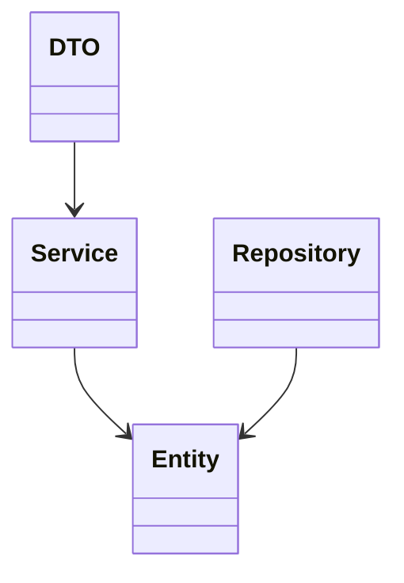
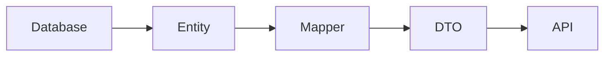

# Modelo de Datos

## Introducción

El modelo de datos de **Template** define la estructura lógica de la información gestionada por la plataforma.

Su diseño persigue los siguientes objetivos:

- Representar el dominio funcional de forma clara y consistente.
- Favorecer la reutilización de entidades comunes.
- Facilitar la evolución del modelo.
- Mantener la independencia entre la lógica de negocio y la persistencia.

El acceso al modelo se realiza mediante **JPA/Hibernate**, mientras que la evolución del esquema físico se gestiona mediante **Liquibase**.

---

# Principios de diseño

El modelo de datos se basa en los siguientes principios:

- Normalización de la información.
- Identificadores únicos para todas las entidades.
- Relaciones explícitas entre entidades.
- Separación entre entidades persistentes y DTOs.
- Auditoría de cambios.
- Evolución controlada mediante migraciones.

---

# Arquitectura del modelo



Las entidades representan el modelo persistente de la aplicación.

Los DTO constituyen el modelo utilizado por las APIs.

---

# Organización

Las entidades se agrupan por módulos funcionales.

```text
domain/

├── common/

├── security/

├── administration/

├── reports/

├── cluster/

└── ...
```

Cada módulo contiene únicamente las entidades relacionadas con su ámbito funcional.

---

# Entidades comunes

Existen una serie de entidades compartidas por toda la plataforma.

Entre ellas:

- Usuario
- Perfil
- Acción
- Parámetro
- Auditoría
- Idioma
- Notificación

Estas entidades forman parte del núcleo de Template y pueden ser utilizadas por cualquier módulo.

---

# Identificadores

Todas las entidades disponen de un identificador único.

Ejemplo:

```java
@Id
@GeneratedValue(strategy = GenerationType.IDENTITY)
private Long id;
```

La estrategia concreta de generación podrá variar según la base de datos utilizada.

---

# Relaciones

El modelo admite relaciones entre entidades utilizando las asociaciones estándar de JPA.

- One To One
- One To Many
- Many To One
- Many To Many

Todas las relaciones deben modelarse de forma explícita y documentarse cuando formen parte del dominio funcional.

---

# Herencia

Cuando varias entidades compartan información común, podrá utilizarse herencia.

Ejemplo:

```text
BaseEntity

↑

Usuario

Perfil

Parámetro
```

La estrategia de herencia dependerá de las necesidades funcionales de cada módulo.

---

# Auditoría

Las entidades pueden incorporar información de auditoría.

Habitualmente:

- Fecha de creación.
- Usuario creador.
- Fecha de modificación.
- Usuario modificador.

Esta información permite realizar el seguimiento de los cambios efectuados sobre los datos.

---

# Eliminación lógica

Cuando sea necesario conservar el histórico de la información, las entidades podrán implementar eliminación lógica mediante un indicador de estado.

De esta forma los registros permanecen almacenados aunque dejen de estar activos.

---

# Enumerados

Los valores constantes del dominio deberán modelarse mediante enumeraciones.

Ejemplos:

- Estado
- Tipo
- Prioridad
- Nivel

Esto mejora la legibilidad del código y evita valores literales.

---

# DTO

Las entidades JPA nunca se exponen directamente mediante las APIs.

Todas las comunicaciones utilizan DTO específicos.



Esta separación proporciona:

- Independencia entre persistencia y APIs.
- Mayor seguridad.
- Evolución independiente del modelo.
- Optimización de las respuestas.

---

# Repositorios

Cada entidad persistente dispone de un repositorio encargado del acceso a la base de datos.

Los repositorios implementan únicamente operaciones de persistencia.

La lógica de negocio pertenece exclusivamente a la capa de servicios.

---

# Convenciones

Todas las entidades desarrolladas sobre Template deben seguir las siguientes normas:

- Una entidad por fichero.
- Nombre en singular.
- Identificador único.
- Relaciones bidireccionales únicamente cuando sean necesarias.
- No incluir lógica de negocio.
- Utilizar tipos adecuados para cada atributo.
- Documentar relaciones complejas.

Las convenciones de nomenclatura se describen en **coding-guidelines.md**.

---

# Evolución del modelo

La evolución del modelo de datos se realiza exclusivamente mediante Liquibase.

Cada modificación del esquema debe ir acompañada de:

- Su correspondiente changelog.
- La actualización de la documentación.
- Las pruebas necesarias para validar la migración.

---

# Buenas prácticas

Durante el desarrollo deben respetarse las siguientes recomendaciones:

- Mantener entidades pequeñas y cohesionadas.
- Evitar relaciones innecesariamente complejas.
- Utilizar carga perezosa cuando sea posible.
- Evitar consultas N+1.
- No utilizar entidades como DTO.
- Mantener el modelo alineado con el dominio funcional.

---

# Documentación relacionada

Para ampliar la información sobre el modelo de datos consultar:

- [backend.md](backend.md)
- [liquibase.md](liquibase.md)
- [api.md](api.md)
- [coding-guidelines.md](../../04-development/coding-guidelines.md)

---

# Resumen

El modelo de datos de Template proporciona una representación consistente del dominio de la aplicación, separando claramente la persistencia de la lógica de negocio y de las APIs.

Su organización modular, junto con el uso de JPA/Hibernate y Liquibase, facilita la evolución controlada del modelo y garantiza la mantenibilidad de la plataforma a largo plazo.