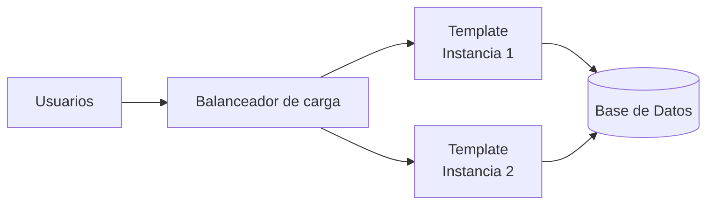

# Despliegue

## Introducción

Template ha sido diseñado para simplificar el despliegue de aplicaciones empresariales, permitiendo generar un único artefacto distribuible que integra tanto el backend como el frontend.

La plataforma soporta diferentes modelos de despliegue, desde instalaciones en un único servidor hasta entornos de alta disponibilidad con múltiples instancias.

---

# Artefacto generado

El resultado del proceso de construcción es un único archivo WAR.

```
template.war
```

Este artefacto contiene:

- Backend Spring Boot.
- Aplicación Angular.
- Recursos estáticos.
- Configuración interna.
- Dependencias necesarias para la ejecución.

El despliegue de la aplicación consiste únicamente en instalar este artefacto sobre el servidor de aplicaciones correspondiente.

---

# Arquitectura de despliegue

Una instalación típica de Template está formada por:



Dependiendo de las necesidades del proyecto, podrá desplegarse una única instancia o varias instancias trabajando en alta disponibilidad.

---

# Tipos de despliegue

## Servidor único

Es el modelo recomendado para:

- Desarrollo.
- Pruebas.
- Instalaciones pequeñas.

```text
Usuario
    │
Template
    │
Base de datos
```

---

## Alta disponibilidad

En este modelo varias instancias de Template comparten la misma base de datos.

Características:

- Balanceo de carga.
- Alta disponibilidad.
- Escalabilidad horizontal.
- Tolerancia a fallos.

La coordinación entre nodos se realiza mediante el módulo **cluster**.

---

# Entornos

La plataforma contempla diferentes entornos de ejecución.

| Entorno             | Objetivo                               |
|---------------------|----------------------------------------|
| Desarrollo (DES)    | Desarrollo y pruebas locales           |
| Integración (INT)   | Integración continua                   |
| Preproducción (PRE) | Validación previa al paso a producción |
| Producción (PRO)    | Entorno productivo                     |

Cada entorno dispone de su propia configuración.

---

# Configuración

La configuración de la plataforma se encuentra externalizada en el proyecto:

```
template-properties
```

Entre otros aspectos, permite configurar:

- Base de datos.
- Seguridad.
- Correo electrónico.
- Logs.
- Integraciones.
- Parámetros de la aplicación.

La configuración puede variar entre entornos sin necesidad de recompilar la aplicación.

---

# Base de datos

Antes del despliegue deberá existir una base de datos accesible por la aplicación.

La creación y actualización del esquema se realiza mediante **Liquibase**.

El proceso de despliegue incluye:

1. Actualización del esquema.
2. Inserción de datos iniciales.
3. Arranque de la aplicación.

---

# Despliegue del frontend

El frontend no requiere un proceso de despliegue independiente.

Durante la compilación:

1. Angular genera la aplicación estática.
2. Los recursos se copian al módulo **webapp**.
3. Maven genera el archivo **template.war**.

De esta forma el servidor únicamente distribuye un único artefacto.

---

# Docker

La plataforma puede ejecutarse utilizando contenedores Docker.

El proyecto **template-docker** proporciona los recursos necesarios para construir las imágenes y levantar la infraestructura mediante Docker Compose.

Dependiendo del entorno podrán desplegarse:

- Aplicación.
- Base de datos.
- Componentes auxiliares.

---

# Scripts de despliegue

Los scripts necesarios para automatizar el despliegue se encuentran en:

```
template-dist
```

Estos scripts permiten automatizar tareas como:

- Construcción.
- Copia de artefactos.
- Instalación.
- Actualización.
- Arranque.
- Parada.

Cuando sea necesario podrán existir scripts específicos para cada sistema operativo.

---

# Actualización de versiones

El proceso habitual de actualización consiste en:

1. Detener la aplicación.
2. Realizar copia de seguridad.
3. Ejecutar Liquibase.
4. Sustituir el archivo WAR.
5. Reiniciar la aplicación.
6. Verificar el funcionamiento.

Este procedimiento garantiza la consistencia entre la aplicación y el esquema de base de datos.

---

# Escalabilidad

Template ha sido diseñado para crecer de forma horizontal.

Es posible incrementar la capacidad del sistema añadiendo nuevas instancias sin modificar la lógica de negocio.

Las nuevas instancias únicamente requieren:

- Acceso a la base de datos.
- Configuración correspondiente.
- Inclusión en el balanceador de carga.

---

# Monitorización

La plataforma incorpora mecanismos para supervisar el estado de la aplicación.

Entre otros:

- Estado de las instancias.
- Interfaces.
- Recursos del sistema.
- Logs.
- Procesos.

Estas funcionalidades permiten detectar incidencias y facilitar las tareas de administración.

---

# Buenas prácticas

Se recomienda seguir las siguientes prácticas durante el despliegue:

- Externalizar toda la configuración.
- No modificar el artefacto generado.
- Automatizar el proceso mediante scripts.
- Versionar la configuración.
- Mantener sincronizados todos los entornos.
- Ejecutar siempre las migraciones mediante Liquibase.
- Realizar copias de seguridad antes de cada actualización.

---

# Documentación relacionada

Para ampliar la información consultar:

- [installation.md](../../04-development/installation.md)
- [configuration.md](../../04-development/configuration.md)
- [backend.md](backend.md)
- [liquibase.md](liquibase.md)
- [ha.md](ha.md)

---

# Resumen

Template genera un único artefacto desplegable (`template.war`) que integra el backend y el frontend de la aplicación.

La plataforma permite adaptarse a distintos escenarios de ejecución, desde instalaciones sencillas hasta arquitecturas de alta disponibilidad, manteniendo una configuración externalizada y un proceso de despliegue homogéneo para todos los entornos.