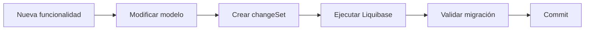

# Liquibase

## Introducción

Template utiliza **Liquibase** como herramienta para el control de versiones del esquema de base de datos.

Todas las modificaciones sobre la estructura de la base de datos deben realizarse mediante changelogs de Liquibase, garantizando que cualquier instalación pueda evolucionar automáticamente entre versiones de forma controlada y reproducible.

El uso de Liquibase proporciona:

- Versionado del esquema de base de datos.
- Automatización de las migraciones.
- Trazabilidad de los cambios.
- Repetibilidad de las instalaciones.
- Compatibilidad entre versiones.

---

# Objetivos

La estrategia de migraciones persigue los siguientes objetivos:

- Eliminar scripts SQL manuales.
- Garantizar que todos los entornos dispongan del mismo esquema.
- Facilitar la instalación de nuevas versiones.
- Permitir la evolución controlada del modelo de datos.
- Mantener el histórico completo de modificaciones.

---

# Organización del proyecto

Las migraciones se encuentran en el proyecto:

```text
template-liquibase/
```

Una organización recomendada es la siguiente:

```text
template-liquibase/

├── changelog/
│
├── schema/
│
├── data/
│
├── views/
│
├── procedures/
│
├── functions/
│
├── indexes/
│
└── master.xml
```

Cada directorio contiene un tipo específico de modificación.

| Directorio | Contenido |
|------------|-----------|
| schema | Creación y modificación de tablas |
| data | Datos iniciales |
| indexes | Índices |
| views | Vistas |
| procedures | Procedimientos almacenados |
| functions | Funciones |
| changelog | Organización de los changelogs |

---

# Changelog maestro

Todas las migraciones son referenciadas desde un changelog principal.

Ejemplo:

```xml
<databaseChangeLog>

    <include file="schema/001-create-security.xml"/>

    <include file="schema/002-create-users.xml"/>

    <include file="data/001-initial-users.xml"/>

</databaseChangeLog>
```

El orden de inclusión determina el orden de ejecución.

---

# Organización de los cambios

Cada modificación de la base de datos debe almacenarse en un fichero independiente.

Ejemplo:

```text
schema/

001-create-security.xml

002-create-users.xml

003-create-roles.xml

004-create-permissions.xml
```

No se deben agrupar múltiples funcionalidades no relacionadas en un mismo changelog.

---

# Identificación de los cambios

Cada `changeSet` debe disponer de un identificador único.

Ejemplo:

```xml
<changeSet
    id="001-create-users"
    author="template">

    ...

</changeSet>
```

Una vez publicado, un `changeSet` nunca debe modificarse.

---

# Evolución del esquema

La evolución del esquema se basa en un principio fundamental:

> **La base de datos únicamente evoluciona hacia adelante.**

Las modificaciones existentes no deben editarse.

Cuando sea necesario cambiar una estructura ya desplegada, deberá añadirse un nuevo `changeSet`.

---

# Datos iniciales

Los datos necesarios para el funcionamiento de la plataforma se cargan mediante Liquibase.

Por ejemplo:

- Usuarios administrativos.
- Perfiles.
- Acciones.
- Parámetros.
- Idiomas.
- Configuración inicial.

Estos datos forman parte de la instalación estándar de Template.

---

# Versionado

Cada versión de Template incorpora las migraciones necesarias para actualizar la base de datos.

El proceso de actualización consiste en ejecutar automáticamente todos los `changeSet` pendientes.

Liquibase registra las migraciones ejecutadas mediante sus tablas internas.

---

# Compatibilidad

Las migraciones deben ser compatibles con la base de datos soportada por la plataforma.

Siempre que sea posible se utilizarán elementos independientes del motor de base de datos.

Cuando una funcionalidad sea específica de un fabricante, deberá documentarse adecuadamente.

---

# Flujo de trabajo

El proceso habitual para incorporar una modificación es el siguiente:



---

# Buenas prácticas

Durante el desarrollo deben seguirse las siguientes recomendaciones:

- Un único cambio funcional por changelog.
- No modificar changeSets ya publicados.
- Utilizar nombres descriptivos.
- Mantener un orden secuencial.
- Documentar cambios complejos.
- Evitar SQL específico cuando no sea necesario.
- Probar todas las migraciones antes de publicarlas.

---

# Rollback

Siempre que sea posible, los cambios deberán definir su operación de rollback.

Ejemplo:

```xml
<rollback>

    <dropTable tableName="users"/>

</rollback>
```

Esto facilita la recuperación ante incidencias durante el despliegue.

---

# Integración con Maven

Las migraciones pueden ejecutarse durante el proceso de despliegue o mediante tareas específicas de Maven.

La estrategia concreta dependerá del entorno de ejecución y del proceso de integración continua adoptado por cada proyecto.

---

# Relación con el modelo de datos

Toda modificación del modelo de datos debe ir acompañada de:

- Actualización del modelo de dominio.
- Nuevo changelog de Liquibase.
- Actualización de la documentación.
- Validación mediante pruebas.

La evolución del código y de la base de datos debe mantenerse sincronizada.

---

# Documentación relacionada

Para ampliar la información consultar:

- **database-model.md**
- **backend.md**
- **deployment.md**
- **configuration.md**

---

# Resumen

Liquibase constituye el mecanismo oficial de gestión del esquema de base de datos de Template.

Todas las modificaciones del modelo de datos deben implementarse mediante changelogs versionados, garantizando instalaciones reproducibles, actualizaciones seguras y una evolución controlada de la plataforma a lo largo de todo su ciclo de vida.