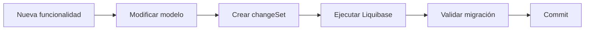

# Liquibase

## Introducción

Template utiliza **Liquibase** como herramienta para el control de versiones del esquema de base de datos.

Todas las modificaciones sobre la estructura de la base de datos deben realizarse mediante changelogs de Liquibase, garantizando que cualquier instalación pueda evolucionar automáticamente entre versiones de forma controlada y reproducible.

El uso de Liquibase proporciona:

- Versionado del esquema de base de datos.
- Automatización de las migraciones.
- Trazabilidad de los cambios.
- Repetibilidad de las instalaciones.
- Compatibilidad entre versiones.

---

# Objetivos

La estrategia de migraciones persigue los siguientes objetivos:

- Eliminar scripts SQL manuales.
- Garantizar que todos los entornos dispongan del mismo esquema.
- Facilitar la instalación de nuevas versiones.
- Permitir la evolución controlada del modelo de datos.
- Mantener el histórico completo de modificaciones.

---

# Organización del proyecto

Las migraciones se encuentran en el proyecto:

```text
template-liquibase/
```

Los ficheros de migración se ubican en `template-liquibase/src/main/resources/db/changelog/`.

La organización es la siguiente:

```text
src/main/resources/db/
└── changelog/
    ├── db.changelog-master.xml
    ├── migrations/
    │   ├── v1.0.0/
    │   ├── v1.1.0/
    │   └── v2.0.0/
    └── data/
        └── v1.0.0/
```

Los changesets se organizan en carpetas por versión dentro de `migrations/`. Los datos iniciales se ubican en `data/`.

---

# Changelog maestro

Todas las migraciones son referenciadas desde un changelog principal (`db.changelog-master.xml`).

Se utiliza `includeAll` para incluir automáticamente todos los ficheros XML de cada directorio de versión, en orden alfabético. Esto evita tener que registrar manualmente cada fichero.

Ejemplo:

```xml
<?xml version="1.0" encoding="UTF-8"?>
<databaseChangeLog
    xmlns="https://www.liquibase.org/xml/ns/dbchangelog"
    xmlns:xsi="http://www.w3.org/2001/XMLSchema-instance"
    xsi:schemaLocation="https://www.liquibase.org/xml/ns/dbchangelog
        https://www.liquibase.org/xml/ns/dbchangelog/dbchangelog-4.20.xsd">

    <includeAll path="migrations/v1.0.0/" relativeToChangelogFile="true"/>

    <includeAll path="migrations/v1.1.0/" relativeToChangelogFile="true"/>

    <includeAll path="data/v1.0.0/" relativeToChangelogFile="true"/>

</databaseChangeLog>
```

El orden de los bloques `includeAll` determina el orden de ejecución entre versiones. Dentro de cada directorio, los ficheros se procesan en orden alfabético, por lo que el formato `YYYYMMDD-` en el nombre garantiza la secuencia correcta.

---

# Organización de los cambios

Cada modificación de la base de datos debe almacenarse en un fichero independiente.

Los ficheros siguen el formato `YYYYMMDD-descripcion-kebab-case.xml`.

Ejemplo:

```text
migrations/v1.0.0/

20240101-create-security.xml

20240102-create-users.xml

20240103-create-roles.xml

20240104-create-permissions.xml
```

No se deben agrupar múltiples funcionalidades no relacionadas en un mismo changelog.

---

# Identificación de los cambios

Cada `changeSet` dispone de un identificador único y es inmutable una vez publicado.

Ver formato obligatorio, campos requeridos y estructura interna en [Reglas de Codificación — Liquibase](../../04-development/coding-guidelines/liquibase.md#formato-de-changesets).

---

# Evolución del esquema

La evolución del esquema se basa en un principio fundamental:

> **La base de datos únicamente evoluciona hacia adelante.**

Las modificaciones existentes no deben editarse.

Cuando sea necesario cambiar una estructura ya desplegada, deberá añadirse un nuevo `changeSet`.

---

# Datos iniciales

Los datos necesarios para el funcionamiento de la plataforma se cargan mediante Liquibase.

Por ejemplo:

- Usuarios administrativos.
- Perfiles.
- Acciones.
- Parámetros.
- Idiomas.
- Configuración inicial.

Estos datos forman parte de la instalación estándar de Template.

---

# Versionado

Cada versión de Template incorpora las migraciones necesarias para actualizar la base de datos.

El proceso de actualización consiste en ejecutar automáticamente todos los `changeSet` pendientes.

Liquibase registra las migraciones ejecutadas mediante sus tablas internas.

---

# Compatibilidad

Las migraciones deben ser compatibles con la base de datos de la plataforma. Consultar la base de datos de referencia en [technologies.md](../../01-introduction/technologies.md).

Siempre que sea posible se utilizarán elementos independientes del motor de base de datos.

Cuando una funcionalidad sea específica de un fabricante, deberá documentarse adecuadamente.

---

# Flujo de trabajo

El proceso habitual para incorporar una modificación es el siguiente:



---

# Buenas prácticas

Ver el listado completo de reglas y recomendaciones en [Reglas de Codificación — Liquibase](../../04-development/coding-guidelines/liquibase.md).

---

# Rollback

Siempre que sea posible, los cambios deberán definir su operación de rollback explícita para facilitar la recuperación ante incidencias durante el despliegue.

Ver convenciones en [Reglas de Codificación — Liquibase](../../04-development/coding-guidelines/liquibase.md#reglas-de-los-changesets).

---

# Integración con Maven

Las migraciones pueden ejecutarse durante el proceso de despliegue o mediante tareas específicas de Maven.

Ver comandos disponibles en [Reglas de Codificación — Liquibase](../../04-development/coding-guidelines/liquibase.md#comandos-habituales).

---

# Relación con el modelo de datos

Toda modificación del modelo de datos debe ir acompañada de:

- Actualización del modelo de dominio.
- Nuevo changelog de Liquibase.
- Actualización de la documentación.
- Validación mediante pruebas.

La evolución del código y de la base de datos debe mantenerse sincronizada.

---

# Documentación relacionada

Para ampliar la información consultar:

- [database-model.md](database-model.md)
- [backend.md](backend.md)
- [deployment.md](deployment.md)
- [configuration.md](../../04-development/configuration.md)
- [Reglas de Codificación — Liquibase](../../04-development/coding-guidelines/liquibase.md)

---

# Resumen

Liquibase constituye el mecanismo oficial de gestión del esquema de base de datos de Template.

Todas las modificaciones del modelo de datos deben implementarse mediante changelogs versionados, garantizando instalaciones reproducibles, actualizaciones seguras y una evolución controlada de la plataforma a lo largo de todo su ciclo de vida.