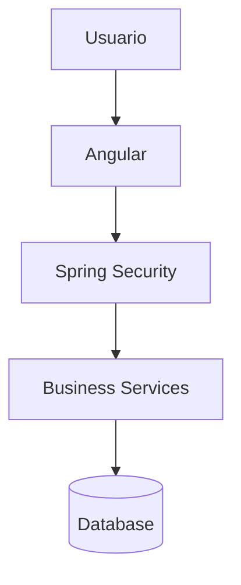
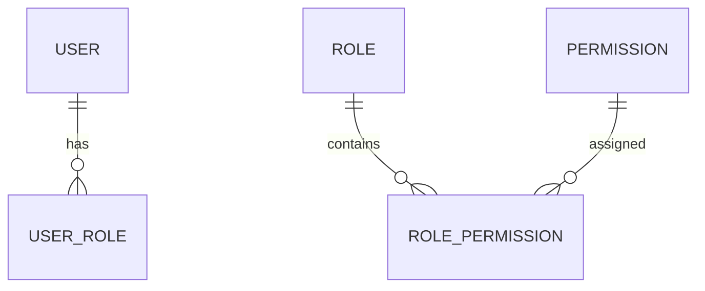
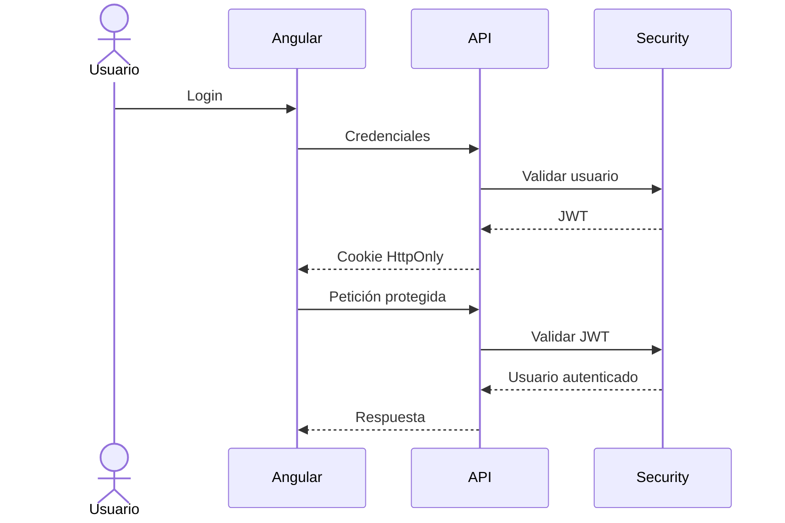

# Seguridad

## Introducción

La seguridad constituye uno de los pilares fundamentales de **Template**.

La plataforma incorpora un modelo de seguridad completo que permite controlar tanto la autenticación de los usuarios como la autorización sobre las funcionalidades disponibles.

Su diseño sigue el principio de **Security by Design**, integrando los mecanismos de seguridad desde la propia arquitectura de la aplicación.

---

# Objetivos

El modelo de seguridad persigue los siguientes objetivos:

- Garantizar la autenticación de los usuarios.
- Controlar el acceso a las funcionalidades.
- Proteger la información sensible.
- Facilitar la integración con sistemas corporativos.
- Permitir distintos mecanismos de autenticación.
- Centralizar la gestión de permisos.

---

# Arquitectura

La seguridad se implementa como una capa transversal utilizada por toda la plataforma.

Todas las peticiones protegidas son validadas antes de acceder a la lógica de negocio.

---

# Modelo de seguridad

Template basa su modelo de autorización en cuatro elementos principales:

Los conceptos principales son:

| Elemento | Descripción                             |
|----------|-----------------------------------------|
| Usuario  | Persona que accede al sistema           |
| Perfil   | Agrupación de permisos                  |
| Acción   | Permiso para ejecutar una funcionalidad |
| Sesión   | Contexto de autenticación del usuario   |

---

# Usuarios

Los usuarios representan las identidades autorizadas para acceder a la aplicación.

Entre otras características disponen de:

- Identificador.
- Nombre de usuario.
- Contraseña (o autenticación externa).
- Estado.
- Idioma.
- Preferencias.

---

# Perfiles

Los perfiles agrupan un conjunto de permisos.

Ejemplos:

- Administrador
- Supervisor
- Operador
- Consulta

Un usuario puede pertenecer a uno o varios perfiles.

---

# Acciones

Las acciones representan el nivel mínimo de autorización.

Cada funcionalidad protegida de la plataforma requiere una acción determinada.

Ejemplos:

- USER_READ
- USER_CREATE
- USER_UPDATE
- USER_DELETE

Este enfoque permite desacoplar las funcionalidades de los perfiles concretos.

---

# Autenticación

La plataforma soporta distintos mecanismos de autenticación.

Actualmente:

- Usuario y contraseña.
- JWT.
- Cookies HttpOnly.

Opcionalmente podrán incorporarse:

- LDAP.
- Active Directory.
- OAuth2.
- OpenID Connect.
- Single Sign-On.

La autenticación seleccionada dependerá de las necesidades del proyecto.

---

# Flujo de autenticación

---

# Autorización

Una vez autenticado, el usuario únicamente podrá acceder a aquellas funcionalidades para las que disponga de autorización.

La autorización se realiza mediante acciones y no mediante perfiles.

Los perfiles únicamente agrupan dichas acciones.

---

# Seguridad de las API's

Todas las API's pueden protegerse mediante mecanismos de autenticación.

Dependiendo del tipo de API podrán utilizarse:

- JWT.
- OAuth2.
- API Keys.
- Basic Authentication.
- Certificados digitales.

La autorización siempre se realiza sobre la lógica de negocio.

---

# Gestión de sesiones

La plataforma utiliza autenticación basada en tokens.

El estado de autenticación se mantiene mediante:

- JWT.
- Cookies HttpOnly.

Este mecanismo evita el uso de sesiones tradicionales en el servidor y facilita el despliegue en arquitecturas distribuidas.

---

# Contraseñas

Las contraseñas nunca se almacenan en texto plano.

Se recomienda utilizar algoritmos robustos de hash, como BCrypt, junto con las políticas de seguridad definidas por la organización.

---

# Protección de datos

Template incorpora mecanismos para proteger la información sensible.

Entre ellos:

- HTTPS.
- Cookies seguras.
- Protección CSRF cuando sea necesaria.
- Validación de entradas.
- Control de acceso.
- Gestión de errores sin exposición de información sensible.

---

# Auditoría

Las operaciones sensibles pueden registrarse para facilitar el seguimiento de la actividad de los usuarios.

Entre otras:

- Inicio de sesión.
- Cierre de sesión.
- Modificación de usuarios.
- Cambios de permisos.
- Operaciones administrativas.

La auditoría se documenta en el módulo correspondiente.

---

# Integración corporativa

La plataforma permite integrarse con servicios corporativos de autenticación.

Por ejemplo:

- LDAP.
- Active Directory.
- Proveedores OAuth2.
- OpenID Connect.

Estas integraciones son opcionales y pueden configurarse según las necesidades de cada despliegue.

---

# Buenas prácticas

Durante el desarrollo deben respetarse las siguientes recomendaciones:

- No implementar lógica de autorización en el frontend.
- Validar siempre los permisos en el backend.
- No exponer información sensible.
- Utilizar siempre HTTPS.
- No almacenar contraseñas.
- Utilizar DTO para todas las API's.
- Centralizar la gestión de permisos.
- Evitar permisos codificados en la aplicación.

---

# Documentación relacionada

Para ampliar la información consultar:

- [backend.md](backend.md)
- [api.md](api.md)
- [database-model.md](database-model.md)
- [coding-guidelines.md](../../04-development/coding-guidelines.md)

---

# Resumen

Template proporciona un modelo de seguridad completo basado en autenticación, autorización y protección de la información.

La separación entre usuarios, perfiles y acciones permite definir un sistema flexible y escalable, mientras que el uso de JWT, cookies HttpOnly y mecanismos estándar de autenticación facilita la integración con infraestructuras corporativas y el despliegue en arquitecturas modernas.