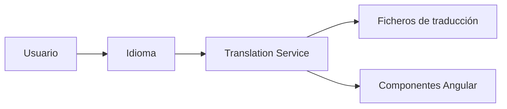

# Internacionalización

## Introducción

Template ha sido diseñado para ofrecer soporte multiidioma desde su concepción, permitiendo adaptar tanto la interfaz de usuario como los mensajes de la aplicación a diferentes idiomas sin necesidad de modificar el código.

La internacionalización afecta tanto al frontend como al backend, proporcionando una experiencia de usuario consistente independientemente del idioma seleccionado.

Actualmente la plataforma soporta múltiples idiomas de forma simultánea y permite incorporar nuevos idiomas de manera sencilla.

---

# Objetivos

El sistema de internacionalización persigue los siguientes objetivos:

- Soportar múltiples idiomas.
- Permitir cambiar el idioma durante la ejecución de la aplicación.
- Traducir todos los textos visibles para el usuario.
- Centralizar la gestión de traducciones.
- Facilitar la incorporación de nuevos idiomas.
- Mantener separada la lógica de negocio de los recursos de idioma.

---

# Arquitectura

La internacionalización se basa en un servicio centralizado utilizado por todos los componentes Angular.



El servicio de traducción es responsable de cargar el idioma seleccionado y proporcionar las traducciones a los distintos componentes de la interfaz.

---

# Idiomas soportados

La plataforma puede incorporar cualquier idioma.

Por defecto se recomienda incluir:

| Código | Idioma  |
|--------|---------|
| es     | Español |
| en     | Inglés  |

Cada proyecto podrá ampliar esta lista según sus necesidades.

---

# Organización de los recursos

Las traducciones se almacenan mediante ficheros independientes para cada idioma.

Ejemplo:

```text
assets/

└── i18n/

    ├── es.json

    ├── en.json

    ├── fr.json

    └── pt.json
```

Cada fichero contiene todas las cadenas traducidas correspondientes a un idioma.

---

# Organización de las claves

Las claves deben organizarse jerárquicamente para facilitar su mantenimiento.

Ejemplo:

```text
menu.home

menu.administration

menu.reports

button.save

button.cancel

button.search

login.user

login.password

login.title

validation.required

validation.email
```

Se recomienda utilizar nombres descriptivos y evitar claves genéricas.

---

# Uso en los componentes

Los componentes nunca deben contener textos literales.

Incorrecto:

```html
<button>Guardar</button>
```

Correcto:

```html
<button>
    {{ 'button.save' | translate }}
</button>
```

De esta forma todas las traducciones permanecen centralizadas.

---

# Cambio de idioma

El usuario puede cambiar el idioma durante la ejecución de la aplicación.

El cambio afecta inmediatamente a todos los componentes visibles sin necesidad de reiniciar la aplicación.

El idioma seleccionado podrá almacenarse en:

- Preferencias del usuario.
- Almacenamiento local del navegador.
- Cookie.
- Configuración del servidor.

La estrategia dependerá de la configuración del proyecto.

---

# Selección automática

Durante el inicio de la aplicación el idioma puede determinarse mediante distintos criterios.

Por ejemplo:

1. Preferencia del usuario.
2. Idioma almacenado en el navegador.
3. Idioma configurado por la organización.
4. Idioma por defecto de la aplicación.

---

# Integración con el backend

El frontend comunica el idioma seleccionado al backend mediante la cabecera HTTP correspondiente.

Ejemplo:

```http
Accept-Language: es
```

Esto permite que:

- Mensajes de error.
- Validaciones.
- Informes.
- Correos electrónicos.

puedan generarse utilizando el mismo idioma que la interfaz de usuario.

---

# Formatos regionales

La internacionalización no se limita a los textos.

También afecta a:

- Fechas.
- Horas.
- Números.
- Monedas.
- Porcentajes.
- Zonas horarias.

Angular proporciona los mecanismos necesarios para representar estos valores según la configuración regional seleccionada.

---

# Mensajes de validación

Todos los mensajes de validación deben utilizar el sistema de traducciones.

Ejemplo:

```text
validation.required

validation.minLength

validation.maxLength

validation.email

validation.invalidDate
```

Esto garantiza que todos los formularios mantengan el mismo comportamiento independientemente del idioma.

---

# Traducción de menús

Los títulos de menús, opciones y pantallas deben obtenerse siempre mediante el servicio de traducción.

Ejemplo:

```text
menu.dashboard

menu.users

menu.security

menu.cluster

menu.settings
```

De esta forma es posible modificar cualquier texto sin necesidad de recompilar la aplicación.

---

# Buenas prácticas

Se recomienda seguir las siguientes normas:

- No utilizar textos literales en componentes.
- Utilizar claves jerárquicas.
- Mantener el mismo conjunto de claves en todos los idiomas.
- Utilizar nombres descriptivos.
- Evitar duplicar traducciones.
- Traducir también mensajes de error y validación.
- Revisar periódicamente las traducciones no utilizadas.

---

# Documentación relacionada

- [layout.md](layout.md)
- [navigation.md](navigation.md)
- [notifications.md](notifications.md)
- [security.md](../backend/security.md)
- [api.md](../backend/api.md)

---

# Resumen

La internacionalización de Template permite adaptar completamente la interfaz de usuario y los mensajes de la aplicación a distintos idiomas, proporcionando una experiencia consistente y homogénea.

La utilización de un servicio centralizado de traducciones, junto con la organización estructurada de los recursos de idioma, facilita el mantenimiento de la plataforma y la incorporación de nuevos idiomas sin modificar el código fuente.