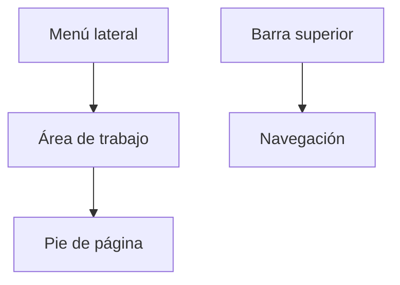

# Layout

## Introducción

El **Layout** define la estructura visual común utilizada por todas las pantallas de Template.

Su objetivo es proporcionar una experiencia de usuario homogénea, independientemente del módulo funcional al que pertenezca cada pantalla.

Todas las funcionalidades desarrolladas sobre Template deben respetar este modelo de diseño para garantizar la coherencia de la aplicación.

---

# Objetivos

El sistema de layout persigue los siguientes objetivos:

- Unificar la experiencia de usuario.
- Facilitar la navegación entre módulos.
- Favorecer el desarrollo de nuevas funcionalidades.
- Adaptarse a diferentes tamaños de pantalla.
- Mantener una identidad visual común.
- Reducir la complejidad de desarrollo del frontend.

---

# Estructura general

La interfaz de usuario se organiza en cinco áreas principales.



Cada una de estas áreas tiene una responsabilidad claramente definida.

---

# Componentes principales

## Barra superior

Situada en la parte superior de la aplicación.

Incluye, entre otros elementos:

- Logotipo de la aplicación.
- Campo de búsqueda global.
- Selector de idioma.
- Accesos rápidos.
- Notificaciones.
- Información del usuario.
- Menú de sesión.

La barra superior permanece visible durante toda la navegación.

---

## Menú lateral

El menú lateral proporciona acceso a los distintos módulos de la aplicación.

Características:

- Menús jerárquicos.
- Colapsable.
- Iconografía consistente.
- Adaptado a los permisos del usuario.
- Estado persistente.

El contenido del menú depende de las acciones autorizadas para el usuario autenticado.

---

## Breadcrumb

El breadcrumb muestra la posición actual del usuario dentro de la aplicación.

Ejemplo:

```text
Administración
    >
Seguridad
    >
Usuarios
```

Su utilización facilita la navegación entre pantallas.

---

## Área de trabajo

Es la zona principal donde se muestran las funcionalidades de la aplicación.

Cada pantalla ocupa esta región sin modificar el resto del layout.

El contenido puede estar formado por:

- Formularios.
- Tablas.
- Dashboards.
- Gráficos.
- Informes.
- Árboles.
- Wizards.

---

## Pie de página

El pie de página muestra información general de la aplicación.

Puede incluir:

- Versión.
- Entorno.
- Copyright.
- Información técnica.
- Estado del sistema.

Su visualización podrá configurarse según las necesidades del proyecto.

---

# Organización visual

El layout mantiene una estructura constante durante toda la navegación.

```text
+-----------------------------------------------------------+
| Header                                                    |
+------------+----------------------------------------------+
|            | Breadcrumb                                   |
| Sidebar    +----------------------------------------------+
|            |                                              |
|            |                                              |
|            |               Content                        |
|            |                                              |
|            |                                              |
+------------+----------------------------------------------+
| Footer                                                    |
+-----------------------------------------------------------+
```

Esta distribución permite que el usuario identifique rápidamente cada zona de la aplicación.

---

# Diseño responsivo

El layout ha sido diseñado siguiendo un enfoque **Responsive Design**.

Dependiendo del tamaño de pantalla, determinados componentes modifican su comportamiento.

## Escritorio

- Menú lateral permanente.
- Barra superior completa.
- Máximo espacio para el contenido.

## Tablet

- Menú lateral colapsable.
- Espacio optimizado.

## Dispositivo móvil

- Menú oculto mediante hamburguesa.
- Componentes adaptados al ancho disponible.
- Navegación simplificada.

---

# Distribución de pantallas

Todas las pantallas de la aplicación deben seguir una estructura similar.

```text
Título

Descripción (opcional)

──────────────────────────────

Filtros

──────────────────────────────

Contenido principal

──────────────────────────────

Acciones
```

Esta organización facilita el aprendizaje por parte del usuario.

---

# Paneles

Las pantallas podrán organizar la información mediante paneles independientes.

Ejemplo:

```text
Información general

Configuración

Resultados

Auditoría
```

Cada panel debe representar una unidad funcional claramente identificable.

---

# Formularios

Los formularios mantienen una apariencia homogénea.

Se recomienda:

- Etiquetas alineadas.
- Validación inmediata.
- Agrupación lógica de campos.
- Mensajes de ayuda.
- Diseño responsive.

---

# Tablas

Las tablas constituyen uno de los elementos principales del layout.

Se recomienda incorporar:

- Ordenación.
- Filtrado.
- Paginación.
- Selección múltiple.
- Exportación.
- Acciones por fila.

Todas las tablas deben compartir el mismo comportamiento y aspecto visual.

---

# Diálogos

Las operaciones secundarias deben realizarse mediante ventanas modales.

Ejemplos:

- Confirmaciones.
- Edición rápida.
- Selección de elementos.
- Ayuda contextual.

Los diálogos deben mantener el mismo diseño en toda la aplicación.

---

# Temas

El layout ha sido diseñado para soportar distintos temas visuales.

Por ejemplo:

- Claro.
- Oscuro.
- Personalizado.

El cambio de tema no modifica la organización funcional de la aplicación.

---

# Accesibilidad

El diseño debe cumplir las recomendaciones de accesibilidad.

Entre otras:

- Navegación mediante teclado.
- Contraste adecuado.
- Etiquetas descriptivas.
- Compatibilidad con lectores de pantalla.
- Indicadores visuales de foco.

---

# Buenas prácticas

Durante el desarrollo de nuevas pantallas se recomienda:

- Mantener la estructura común del layout.
- Evitar modificar la barra superior.
- No alterar el comportamiento del menú lateral.
- Mantener una navegación consistente.
- Utilizar componentes reutilizables.
- Diseñar pantallas responsivas.
- Evitar duplicar funcionalidades existentes.

---

# Documentación relacionada

- [navigation.md](navigation.md)
- [notifications.md](notifications.md)
- [internacionalizacion.md](internacionalizacion.md)
- [pwa.md](pwa.md)

---

# Resumen

El Layout define la estructura visual común de todas las aplicaciones desarrolladas sobre Template.

La utilización de una organización homogénea, componentes reutilizables y un diseño responsive garantiza una experiencia de usuario consistente, facilita el desarrollo de nuevos módulos y simplifica el mantenimiento de la interfaz de usuario.