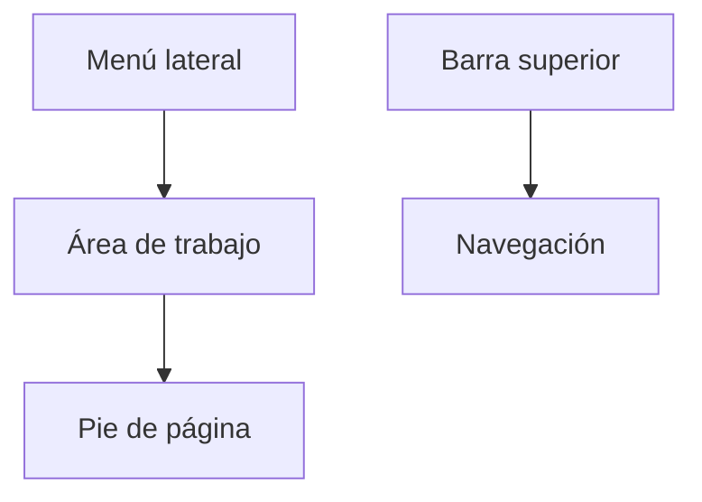

# Layout

## Introducción

El **Layout** define la estructura visual común utilizada por todas las pantallas de Template.

Su objetivo es proporcionar una experiencia de usuario homogénea, independientemente del módulo funcional al que pertenezca cada pantalla.

Todas las funcionalidades desarrolladas sobre Template deben respetar este modelo de diseño para garantizar la coherencia de la aplicación.

---

# Objetivos

El sistema de layout persigue los siguientes objetivos:

- Unificar la experiencia de usuario.
- Facilitar la navegación entre módulos.
- Favorecer el desarrollo de nuevas funcionalidades.
- Adaptarse a diferentes tamaños de pantalla.
- Mantener una identidad visual común.
- Reducir la complejidad de desarrollo del frontend.

---

# Estructura general

La interfaz de usuario se organiza en cinco áreas principales.


```mermaid
flowchart TB

Header["Barra superior"]

Sidebar["Menú lateral"]

Content["Área de trabajo"]

Breadcrumb["Navegación"]

Footer["Pie de página"]

Header --> Breadcrumb

Sidebar --> Content

Content --> Footer
```

Cada una de estas áreas tiene una responsabilidad claramente definida.

---

# Patrones de pantalla reutilizables

Todas las pantallas del frontend deben seguir uno de estos patrones base. La intención es garantizar que, al crear una nueva funcionalidad, la estructura visual sea homogénea con el resto de la aplicación y que cada entidad reutilice la misma base de diseño con variaciones de contenido y validación.

## 1. List Screen

Se usa para pantallas de consulta, listado y gestión de registros.

### Objetivo
- Mostrar una colección de elementos en formato tabular o de lista.
- Permitir filtros, búsqueda, ordenación y paginación.
- Proporcionar acciones sobre el conjunto o sobre la fila seleccionada.

### Estructura base

```text
+------------------------------------------------------------------+
| Título de la entidad                                             |
| [Crear] [Exportar]                                               |
+------------------------------------------------------------------+
| Filtro 1 | Filtro 2 | Filtro 3 | [Buscar] [Limpiar]             |
+------------------------------------------------------------------+
| Columna 1 | Columna 2 | Columna 3 | Columna 4 | Columna 5        |
|---------- |-----------|-----------|-----------|------------------|
| valor     | valor     | valor     | valor     | valor            |
| valor     | valor     | valor     | valor     | valor            |
+------------------------------------------------------------------+
| < 1 2 3 > | Registros por página: 10                            |
+------------------------------------------------------------------+
```

### Reglas de diseño
- La cabecera incluye el título y las acciones principales del listado.
- Los filtros y la búsqueda van en una sola línea o bloque superior.
- La tabla usa el componente `tp-data-table` y se apoya en ordenación, selección y paginación.
- Las acciones sobre registros se agrupan en una toolbar, no se repiten por fila.
- Si la entidad no permite crear o borrar, solo se muestran los botones aplicables.
- La columna de identificador interno no debe mostrarse al usuario.

### Aplicación esperada
- Usuarios
- Perfiles
- Acciones
- Cualquier entidad con listado paginado y filtros

---

## 2. Form Screen

Se usa para pantallas de alta, edición y validación de un registro; también se reutiliza en modo lectura cuando la pantalla es solo consulta.

### Objetivo
- Recoger la información de un elemento de negocio.
- Validar campos antes del envío.
- Mostrar el mismo contenido en modo de lectura, con los campos deshabilitados.
- Guardar datos y volver al listado o a la vista previa.

### Estructura base

```text
+------------------------------------------------------------------+
| Crear / Editar / Consultar [Entidad]                             |
+------------------------------------------------------------------+
| Campo 1 * | Campo 2 | Campo 3                                   |
| Campo 4   | Campo 5 | Campo 6                                   |
| Descripción | [textarea]                                         |
+------------------------------------------------------------------+
| [Cancelar] [Guardar]                                             |
+------------------------------------------------------------------+
```

### Reglas de diseño
- El formulario usa un contenedor visual uniforme con fondo de superficie, borde y padding.
- Los botones de acción se sitúan al final del formulario y se alinean a la derecha.
- Los campos se agrupan por bloques lógicos y no se mezcla el diseño con componentes de la tabla.
- Las validaciones se muestran cerca del campo afectado y con mensajes claros.
- El título del formulario va fuera del contenedor principal para mantener consistencia.
- El patrón de botonería debe respetar: Cancelar y Guardar, con el guardado como acción principal.
- En modo solo lectura, se reutiliza la misma composición visual, pero los campos aparecen deshabilitados y el flujo de acción se limita a volver o abrir edición.

### Aplicación esperada
- Alta de usuario
- Edición de usuario
- Consulta de usuario en solo lectura
- Alta de perfil
- Edición de perfil
- Consulta de perfil en solo lectura
- Edición de acción
- Consulta de acción en solo lectura

> La vista de consulta no define un patrón visual distinto: reutiliza el `Form Screen` con el mismo layout y la misma información, pero en estado de solo lectura.

---

## 3. Confirmation Modal

Se usa para operaciones destructivas o decisiones con impacto importante.

### Objetivo
- Confirmar una acción que no puede deshacerse o que requiere decisión explícita.
- Evitar errores por acción accidental.

### Estructura base

```text
+----------------------------------------------+
| Confirmación                                 |
| ¿Desea eliminar este registro?               |
| Se eliminará de forma permanente.            |
+----------------------------------------------+
| [Cancelar] [Confirmar]                       |
+----------------------------------------------+
```

### Reglas de diseño
- Debe incluir texto claro del impacto de la acción.
- La acción principal debe ser visualmente más fuerte que la cancelación.
- El botón de confirmación debe ser de riesgo y claramente identificado.
- La cancelación debe estar siempre disponible.

### Aplicación esperada
- Eliminación de usuarios
- Eliminación de perfiles
- Cualquier acción con confirmación previa

---

## 5. Regla de consistencia para nuevas pantallas

Cuando se cree una nueva pantalla del tipo List Screen, Form Screen o Confirmation Modal, debe cumplir las siguientes reglas:

- Reutilizar el patrón base de la categoría correspondiente.
- No introducir variaciones visuales sin justificación funcional.
- Mantener la misma estructura de cabecera, contenido y pie de acciones.
- Utilizar los componentes reutilizables del sistema antes que crear una composición ad hoc.
- Mantener el mismo comportamiento de filtros, selección y validación de forma consistente.

Con esta regla, cualquier nueva pantalla se genera con el mismo sentido visual que el resto del producto y resulta más fácil de mantener, revisar y extender.

---

# Componentes principales

## Barra superior

Situada en la parte superior de la aplicación.

Incluye, entre otros elementos:

- Botón de toggle del menú lateral (zona izquierda).
- Logotipo de la aplicación.
- Campo de búsqueda global.
- Selector de idioma.
- Accesos rápidos.
- Notificaciones.
- Información del usuario.
- Menú de sesión.

La barra superior permanece visible durante toda la navegación.

### Alineación visual con el menú lateral

La barra superior (`.tp-header`) y la zona de marca del menú lateral (`.sidebar-brand`) comparten la misma altura (`--tp-header-height`: 56px). Esto crea una línea horizontal continua que unifica visualmente ambos elementos como si fueran una sola cabecera.

---

## Menú lateral

El menú lateral proporciona acceso a los distintos módulos de la aplicación.

Características:

- Menús jerárquicos.
- Colapsable (dos estados: expandido y contraído).
- Iconografía consistente.
- Adaptado a los permisos del usuario.
- Estado persistente (se recuerda entre navegaciones).

El contenido del menú depende de las acciones autorizadas para el usuario autenticado.

### Comportamiento colapsable

El menú lateral soporta dos estados visuales controlados por un botón de toggle situado en la barra superior (zona izquierda).

#### Estado expandido (por defecto)

- Ancho: `260px` (variable `--tp-sidebar-width`).
- Muestra: icono + texto de cada enlace.
- Muestra: títulos de sección (PRINCIPAL, ADMINISTRACIÓN).
- Muestra: submenús expandidos/colapsados.
- La marca de la aplicación muestra icono + nombre.

#### Estado contraído

- Ancho: `64px`.
- Muestra: solo los iconos de cada enlace, centrados.
- Oculta: textos de los enlaces, títulos de sección y chevrons.
- La marca de la aplicación muestra solo el icono.
- Los menús con submenú muestran un **flyout lateral** al pasar el ratón sobre el icono: un panel blanco flotante que aparece a la derecha del sidebar con las opciones del submenú.
- Los submenús anidados (ej. Seguridad dentro de Administración) se muestran inline dentro del flyout, indentados.

#### Botón de toggle

| Propiedad       | Valor                                            |
|-----------------|--------------------------------------------------|
| Ubicación       | Barra superior, zona izquierda (primer elemento) |
| Icono expandido | `bi-layout-sidebar-inset`                        |
| Icono contraído | `bi-list`                                        |
| `aria-label`    | "Colapsar menú" / "Expandir menú"                |
| `aria-expanded` | `true` (expandido) / `false` (contraído)         |

#### Transición

- La transición entre estados utiliza una animación de `250ms` con easing `ease-in-out`.
- Se anima simultáneamente el ancho del sidebar y el margen izquierdo del área principal.

#### Persistencia del estado

- El estado (expandido/contraído) se persiste en `localStorage` con la clave `tp-sidebar-collapsed`.
- Al iniciar la aplicación, se restaura el último estado conocido.

#### Interacción con responsive

| Pantalla            | Comportamiento                                                        |
|---------------------|-----------------------------------------------------------------------|
| Escritorio (≥992px) | Toggle funcional: alterna entre 260px y 64px.                         |
| Tablet (<992px)     | Sidebar oculto por defecto; se muestra como overlay al pulsar toggle. |
| Móvil (<576px)      | Sidebar oculto; se despliega completo como overlay con backdrop.      |

#### Implementación Angular

```typescript
// sidebar.component.ts
@Component({
  selector: 'app-sidebar',
  templateUrl: './sidebar.component.html',
  styleUrls: ['./sidebar.component.scss'],
  changeDetection: ChangeDetectionStrategy.OnPush
})
export class SidebarComponent implements OnInit {
  isCollapsed = signal<boolean>(false);

  ngOnInit(): void {
    const saved = localStorage.getItem('tp-sidebar-collapsed');
    if (saved === 'true') {
      this.isCollapsed.set(true);
    }
  }

  toggle(): void {
    this.isCollapsed.update(v => !v);
    localStorage.setItem('tp-sidebar-collapsed', String(this.isCollapsed()));
  }
}
```

#### Clases CSS implicadas

| Clase                           | Elemento     | Descripción                              |
|---------------------------------|--------------|------------------------------------------|
| `.tp-sidebar`                   | `<aside>`    | Sidebar en estado normal (260px)         |
| `.tp-sidebar.collapsed`         | `<aside>`    | Sidebar en estado contraído (64px)       |
| `.tp-wrapper.sidebar-collapsed` | `<div>` raíz | Wrapper cuando el sidebar está contraído |
| `.tp-sidebar-toggle`            | `<button>`   | Botón de toggle en la barra superior     |

#### Referencia visual (wireframes)

Los mockups en `template-docs/specification/mockups/` implementan este comportamiento de forma interactiva con JavaScript para previsualización.

---

### Ancho ajustable por el usuario

Además del comportamiento colapsable, el menú lateral permite al usuario ajustar libremente su ancho mediante arrastre.

#### Funcionamiento

- En el borde derecho del sidebar se muestra un **resize handle** (separador) que el usuario puede arrastrar horizontalmente.
- El cursor cambia a `col-resize` al posicionarse sobre el handle, indicando que es arrastrable.
- Al hacer **doble clic** sobre el handle, el ancho se restablece al valor por defecto (260px).

#### Restricciones

| Propiedad    | Valor  |
|--------------|--------|
| Ancho mínimo | 180px  |
| Ancho máximo | 480px  |
| Ancho por defecto | 260px |

#### Persistencia

- El ancho personalizado se persiste en `localStorage` con la clave `tp-sidebar-width`.
- Al iniciar la aplicación, se restaura el último ancho configurado por el usuario.

#### Interacción con otros estados

| Estado del sidebar | Comportamiento del resize |
|--------------------|---------------------------|
| Expandido          | Resize habilitado         |
| Colapsado (64px)   | Resize deshabilitado (handle oculto) |
| Mobile/Tablet      | Resize no disponible (handle oculto) |

#### Transiciones

- Durante el arrastre, las transiciones CSS se desactivan para ofrecer respuesta instantánea.
- Al soltar, las transiciones se restauran para que el toggle collapse/expand siga siendo animado.

#### Accesibilidad

| Propiedad          | Valor                            |
|--------------------|----------------------------------|
| `role`             | `separator`                      |
| `aria-orientation` | `vertical`                       |
| `aria-label`       | `layout.sidebar.resize` (i18n)   |

#### Clases CSS implicadas

| Clase                        | Elemento     | Descripción                                        |
|------------------------------|--------------|----------------------------------------------------|
| `.sidebar-resize-handle`     | `<div>`      | Handle de arrastre en el borde derecho del sidebar |
| `.sidebar-resizing`          | `.tp-wrapper`| Aplicada durante el arrastre (desactiva transiciones) |
| `body.tp-sidebar-resizing`   | `<body>`     | Previene selección de texto durante el arrastre    |

---

## Breadcrumb

El breadcrumb muestra la posición actual del usuario dentro de la aplicación.

Ejemplo:

```text
Administración
    >
Seguridad
    >
Usuarios
```

Su utilización facilita la navegación entre pantallas.

---

## Área de trabajo

Es la zona principal donde se muestran las funcionalidades de la aplicación.

Cada pantalla ocupa esta región sin modificar el resto del layout.

El contenido puede estar formado por:

- Formularios.
- Tablas.
- Dashboards.
- Gráficos.
- Informes.
- Árboles.
- Wizards.

---

## Pie de página

El pie de página muestra información general de la aplicación.

Puede incluir:

- Versión.
- Entorno.
- Copyright.
- Información técnica.
- Estado del sistema.

Su visualización podrá configurarse según las necesidades del proyecto.

---

# Organización visual

El layout mantiene una estructura constante durante toda la navegación.

```text
+-----------------------------------------------------------+
| Header                                                    |
+------------+----------------------------------------------+
|            | Breadcrumb                                   |
| Sidebar    +----------------------------------------------+
|            |                                              |
|            |                                              |
|            |               Content                        |
|            |                                              |
|            |                                              |
+------------+----------------------------------------------+
| Footer                                                    |
+-----------------------------------------------------------+
```

Esta distribución permite que el usuario identifique rápidamente cada zona de la aplicación.

---

# Diseño responsivo

El layout ha sido diseñado siguiendo un enfoque **Responsive Design**.

Dependiendo del tamaño de pantalla, determinados componentes modifican su comportamiento.

## Escritorio

- Menú lateral permanente.
- Barra superior completa.
- Máximo espacio para el contenido.

## Tablet

- Menú lateral colapsable.
- Espacio optimizado.

## Dispositivo móvil

- Menú oculto mediante hamburguesa.
- Componentes adaptados al ancho disponible.
- Navegación simplificada.

---

# Distribución de pantallas

Todas las pantallas de la aplicación deben seguir una estructura similar.

```text
Título

Descripción (opcional)

──────────────────────────────

Filtros

──────────────────────────────

Contenido principal

──────────────────────────────

Acciones
```

Esta organización facilita el aprendizaje por parte del usuario.

---

# Paneles

Las pantallas podrán organizar la información mediante paneles independientes.

Ejemplo:

```text
Información general

Configuración

Resultados

Auditoría
```

Cada panel debe representar una unidad funcional claramente identificable.

---

# Elementos de pantalla

Los elementos que componen las pantallas (formularios, tablas, diálogos, filtros) mantienen una apariencia homogénea en toda la aplicación. Su especificación detallada (patrones de pantalla, reglas de diseño y componentes) reside en las siguientes fuentes únicas:

| Elemento    | Fuente única                                                        |
|-------------|---------------------------------------------------------------------|
| Formularios | [design-system.md](design-system.md) (patrón de formulario) + [components.md](components.md) (`app-entity-form`) |
| Tablas      | [design-system.md](design-system.md) (patrón de listado y toolbar) + [components.md](components.md) (`tp-data-table`) |
| Diálogos    | [components.md](components.md) (`tp-modal`)                          |
| Filtros     | [design-system.md](design-system.md) (patrón de filtros)            |

> **Acciones sobre registros**: las acciones (Nuevo, Modificar, Eliminar, Exportar) se agrupan en una **barra de herramientas única** situada entre los filtros y la tabla. No se muestran botones de acción por fila; el usuario selecciona la fila y actúa desde la toolbar (ver el patrón de listado en design-system.md).

---

# Temas

El layout soporta distintos temas visuales (claro, oscuro y personalizado). El cambio de tema no modifica la organización funcional de la aplicación. Los tokens del tema oscuro se documentan en [design-system.md](design-system.md#tema-oscuro).

---

# Accesibilidad

El diseño debe cumplir las recomendaciones de accesibilidad.

Entre otras:

- Navegación mediante teclado.
- Contraste adecuado.
- Etiquetas descriptivas.
- Compatibilidad con lectores de pantalla.
- Indicadores visuales de foco.

---

# Buenas prácticas

Durante el desarrollo de nuevas pantallas se recomienda:

- Mantener la estructura común del layout.
- Evitar modificar la barra superior.
- No alterar el comportamiento del menú lateral.
- Mantener una navegación consistente.
- Utilizar componentes reutilizables.
- Diseñar pantallas responsivas.
- Evitar duplicar funcionalidades existentes.

---

# Documentación relacionada

- [navigation.md](navigation.md)
- [notifications.md](notifications.md)
- [internacionalizacion.md](internacionalizacion.md)
- [pwa.md](pwa.md)
