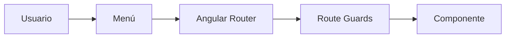
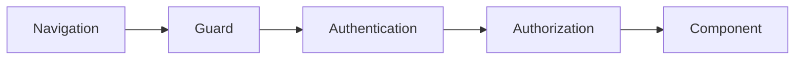

# Navegación

## Introducción

El sistema de navegación de **Template** proporciona un modelo unificado para acceder a las diferentes funcionalidades de la aplicación.

Su diseño permite al usuario desplazarse de forma intuitiva entre los distintos módulos funcionales, manteniendo en todo momento el contexto de navegación y respetando el modelo de seguridad definido por la plataforma.

La navegación está completamente integrada con el sistema de permisos, el menú principal y el router de Angular.

---

# Objetivos

El sistema de navegación persigue los siguientes objetivos:

- Proporcionar una experiencia de usuario consistente.
- Facilitar el acceso a todas las funcionalidades.
- Integrar la navegación con el sistema de seguridad.
- Mantener el contexto del usuario.
- Soportar navegación mediante URL.
- Facilitar la incorporación de nuevos módulos.

---

# Arquitectura

La navegación está formada por varios componentes que trabajan conjuntamente.


```mermaid
flowchart LR

User["Usuario"]

Menu["Menú"]

Router["Angular Router"]

Guard["Route Guards"]

Component["Componente"]

User --> Menu

Menu --> Router

Router --> Guard

Guard --> Component
```

Cada navegación pasa por el sistema de autorización antes de mostrar la pantalla correspondiente.

---

# Elementos de navegación

La navegación de Template se compone de los siguientes elementos:

- Menú principal.
- Breadcrumb.
- Router de Angular.
- Navegación mediante URL.
- Accesos rápidos.
- Historial del navegador.

Cada uno de ellos desempeña una función específica dentro de la experiencia de usuario.

---

# Menú principal

El menú principal constituye el mecanismo habitual de acceso a las funcionalidades de la aplicación.

Características:

- Organización jerárquica.
- Menús multi-nivel.
- Iconografía homogénea.
- Adaptado al perfil del usuario.
- Colapsable.
- Búsqueda de opciones.

Los elementos mostrados dependen de los permisos del usuario autenticado.

---

# Navegación mediante rutas

Cada pantalla dispone de una ruta única.

Ejemplos:

```text
/dashboard

/reports

/administration

/administration/users

/administration/security

/cluster
```

Las rutas deben ser:

- Estables.
- Descriptivas.
- Jerárquicas.
- Independientes del idioma.

---

# Breadcrumb

El breadcrumb muestra el recorrido seguido por el usuario.

Ejemplo:

```text
Administración

>

Seguridad

>

Usuarios
```

Permite regresar fácilmente a niveles superiores de navegación.

---

# Navegación programática

Los componentes pueden realizar cambios de pantalla utilizando el Router de Angular.

Ejemplo:

```typescript
this.router.navigate(['/administration/users']);
```

La navegación debe centralizarse siempre que sea posible para mantener un comportamiento homogéneo.

---

# Parámetros de navegación

Las pantallas pueden recibir parámetros mediante la URL.

Ejemplo:

```text
/users/125

/reports/monthly

/interfaces/detail/48
```

También podrán utilizarse parámetros de consulta.

Ejemplo:

```text
/reports?year=2026&type=monthly
```

Los parámetros deben utilizarse únicamente para representar el estado de la navegación.

---

# Seguridad

Antes de acceder a una pantalla se validan los permisos correspondientes.


```mermaid
flowchart LR

Navigation --> Guard --> Authentication --> Authorization --> Component
```

Si el usuario no dispone de autorización, la navegación será cancelada y se mostrará la página correspondiente.

---

# Navegación dinámica

Template permite generar el menú de forma dinámica.

La estructura puede obtenerse desde:

- Configuración.
- Base de datos.
- Backend.
- Módulos instalados.

Esto facilita la incorporación de nuevas funcionalidades sin modificar el frontend.

---

# Estado de navegación

El sistema mantiene el contexto del usuario durante la navegación.

Entre otros elementos:

- Opción seleccionada.
- Menús expandidos.
- Breadcrumb.
- Historial.
- Idioma.
- Tema visual.

Esto proporciona una experiencia de usuario consistente durante toda la sesión.

---

# Integración con módulos

Cada módulo funcional incorpora sus propias rutas. La siguiente estructura muestra el menú completo anotado con la acción de seguridad que gobierna cada opción (ver el catálogo de acciones y las reglas de visibilidad en [security.md](../backend/security.md)):

```text
Principal
├── Dashboard                => DASHBOARD_READ
└── Informes ▾               => REPORT_EXECUTE
    ├── Actividad mensual
    ├── Resumen de accesos
    ├── Estadísticas de uso
    └── Informe de errores

Interfaces ▾                 => INTERFACES_READ
├── Monitor
└── Configuración

Administración ▾
├── Seguridad ▾
│   ├── Usuarios             => USER_READ, USER_WRITE
│   ├── Perfiles             => PROFILE_READ, PROFILE_WRITE
│   └── Acciones             => ACTION_READ
├── Parámetros               => SYSTEM_PARAMETER_READ, SYSTEM_PARAMETER_WRITE
├── Auditoría                => SYSTEM_LOG_READ
└── Cluster ▾
    ├── Nodos                => CLUSTER_NODE_READ, CLUSTER_NODE_WRITE
    └── Bloqueos             => CLUSTER_LOCK_READ
```

"Informes", "Interfaces" y "Administración" son menús desplegables de primer nivel con icono y chevron. Al expandirse muestran sus opciones hijas. "Seguridad" y "Cluster" son submenús de segundo nivel dentro de "Administración".

El módulo **Interfaces** agrupa la funcionalidad de supervisión e integración con sistemas externos:
- **Monitor**: panel de actividad de las interfaces, mostrando la trazabilidad de operaciones (logs de entrada/salida, estados, payloads).
- **Configuración**: listado de interfaces registradas con su estado actual (activa, inactiva, error) y detalle de cada interfaz.

Los informes disponibles para el usuario se muestran como submenú desplegable de "Informes" en el menú lateral. La lista se genera dinámicamente según los informes asignados al usuario (relación `user2report`).

La sección "Auditoría" ya no es un submenú desplegable; al tratarse de un único destino (registros de auditoría del sistema), se comporta como un enlace directo dentro de Administración.

Cada módulo es responsable de registrar sus rutas dentro de la aplicación.

---

# Acciones y permisos

Cada pantalla o funcionalidad tiene una o varias **acciones** de seguridad asociadas que controlan si el usuario puede ver datos, editarlos o ejecutar funcionalidades. El menú se filtra dinámicamente según las acciones del usuario autenticado (ver el árbol menú → acción en la sección [Integración con módulos](#integración-con-módulos)).

La **nomenclatura de acciones** (`_READ` / `_WRITE` / `_EXECUTE`), el **catálogo completo de códigos** y las **reglas de visibilidad** del menú se documentan como parte del modelo de seguridad en [security.md](../backend/security.md#acciones), que es la fuente única de verdad.

> **Seguridad en el frontend**: aunque el catálogo de acciones se mantiene en la documentación de seguridad backend, estas acciones **deben tenerse en cuenta al implementar la seguridad del frontend**. En concreto:
>
> - Los **Route Guards** (`CanActivate`) protegen cada ruta comprobando que el usuario dispone de la acción requerida antes de activar el componente.
> - El **menú** oculta las opciones para las que el usuario no tiene acción (según las reglas de visibilidad).
> - Los **elementos de UI** condicionados a permisos (botones Nuevo/Editar/Eliminar de la toolbar) se muestran u ocultan según las acciones `_WRITE` / `_EXECUTE` correspondientes.
> - La comprobación en el frontend es solo de experiencia de usuario; **la autorización real siempre se valida en el backend** (nunca confiar únicamente en el control de acceso del cliente).

---

# Lazy Loading

Las funcionalidades se cargan bajo demanda utilizando Lazy Loading.

Beneficios:

- Menor tiempo de carga inicial.
- Mejor rendimiento.
- Independencia entre módulos.
- Escalabilidad.

Cada módulo funcional puede desarrollarse y desplegarse de forma independiente desde el punto de vista del frontend.

---

# Navegación en dispositivos móviles

El comportamiento del menú lateral en tablet y móvil (oculto por defecto, overlay con hamburguesa, adaptación del espacio) se documenta en [layout.md](layout.md#comportamiento-colapsable), fuente única del comportamiento visual y responsive del sidebar.

---

# Gestión de errores

Cuando una ruta no existe o el usuario no dispone de permisos suficientes, la plataforma mostrará una página específica.

Ejemplos:

- 401 - No autenticado.
- 403 - Acceso denegado.
- 404 - Página no encontrada.

Estas pantallas mantienen el mismo layout que el resto de la aplicación.

---

# Buenas prácticas

Durante el desarrollo se recomienda:

- Utilizar rutas jerárquicas.
- Evitar rutas duplicadas.
- Mantener URL's estables.
- Utilizar Lazy Loading para los módulos funcionales.
- Proteger todas las rutas mediante Guards.
- No realizar comprobaciones de permisos únicamente en el frontend.
- Mantener sincronizados el menú y el sistema de rutas.

---

# Documentación relacionada

- [layout.md](layout.md)
- [internacionalizacion.md](internacionalizacion.md)
- [notifications.md](notifications.md)
- [security.md](../backend/security.md)
- [api.md](../backend/api.md)
