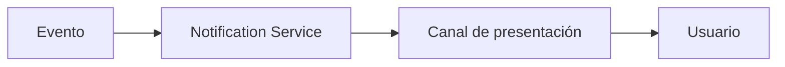
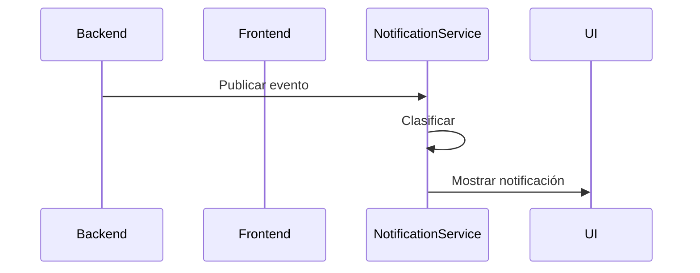
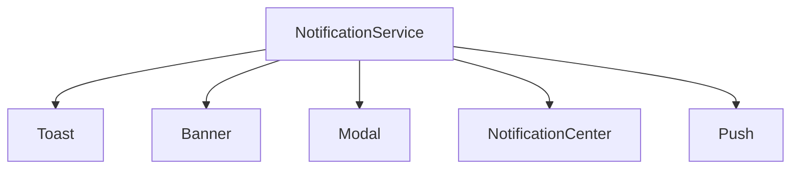
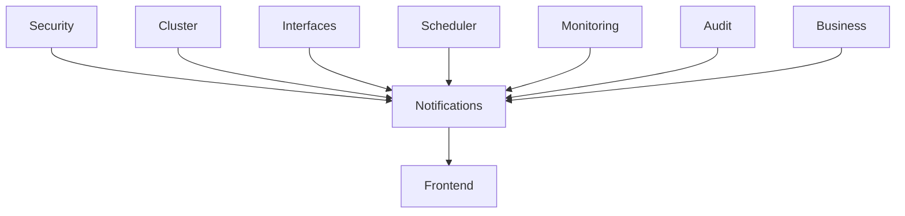

# Notificaciones

## Introducción

El sistema de **Notificaciones** proporciona un mecanismo centralizado para comunicar eventos al usuario durante la ejecución de la aplicación.

A diferencia de un sistema tradicional basado únicamente en mensajes visuales (*toast*), Template implementa un **Notification Framework**, donde cualquier componente del sistema puede publicar un evento sin conocer cómo será presentado al usuario.

Esta arquitectura desacopla completamente la generación de eventos de su representación visual, permitiendo reutilizar el mismo mecanismo para toda la plataforma.

El sistema está integrado con el frontend y el backend, facilitando la comunicación de eventos funcionales, técnicos y de monitorización.

---

# Objetivos

El sistema de notificaciones persigue los siguientes objetivos:

- Centralizar la gestión de eventos de usuario.
- Desacoplar la generación de eventos de su presentación.
- Unificar el comportamiento de todas las notificaciones.
- Facilitar la incorporación de nuevos canales de notificación.
- Mejorar la experiencia de usuario.
- Permitir la persistencia de eventos importantes.

---

# Arquitectura

El sistema está basado en un modelo orientado a eventos.

Los distintos componentes de la aplicación publican eventos.

El servicio de notificaciones decide posteriormente cómo deben presentarse.

---

# Notification Framework

El núcleo del sistema es el **Notification Service**.

Su responsabilidad consiste en:

- Recibir eventos.
- Clasificarlos.
- Asignar una prioridad.
- Decidir el canal de presentación.
- Registrar el evento cuando sea necesario.

Los componentes de negocio nunca muestran directamente mensajes al usuario.

Únicamente publican eventos.

---

# Flujo de una notificación

Este modelo garantiza que todas las notificaciones sigan el mismo comportamiento.

---

# Origen de los eventos

Los eventos pueden generarse desde cualquier componente de la plataforma.

Por ejemplo:

- Operaciones del usuario.
- Validaciones.
- Procesos batch.
- Interfaces.
- Scheduler.
- Monitorización.
- Cluster.
- Seguridad.
- Auditoría.

Todos ellos utilizan el mismo servicio.

---

# Tipos de eventos

Los eventos pueden clasificarse según su naturaleza.

| Tipo | Descripción |
|------|-------------|
| Información | Evento informativo. |
| Éxito | Operación completada correctamente. |
| Advertencia | Situación que requiere atención. |
| Error | Operación fallida. |
| Sistema | Eventos técnicos de la plataforma. |

---

# Canales de presentación

Una misma notificación puede representarse mediante diferentes canales.

El canal utilizado dependerá del tipo de evento y de su prioridad.

---

# Toast

Utilizados para informar del resultado inmediato de una operación.

Ejemplos:

- Registro guardado correctamente.
- Usuario eliminado.
- Cambios aplicados.

Desaparecen automáticamente transcurrido un tiempo configurable.

---

# Banner

Los banners muestran información importante sin interrumpir la navegación.

Ejemplos:

- Sistema en mantenimiento.
- Nodo secundario activo.
- Licencia próxima a caducar.

Normalmente permanecen visibles hasta que desaparece la condición que los originó.

---

# Ventanas modales

Las ventanas modales se utilizan cuando la interacción del usuario resulta obligatoria.

Ejemplos:

- Confirmaciones.
- Advertencias críticas.
- Aceptación de condiciones.
- Conflictos de edición.

---

# Centro de Notificaciones

El Centro de Notificaciones constituye el repositorio de todas las notificaciones persistentes.

Permite:

- Consultar el historial.
- Filtrar.
- Ordenar.
- Buscar.
- Marcar como leídas.
- Acceder al detalle del evento.

El acceso se realiza desde la barra superior de la aplicación.

---

# Notificaciones Push

La arquitectura permite incorporar mecanismos de notificación externos.

Por ejemplo:

- Push Web.
- WebSocket.
- Server Sent Events (SSE).
- Aplicaciones móviles.

Esta funcionalidad podrá incorporarse sin modificar la lógica de negocio.

---

# Prioridad

Cada evento dispone de un nivel de prioridad.

| Prioridad | Uso |
|-----------|-----|
| Baja | Información general. |
| Media | Información relevante. |
| Alta | Requiere atención. |
| Crítica | Requiere actuación inmediata. |

La prioridad influye en el canal utilizado.

Por ejemplo:

| Prioridad | Canal recomendado |
|-----------|------------------|
| Baja | Toast |
| Media | Centro de Notificaciones |
| Alta | Banner |
| Crítica | Modal + Centro de Notificaciones |

---

# Persistencia

No todas las notificaciones deben almacenarse.

Se distinguen dos categorías.

## Temporales

Desaparecen automáticamente.

Ejemplos:

- Guardado correcto.
- Operación finalizada.

## Persistentes

Permanecen disponibles hasta que el usuario las revisa.

Ejemplos:

- Alarmas.
- Incidencias.
- Interfaces detenidas.
- Errores del cluster.

---

# Integración con el backend

El backend puede publicar eventos sin conocer la interfaz de usuario.

Ejemplos:

- Finalización de un proceso.
- Cambio de estado de un nodo.
- Error de una interfaz.
- Scheduler ejecutado.
- Auditoría registrada.

El frontend decide posteriormente cómo representar dichos eventos.

---

# Navegación

Las notificaciones pueden incluir acciones asociadas.

Por ejemplo:

- Abrir una pantalla.
- Consultar un informe.
- Mostrar una incidencia.
- Navegar hasta el elemento afectado.

Esto permite convertir una notificación en un punto de acceso directo a la funcionalidad correspondiente.

---

# Integración con otros módulos

El Notification Framework es utilizado por toda la plataforma.

Esto garantiza una experiencia homogénea independientemente del origen del evento.

---

# Buenas prácticas

Se recomienda:

- Publicar eventos, no mostrar mensajes directamente.
- Mantener los textos internacionalizados.
- Utilizar el nivel de prioridad adecuado.
- Evitar mensajes redundantes.
- No abusar de las ventanas modales.
- Utilizar notificaciones persistentes únicamente cuando aporten valor.
- Mantener la lógica de presentación fuera de la lógica de negocio.

---

# Documentación relacionada

- `layout.md`
- `navigation.md`
- `internacionalizacion.md`
- `backend/api.md`
- `backend/security.md`
- `backend/monitoring.md`

---

# Resumen

El sistema de notificaciones de Template implementa un **Notification Framework** basado en eventos, donde la lógica de negocio únicamente publica eventos y es la plataforma quien decide cómo representarlos.

Esta arquitectura desacopla completamente la generación de notificaciones de su presentación, facilita la reutilización del sistema por todos los módulos y permite incorporar nuevos canales de comunicación sin modificar el código funcional.

El resultado es un mecanismo flexible, extensible y homogéneo que puede utilizarse desde cualquier componente de la plataforma, convirtiéndose en uno de los servicios transversales fundamentales de Template.