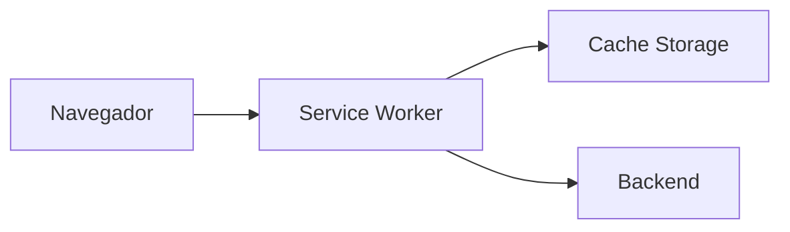
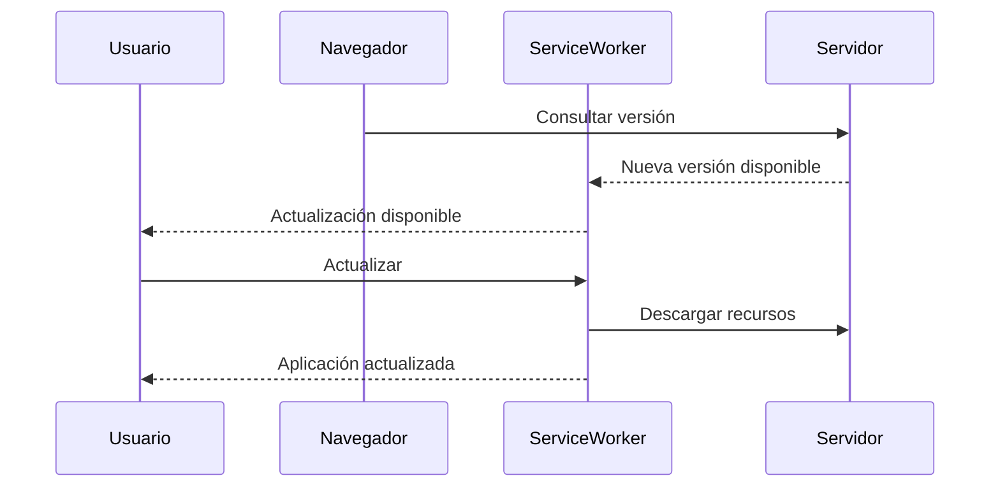

# Progressive Web App (PWA)

## Introducción

Template incorpora soporte nativo para **Progressive Web Applications (PWA)**, permitiendo que las aplicaciones desarrolladas sobre la plataforma ofrezcan una experiencia de usuario similar a una aplicación de escritorio o móvil.

El soporte PWA proporciona capacidades como la instalación de la aplicación, funcionamiento offline, almacenamiento local de recursos y actualización automática, mejorando la disponibilidad y la experiencia del usuario.

Estas funcionalidades se integran de forma transparente dentro del frontend y no requieren modificaciones en los módulos funcionales.

---

# Objetivos

El soporte PWA persigue los siguientes objetivos:

- Permitir la instalación de la aplicación desde el navegador.
- Mejorar el rendimiento mediante almacenamiento en caché.
- Reducir el consumo de red.
- Facilitar el funcionamiento con conectividad limitada.
- Mejorar la experiencia de usuario.
- Permitir futuras capacidades offline.

---

# Arquitectura

La arquitectura PWA se basa en varios componentes.

El **Service Worker** actúa como intermediario entre la aplicación y el servidor, gestionando el almacenamiento local y las peticiones HTTP.

---

# Componentes

La implementación PWA se basa en los siguientes elementos.

| Componente | Descripción |
|------------|-------------|
| Manifest | Describe la aplicación instalable. |
| Service Worker | Gestiona caché y recursos. |
| Cache Storage | Almacenamiento local de recursos. |
| IndexedDB | Almacenamiento de datos locales (cuando sea necesario). |

---

# Instalación

Las aplicaciones desarrolladas con Template pueden instalarse directamente desde el navegador.

Una vez instalada, la aplicación se ejecuta como una aplicación independiente.

Entre otras ventajas:

- Acceso desde el escritorio.
- Ejecución en ventana propia.
- Inicio rápido.
- Integración con el sistema operativo.

---

# Service Worker

El Service Worker es el componente responsable de gestionar:

- Recursos estáticos.
- Caché.
- Actualizaciones.
- Funcionamiento offline.
- Estrategias de recuperación.

Su funcionamiento es completamente transparente para los módulos funcionales.

---

# Estrategias de caché

Template podrá utilizar diferentes estrategias dependiendo del tipo de recurso.

| Recurso | Estrategia recomendada |
|----------|------------------------|
| HTML | Network First |
| JavaScript | Cache First |
| CSS | Cache First |
| Imágenes | Cache First |
| API REST | Network First |
| Configuración | Network First |

La estrategia concreta podrá modificarse según las necesidades del proyecto.

---

# Funcionamiento Offline

Uno de los objetivos de la plataforma es ofrecer una experiencia razonable cuando la conectividad sea limitada.

En modo offline podrán mantenerse disponibles:

- Recursos estáticos.
- Navegación básica.
- Pantallas previamente visitadas.
- Configuración local.
- Preferencias del usuario.

Las funcionalidades que requieran acceso al servidor podrán limitarse o posponerse hasta recuperar la conexión.

---

# Sincronización

Cuando la conectividad se restablezca, la plataforma podrá sincronizar automáticamente la información pendiente.

Ejemplos:

- Envío de formularios.
- Actualización de datos.
- Reintento de operaciones.
- Sincronización de preferencias.

La estrategia de sincronización dependerá de cada módulo funcional.

---

# Actualización de la aplicación

Template detecta automáticamente la existencia de nuevas versiones.

El proceso de actualización sigue el siguiente flujo.

Este mecanismo garantiza que los usuarios dispongan siempre de la última versión disponible.

---

# Integración con el frontend

El soporte PWA es completamente transparente para los módulos Angular.

Las funcionalidades de negocio no necesitan implementar lógica específica para aprovechar las capacidades de la plataforma.

---

# Almacenamiento local

Template podrá utilizar almacenamiento local para conservar información entre sesiones.

Entre otros elementos:

- Preferencias del usuario.
- Idioma.
- Tema visual.
- Configuración local.
- Información temporal.

La información sensible nunca deberá almacenarse sin las medidas de seguridad adecuadas.

---

# Seguridad

Las aplicaciones PWA requieren el uso de HTTPS.

Además, Template mantiene las mismas políticas de seguridad que el resto de la plataforma.

Entre otras:

- Cookies HttpOnly.
- JWT.
- CSP (Content Security Policy).
- Protección frente a XSS.
- Protección frente a CSRF cuando sea aplicable.

---

# Limitaciones

Aunque la plataforma proporciona soporte PWA, determinadas funcionalidades requieren conexión con el servidor.

Por ejemplo:

- Autenticación inicial.
- Consultas a la base de datos.
- Procesos batch.
- Interfaces con sistemas externos.
- Operaciones administrativas.

El comportamiento offline dependerá de la funcionalidad implementada.

---

# Buenas prácticas

Durante el desarrollo se recomienda:

- Diseñar las pantallas pensando en conexiones lentas.
- Minimizar el número de peticiones HTTP.
- Aprovechar el almacenamiento local para información no sensible.
- Mantener actualizados los recursos almacenados en caché.
- Gestionar adecuadamente las situaciones sin conexión.
- Informar al usuario cuando la aplicación esté trabajando en modo offline.

---

# Documentación relacionada

- [layout.md](layout.md)
- [navigation.md](navigation.md)
- [internacionalizacion.md](internacionalizacion.md)
- [notifications.md](notifications.md)
- [api.md](../backend/api.md)

---

# Resumen

Template incorpora soporte nativo para Progressive Web Applications, proporcionando una experiencia moderna, rápida y fiable.

La integración con Service Workers, almacenamiento local y mecanismos de actualización automática permite mejorar el rendimiento y preparar la plataforma para escenarios con conectividad limitada, sin que los módulos funcionales tengan que implementar lógica específica para ello.