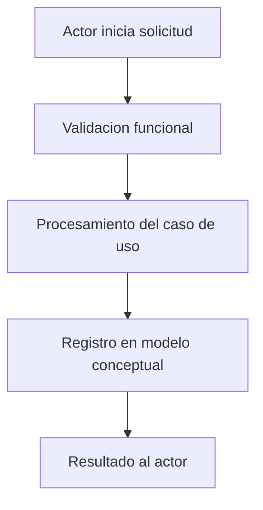

# Definicion Funcional

## Contexto y alcance
- Objetivo de negocio:
- Problema a resolver:
- Actores involucrados:
- Alcance funcional:
- Fuera de alcance:

## Requisitos funcionales
- RF-01:
- RF-02:
- RF-03:

## Casos de uso
### Caso de uso 1
- ID: CU-01
- Actor:
- Precondiciones:
- Flujo Principal:
  1.
  2.
  3.
- Flujos Alternativos:
  - A1:
  - A2:
- Postcondiciones:

### Caso de uso 2
- ID: CU-02
- Actor:
- Precondiciones:
- Flujo Principal:
  1.
  2.
  3.
- Flujos Alternativos:
  - A1:
  - A2:
- Postcondiciones:

## Modelo de datos conceptual
### Entidades clave
- Entidad 1:
  - Descripcion:
  - Atributos clave:
- Entidad 2:
  - Descripcion:
  - Atributos clave:

### Relaciones
- Entidad 1 -> Entidad 2:
- Cardinalidad:
- Regla de negocio asociada:

## Arquitectura funcional
### Componentes funcionales
- Componente 1:
  - Responsabilidad:
  - Entradas:
  - Salidas:
- Componente 2:
  - Responsabilidad:
  - Entradas:
  - Salidas:

### Flujo funcional principal

## Riesgos y decisiones abiertas
- Riesgo 1:
- Riesgo 2:
- Decision abierta 1:
- Decision abierta 2:

## Trazabilidad
| Requisito | Caso de Uso | Entidad | Componente |
|---|---|---|---|
| RF-01 | CU-01 | Entidad 1 | Componente 1 |
| RF-02 | CU-02 | Entidad 2 | Componente 2 |

## Supuestos
- Supuesto 1:
- Supuesto 2:

## Estado del documento
- Version:
- Fecha:
- Responsable:
