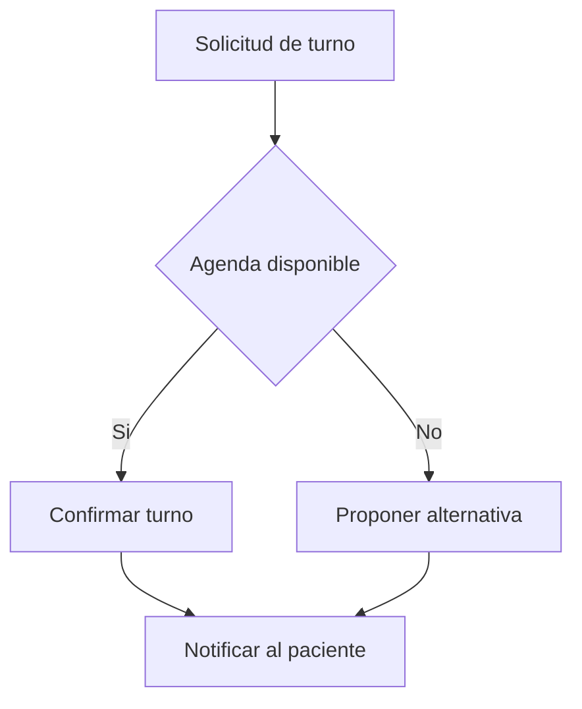

# IA Guideline

Esta guia resume como usar los agentes y personalizaciones de IA del proyecto para pasar de idea a definicion funcional y luego a diseno tecnico.

## Objetivo
- Definir primero el que (negocio y comportamiento).
- Definir despues el como (arquitectura tecnica).
- Mantener trazabilidad entre requisitos, casos de uso, datos y componentes.

## Activos creados
- Agente: Analista de Sistemas Senior
- Agente: Arquitecto Tecnico
- Prompt: Levantar Requisitos Funcionales
- Instruccion: Estandar Documentacion Requisitos (aplica en `template-docs/**/*.md`)

## Flujo recomendado
1. Usar el agente Analista de Sistemas Senior para definir alcance y requisitos.
2. Refinar casos de uso y modelo conceptual.
3. Guardar documento funcional en template-docs.
4. Usar el agente Arquitecto Tecnico para convertir el analisis en decisiones tecnicas.
5. Guardar documento tecnico en template-docs.

## Ejemplos de prompts
### 1) Descubrimiento funcional inicial
"Define requisitos funcionales y casos de uso para una plataforma de turnos medicos multi-sede. Actores: paciente, recepcionista y medico."

### 2) Caso de uso completo con diagrama
"Desarrolla el caso de uso de reserva de turno y agrega un diagrama Mermaid de secuencia."

### 3) Modelo de datos conceptual
"Propone un modelo de datos conceptual para gestion de turnos, agenda, especialidades y historico de atenciones."

### 4) Traduccion funcional a tecnica
"A partir de estos requisitos y casos de uso, define arquitectura tecnica, contratos entre modulos, NFRs y roadmap por fases."

## Plantilla de salida sugerida
### Contexto y alcance
- Objetivo de negocio:
- Actores:
- Alcance:
- Fuera de alcance:

### Requisitos funcionales
- RF-01:
- RF-02:

### Casos de uso
- ID:
- Actor:
- Precondiciones:
- Flujo Principal:
- Flujos Alternativos:
- Postcondiciones:

### Modelo de datos conceptual
- Entidades clave:
- Relaciones:
- Reglas de negocio:

### Arquitectura funcional/tecnica
- Componentes:
- Responsabilidades:
- Interfaces:

### Trazabilidad
| Requisito | Caso de Uso | Entidad | Componente |
|---|---|---|---|
| RF-01 | CU-01 | Usuario | Gestion de Acceso |

### Riesgos y preguntas abiertas
- Riesgo 1:
- Pregunta 1:

## Ejemplo Mermaid (flujo)

## Convencion de guardado en template-docs
- Documento funcional sugerido: template-docs/functional-definition.md
- Documento tecnico sugerido: template-docs/technical-architecture.md
- En cada respuesta, la IA debe proponer explicitamente guardar o actualizar uno de estos documentos.
