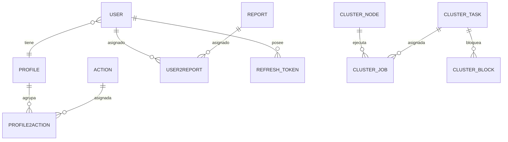

# Modelo de Datos (funcional)

## Introducción

Este documento describe el **modelo de datos desde el punto de vista funcional**: qué entidades de negocio existen en Template, qué representan y cómo se relacionan entre sí.

Su objetivo es servir como referencia de dominio, comprensible sin necesidad de conocer los detalles de persistencia. El **detalle técnico** del modelo (mapeo JPA/Hibernate, herencia, auditoría, DTO, repositorios y evolución con Liquibase) se documenta en [database-model.md](../03-technical/backend/database-model.md), que es la fuente única de verdad para la capa de persistencia.

---

## Organización por dominios

Las entidades se agrupan según el módulo funcional al que pertenecen:

| Dominio         | Entidades                                                        |
|-----------------|------------------------------------------------------------------|
| Seguridad       | Usuario, Perfil, Acción, Token de refresco                       |
| Administración  | Parámetro, Registro de auditoría                                 |
| Informes        | Informe, Asignación usuario–informe                              |
| Interfaces      | Interfaz, Registro de interfaz                                   |
| Cluster         | Nodo, Tarea, Trabajo (asignación), Bloqueo                       |

---

## Entidades comunes

### Usuario

Identidad autorizada para acceder a la aplicación. Contiene los datos de autenticación e identificación del usuario y su asociación con un perfil de seguridad.

| Atributo funcional | Descripción                                       |
|--------------------|---------------------------------------------------|
| Nombre de usuario  | Identificador de acceso, único                    |
| Contraseña         | Credencial (almacenada cifrada, nunca en claro)   |
| Nombre y apellidos | Datos identificativos                             |
| Email              | Correo de contacto                                |
| Último acceso      | Fecha y hora del último inicio de sesión          |
| Perfil             | Perfil de seguridad asignado (relación N:1)       |
| Informes           | Informes asignados al usuario (relación N:M)      |

### Perfil

Agrupación de acciones (permisos) que se asigna a los usuarios. Un usuario tiene un perfil, y un perfil agrupa varias acciones.

| Atributo funcional | Descripción                                       |
|--------------------|---------------------------------------------------|
| Nombre             | Nombre del perfil, único                          |
| Descripción        | Texto descriptivo                                 |
| Acciones           | Acciones asociadas al perfil (relación N:M)       |
| Usuarios           | Usuarios que tienen asignado el perfil            |

### Acción

Nivel mínimo de autorización. Cada funcionalidad protegida requiere una acción. El catálogo de códigos de acción y las reglas de visibilidad del menú se documentan en [security.md](../03-technical/backend/security.md#acciones).

| Atributo funcional | Descripción                                              |
|--------------------|----------------------------------------------------------|
| Código             | Identificador de la acción (p. ej. `USER_READ`), único   |
| Tipo               | Naturaleza de la acción (lectura, escritura, ejecución)  |
| Nombre             | Nombre legible                                           |
| Descripción        | Texto descriptivo                                        |

### Token de refresco

Token opaco persistente asociado a un usuario, usado para renovar la sesión sin reautenticar. Se entrega al cliente mediante cookie HttpOnly y permite su revocación desde el servidor.

| Atributo funcional | Descripción                                       |
|--------------------|---------------------------------------------------|
| Token              | Valor opaco único                                 |
| Usuario            | Usuario propietario del token                     |
| Fecha de expiración| Momento a partir del cual deja de ser válido      |
| Revocado           | Indicador de token invalidado                     |

### Parámetro

Valor de configuración del sistema, tipado, gestionable desde la administración.

| Atributo funcional | Descripción                                       |
|--------------------|---------------------------------------------------|
| Código             | Identificador del parámetro, único                |
| Valor              | Valor configurado                                 |
| Tipo               | Tipo de dato del valor                            |
| Descripción        | Texto descriptivo                                 |

### Registro de auditoría

Entrada inmutable (solo inserción) que registra las operaciones sensibles realizadas sobre el sistema.

| Atributo funcional | Descripción                                       |
|--------------------|---------------------------------------------------|
| Fecha y hora       | Momento de la operación (UTC)                     |
| Usuario            | Usuario que ejecutó la operación                  |
| Tipo de operación  | Naturaleza del cambio                             |
| Sección            | Módulo o entidad afectada                         |
| Entidad afectada   | Identificador y nombre de la entidad              |
| Detalle            | Información adicional de la operación             |

### Informe

Informe que puede asignarse a los usuarios para su ejecución y exportación.

| Atributo funcional | Descripción                                       |
|--------------------|---------------------------------------------------|
| Nombre             | Nombre del informe                                |
| Descripción        | Texto descriptivo                                 |
| Usuarios           | Usuarios a los que está asignado (relación N:M)   |

### Interfaz

Interfaz externa (endpoint) supervisada por el sistema en el módulo de Interfaces.

| Atributo funcional  | Descripción                                      |
|---------------------|--------------------------------------------------|
| Nombre              | Nombre de la interfaz                            |
| Descripción         | Texto descriptivo                                |
| URL                 | Dirección del endpoint                           |
| Protocolo           | Protocolo de comunicación                        |
| Estado              | Estado actual (activa, inactiva, error)          |
| Frecuencia de chequeo | Periodicidad de la comprobación                |

### Registro de interfaz

Entrada inmutable (solo inserción) que registra cada operación de una interfaz, con su trazabilidad de entrada/salida.

| Atributo funcional | Descripción                                       |
|--------------------|---------------------------------------------------|
| Fecha y hora       | Momento de la operación (UTC)                     |
| Tipo de operación  | Naturaleza de la operación                        |
| Nombre de interfaz | Interfaz que originó el registro                  |
| Payload de petición| Contenido de la petición                          |
| Payload de respuesta| Contenido de la respuesta                        |
| Estado             | Resultado de la operación                         |

### Entidades del cluster

El módulo de alta disponibilidad gestiona la coordinación entre nodos:

| Entidad  | Descripción                                                                        |
|----------|------------------------------------------------------------------------------------|
| Nodo     | Nodo del cluster con su estado, host, IP, indicador de maestro y métricas de memoria |
| Tarea    | Definición de una tarea ejecutable en el cluster                                   |
| Trabajo  | Asignación de una tarea a un nodo, con prioridad y estado (clave compuesta nodo+tarea) |
| Bloqueo  | Registro de bloqueo (lock) de una tarea con métricas de ejecución                  |

---

## Relaciones entre entidades

Las relaciones N:M se materializan mediante entidades intermedias:

- **Usuario ↔ Informe**: a través de la asignación usuario–informe (`user2report`).
- **Perfil ↔ Acción**: a través de la asignación perfil–acción (`profile2action`).

---

## Funcionalidades sin entidad persistente propia

Algunas funcionalidades transversales de la plataforma **no disponen de una entidad de dominio propia** en el modelo actual:

- **Internacionalización (idiomas)**: los idiomas y sus traducciones se gestionan mediante ficheros de recursos en el frontend (ver [internacionalizacion.md](../03-technical/frontend/internacionalizacion.md)), no como entidad de base de datos.
- **Notificaciones**: el framework de notificaciones se basa en eventos y canales de presentación (ver [notifications.md](../03-technical/frontend/notifications.md)); actualmente no persiste las notificaciones como entidad del dominio.

Si en el futuro se requiere persistir idiomas o notificaciones, deberán incorporarse como nuevas entidades y documentarse aquí y en [database-model.md](../03-technical/backend/database-model.md).

---

## Documentación relacionada

- [database-model.md](../03-technical/backend/database-model.md) — modelo técnico (JPA, DTO, repositorios, Liquibase).
- [security.md](../03-technical/backend/security.md) — modelo de seguridad y catálogo de acciones.
- [requirements.md](requirements.md) — requisitos funcionales.
