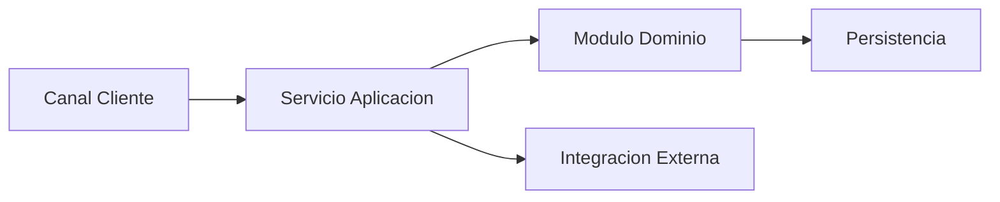

# Arquitectura Tecnica

## Resumen de entrada funcional
- Documento funcional de referencia:
- Objetivo tecnico:
- Restricciones tecnicas conocidas:
- Supuestos de arquitectura:

## Arquitectura tecnica objetivo
### Componentes tecnicos
- Componente tecnico 1:
  - Responsabilidad:
  - Dependencias:
  - Interfaces/contratos:
- Componente tecnico 2:
  - Responsabilidad:
  - Dependencias:
  - Interfaces/contratos:

### Vista de interaccion tecnica

## Mapa de trazabilidad funcional-tecnica
| Requisito | Caso de Uso | Componente Funcional | Componente Tecnico | Contrato/Interfaz |
|---|---|---|---|---|
| RF-01 | CU-01 | Componente 1 | Componente tecnico 1 | API-01 |
| RF-02 | CU-02 | Componente 2 | Componente tecnico 2 | EVT-01 |

## Requisitos no funcionales (NFR)
### Seguridad
- NFR-SEC-01:
- NFR-SEC-02:

### Rendimiento
- NFR-PERF-01:
- NFR-PERF-02:

### Escalabilidad
- NFR-SCAL-01:

### Observabilidad
- NFR-OBS-01:
- NFR-OBS-02:

## Integraciones y contratos
- Integracion 1:
  - Tipo de intercambio:
  - Frecuencia:
  - Reintentos:
  - Manejo de errores:
- Integracion 2:
  - Tipo de intercambio:
  - Frecuencia:
  - Reintentos:
  - Manejo de errores:

## Riesgos tecnicos y mitigaciones
| Riesgo | Impacto | Probabilidad | Mitigacion |
|---|---|---|---|
| Riesgo tecnico 1 | Alto | Media | |
| Riesgo tecnico 2 | Medio | Alta | |

## Plan de implementacion por fases
### Fase 1
- Objetivo:
- Entregables:
- Dependencias:

### Fase 2
- Objetivo:
- Entregables:
- Dependencias:

### Fase 3
- Objetivo:
- Entregables:
- Dependencias:

## Decisiones abiertas
- Decision 1:
- Decision 2:

## Estado del documento
- Version:
- Fecha:
- Responsable:
